<h1>Unidade 04 - Estilos e Padrões Arquiteturais</h1>

<h2>Estilos Arquiteturais</h2>

<h3>Estilos Arquiteturais</h3>

* Estilos e padrões arquiteturais são estilos de padrões de projetos que podem ser reutilizaveis.
* São resolvidos dentro de um contexto especifico.
* Nesse cenário é importante lembrar que muitas vezes os problemas se repetem.
* Suas características se encontram em contextos de sistemas diferentes.
* Diante de problemas semelhantes, podemos usar padrões arquiteturais ja validados e conhecidos como solução para esses problemas.
* Forma um conhecimento comum e compartilhado.
* Existem diferentes estilos arquiteturas e incluse o nome entre autores diferentes.
* Alguns autores vão citar mais ou menos estilos de padrões arquiteturais.
* Muitos autores podem agrupar estilos e padrões.
* O importânte é entender e saber entender qual padrão utilizar ao problema que temos em questão.

* Elementos que caracterizem a arquitetura.
* Não são uma arquitetura de software completa, mas sim o primeiro passo para desenho ou definir qual vai ser a arquitetura do sistema. Solução inicial, preconcebida.
* Normalmente utilizada em algumas situações.

* Classificação de Padrões Arquiteturais
    * Vários parâmetros podem ser usados:
        * Forma de passagem de controle entre componentes: Sistemas de fluxo de dados ou Padrões de comunicação (síncrono x assíncrono).
        * Ênfase em atributos de qualidade (manutenibilidade ou desempenho).
    * Sistema deve:
        * Atender requisitos funcionais.
        * Atender requisitos não funcionais: Portabilidade, Manutenabilidade, Estabilidade, Confiabilidade, Desempenho.

<h3>Arquitetura em Camadas</h3>

* Maneira comum de documentar arquitetura de software
* Ajudam a decompor as aplicações que podem ser subdividas em subgrupos por tarefa.
* Exemplo classico seris os protocolos de rede.
* Na divisão desses protocolos ocorrem a descrição de como a comunicação se da entre as diversas camadas.
* Importante definir contato, conteudo e significado das mensagens que são trocadas entre as camadas, cenarios precisam ser descritos em detalhe
* Cada camada terá um responsabilidade.
* Cada camada realizará um trabalho que será aproveitado na camada seguinte.
* Um contexto de uso seria um sistema grande e complexo que vai demandar algum tipo de decomposição, algum tipo de quebra que vai demandar responsabilidades diferentes.
* Como seria um implementação em arquitetura em camadas?

* Implementação
    * 1 - Defina o critério de abstração para agrupar tarefas em subcamadas
    * 2 - Determine o número de níveis de abstração.
    * 3 - Nomeie as camadas e assinale tarefas a cada uma.
    * 4 - Especifique os serviços. Camadas devem ser totalmente separadas uma da outra.
    * 5 - Refine as camadas.
    * 6 - Especifique uma interface para cada camada.
    * 7 - Estruture camadas individuais.
    * 8 - Especifique os mecanismos de comunicação entre elas.
    * 9 - Projete uma estratégia de gerência de erros.

* Benefícios
    * Reuso de camadas.
    * Suporte para padronização.
    * Dependências são mantidas localmentes dentro da propria camada
    * Manutenibilidade
        * Camada pode ser trocada facilmente
        * Exemplo: hardware

* Desvantagem
    * Desempenho

<h3>Sistemas Interativos</h3>

* São baseados em um conjunto de requisitos funcionais
* Uso mais intencivo das interfaces de usuário
* Necessidade de alteração com certa frequencia
* Possibilidade que alterações da interface sejam executadas sem impactar o cumprimento e atendimento dos requisitos funcionais.
* Modelos comuns: Modelo MVC

* Modelo MVC
    * Divide aplicação em 3 componentes:
        * Modelo: Funcionalidade básicas e dados.
        * Visão: Exibe informação ao usuário.
        * Controle: Gerenciam entrada e dados.
    * Usado em aplicações interativas que tem uma interface gráfica com o ator humano mais flexivel.
    * Podendo mexer a mesma informação de diversas formas, sem impactar na informaação que esta por trás.
    * Sistemas interativos como o modelo MVC precisam suportar o Look-and-feel diferentes.
    * Look-and-feel trata da aparencia das aplicações. A interface precisa refletir mudanças nos dados imediatamente.
    * Trata-se de um conceito chamado de Separation of concerns.
    * Cada uma dessas estruturas do MVC vai ter uma responsabilidade diferente e separada.
    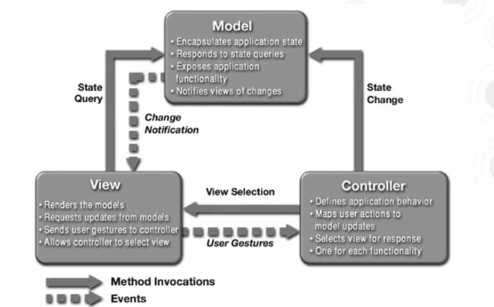

    * Visão:
        * Componentes são responsáveis por exibir a informação ao usuário
        * Cada visão vai ter associada a ela um componente de controler para ela realizar essa visão.
        * Responsabilidade da visão capturar movimentos do mouse e cliques, etc.
    * Controllers
        * Recebem entradas que forem executadas pela visão
        * Determina com base na entrada o que o usuário deseja fazer.
        * Faz a comunicação de volta com a visão para o que o cliente deseja ver
    * Model
        * Modelo contem ou representa o núcleo dessa aplicação
        * Propagação de mudanças
        * Definir de como os dados serão tratados.
        * Objetos da aplicação
        * Instancias mostram os estados da aplicação

* Modelo MVC - Controle
    * Frameworks de aplicação que podem ser usados na camada de controle:
        * Struts.
        * Java Server Faces.
        * Spring.
        * WebWork

* Benefícios
    * Múltiplas visões do mesmo controle.
    * Visões sincronizadas (mecanismo de propagação).
    * Controles e visões são "plugáveis".
    * Substituição fácil  de "look and feel".
    * Desenvolvedores da interface gráfica poderem focar exclusivamente no seu trabalho, sem se preocupar com lógica do negócio.
    * Desenvolvedores vão focar na implementação da lógica dos negócio sem se preocupar com recursos de interface gráfica.

<h3>Sistemas Distribuídos</h3>

* Cenário comum para sistemas distribuidos seria um sistema rodando em várias CPU's
* Redes conectando vários computadores.

* Vantagens
    * Economia, Desempenho e Escalabilidade (usam recursos distribuídos na rede).
    * Confiabilidade (uma máquina pode falhar sem afetar o restante do sistema).

* Desvantagens
    * Precisam de software específico.

* Um dos padrões para se trabalhar com sistemas distribuidos é o padrão Broker.
    * Pode ser utilizado para estruturas sistemas de software que possuem chamadas remotas.
    * Existe um componente chamado Broker que é responsável por coordenar a comunicação, assim como enviar a solicitações e transmitir resultados e exceçõs tratadas entre os componentes.

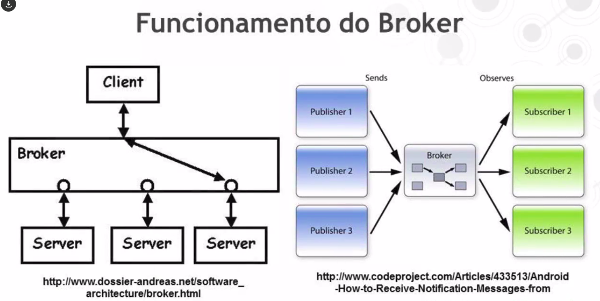

* Padrão Broker
    * Componente Broker atua para separar melhor clientes de servidores.
    * Servidores:
        * Se registram no broker.
        * Tornam seus serviços disponíveis a clientes através de interfaces definidas.
    * Clientes:
        * Acessam funcionalidades dos servidores através de requisições ao broker.
    * Arquitetura broker precisa ser flexível
        * Objetos podem ser alterados facilmente
    * Precisa fornecer apis de comunicação aos seus clientes.
    * Responsabilidades do componente broker:
        * Localizar o servidor apropriado.
        * Reenviar solicitações aos servidores.
        * Transmitir resultados e exceções aos clientes.

* Conhecidos do padrão broker podem ser vistos como CORBA
* CORBA - Common Object Request Broker Architecture
    * Tecnologia orientada a objetos para distribuir objetos heretogeneos.

* WWW
    * Navegadores atuam de certa forma como brokers
    * Servidores WEB atuam como provedores de serviço.

<h3>Outros padrões arquiteturais</h3>

* Nomenclatura aos estilos arquiteturais é um pouco adversa.
* Primeiro estilo:
* Sistemas de fluxos de dados:
    * Possuem dois ou mais componentes de processamento;
    * Transformam dados de uma entrada em dados de uma saída.
    * Transformação de maneira sequencial.

    * Pipes and filters
        * Uma componente de processamento tem duas saídas.
            * Saída padrão
            * Saída de erro.
        * Mecanismos de entradas e saída são chamados portas.
        * Um filtro típico possui três portas.
    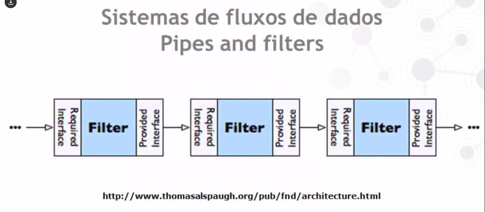
    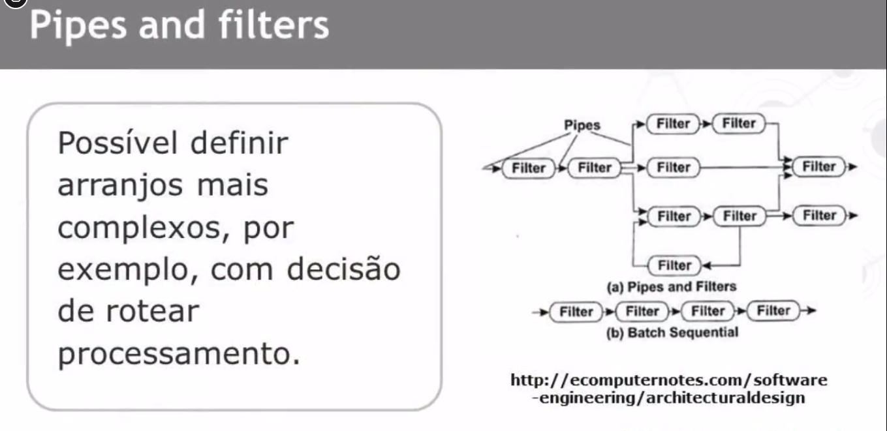

    
* Sistemas de chamada e retorno
    * Caracterizados por um processo inicial de controle que invoca operações.
    * Utilizado em sistemas orientados a objetos.
    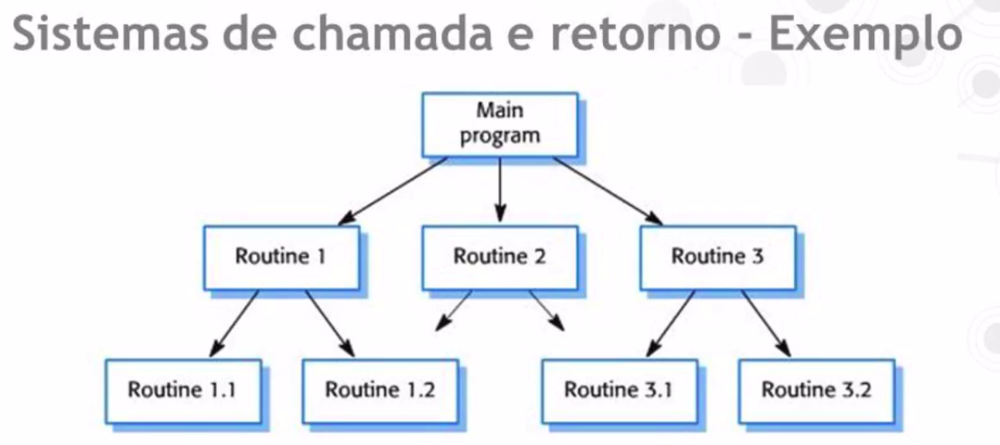

* Componentes independentes
    * Componentes independentes dependem de chamada implícita de operações.
    * Chamada da operação está desconectada da execução.
    * Componente "chamador" e "chamado" podem existir em processos separados e até mesmo em processadores distribuídos.
    * Tendem a ser mais modulares.
    * Mais possibilidade de reuso.
    * Sistema em si é mais complexo normalmente.
    * São uma forma de sistema distribuído.
    * Sujeitos a restrições de desempenho.
    
    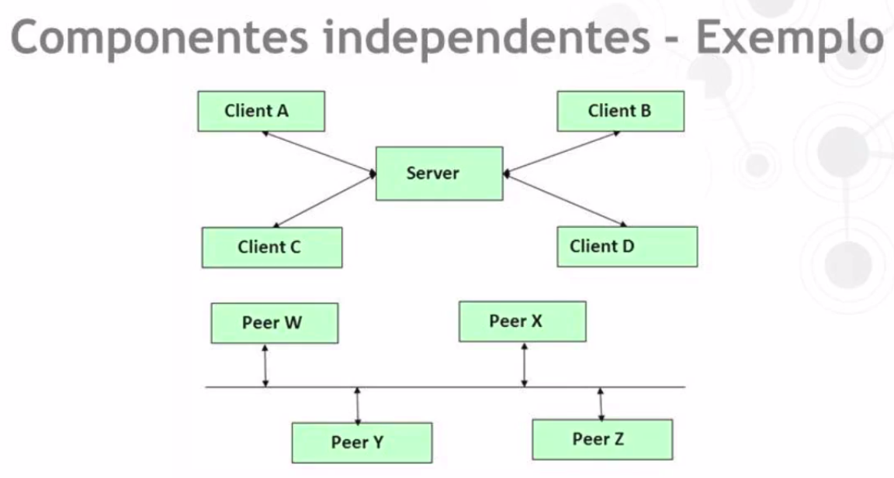

* Repositórios
    * Envolvem fonte de dados compartilhada.
    * Motivação: Guardar dados persistentes.
    * Dois elementos principais:
        * Elemento de dados central;
        * Múltiplos elementos processadores independentes.

    * Quadro Negro (Blackboard)
        * Do tipo repositório.
        * Fonte de conhecimento: elementos processadores.
        * Quadro negro: elemento central compartilhado.
            * Exemplo: Sistema de banco de dados.
        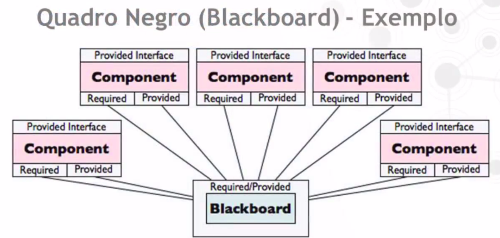

* Peer-to-Peer
    * Cada um dos membros funcionam como um par um do outro.
    * Todos eles atuam tanto como clientes como servidores
    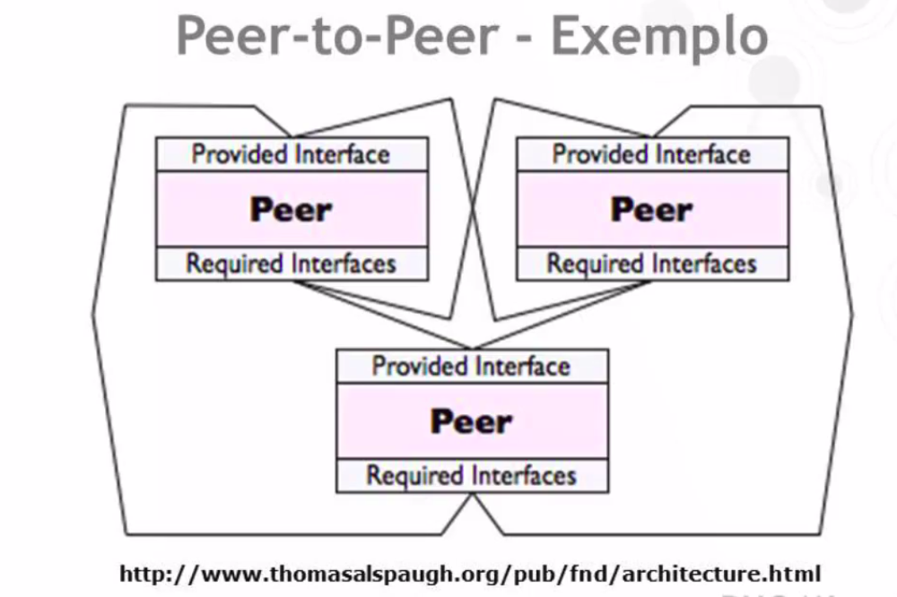
    * Aplicação:
        * Distribuição de arquivos
        * Processamento - Compartilhar processadores.

* Taxonomias
    * A classificação dos estilos arquiteturais pode variar de acordo com a referência bibliográfica.
    * São apresentados a seguir alguns resumos de tais classificaçoes.
    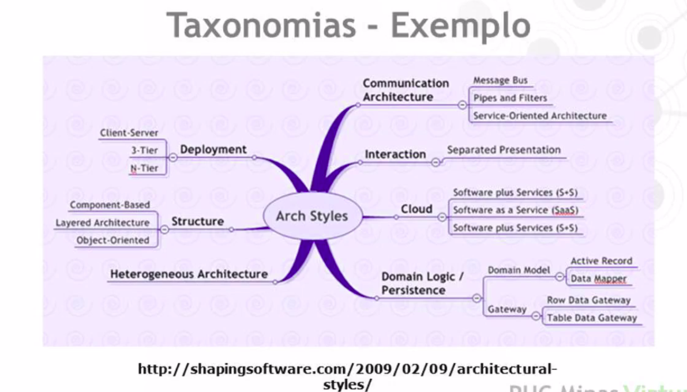
    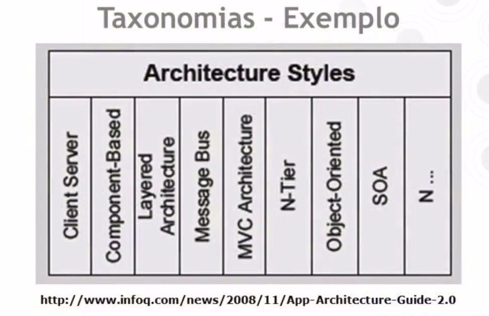
    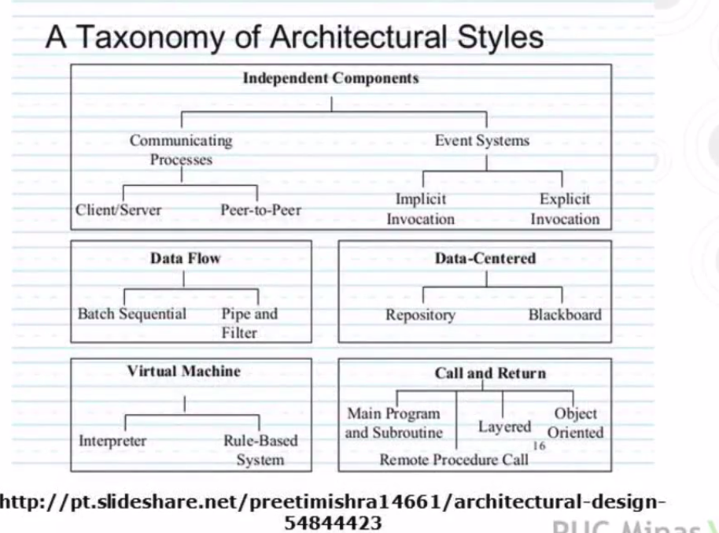

<h2>Serviços</h2>

<h3>Introdução a Serviços</h3>

* Conceito não é novo.
* Conveções para poder funcionar

* Arquitetura Orientada a Serviços - SOA - Software Oriented Architecture
    * Unidades existem de forma autonomas e não isoladas
    * Unidades são serviços.
    * Paradigma de desenvolvimento.
    * Objetivo é criar modulos funcionais - serviços - com baixo acoplamento e permitindo reutilização.
    * Coesão
        * Elementos conectados para executar a função do modulo
    
    * Componentes fracamente acoplados
        * Web Services devem ser componentes fracamente acoplados.
        * Podem continuar a funcionar mesmo como alterações na comunicação como:
            * Adição de novos parâmetros.
            * Omissão de parâmetros.
            * Mudança de ordem de parâmetros.
        
    * Granularidade
        * Ajuda a medir a complexidade de um modelo de componentes.
        * Granularidade fina:
            * Desce em nível de classes.
            * Componentes muito detalhados.
        * Granularidade Grossa:
            * Oculta o modelo de classes básico.
            * Componentes executam mais de uma função.
        
        * SOA visa criar componentes de granularidade grossa.

* Podemos definir um serviço que atende uma função de negócio bem específica.
* Recebe requisições e responde a essas requisições encapsulando todo o detalhe do processamento, assim quem utiliza o serviço de um determinado componente não conhece o detalhe da sua encapsulação.

* Serviço 
    * Executa unidades completas do trabalho:
        * Podem ser "stateless" (não armazenam estado).
        * Facilita a reutilização
        * Statefull
            * Mais dificeis de ser mantidos
            * Mais acoplamento

* Principio do Projeto de Serviços
    * Fracamente acoplados: Mantém uma relação que minimiza dependências e apenas têm conhecimento de outros.
    * Contrato de serviço: Serviços concordam com um contrato definido por uma ou mais descrições de serviço e documentos relacionados.
    * Autonomia: Possuem controle sob a lógica interna que está encapsulada nele.
    * Abstração: Escondem lógica do mundo externo.
    * Reusabilidade: Lógica dividida em serviços para promover reuso.
    * Ausência de estado: Serviços minimizam armazenamento sobre informações específicas de suas atividades.
    * Serviços são projetados para serem encontrados por mecanismos bem específicos

<h3>Web Services</h3>

* Implentação de SOA
* Requisitos de um componente SOA
    * Granularidade grossa
    * Preferencialmente "Stateless"
    * Baixo acoplamento.
    * Interface bem-definida
    * Detalhes de implementação bem encapsulado.

* SOAP - Simple Object Access Protocol
    * Possibilita a invocação remota de métodos através da Internet.
    * Usa:
        * Protocolo simples e difundido: HTTP
        * Forma de comunicação padronizada: XML
        * Possível atravessar firewalls

* WSDL - Web Services Description Language
    * Forma de estabelecer uma comunicação fracamente acoplada entre serviços web.
    * Documentos de descrição são necessários para acompanhar qualquer serviço que queira agir como provedor.

    * Interface e Implementação
        * O uso de WSDL na arquitetura de Web Services é em geral dividido em duas partes:
            * Interface do Serviço. - Abstrata
            * Implementação do Serviço. - Concreta

    * Descrição abstrata do WSDL
        * Interface: Visão alto nível da interface de serviço.
        * Operação: Ação realizada pelo serviço.
        * Comparada a um método público de um componente. Tem parâmetro de entrada e saída, representados como mensagens. É um conjunto de mensagens de entrada e saída.
        * Tipos de dados (Types): Definir tipos a serem usados nas mensagens. Podem ser usados tipos do schema XML padrão.
        * Mensagens: Com tipos já definidos.
        * Port types: Compostos de operações. Junto com mensagens de entrada e saída.

    * Descrição concreta do WSDL
        * Binding: Descreve requisito para o serviço estabelecer conexões físicas. Representa uma tecnologia de transporte que o serviço pode usar para se comunicar. SOAP é a forma mais comum de binding. Pode-se aplicar a toda a interface ou uma operação específica.
        * Porta: Representa o endereço físico no qualo serviço pode ser acessado com um protocolo específico. Existe separadamente para permitir que informação da localização seja mantida separadamente de outras aspectos da descrição.

<h2>Tópicos em estilos arquiteturais</h2>

<h3>Mapeamento Objeto Relacional</h3>

* A interface com o banco de dados é uma decisão importante para a arquitetura de software. Uma das formas de se realizar esta interface é através do mapeamento objeto relacional, que cria uma comunicação e associação entre o mundo relacional das bases de dados e o mundo da orientação por objetos.

* Persistência
    * Envolve:
        * Armazenamento, organização e recuperação de dados estruturados.
        * Concorrência e integridade de dados. Garantir que os dados são acessados por requisições diferentes e garantir a integridade dos dados.
        * Compartilhamento de dados.
    
    * Banco de dados possui:
        * Tabela Cliente.
        * Tabela Empregado.
    
    * Aplicação O.O possui:
        * Classe Cliente.
        * Classe Empregado.

* Uma solução ORM contém
    * API para realizar operações CRUD básicas em objetos de classes persistentes.
    * Uma linguagem ou API para especificar consultas.
    * Mecanismo para especificar metadados de mapeamento.
    * Recursos para otimizar funções.

* Por que ORM?
    * Produtividade: Reduz tempo de codificação.
    * Manutenibilidade: Reduz linhas de códigos. Maior relacionamento entre modelo de dados.
    * Desempenho: Recursos de otimização. Tempo livre do desenvolvedor para tal.
    * Independência de fabricante: Independencia de SGBD.

* Tipos de Camadas de Persistência
    * Tipo mais comum: SQL no código fonte.
    * Vantagens: Permite escrever código muito rápido. Viável para pequenas aplicações e protótipos.
    * Desvantagens: Dependência entre classes de negócio e esquema do banco de dados relacional. Pequenas mudanças demandam alteração de código.

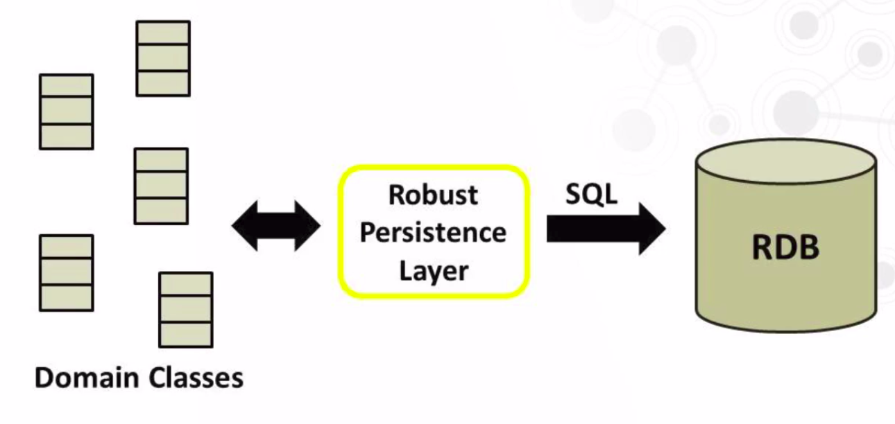

* Uma camada de persistencia precisa suportar total encapsulamento do mecanismo de persistência.
* Ações referentes a múltiplos objetos.
* Transações, Extensibilidade, Cursores.
* Múltiplas arquiteturas.
* Versões e fabricantes diferentes de SGBD.
* Conexões múltiplas simultâneas.

<h3>Hibernate</h3>

* Uma das ferramentas utilizadas para se implantar o mapeamento objeto relacionado é o , Hibernate