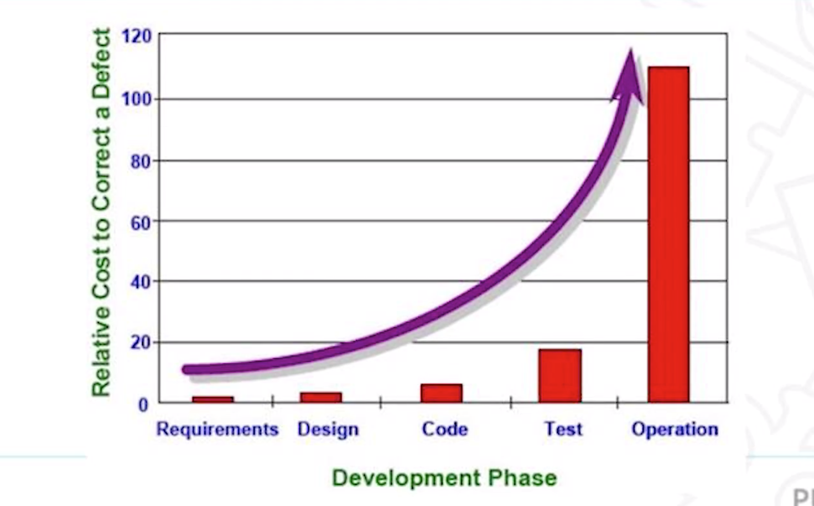
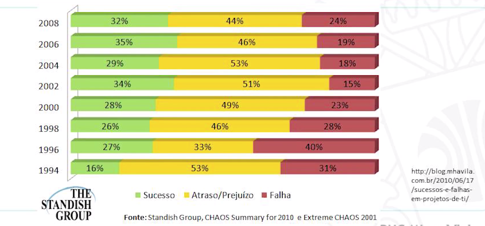

<h1>Unidade 01 - Introdução a Arquitetura de Software</h1>

<h2>1 - O Arquiteto de Software</h2>

<h3>Introdução a Arquiteturas de Software</h3>
* Tema arquitetura tem diversos significados. Se pensarmos na construção civil, conhecemos o termo como na construção de uma casa, de um prédio ou mesmo o layout interno de um comodo.
* No meio de tecnologia temos o termo "arquitetura" aplicado com diversos significados. Aplicado em diversos contextos.
* Em todos os assuntos o termo arquitetura da ideia de alicerce, de algo que vai ser usado como base para desenvolvimento.
* O termo Arquitetura de Software se refere a descrição de elementos dos quais o sistema vai ser construído, que são os seus componentes, necessitando ter uma interação entre eles. Existindo vários padroes, como por exemplo, os padrões do mercado ou os padrões da própria organizacao, podem existir restrições do uso desses padroes.
* Arquitetura de Software define a estrutura do software. Isso vai compreender os componentes do software que irao se relacionar. É um objetivo importante da Arquitetura de Software conseguir identificar esses relacionamentos. Algumas questões precisam ser abordadas no nível da arquitetura de software.
* Se inicia através da identificação de alternativas para a arquitetura de um determinado sistema. Essas alternativas precisam ser identificadas, analisadas e uma alternativa ou um conjunto de componentes dessa alternativa precisa ser selecionado naquele projeto.
* Essa seleção pode levar em consideração diversos critérios, como por exemplo o risco ou o atendimento dos próprios requisitos do projeto, restrições do cliente, restrições do contexto do qual o sistema é desenvolvido.
* O Arquiteto precisa passar por essas alternativas e selecionar a que melhor se adeque.
* É importante pensar que uma primeira alternativa pensada naquele projeto vai ser a melhor.
* Outra questão que é abordada no nível arquitetura é a questão de escalabilidade, desempenho, em geral atributos de qualidade do software. Um software precisa atender um conjunto de requisitos NAO FUNCIONAIS que muitas vezes são uma preocupação do pessoal de arquitetura de software. Dentro dessas restrições, podemos citar a questão de escalabilidade, desempenho, usabilidade, confiabilidade, falhas e serem conhecidas pelo arquiteto e vao ter uma influencia nas alternativas do projeto que serão selecionadas.
* Outras questões que precisam ser tratadas em nível arquitetura é a comunicação e a sincronização entre os componentes de um sistema ou ate mesmo de um sistema com outros sistemas ou dispositivos externos.
* Toda essa questão de comunicação precisa ser decidida e pensada em nível arquitetura.
* Atribuir funcionalidades nos componentes desse software.
* Damos inicio a uma visão mais macro da arquitetura e a medida que o tempo passa a ideia da arquitetura vai se refinando, conseguindo então enxergar componentes menos e tomar decisões em um nível menor.
* Arquitetura pode atuar como estrutura a fim de atender os requisitos de um sistemas, funcionais e não funcionais.
* Alguns requisitos são chamados de arquiteturalmente relevantes, são requisitos que tem impacto nessa arquitetura, eles vão influenciar na escolha dessa arquitetura.
* A arquitetura pode auxiliar na estimativa de custos e no gerenciamento do processo de desenvolvimento.
* Vai existir um conjunto de requisitos não funcionais, e de acordo com o esses requisitos, podemos fazer uma estimativa de custo para esses projetos. Nesse sentido podemos fazer uma priorização ou uma analise de viabilidade, mostrando se a forma como essa arquitetura esta sendo concebida consegue atender a todos os requisitos, ou ainda se todos esses requisitos são todos importantes ou se são todos necessários para o projeto.
* Um Arquitetura pode ainda servir de base para uma analise de consistência e dependência.
* Consistencia entre os varias elementos que essa arquitetura tem entre suas dependências.
* Existem padroes de arquitetura que possuem validações em questão a consistência e dependência.
* A arquitetura pode tbm dar suporte ao reuso. Se um determinado projeto ou determinado empresa tem a necessidade de reutilizar um determinado componente em um determinado software, a arquitetura vai ter que permitir a utilização dessa reutilização.
* Algumas questões fundamentais que devemos tratar na arquitetura de software:
	* 1- Existe uma arquitetura genérica que pode atuar como modelo para o sistema?
		* Se a empresa trabalha sempre de uma forma padronizada, como por exemplo a empresa trabalha sempre com software para web, sempre cliente-servidor. Se o tipo de software que ela produz é basicamente o mesmo em todos os projetos, provavlmente vai ter uma arquitetura referencia e claro que ela pode ter mais de uma arquitetura genérica, por exemplo: uma arquitetura genérica java que teriam todos seus componentes java e uma arquitetura .net para todos os seus componentes e frameworks e cada um desses projetos eles utilizariam cada uma dessas arquiteturas e teriam um refinamento.
	* 2- Como esse sistema vai ser distribuido?
		* É um sistema em uma maquina só, é um cliente servidor. É algo que iremos ter varios usuários ou um usuários apenas.
	* 3- Que padroes ou estilos de arquiteturas podem ser usados?
		* Existem soluções ja definidas para problemas ja conhecidos. Se enfrentamos no projeto onde a situação ja é conhecida, podemos encaixar um desses padroes.
	* 4- Como componentes sao decompostos?
		* Pensamos na arquitetura de maneira genérica, de maneira mais ampla e depois realizamos uma decomposição para saber quais são esses componentes internos da arquitetura e quais são esses componentes arquiteturais a gente precisa tomar no nível de cada um desses componentes.
	* 5 - Qual a melhor organizacao da arquitetura para satisfazer requisitos não funcionais?
		* É importante identificar os requisitos não funcionais e a escolha da arquitetura pode contribuir para a descoberta de novos requisitos não funcionais, mas nesse momento eles precisam ser conhecidos.
	* 6 - Como esse projeto de arquitetura vai ser avaliado?
		* Necessário fazermos algum tipo de validação, necessário termos mais garantia mais certeza de que a arquitetura vai atender os requisitos e as necessidades técnicas desse projeto e as necessidades do cliente.
		* Algumas empresas e alguns projetos trabalham com uma prova de conceito, parecido com um protótipo. Se não temos certeza do comportamento e do desempenho daquela arquitetura, podemos fazer uma prova de conceito
	* 7 - Como essa arquitetura vai ser documentada?
		* Se tivermos falando de uma arquitetura que vai ser utilizada em varios projetos devemos criar uma documentação clara ao nível dos componentes interno dessa arquitetura.

-----------
<h3>O Arquiteto de Software</h3>

* O Arquiteto de Software precisa ter algumas habilidades, como reconhecer estruturas comuns em sistema ja desenvolvidos.

* Uma das preocupações do trabalho do arquiteto de software é reutilizar coisas que ja foram feitas dentro da organizacao. Componentes ja desenvolvidos dentro da organizacao. Por conta disso, é necessário conhecer os componentes para evitar o custo do desenvolvimento de software.

* Um arquiteto deve usar o conhecimento sobre arquiteturas existentes, ele precisa conhecer arquiteturas comuns, arquiteturas de mercado, frameworks, tecnologias de ponta. Justamente para tomar decisões em novos sistemas.

* Um dos trabalhos do arquiteto é analisar opções, possíveis arquiteturas cada vez que ele tem um projeto novo. Nesse sentido quanto mais arquiteturas possíveis ele conhece, mais embasamento e mais informação ele vai ter para tomar a decisão para aquele projeto.

* O arquiteto precisa ser capaz de realizar uma descrição formal da arquitetura, então ele tem que ser alguém que consiga documentar a arquitetura do sistema para ser utilizada pelo os outros componentes, necessitando se comunicar com o analista de requisitos, para entender como os requisitos vai ser recebidos e precisa ter contato com o restante da equipe técnica, como o pessoal do banco de dados, projetistas, os desevolvedores, ui e precisa ser compreendida por todos esses membros.

* O arquiteto tem uma compreensão profunda do domínio e das tecnologias pertinentes. O domínio das tecnologias ele consegue com um tempo de experiência maior, normalmente o arquiteto ja tem  um tempo de experiencia grande com desenvolvimento de software. Muitas vezes na  empresa o arquiteto seria um desenvolvedor bastante experiente, mas com essa diferenciação de que é capaz de conhecer as tecnologias existentes, capaz de conhecer o que a empresa ja fez e tomar decisões arquiteturais para novos projetos na empresa.

* O arquiteto pode precisar conhecer tbm de um domínio especifico, o que pode ser exigido dele em alguns casos. O domínio tem a ver com o campo, o negocio da empresa. Como por exemplo algumas empresas desenvolvem para um domínio contábil, um domínio financeiro, um domínio jurídico, por conta de que cada domínio podem existir sistemas ja existentes, sendo importante o arquiteto conhecer o domínio.
* Conhecer e saber utilizar técnicas de modelagem e metodologias de desenvolvimento. O arquiteto tbm é um membro de equipe de desenvolvimento como os outros. Ele tem que se integrar as ativadas da equipe.
* Ele precisa entender as estratégias de negocio da instituição que ele atua, como por exemplo quanto tempo ele tem, de estimativas se existe um ramo de atuação desse empresa.
* Precisa conhecer produtos, processo e estratégias dos próprios concorrentes e o que pode trazer para dentro da organizacao dele, ou mesmo se atualizar em frente a novas tecnologias que estão sendo utilizadas no mercado.
* Quais seriam as principais atividades de um arquiteto?
	* Existe em algumas organizações uma certa nuvem de onde começa e onde termina o trabalho do arquiteto, pq as organizações Dao nomes diferentes para esses papeis e alocam atividades diferentes.
	* Em algumas empresas os arquitetos possuem as atividades de:
		* Modelagem. - Realizar ou entender um pouco de modelagem.
		* Analise de trade-offs e viabilidade
		* Prototipacao, simulação e realização de experimentos. - Fazer analise de compra ou reautilizacao de componentes e validar se a arquitetura é viável para o projeto.
	* Precisa ser uma pessoa inovadora do ponto de vista tecnológico, tendo que entender o que for melhor para empresa e o usuário. Mais moderno e melhor usabilidade. Acaba sendo a pessoa responsável trazendo isso para dentro do projeto.
	* Atuacao como mentor de arquitetos novatos - Ponto mais alto de uma carreira técnica.
	* Algumas empresas podem chamar o cargo de líder técnico.

<h3>Integração com outros papeis do desenvolvimento de software</h3>

* O trabalho do arquitetura esta entregado com outros papeis do desenvolvimento de um software.
* Analista de Requisitos - Papel responsável por coletar, identificar e levantar requisitos, tanto funcionais, quanto não funcionais do sistema. Junto ao arquiteto de software, é responsabilidade dele discutir os requisitos não funcionais e também as funcionalidades que o sistema ira possuir para que o arquiteto faca uma melhor escolha da arquitetura que sera utilizada.
* O arquiteto e o analista trabalham na verificação de documentos de requisitos, dessa forma tanto o arquiteto pode contribuir com a sua visão de artefatos de produtos de trabalho típicos do trabalho do analista de requisitos, quanto o analista tbm pode contribuir na verificação de documentos de arquitetura.
* Desenvolvedor - A integração com o desenvolvedor é grande e intensa.
* O arquiteto é responsável por apresentar a arquitetura do sistema para os desenvolvedores da equipe. Ele tbm define padroes de desenvolvimento ou de codificação que serão utilizados pelos desenvolvedores.
* Muitas vezes o Arquiteto é visto como uma referencia técnica dos desenvovledores, alguém mais experiente, alguém que passa essas informações e experiencias para o desenvolvimento.
* Muitas vezes o líder técnico é visto como um grau a baixo do arquiteto.
* Analista de Testes - O Arquiteto discuti requisitos e critérios de aceitação, principalmente aqueles relacionados aos requisitos não funcionais, como os requisitos podem ou irão ser testados e validados pela equipe de testes.
	* O Arquiteto pode ainda contribuir na discucao de estratégia de automação de testes junto a arquitetura do sistema.
	* O arquiteto vai ainda apoiar a execução de testes de integração a integração entre as varias camadas do sistema vai ser avaliada por esse tipo de teste.
* Gerente de Projetos - O Gerente de projetos vai realizar atividades ao planejamento a execução e ao monitoramento do projeto. O Arquiteto pode apoiar o planejamento das atividades técnicas da equipe. Ele pode apoiar o gerente de projetos na realização de estimativas das atividades, caso isso faca parte do processo de desenvolvimento dessa empresa.
	* O arquiteto pode ainda acompanhar atividades da equipe mais técnica, contribuindo para o trabalho da gerencia de projetos como um todo.
* Gestor de Configuração - É atividade do gestor de configuração a geração de releases, de linhas de base, o planejamentos dos itens de linha de configuração e ainda as auditorias dessas linhas de bases geradas.
	* Arquiteto vai apoiar a dissiminacao de boas praticas relacionamento a gerencia de configuração na equipe de desenvolvimento.
	* Uma pratica comum é não trabalhar com o código sendo trabalhada em uma maquina local durante muito tempo. O arquiteto pode ajudar a equipe de confiugracao a implementar essa pratica.
	* Existem praticas relacionadas a padroes de commit, ou seja quando voce vai subir um código ao repositório central.
* Equipe de Qualidade - Trabalha na definição de padroes de qualidade. É comum varios papeis do desenvolvimento de software acompanharem a equipe de qualidade serem olhos da equipe de qualidade em cada uma das equipes.
	* Caso existam padroes de qualidade relacionados a arquitetura, a equipe de arquitetos pode apoiar a equipe de qualidade na formulação desses padroes.
	* Esses padroes vai definir regras e diretrizes de padronização e de elaboração do produto de trabalho de cada uma das equipes, no nosso caso a equipe de qualidade.
	* A equipe de qualidade também pode demandar inspetores técnicos, podendo o arquiteto tbm apoiar.
* Equipe de Processos - Muitas vezes unificadas com a equipe de qualidade. Normalmente responsável por escrever processos, como a organizacao realiza a atividade de desenvolvimento de software, quais são os templates e os padroes utilizados no desenvolvimento de software. É comum a equipe de processos contar com a equipe de desenvolvimento, incluso o arquiteto. O arquiteto tem a responsabilidade a ajudar a escrita desses projetos, ajudando com informações de como as atividades são feitas no momento atual e caso haja necessidade de melhorias e de alterações nesse processo como elas deveriam ser feitas no futuro.
	* Integração bastante comum em equipes que utilizam o padrão de maturidade de software.
* Par timers - Parte do tempo na escrita de processos.

<h2>2 - Requisitos<h2>

<h3>Requisitos de Software</h3>

* Requisitos de software incluem características desejáveis de um produto, necessidades de um cliente para resolver um problema ou atender a restrições legais e contratuais. Nesta vídeo aula, iremos ver algumas definições de requisitos de software.

* Uma condição ou capacidade necessitada por um usuário para resolver um problema ou atingir um objetivo. Nesse sentido o requisito é algo que usuário precisa para resolver um problema que existe no mundo real dele.
* Usuário pode precisar automatizar um processo, por exemplo. Executar o processo de maneira mais rápida, sem erros, podendo ser um requisito.
* No caso de um call center, temos como necessidade atingir ou atender o maior numero de usuários possível. Um requisito para esse cenário poderia ser algo que tornasse o sistema com maior capacidade de atendimento. Por exemplo: Sortear igualmente as ligações. Dividir essas ligações entre os diversos operadores de forma automática. Ter uma lista de chamadas a serem realizadas durante um dia.
* Tudo isso  são necessidades que o usuário precisa para poder trabalhar melhor.
* Outra definicao:
	* Uma condição ou capacidade que deve ser cumprida ou possuída por um sistema ou componente do sistema para satisfazer um contrato, um padrão, especificação ou outro documento formal imposto.
	* Mostra que o requisito vem como algo obrigatório.
	* Na area contábil é muito comum, por exemplo, atualizações no programa da receita federal para a nossa declaração de imposto de renda.
	* A grosso modo um requisito existe para definir um problema para ajudar a resolver um problema de uma forma melhor, mais automatizado, ou para atender algum requisito legal.
	* É chamado de requisito também a representação documental de condição ou capacidade, como em 1 e 2.
	Um requisito também esta relacionado com características que definem os critérios de aceitação de um produto.
	* Garantia de que o produto que voce esta recebendo pode ser usado.
	* Quando voce vai em uma loja, por exemplo, e compra uma tv. Voce troca de canal, aumenta o volume etc. Se alguma dessas funcionalidades básicas não passar nos testes, esses requisitos nao foram correspondidos.
	* Quando voce recebe um produto esta relacionado a um critério de aceitação.	
	* Em questão de software, por exemplo, se voce fizer uma busca por contas a pagar por exemplo, deve retornar corretamente as infomracoes. Se houver filtros, devera corresponder com os filtros.
	* Pode ser tbm: 
		* Propriedade que um software deve exibir para resolver um problema do mundo real.
		* Condição ou capacidade que o sistema deve contemplar que pode ser derivada diretamente das necessidades do usuario ou de um documento imposto.
		* Características do sistema ou descrição de algo  que sistema é capaz de fazer para atingir seus objetvios.
		* Uma declaracao que vai identificar um produto funcional ou uma restricao.  Um requisito precisa ser nao ambiguo, ou seja, quando um requisito declarado, todas pessoas precisam entender da mesma forma. Ser testavel e mensuravel, para garantir que tudo foi implementado de acordo com o combinado.
	* Aspectos relevantes:
		* Requisitos envolvem questoes na fronteira do dominio. (Assunto, tema, contexto que aquele sistema existe). Por exemplo: Domínio contábil, domínio juridico, dominio da saude, dominio financeiro. Irá resolver problemas reais dentro desses domínios.
		* Problema existe no mundo real e nao no software. Comeca coletar os requisitos tentando entender como esse problema existe no mundo real. O software será uma consequencia para a solucao do problema.
		* Requisitos descrevem os efeitos do sistema no ambiente, nao o sistema em si. Sempre preocupado com o que acontece no mundo real.
		* Importante distinguir o dominio do problema e o dominio solucao.
		* Requisitos inicias nao devem descrever mais do que o necessario para se definir o problema.
		* A princípio, evitar referencia a solucoes particulares.

	* Aspectos relevantes - Dominio
		* Tudo aquilo ligado ao ambiente.
		* Onde uma solucao de software (ou qualquer outro tipo) executa.

<h3>Por que requisitos sao importantes?</h3>

* Requisitos são importantes, pois requisitos mal definidos, incompletos ou incorretos, levam ao desenvolvimento de um produto com defeitos. A correção destes defeitos vai se tornando mais cara com o tempo. Nesta vídeo aula, veremos alguns destes aspectos que fazem com que requisitos sejam tão importantes.
* Desde antes da venda do projeto, trabalhos com requisitos.
* Mesmo se essa etapa for mal feita, provavelmente entregará as chances de sucesso desse nosso projeto.
* A importancia de requisitos esta relacionada com o impacto que um trabalho mal feito de quais requisitos o projeto tem.
* O que acontece quando os requisitos nao estao ok?
	* O sistema pode ser entregue com atrasos, alem do custo do orcamento, pois nao foi capturado corretamente as necessidades do cliente.
	* Os clientes e usuários finais podem nao ficar satisfeitos com o sistema.
	* Abandono do sistema.
	* Reconstruir o sistema.

* O sistema pode ficar inviavel de ser utilizado devido aos defeits.

* Se o sistema continuar em uso, o custo de manter e evoluir o sistema pode ser muito significativo.

* Erros em requisitos acarretam os seguintes problemas:
	* Atraso nas entregas.
	* Baixa qualidade de produtos.
	* Baixa qualidade de vida dos desenvolvedores. Depois o desenvolvedor precisa correr atras para o projeto dar certo.
	* Prejuizo de producao.
	* Riscos de morte que afetam a vida humana.

* Estudos feitos:

* Menos trabalho executados na etapa de requisitos.
* A medida qqueo o projeto anda, mais artefatos sao entregues.
* Se eu descubro um erro durante o desenvolvimento o custo aumenta exponencialmente.
* Erro grave na operacao, muita gente fica sem trabalho. As vezes a pessoa precisa do sistema e nao tem o sistema.

* Relatorio do caos:

* No inicio havia uma porcentagem baixa de projetos com sucesso.
* Muita gente atribui a melhora a um melhor gerenciamento do projeto, de escopo, inclusao dos métodos ageis.
* Melhoramos um pouco, mas ainda há muito a que melhorar.
* Qual fator critico do fator de sucesso dos projetos?
	* Os primeiros fatores estao fortemente relacionados com requisitos.
	* Baixo envolvimento do cliente, pois se o cliente nao se envolve nao conseguimos capturar as necessidades dele.
	* Mudancas muito constantes nos requisitos, com os metodos ageis isso fica mais facil de gerenciar.
	* Estar relacionados com requisitos implicitos, coisas que nao conseguimos capturar junto ao cliente, que tambem os metodos ageis melhorar isso de alguma forma.

* Importancia dos requisitos
* Provem a base para o planejamento do projeto. Sao requisitos que irao msotrar quanto tempo o projeto vai durar, quanto esforco vai ser gasto no projeto, quanto sera cobrado.
* Essenciais para estudo de solicitacoes de mudanca.
* Permitem a gerencia de riscos desde os estagios iniciais de desenvolvimento.
* Sao a base para testes de aceitacao.
* Gerenciamento de contratos.

<h3>Tipos de Requisitos</h3>

* Uma das classificações de requisitos os divide em funcionais e não funcionais. Requisitos funcionais incluem ações realizadas pelo sistema que envolvem a interação com os diferentes usuários. Requisitos não funcionais incluem restrições que podem estar relacionadas a funcionalidades específicas ou ao sistema como um todo. Nesta vídeo aula, apresentamos as diferenças entre requisitos funcionais e não funcionais. Também veremos a classificação entre requisitos de cliente e de produto.
* Diversas classificacoes de requisitos quanto a seu tipo existem:
	* Requisitos funcionais e requisitos nao funcionais.
	* Requisitos de cliente e requisitos de sistema.

* Funcionais
	* Especificam acoes que um sistema deve executar, sem levar em consideracao restricoes fisicas.
	* Uma acao, uma interacao. Ira envolver uma acao. Um processamento de dados desse sistema.
	* Exemplo:
		* o sistema deve permitir ao administrador gerenciar o cadastro de usuarios.Tudo executado pelo usuario.
		* O sistema deve permitir ao Gerente visualizar todos os emprestimos efetuados no mes, indicando o funcionario que disponibilizou o emprestimo, o cliente que obteve o emprestimo e o valor emprestado.
	
* Nao funcionais
	* Global ou local. Global quando afeta todos os requisitos funcionais, local quando afeta um requisito funcional especificadamente, mas em todos esses cenarios definimos como um restricao, uma condicao, uma qualidade.
	* Descrevem restricoes desejadas ou necessarias, atributos do sistema ou de ambiente.
	* Condicoes que o sistema deve atender.
	* Qualidades especificas que o sistema deve ter.
	* Especificidades que o ambiente deve cumprir.
	* Sao também chamados de restricoes ou requisitos de qualidade.
	* Determinam a arquitetura do sistema.
	* Exemplos: 
		* O fechamento contabil do mes devera ser realizado no maximo 4 horas, para um volume de ate 40 milhoes de registros.
		* A base de dados do sistema devera ser armazenada em MySQL.
		* O sistema deverá suportar dois idiomas: portugues e espanhol. (Restricao de todo o sistema. Internacionalizacao é um requisito nao funcional).
		* O sistema	deve ser capaz de se recuperar de uma falha em até 1 hora.
		* Impoe restricoes.

* Nao funcionais - Tipos
	* Usabilidade: estética, consistencia de interface do usuário, ajuda on-line sensível ao contexto, wizards, documentacao de usuário e material de treinamento.
	* Confiabilidade: Frequencia e severidade das falhas, possibilidade de recuperacao, tempo médio entre falhas, previsibilidade, acuracia.
	* Desempenho: Impoe condicoes aos requisitos funcionais: velocidade, eficiencia, throughtput, tempo de resposta, tempo de recuperacao, faixa de recurso utilizado.
	* Suporte: testabilidade, extensibilidade, adaptabilidade, manutenibilidade, compatibilidade, configurabilidade, instabilidade, internacionalizacao.
	* Desenho: define restricoes ao desenho do sistema, como uso de padroes de desenho.
	* Implementacao: que define restricoes a implementacao do sistema, como linguagens de desenvolvimento, padroes de codificacao, politicas de uso do Banco de Dados, limites de recursos e ambiente de desenvolvimento.

* Requisito de cliente e requisito do sistema
	* O detalhamento dos requisitos evolui durante o projeto.
		* Origem no cliente e nos usuarios.
		* Termina detalhado o suficiente para prosseguir o desenvolvimento do sistema.
	* Necessidade do cliente
		* Construir um sistema para prever o movimento de acoes da BOVESPA com taxa de acerto de 70%.
	* Funcionalidades a serem cumpridas pelo sistema
		* Analisar séries históricas
		* Treinar o sistema com dados históricos.
		* Gerar modelos matematicos para conjunto de acoes.
		* Compilar portifolio de acoes.

* Requisitos de cliente
	* Expressam os resultados desejados para superar os problemas reais.
	* Descrevem o problema enfrentado pelo cliente ou usuario, materializando a partir de suas necessidades, expectativas, restricoes e interface apontadas.
	* Descrevem as caracteristicas desejaveis de uma solucao.
	* Delimitam o universo de solucoes possiveis (dominio), ao invés de uma solucao especifica.
	* Também chamados de requisitos de usuário.

	* Normalmente materializados em documentos iniciais, tais como:
		* Proposta tecnica
		* Documento de visao
		* Lista de funcionalidades
	
	* Linguagem muito proxima ao usuario.

* Requisito de sistema
	* Descrevem o comportamento de um sistema de computacao apresentado como solucao para o problema do cliente.
	* Uma escolha dentro do dominio delimitado.
	* Delimitam as interfaces de um sistema que soluciona o problema.
	* Também chamados de requisitos do produto.

	* Normalemente materializados em
		* Documentos detalhados de requisitos.
		* Casos de uso (modelagem e detalhamento)
		* Diagramas de estado e diagramas de sequencia
		* Prototipos
		* Mapas de navegacao
	* Lingaugem mais proxima dos analistas, entretanto, continua a descrever o que deve ser feito, nao como devera ser feito.

<h3>Requisitos Arquiteturais</h3>

* O que são requisitos? O IEEE define requisito como:
	* “Uma condição ou capacidade necessitada por um usuário para resolver um problema ou atingir um objetivo”.

* Tudo o que um sistema precisa fazer para tratar alguma coisa que o usuario precisa, para suprir uma necessidade para esse usuário. O IEEE, diz ainda que:
	* “Uma condição ou capacidade que deve ser cumprida ou possuída por um sistema ou componente do sistema para satisfazer um contrato, padrão, especificação ou outro documento formal imposto”.

* Juntando as duas definições, o requisito existe ou para atender uma necessidade do usuário ou para resolver um problema desse usuário ou ainda que existe uma situação imposta, um contrato uma norma que impõe uma mudança ou a implementação do requisito em um software.
	
* Outras definições de requisito. Segundo Wilson de Pádua, requisitos são  características que definem os critérios de aceitação de um produto.
* Essa definição vai pensando no final de um projeto, e normalmente pensamos no inicio do projeto.
* Para o Wilson tudo que esta relacionado para aceitar um sistema é um requisito. É interessante pois mostra que muitas vezes não conseguimos perceber todos os requisitos no momento adequado, podendo perceber quando o produto ja esta pronto. Tudo que o usuário for exigir nessa aceitação é um requisito, claro que devíamos  evitar isso na hora do desenvolvimento do software.
* O SWEBOK define requisito como propriedade que um software deve exibir para resolver um problema do mundo real.
* Existem duas classificações em termo de requisitos que são importantes para entendermos como isso vai nos impactar na arquitetura
	
* Requisitos Funcionais - Especificam acoes que um sistema deve executar, sem levar em consideração restrições físicas.
	* Dao origem a casos de uso.
	* Como algo que vai ter uma ação a um sistema, vai ter uma interação entre o sistema e seus atores. Interagir com o usuário e fornecer dados desse mundo externo.
	* Vou precisar realizar um conjunto de passos é requisito funcional.
	* Exemplo de Requisito funcional:
		* O Gerente devera visualizar todos os  empréstimos  efetuados do mes, indicando do funcionário que disponibilizou o empréstimo, o cliente que obteve o empréstimo e o valor emprestado.
		* Gera valor ao nosso usuário, uma ação que vai realizar dentro do sistema.
		* Sistema que trabalha com empréstimos e vai gerar um relatório. Tem interação para realizar isso.	

* Requisitos nao funcionais - As vezes devemos entregar as funcionalidades sujeito a um conjunto de restrições, então essas restrições esses requisitos de qualidade que pode ser de uma funcionalidade especifica ou como um sistema ao todo, são chamados de requisitos não funcionais.
	* Ideia é que os requisitos não funcionais restrigem e limitam a forma como o sistema são entregues.
	* Entregar uma tarefa, gerar um relatório. O processo de gerar o relatório seria algo mais análogo, mais parecido com a ideia do requisito funcional.
	* O papel onde voce precisa escrever precisa ser o papel de x espessura, entregar ate as 2 da tarde. Tipo de restrição análogas, requisitos não funcionais.
	* Os requisitos não funcionais estão relacionados ou podem ate limitar o desenvolvimento de uma sistema como um todo e não somente uma funcionalidade especifica.
	* Exemplo de requisito não funcional: O fechamento contabiliza do mes devera ser realizado em no máximo 4h para um volume de ate 40 milhões de registros.
	* O sistema devera suportar dois idiomas: português e espanhol
	* Categorias de requisitos não funcionais: Confiabilidade, usabilidade, desempenho, desenho, fisico, implementação, interface, segurança e entre outros.
	* Confiabilidade - Algo relacionado a falhas ou recuperar essas falhas
	* Desempenho - tempo de resposta
	* Segurança - Posso ter uma funcionalidade de login - Requisito funcional, entrega algo de valor do funcionário. Tem que ser feito com algoritmo de criptografia x, passa ser um requisito não funcional
	Classificação de Requisito FURPS - A ideia é que um acrônimo, que define alguns  tipos desses requisitos.
	* F - Funcionalidade (Functionality) F
	* U - Usabilidade (Usability) U
	* C - Confiabilidade (Reliabity) R
	* D - Desempenho (Performance) P
	* S - Suportabilidade (Supportability) S

	* Exemplo de requisitos arquiteturas
		*  Suporte a multiplas linguagens 
		*  O Banco utilizado sera o Oracle 8i
		*  O sistema rodara 7 dias/semana, 24 horas/dia
		*  Sera required um help online
		*  Toda lógica de apresentação sera escrito em visual basic ou em uma outra linguagem.
	* Requisitos são as principais entradas para o arquiteto, independente se trabalha com agile ou tradicional e conhecer os requisitos e como eles atrapalham no trabalho do arquiteto.

<h3>Discussão Requisitos funcionais e não funcionais</h3>

* Para classificar um requisito como funcional e não funcional é necessário verificar em que etapa o requisito esta, ele é um requisito menos detalhado ou mais detalhado, ele é mais macro ou micro e qual a granularidade desses requisitos.
* Os requisito não funcionais precisam ser identificados e documentados o quanto antes, valendo para projetos tradicionais e agile. Justamente pq os requisitos não funcionais vai ter um influencia da arquitetura, quanto antes eu souber mais previamente eu consigo atacar esses riscos e considerar esses requisitos dentro da minha arquitetura.
* Nao é uma classificação tao exata, dependendo do momento e o nível de detalhes que os requisitos estão.
* O requisito funcional tem a ver com uma funcionalidade, ou algo que vai entregar valor para o cliente. Ex: Cadastro, geração de relatório, execução de processos
* O requisito nao funcional vai ser uma restrição. Relacionada a um desses requisitos funcionais ou a todo o sistema.
* Qual é o requisito não funciona?
	* I - Os valores das faturas devem ser totalizados por cliente e por data de vencimento igual a fornecida pela area de contas a pagar. - FUNCIONAIS - Visto como regra de negocio, se o requisito esta mais detalhado posso ter uma parte de um requisito funcional. Relacionado a funcionalidade.
	* II - O software deve ser processado tanto em alta quanto em baixa plataforma. - REQUISITO NAO FUNCIONAL. Requisito que não esta relacionado a um requisito funcional especifico, mas com o sistema como um todo. Todas as funcionalidades do sistemas tem que funcionar tanto em alta quanto em baixa. Tem que atender a essa restrição.
	* III - A data de vencimento constante dos boletos de pagamento deve ser igual a data de registro de documento do cadastro mais trinta dias corridos. - FUNCIONAL.
	
* Quais são os requisitos não funcionais?
	* I - Para cada cliente deve ser aplicado um identificador único.
	* II - O tempo de resposta entre a requisição e a informação não pode exceder a 2 ms. - NAO FUNCIONAL - Geral pra todas as funcionalidades. Posso ate entregar a funcionalidade, mas se isso demorar mais de 2 ms eu estou afetando esse requisito não funcional. Restrição em como a informação é entregue ao cliente.
	* III - Clientes tem filiais que devem carregar, na base de dados, o identificador do cliente principal.
	* IV - O sistema não deve ferir as leis de proteção ambiental. - NAO FUNCIONAL. Geral para todas as funcionalidades. Pode fazer tudo o que ele faz (funcional), mas fazer tudo dentro das leis é uma característica não funcional.

* Uma maneira mais fácil para classificar os requisitos não funcionais é lembrar de todos aqueles tipos de requisitos não funcionais.

* Lembre-se dos tipos de Requisitos Não Funcionais
	* Desempenho
	* Usabilidade
	* Ambiente
	* Portabilidade
	* Seguranca

	* Verificar se aquele requisito pertence em uma dessas categorias.
	* Funcionalidade de Login - Funcional
	* Se a funcionalidade tem um determinado nível de segurança, um determinado algoritmo de criptografia - Nao funcional.

<h3>Diagramas URL de Arquitetura - Componente</h3>
* Precisa ser conhecido e bastante utilizado pelo arquiteto de software.
* O que é um componente?
* É uma parte encapsulada, reutilizável do software. Sao como um conjunto de blocos que são combinados para formar o software. Pode ser do tamanho de uma classe ate um subsistema. Diversas granularidades.
* Candidatos a componentes devem realizar uma função chave e serem usados frequentemente. Muito associada a encapsulamento e rezo.
* Conjunto de componentes como varios legos.
* Um componente sozinho nao faz muita coisa, mas um conjunto de componentes definem a arquitetura do sistema. Entregando algo interessante.
* Exemplo: Componente para registrar logs. Sempre que eu deparar para realizar um log no meu sistema, eu posso realizar esse componente.
* Criar um documento para fazer parsing entre documentos. Sempre quando precisar posso utilizar o mesmo componente.	
* Um componente faz tudo o que uma classe ou um conjunto de classes faz. Simplesmente tenho que pensar em quais são as funcionalidades que eu quero encapsuladas que provavelmente vai ser utilizadas e fazer isso dentro de um componente.
* Componentes nao possuem muita dependência. Quanto maior a dependência do componente mais difícil vai ser a reutilização. Eles tem que ser mais isolados nesse sentido.
* Mudanças em um componente noa devem afetar o restante do sistema. Justamente se eu fizer de maneira encapsulada a mudança não tera impacto.
* Sao acessados por meio de interfaces. Precisam ser pouco acoplados para que possam ser alterados sem demandar mudanças no sistema.
* Em um diagrama UML um componente é representado como um retângulo com o nome do componente
* Os componentes vai estar tbm em um diagrama de componentes, quando projetamos um software é comum planejar os pedaços em um nível mais alto para estabelecer a arquitetura e pensar nas grandes dependias desses modelos.
* A medida que vai decompondo, pensamos em componentes em mais baixo nível, para ter a oportunidade de reutiliza-los.
* Pensando em documentação o diagrama faz parte do desenvolvimento, como as partes vai ser organizadas em modelos e componentes utilizáveis.
* Diagrama de Componentes:
	* Objetivo: Apresentar a disposição dos componentes “fisico” de um sistema.
	* Componente: Unidade de software com funcionalidades auto-contidas (um .class, um .exe, uma DLL etc). (Exemplo de diagrama de componentes)
	* Pacotes - Organizar componentes
	* Seta tracejada - Relacionamento de dependência - O que esta sendo apontado fornece um serviço.
	* Componentes precisam se comunicar e existem dependências entre eles. Para utilizar como essa comunicação é feita, utilizamos interfaces e essas interfaces tbm tem uma representação na UML.
	* Existe a interface fornecida, ou seja, o componente fornece essa abertura essa possibilidade de comucacao para outros componentes.
	* Existe a interface demandada, ou seja, eu preciso consultar o serviço de outro componente.
	* Interface com bolinha na ponta - Interface fornecida, eu faço tal tipo de serviço e para voce utilizar eu libero uma interface
	* Interface com meia bolinha - Recebe dados
	* Se um precisa outro tem que fornecer - 

* Discussão Exemplos de Diagramas de Componentes
	* Principais items de um diagrama de componente da uma.
	* O tipo do componente vai ser mostrado no símbolo superior direito do retângulo.
	* Cada componente é um retângulo com o símbolo do lado superior direito.
	* Formas como os componentes interages entre si
	* Interfaces fornecidas e interfaces demandadas.
	* Componente customer fornece duas interfaces

<h3>Diagrama UML de arquitetura - Pacote</h3>
* Um diagrama de pacotes vai organizar elementos da uml, normal vermos ele sendo utilizado junto a casos de usos e a classes. A ideia é que o conteúdo que o pacote possui possa ser desenhado dentro do próprio pacote ou externamente. Se for externamente o conteúdo vai ser conectado  pelo pacote por uma linha.
* O diagrama de pacotes vai favorecer também a organizacao lógica das camadas, cada camada poderia ser um pacote, mostrando a comunicação entre os pacotes, como o dado flui entre as camadas.
* É possível usar tbm estereótipos para os pacotes, que são mecanismos de extensão da UML.
* Exemplo de estereotipo: <<facede>>, <<framework>>, <<model>>, <<stub>>, <<subsystem>>, <<system>>.
* Como se fossem tipos de elementos que posso usar para diferenciar os pacotes.
* Existem algumas diretrizes na confecção e liberação de pacotes, por exemplo: 
	* Classes da mesma hierarquia vai pertencer ao mesmo pacote.
	* Classes relacionadas a outra por composição (uma precisa da outra), frequentemente possuem o mesmo pacote;
	* Classes que tem um alto grau de acoplamento, precisam estar próximas.
	* A dependencia de pacotes são representadas por setas (mostra a relação de dependencia).
	* Pacote gera ou fornece um serviço que o outro demanda.
	* Pacotes pode ser utilizados para organizar casos de uso.
	
<h3>Diagramas UML de arquitetura - Implantação</h3>
* Em ingles recebe o nome como deployment, mas aqui recebe o nome de implatacao.
* Ele contempla a implantação fisico do sistema, essa visão fisico vai abranger os elementos fisico do sistema.
* Como os elementos vai ser dispostos. Posso ter um servidor de banco de dados, servidor de aplicação, mais maquinas cliente. Distribuição fisico do software entre esse elementos. E esses elementos juntos permitem que o sistema execute.
* Nos casos mais simples, o software vai ser entregue com um único arquivo executável, que vai ser instalado em um único computador. Nesse caso é bastante simples pro tipo de software que nos desenvolvemos atualmente.
* Software hoje conta com uma estrutura de hardware maior, vai ser usado por varias usuários em maquinas diferentes, então precisamos de um diagrama para ilustrar a complexidade dessa situação.
* Para cada elemento de hardware, ou seja, cada elemento fisico que precisamos mostrar nós utilizamos um elemento que se chama nodo.
* Um nodo é um recurso de hardware ou software que pode hospedar software ou arquivos relacionados.
* Podem-se usar todos para representar elementos de hardware, porem, nodos não precisam sempre de hardware.
* A representação de um todo na UML é feita através de uma caixa.
* O nome do nodo vem no centro. 
* Alguns tipos de software provem um ambiente no qual outros componentes de software podem ser executados. Nesse caso, eles também podem ser representados como nodos. Por exemplo em um contexto de aplicação.
* Um nodo vai alem de simplesmente hardware. Se eu tenho um software que hospeda outros, eu tbm posso representa-lo como um nodo.
* Nodo de maneira mais ampla pode ser entendida como um ambiente externo que vai prove serviços para o software.
* Alguns exemplos de nodos pensando em hardware: Um servidor, um computador desktop, driver.
* Pensando em contextos de aplicação: Sistemas Operacionais, um container J2EE, servidores web. Sao ambientes de execução de outro software, podendo ser representado como nodos.
* Um nodo vai representar um software que roda dentro de um hardware e essa modelagem vai ser feita através de artefatos. Esse software que vai ser utilizado dentro de componente, de hardware ou de software vai receber o nome de artefato.
* Por exemplo: pode ser um único artefato desse software, posso hospeda-lo como um nodo.
	
* Artefatos
	* Sao arquivos fisico que executam ou são usados pelo software, por exemplo:
	* Executaveis, como .exe ou .jar
	* Bibliotecas como dlls
	* Fonte como .java ou .cpp
	* De configuração .xml, .properties, .txt

* A ideia de representar esses artefatos é muito importante para a implantação do software.
* Pode ocorrer erro na hora da implatacao por falta de configuração.
* Fazendo com que o diagrama de implatacao mostre o que vai precisar estar fisicamente no sistema.
* O Artefato na UML vai ser exibido como um retângulo e ele vai ter o  estereotipo <<artifact>>.
* Um artefato é exibido como um retângulo com o estereotipo <<artifact>>, ou o ícone de documento no canto superior direito ou ambos.
* Artefatos isolados.
* O valor do diagrama vai estar em implantar um artefato em um nodo, isso indica que o artefato reside foi copiado, ou esta instalado naquele nódulo fisico.
* Para representar isso, eu posso colocar então o artefato como nodo e uma seta de dependencia, usando o esteotipo deploy, ou ainda o nome do artefato dentro do nodo.
* Pode ter ainda alguns casos que eu vou ter que listar varios artefatos, nesse caso os mesmo vao poder ser listados dentro do nodo, talvez não consiga mostrar a dependencia entre eles.
* Se um artefato usa o outro, eu vou ter que usar uma seta de dependencia para ligar um ao outro internamente, dentro do próprio nodo.
* Diagrama de implantação ou diagrama de distribuição.
* Um diagrama de implantação precisa conter as informações necessárias para cada tipo de publico. Tipo de diagrama que pode ser possível mostrar ate para o cliente, ou para alguém mais técnico.
* Dependendo do contexto, vou ter mais ou menos informações. O diagrama precisa conter as informações necessárias para cada publico, para cada ambiente.
* Diagrama de implantação vai sendo detalhado ao longo do projeto.
* Util em todos os estágios do processo de desenvolvimento.
* Talvez no inicio tenho poucas informações como os componentes vai ser distribuídos dentro dos nodos.
* Importante comunicar informações como:
	* Como a arquitetura inclui um servidor web
	* Um servidor de aplicação.
	* Com um SGDB
	* Por meio de um browser, uma interface gráfica.
	* Protecao de firewall, etc.

