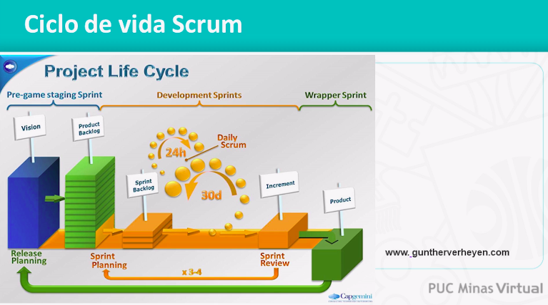
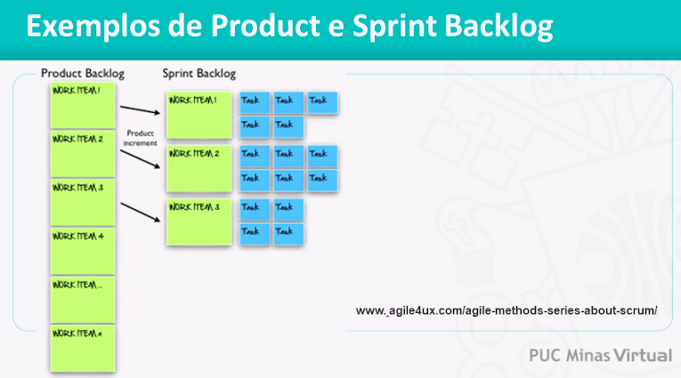
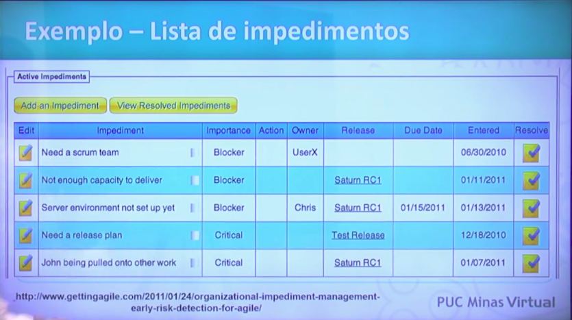
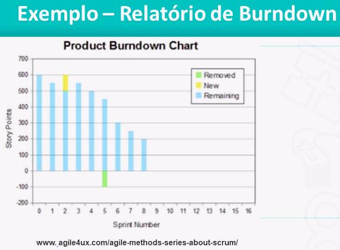
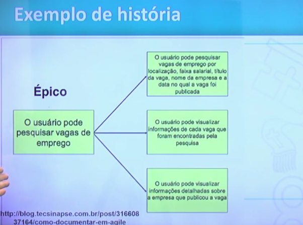
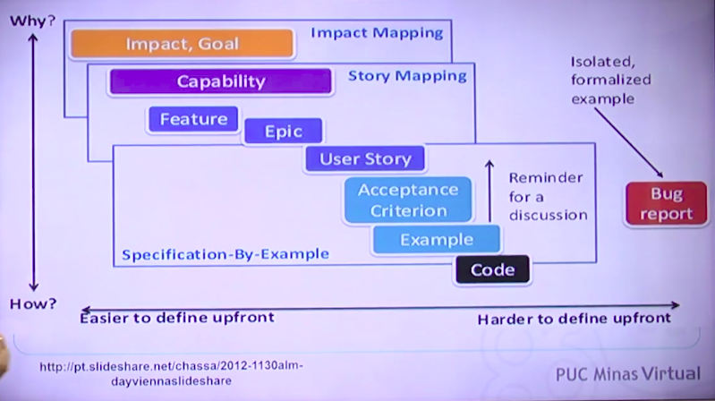

<h1>Unidade 03 - Métodos Ágeis</h1>

<h2>Métodos Ágeis</h2>

<h3>Introdução aos Métodos Ágeis</h3>

* Os métodos ágeis têm sido usados para o desenvolvimento de software desde 2001, quando o Manifesto ágil foi publicado. Este manifesto contem princípios que nortearam todos os métodos considerados ágeis desde então.

* A modelagem dos métodos ágeis são muito mais uma atitudes, não sendo um processo prescritivo de software.

* Um processo prescritivo nos diz exatamente o que fazer em cada momento do desenvolvimento de software. Temos templates, passos para a execução das atividades. A modelagem ágil, os métodos ágeis não são considerados métodos prescritivos. Pelo contrário, eles não dizem o que deve ser feito.

* Possuem um conjunto de princípios e valores que precisam ser seguidos para que os resultados pregados por esses métodos sejam de fato alcançados. Alguns autores não gostam de utilizar o termo métodologia ágil, pois o termo "métodologia" nos da uma ideia de processo, uma ideia de algo um pouco mais prescritivo, mas é claro que no dia a dia utilizamos o termo, mas pelos autores mais radicais não fossem um termo muito adequado.

* A proposta desses métodos é que eles vão resultar em um software de melhor qualidade e com um desenvolvimento mais rápido.

* Motivação
    * Princípio da Incerteza - inerente e inevitável em projetos e processos de software. Nos métodos tradicionais, nos processos precritivos, partimos da ideia que precisamos fechar um escopo, levantar bem os requisitos do software, para depois desenvolvermos o software. O recorte pode ser desde uma especificação completa, como em um processo em cascata, para depois desenvolver o software, ou ele pode ter recortes menores, como em um processo mais iterativo, posso especificar pequenos modulos e iniciar o desenvolvimento. Como todo nosso planejamento de desenvolvimento do software são projetados pelos requisitos levantados, se os requisitos mudam, eu preciso atualizar meu planejamento. Nos processos tradicionais é trabalhado com uma gestão mais forte, mais rigorosa do escopo, entretanto no meio do desenvolvimento do software mudanças vão acontecer. A motivação parte do principio da incerteza. Não adianta ir contra essas solicitações de mudança.

* Manifesto Ágil
    * Reunião de grupo de profissionais experientes com motivação de melhorar o desenvolvimento de software. Criaram o Manifesto para o Desenvolvimento Ágil.
    * Alguns profissionais experientes que estavam cansados de verificar esses problemas de desenvolvimento de software.
    * Criaram um grupo chamado de Aliança Ágil (www.agilealliance.com)
    * Formada em 2001.

* Quando tratamos de métodos ágeis, iremos partir de 4 princípais diretrizes. Essas diretrizes opões valores empregados nos métodos ágeis em contra posição a valores pregados nos métodos tradicionais. A ideia que não se abandone totalmente aquilo que os métodos tradicionais pregam, mas existe uma ideia de valorização de algumas coisas que os métodos ágeis colocam como mais importantes.

* Valorização de...
    * Indivíduos e interação entre eles é mais importante que o uso de processos e ferramentas.
        * Processos prescritivos são bem baseados na descrição detalhada desses processos. O mundo ágil prega que esses indivíduos e a promoção de um interação entre eles vai ter um resultado melhor do que seguir necessáriamente um processo muito padronizado que pode não ser adequado a todas as equipes, ou a todos os projetos em todos os casos. Não prega que não devemos usar processos, mas prega que devemos usar mais indivíduos e a interação entre eles e menos processos. É muito mais uma ideia de adequação.
    
    * É mais importante software em funcionamento do que uma documentação abrangente. Os métodos traducionais partem de um escopo bastante detalhado e definido para o projeto. O escopo definido e os requisitos detalhados são a parte princípal dos projetos tradicionais. No mundo ágil o software é mais importante.
        * Os requisitos já estão detalhados no software e não nos documentos. O software passa a ser o mecanismo de controle. O que precisa ser mais controlado.
        * Nos métodos tradicionais existe uma gerência de escopo muito forte.
        * Nos métodos ágeis existe uma gerência com a correção do software muito forte.
        * Não significa que não deva existir uma documentação. Será utilizado uma documentação quando a equipe entender que isso trará algum resultado.

    * Colaboração com o cliente é mais importante que negociação de contratos.
        * É uma das mais dificeis de serem alcançadas na prática. A negociação de contratos partem da ideia de que o escopo foi definido. Está muito bem fechado e qualquer alteração demanda uma gestão desse escopo.
        * A ideia dos métodos ágeis é que seja fechado com o cliente com base no fato de que mudanças vão acontecer e fechamos com ele uma colaboração. Fica acordado que ele pode sim realizar mudanças e que o software vai ter um prazo e uma equipe trabalhando nele. Essas mudanças vão levar a requisitos que ele quer mais rapidamente, mas isso implica que alguns casos ele tenha que abrir mão de algumas coisas.
        * O cliente está próximo para validar o que foi feito, para dar feedback, para priorizar os requisitos e para entender que ele faz parte de um time. Orienta o trabalho da equipe.

    * Responder a mudanças mais importante do que seguir um plano.
        * Deixa as mudanças acontecer e se adeque as mudanças que será desenvolvido um software que atende o cliente mais rapidamente.

* Além disso podemos citar 12 princípios.

* Princípios
    * 1- A prioridade é satisfazer ao cliente através de entregas contínuas e frequentes;
        * Métodos ágeis trabalham com entregas curtas
        * Feedback deve ser rápido
        * Não sera desenvolvimento muito software e só no final mostrar para o cliente como esta ficando.
        * Qualquer mudança tem que ser percebida rapidamente.
        * Se as entregas são curtas, existe um feedback muito rápido do cliente e é possível adequar aquele software para estar mais próximo para o que o cliente espera.
    
    * 2- Receber bem as mudanças de requisitos, mesmo em uma fase avançada do projeto;
        * Por isso a importância da colaboração do cliente.
    
    * 3- Entregas com frequência, sempre na menor escala de tempo;
        * Alguns métodos pregam inclusive como boa prática que tenhamos entregas com a mesma frequência, que isso seja padronizado para que o cliente tenha uma ideia de quando recebera essas entregas e a equipe também tenha uma idéia de sua produção.
    
    * 4- As equipes de negócio e de desenvolvimento devem trabalhar juntas diariamente;
    
    * 5- Manter a equipe motivada fornecendo ambiente, apoio e confiança necessários;
        * Método tradicional parte de um gerente coordenando uma equipe
        * Método ágil parte para uma equipe mais autodirigida mais automotivada autoorganizada
    
    * 6- A maneira mais eficiente da informação circular através de uma conversa cara-a-cara
        * Reuniões rápidas ao invés de relatórios grandes.
    
    * 7- Ter o sistema funcionando é a melhor medida de progresso;
        * Através disso é possível saber se esta atendendo ou não os requisitos do cliente com o sistema funcionando.
        * O código fonte parte a ser nosso princípal item de produção, ao contrário dos métodos tradicionais.
    
    * 8- Processos ágeis promovem o desenvolvimento sustentável;
        * Se todas essas diretrizes são aplicadas o desenvolvimento se sustenta no sentido de que é possível prosseguir no mesmo ritimo sem ter as equipes cansadas e motivadas com o desenvolvimento.
    
    * 9- Atenção contínua a excelência técnica e um bom projeto aumentam a agilidade;
        * Bom design, boa arquitetura.
    
    * 10- Simplicidade é essencial;
        * Facilita na evolução do software.
    
    * 11- As melhores arquiteturas, requisitos e projetos provêm de equipes organizadas;
    
    * 12- Em intervalos regulares, a equipe deve refletir sobre como se tornar mais eficaz;
        * Algo como lições aprendidas e melhoria contínua.

* Existem cenários onde o método ágil é adequado e cenários onde os métodos tradicionais sejam mais adequados.

* Quando não usar ágil
    * Quando você precisa formalmente documentar cada fase do ciclo de vida do software.
    * Necessário seguir processo tradicional.
    * Usuários não estão sempre acessíveis.
    * Exigência do cliente.

<h3>Prescritivos x Ágeis</h3>

* Para melhor compreender os princípios ágeis, é importante comparar com os métodos chamados tradicionais ou prescritivos, usados ainda hoje em dia.

* Métodos Prescritivos ou Métodos Convencionais
    * Adotam a estratégia de previsibilidade. Tenta-se levantar todos os requisitos antes de dar inicio ao processo de desenvolvimento.
    * Levantar todos os requisitos antes de codificar os requisitos, tendo-se um maior controle do que será desenvolvido.
    * Métodos convencionais acontecem por meio de processos bem detalhados, bem documentados, também chegamos na mesma estratégia e no mesmo objetivo da previsibilidade.
    * Se é adotado sempre os mesmos processos, será alcançado os mesmos resultados. Vai ter formas de medir a produtividade, metricas mais faceis para comparação.
    * Com os requisitos e o escopo do projeto bem definido, é feito o planejamento. Essas mudanças são controladas entre o processo em todo o método tradicional. Esse controle de mudanças passa a ser um controle rígido. O controle rígido nao quer dizer que as mudanças não possam ser implementadas, mas existe todo um fluxo para fazer a mudança, uma análise de impacto, do custo, do prazo, etc.

* Métodos Ágeis
    * Optam pela adaptabilidade. Buscam levantar aos poucos os requisitos e o planejamento é contínuo. Há adaptação às mudanças.
    * Os aspectos humanos durante o desenvolvimento do software são bastante enfatizados, como a integração entre a equipe, o feedback, a importância da equipe estar satisfeita, ao contrário dos métodos tradicionais.
    * Não são centrados nos artefatos. É claro que alguns métodos ágeis tem alguns artefatos previstos, mas eles não tem conjunto grande de artefatos produzidos como nos métodos tradicionais.
    * O certo é ter uma documentação quando necessário e em um nível apropriado para evitar redundancias e excessos.
    * Não gastar tempo, dinheiro e recursos escrevendo uma documentação extensa, completa e detalhada, que será difícil manter, ou até mesmo não será mantida, tendo uma documentação desatualizada e ficar dentro de uma gaveta sem consulta-la. Só irá desenvolver documentações sempre que necessário.

* Existem mudanças em relação do ciclo de vida dos métodos tradicionais e dos métodos ágeis.

* Comparação do método cascata e um método ágil.
* Método cascata uma fase só é iniciada quando a fase anterior é concluída. Só se tem um produto pronto no final. Demorar para ter um feedback do cliente. Chega no final com um risco grande de que o produto não anteda as necessidades do cliente
* Método ágil possuem vários ciclos, como se fosse um PDCA, algo contínuo. Existem os giros de desenvolvimento e testes com entregas. Giros rápidos com entregas contínuas e frequentes para adaptar as necessidades do cliente.

* Na figura existem dois triangulos, na primeira parte o triangulo azul mostra a estrutura para os projetos tradicionais, projetos em cascata. Na parte de cima existe um retangulo mostrando as restrições. Em um projeto tradicional, orientado a planos o que é fixo o que é restrição é o escopo. O escopo é fechado e bem definido. Em cima do escopo temos a estimativa, que está na parte cinza de baixo da figura. O projeto que está estimado para 500 ponto de função vai ter um custo x e vai durar cerca de y horas.
* Nos métodos ágeis tudo é invertido, no inicio do projeto temos a discução das principais funcionalidades sem fechar o escopo. Existe um certo norte ao inicio do projeto mas isso vai sendo mudando com o tempo com a ajuda do usuário.

* Outra diferença está relacionada a entregas e velocidade das entregas e como perceber um retorno dos investimento desses projetos.
* Caso aconteça algo que o projeto pare de ser desenvolvido, no projeto em cascata a especificação irá estar completa e não existe um software que funcione e tenha algo operacional de fato. Esse projeto teria um retorno muito baixo. Não é possível usar a especificação, é preciso de algo. Tem retorno contínuo em relação ao projeto, mesmo que não seja em sua totalidade.

* A metodologia ágil trabalha com equipes pequenas, pela ideia da comunicação rápida, da conversa cara a cara os times precisam ser pequenos. Ao contraŕio da metodologia tradicional que os times são grandes.
* A metodologia ágil trabalha sem a especificação de papeis, tende todo mundo a ser equipe. Nos métodos tradicionais os processos são muito bem definidos.
* Equipe ágil não deve exceder 14 pessoas.
* Equipes pequenas
* Método Scrum: de Scrum de Scrums (Scrum of Scrums), varias pequenas equipes que tem que ser entregadas e cada equipe pequena utiliza seus métodos ágeis.

* Fatores Humanos
    * Pessoas capacitadas e com experiência são fator chave para metodologias ágeis.
    * Como existem menos a diversificação de papeis as pessoas tem que ser mais curingas.
    * Compromentimento e disponibilidade do cliente.
    * Processo fica mais atraente e isso reflete na cultura da organização. Vai conseguir ser ágil as organizações mais soltas e menos burocráticas.

* Fatores de riscos
    * Usados em aplicações que podem ser construídas rapidamente e não necessitam garantia extensiva da qualidade.
    * Sistemas críticos que demandam alta confiabilidade e segurança são mais adequados para uma metodologia prescritiva.
    * São tendencias e não quer dizer que pode existir métodos prescritivos com algumas características ágeis e ao contrário também acontece.

* Se o cliente não participa e a organização não tem estrutura para ágil. É um projeto que demanda algo mais processual talvez não seja necessário usar o ágil.

* Não existe uma metodologia boa ou ruim, mas existe sim algo adequado para a organização ou para o projeto.
* Existem organizações que trabalham com as duas metodologias. Odotam o método tradicional ou o metodo ágil.

<h3>XP - Extreme Programming</h3>

* Para ilustrar as características apresentadas dos métodos ágeis, apresentamos um dos primeiros métodos que foi usado em ampla escala, o Extreme Programming ou XP.

* Introdução ao XP
    * Metodologia ágil de desenvolvimento de software para times pequenos e médios.
    * Leva as melhores práticas ao "extremo".
    * Talvez seja a primeira metodologia ágil mais conhecida ou mais difundida na prática.
    * Enfatiza colaboração, criação de software cedo e rápida, prática de desenvolvimento.
    * Fundamentada em 4 valores básicos.

* Valores do XP
    * Comunicação - Primeiro valor
        * Comunicação ocorre entre os desenvolvedores através de uma prática chamada programação em pares e também das reuniões de pé. As reuniões de pé são realizadas dessa maneira como proposito de durarem pouco, assim contraposição dos métodos tradicionais, que são reuniões longas que muitas vezes não tem necessidade de durar tanto e não tem tantas decisões a serem tomadas.
        * Envolvimento com os usuários através da escrita de testes de aceitação. Outro mecanismo de comunicação.
    
    * FeedBack
        * Estimativas de tempo; Dão feedback da compreensão do que deve ser feito.
        * Testes fornecem o estado do sistema (TDD); O desenvolvimento dirigido a testes fornece constantemente informações do estado do sistema.
        * Integração contínua;
        * Ciclo de desenvolvimento rápido;
        * Chance de ver e operar um sistema parcial. O cliente também nos da o feedback.
    
    * Coragem
        * Bastante importante para alguns desenvolvedores, essa coragem está envolvida com simplificar/refatorar o código.
        * Simplificar e refatorar código; Jogar código fora;
        * Receber crédito somente por código completo; O código só está completo quando possui um conjunto de testes executados e implementa todos os requisitos e evitar disponibilizar o código para teste e não estar pronto ainda.
        * Ser transparente;
        * Fazer correções arquiteturais;
        * Não descartar práticas essenciais.

    * Simplicidade
        * XP encoraja o uso de simples cartões de papel para escrita breve de funcionalidades. Pode ser chamado de histórias de usuários.
        * Evita criação de componentes que não sejam imediatamentejustificáveis pelos requisitos correntes. Desenvolver somente aquilo que de fato precisa ser feito.
    
* Práticas do XP
    * Programação em pares
        * Todo código fonte é produzido em duplas em um computador. Enquanto um implementa, o outro pensa. Alternam entre si. Duplas normalmente não são fixas. A cada dia um desenvolvedor recebe uma atribuição e recebe um par para ele. A ideia é que o observador faça uma inspeção, uma observação em tempo real, conseguindo pensar em coisas que o desenvolvedor que está implementando de fato não consegue notar, consegue perceber correções que poderiam ser feitas naquele momento, claro que existe algo oneroso, mas é investimento que se paga com os benefícios e resultados alcançados.

    * Propriedade coletiva do código.
        * Qualquer um pode alterar ou melhorar qualquer parte do código.
        * Toda equipe responsável por todo o código.
        * Torna-se reponsável pelo código a equipe inteira, se eu vir um problema ou encontrar um erro eu mesmo posso mudar isso. A qualidade desse código vai ser garantida por outras práticas, como a programação em pares e os testes contínuos.
    
    * Semana de 40 horas
        * Horas extras são um sinal de problemas sérios no projeto.
        * Não faça horas extras por mais de uma semana.
        * Principio dos métodos ageis é que o desenvolvimento seja sustentável, ninguém consegue trabalhar de maneira sustentável durante muito tempo, fazendo hora extra durante semanas seguidas. Concentrar o trabalho em 40 horas semanais.
    
    * Cliente residente
        * Deve haver um cliente disponível para responder às questões dos desenvolvedores e estabalecer prioridades de baixo nível.
        * De preferência fisicamente nos projetos.
        * Se o cliente não consegue liberar alguem ou se não existe alguém responsável por essa tarefa do lado do cliente, nao vale a pena construir o software, é como se não houvesse interesse por parte do cliente na construção do software. Programadores e clientes habitam o mesmo espaço e implementa-los de maneira mais correta.
        * Clientes devem conhecer o domínio e ter poder de decisão. Dúvidas e perguntas das equipes desenvolvedores precisam ser sanadas pelos clientes envolvidos.
        * O cliente deve ser alguém que realmente vá utilizar o sistema.
        * Maior envolvimento do cliente é fundamental para projetos de sucesso.

    * Integração Contínua
        * Código é integrado e testado no mínimo diariamente.
        * Cenário comum: Código é integrado em uma máquina de integração. Todos os testes são executados. Se um erro é encontrado, o código é consertado (não importa a localização).
        * Para cada código existe um conjunto de testes que o valida e se um erro for encontrado esse código tem que ser consertado. O código que roda sempre no repositório central tem que ser correto na entregação contínua.

<h2>Scrum</h2>

<h3>Scrum - Princípios Básicos</h3>

* Atualmente, talvez o método ágil mais usado seja o Scrum, tanto para desenvolvimento quanto para gerenciamento de projetos ágeis. O coração do Scrum é formado pela Sprint, o que equivalente a uma iteração, que deve ser curta, não mais de 30 dias. Neste vídeo, discutimos esta e outras características básicas deste método.

* Introdução ao Scrum
    * Origem do nome vem do jogo Hugby.
    * A equipe do time se junta para analisar quais serão as próximas jogadas e estrátegias.
    * Metodologia foca em analisar a melhor estratégia para execução, documentação e entrega para alcançar um objetivo.

* Principal divisão de trabalho dentro do Scrum é chamada de Spring

* Sprint
    * Tem uma ideia de agilidade.
    * Consiste em intervalos fixos de tempo, em que todo o trabalho é realizado. Passar por todas as atividades que podem estar no ciclo de desenvolvimento, não tem só codificação, pode ter documentação no nível que a equipe precisar, arquitetura, testes. Quem decide isso é a equipe de acordo com as necessidades daquele projeto. Se não foi possível terminar algo na Sprint, isso ira ficar para depois. A prioridade vai ser rediscutida e não vai ser implementada na Sprint que não deu tempo. Intervalo sempre fixo, nao estica, não aumenta e tbm não diminui.
    * Um Sprint tem duração aproximada de trinta dias, sendo esse um valor do qual a equipe pode escolher o tempo de duração, mas com seu valor máxima de até 30 dias, para que não passe muito tempo sem entregar o incremento de sofware. Não quer dizer que todas as Sprint serão iguais. Não muda o tamanho do que deu ou não conta de terminar. Boa pratica ter Sprints do mesmo tamanho. 
    * Durante um Sprint a equipe Scrum se organiza para produzir um incremento do produto. Não necessariamente precisa ser entregue ao cliente no sentido de ser colocado em operação, mas a uma demonstração desse incremento do que a equipe conseguiu produzir até o final da Sprint.
    * O trabalho conduzido dentro de um Sprint é adaptado ao problema em mãos e é definido e, frequentemente, modificado em tempo real pela equipe Scrum.
    * A quantidade de Sprints varia dependendo da complexidade e do tamanho do produto.

* Principios
    * Pequenas equipes são organizadas de modo a maximizar a comunicação e compartilhamento de conhecimento tácito e minimizar supervisão. Normalmente no mundo ágil o conhecimento não está formalmente documentado, formalmente descrito, ele é tácito. A própria equipe trabalha de maneira auto gerenciável.
    * O processo precisa ser adaptável e produz frequentemente incrementos de software que podem ser inspecionados, ajustados, testados, documentados e expandidos. Tudo de acordo com as necessidades do projeto.
    * O desenvolvimento é dividido em partições claras, de baixo acoplamento ou em pacotes. Todo trabalho que entra na Sprint deve ser feito de maneira individual sem dependencias com outros. Isso facilita decidir quais serão os requisitos mais prioritários, pois se não existe um requisito ligado a outro, não como um requisito ser implementa por dependencia de outro.
    * Testes e documentação constantes são realizados à medida que o produto é construído. Tipo de documentação a equipe vai decidir de acordo com as características do projeto.
    * O processo fornece habilidade de declarar o produto "pronto" sempre que necessário. Pode não ser um pronto entregável em produção mas existe uma avaliação que tudo foi implementado de acordo com o desejado.

* Ciclo de vida do Scrum
    * Antes do período de desenvolvimento é necessário elaborar uma visão.
    * Lembra um pouco mais os métodos tradicionais, pois tenta entender os requisitos do usuário.
    * Não existe um compromisso com os requisitos das metodologias tradicionais, mas precisa tirar o retrato das necessidades do cliente naquele momento.
    * Além das sprints de desenvolvimento existe um período para compreender os requisitos e também existe um período posterior para empacotamento e agrupar esses incrementos e entregá-los na operação do cliente.

<h3>Scrum - Papeis, Cerimônias e Artefatos</h3>

* O método Scrum é formado por Cerimônias ou reuniões (Reunião diária, Reunião de planejamento, Reunião de revisão e Reunião de retrospectiva), papeis (Product Owner, Scrum Master e Equipe de Desenvolvimento) e Artefatos (Product Backlog e Sprint Backlog).

* Papeis
    * Product Owner - PO
        * Define os itens que compõe a "lista de pendências" - Product Backlog - e define as prioridades. Muitas vezes existe um PO que não sabe descrever as histórias, mas é ele que vai ter que contar para alguém como essas histórias devem ser escritas e o que é importa que essas histórias tenham, além disso define as prioridades.
        * Define os objetivos para o próximo Sprint.
        * Revê o produto ao final de cada Sprint.
    
    * Scrum Master
        * Gerencia o processo do Scrum. Ensina o Scrum a todos os envolvidos no projeto. É muito mais um guia, um orientador do que um gerente, muita gente tenta associar a figura do gerente mas não é exatamente isso. O papel dele é ensinar as pessoas como executar o Scrum.
        * Implementa o Scrum de modo que esteja adequado à cultura da organização e que todos sigam as regras e práticas do Scrum. Scrum é um conjunto de diretrizes muito básicas e precisa ser trabalhadas e repensadas de acordo com a organização.
        * É responsável por remover os impedimentos do projeto. Qualquer impedimento tecnico, de infraestrutura, de relacionamento e quem resolve isso é o Scrum Master.

    * Scrum Team
        * É a equipe de desenvolvimento.
        * Não existe necessariamente uma divisão funcional através de papéis como: programador, designer, analista de testes ou arquiteto.
        * Todos trabalham para completar o trabalho com o qual se comprometeram para um Sprint.
        * Não existem donos, se tem um problema todo mundo pode ajudar a resolver, se tem um defeito todos podem ajudar a resolver. Tudo pode fazer de acordo com as necessidades de acordo com o projeto.
    
* Cerimônias
    * Scrum Planning Meeting
        * Reunião de planejamento na qual o Product Owner prioriza os itens do Product Backlog. Acontece no inicios das Sprints e trazer os itens que caibam dentro da Sprint para que sejam implementados.
        * A equipe seleciona as atividades que ela será capaz de implementar durante o Sprint.
        * As histórias de um Sprint são transferidas do Product Backlog para o Sprint Backlog. Sempre que for dito história será chamado dos requisitos e necessidades daquilo que foi sitado pelo PO. Tarefas são as ações da atividade da equipe de desenvolvimento para que as histórias sejam concluídas corretamente.
    
    * Daily Scrum
        * Breve reunião de 15 minutos de pé.
        * O objetivo é disseminar conhecimento sobre o que foi feito no dia anterior, identificar impedimentos e priorizar o trabalho do dia que se inicia.
        * Assuntos discutidos são poucos, não é para discutir solução de problemas.
        * Equipes são pequenas, por isso 15 minutos.

    * Scrum Review Meeting
        * Valida os objetivos da iteração e a finalização das histórias.
        * Software é mostrado ao PO e aplica os critérios de aceitação e se está corretamente implementado e se estiver Ok as histórias estão ok e se não estiver de acordo, volta para o backlog.

    * Scrum Retrospective Meeting
        * Reunião de retrospectiva para levantar todo conhecimento e experiência da iteração que se encerra.
        * Acontece em um final de Sprint. Lições aprendidas nos métodos tradicionais.
        * Fluxo de trabalho muito fluido e pode mudar entre uma Sprint e outra.
        * Coisas que não funcionaram a equipe vai pensar e aprender como trabalharam e pensar em forma mais corretas.

* Artefatos
    * Product Backlog
        * Lista priorizada de requisitos ou características do projeto que fornecem valor de negócio para o cliente. Não precisa estar completo no início do projeto. Não precisa estar completo, pois o cliente pode pensar prioridades e requisitos novos.
        * Conjunto de histórias/requisitos priorizadas.
        * Itens podem ser adicionados à pendência a qualquer momento (modificações introduzidas).

    * Sprint Backlog
        * Histórias que entreram para a Sprint.
        * Lista de histórias mais relevantes quebradas em tarefas com suas respectivas estimativas de duração do presente momento.
        * Definida pelo time e negociada com o Product Owner.
        * Deve ser mantida sempre atualizada.
        * Tarefas são mais técnicas. Implementação das Histórias.
        

    * Lista de Impedimentos
        * Lista que contém os impedimentos para o time alcançar os objetivos.
        * Tais impedimentos devem ser resolvidos pelo Scrum Master.
        

    * Relatórios
        * São relatórios capazes de mostrar o andamento do projeto. Importantes para controle e tomada de decisão dentro do projeto.
        * Relatório de burndown - Acompanhamento do tempo restante para concluir as tarefas.
        * NO primeiro dia existe uma quantidade de horas que vai sendo usadas ao decorrer dos dias.
        

<h2>Histórias de usuário</h2>

<h3>Histórias de Usuário</h3>

* Histórias de usuário são intenções curtas e negociáveis. Representam requisitos do usuário, mas em função do fato de não definirmos totalmente o escopo do projeto em seu início, estas intenções podem ser modificadas, excluídas ao longo do projeto. Neste vídeo, introduzimos o conceito de história de usuário.

* Inicialmente, unidade de funcionalidade no Extreme Programming (XP).

* Sentença curta de intenção que descreve algo que o sistema deve fazer para o usuário. Sem detalhamentos, apenas a necessidade. Como será feito será discutido depois. Por que intenção? Usuário não é capaz de dizer tudo o que ele quer no início do projeto. Na medida que ele vai recebendo pequenos incrementos do software ele vai dando feedback, falando o que ele gostou e o que ele não gostou. É uma intenção pois nem mesmo o usuário tem condições de saber nesse primeiro momento, pois não viu nada do software ainda. Está dando o poder de redefinir com o tempo. Na metodologia tradicional já possui um escopo fixo.

* No XP, histórias são escritas pelo usuário.

* No Scrum, o Product Owner geralmente escreve (aceita e prioriza) histórias, apoiado pelos clientes, partes interessadas e equipe. Foco muito mais no valor para o usuário, do que uma decomposição hierarquica funcinal.

* Na prática, qualquer membro da equipe com conhecimento no domínio pode escrever histórias.

* Devem ser escritas de forma a serem compreendidas por usuários e desenvolvedores.

* Focam no valor definido pelo usuário em vez de uma decomposição hierarquica funcional.

* Podem ser escritas em cartões ou ferramentas.

* Detalhes não aparecem nas histórias.

* Histórias X Requisitos
    * Não são especificações detalhadas de requisitos, mas expressões de intenção negociáveis.
    * São curtas, fáceis de ler e compreensiveis a desenvolvedores, partes interessadas e usuários.
    * Representam incrementos de funcionalidades.
    * Relativamente fáceis de se estimar esforços.
    * Não são registradas em documentos longo, mas em listas organizadas.
    * Não são detalhadas no início do projeto.
    * Necessitam de pouca ou nenhuma manutenção.
    * Servem de entrada para qualquer documentação posterior necessária.

* Como escrever histórias
    * Tem formato especifico de escrita geralmente
        * Como um "papel", eu posso/devo "ação" para que "valor para o negócio"
        * Eu como "aluno", "gerente", preciso ou devo fazer tal coisa para que algo seja alcançado.
        * Eu como aluno preciso visualizar minhas notas para saber como andam meu desempenho escolar.
    
    * Foco:
        * Papel do usuário.
        * Valor para o negócio
    
    * Papel: Permite uma segmentação da funcionalidade. Identifica necessidades de papeis.

    * Atividade: Representa "requisito do sistema".

    * Valor para o negócio: Comunica porque a atividade é necessária.

* Processo Completo
    * Defina uma história de valor para o usuário.
    * Implemente e teste em uma iteração curta.
    * Demonstre ou entregue para o usuário.

* Representação das Histórias
    * 3 C's
        * Cartão 
            * Representa uma ou três frases usadas para descrever a intenção da estória.
            * Detalhes ainda serão determinados. Só será visto após a Sprint chegar.
            * Promessa de conversa
        
        * Conversa
            * Discussão entre equipe, cliente e product owner para determinar o comportamento detalhado.
        
        * Confirmação
            * Representa o teste de aceitação.
            * Representa condições de satisfação.
        
* História grande chamada de Épico

* Conclusão
    * Histórias são mecanismos importantes para entendimento, detalhamento e negociação dos requisitos.
    * Permitem maior detalhamento na medida em que o mesmo se faz necessário.
    * Estimativas podem ser derivadas de histórias.

* Se você tem uma história de usuário que não pode ser entregue em uma sprint, você pode estar em face à dois problemas. O primeiro pode ser que a história não foi bem definida ou compreendida pela equipe de desenvolvimento e isso fez com que mais coisas do que o necessário fossem feitas. O segundo é que a história é mais complexa do que realmente parece, então nesse caso você estará de frente à um épico e não uma história. O certo é quebrar esse épico em histórias menores. Um épico pode sim levar mais de uma sprint pra ser feito, mas uma história não.

<h3>Boas histórias de usuário</h3>

* Começar com  objetivos
    * Todo sistema existe por um conjunto de objetivos, existe uma razão para desenvolve-lo. Deve começar por esses objetivos para identificar as histórias. Objetivos nos dão um pouco essa orientação.
    * Em projetos grandes com muitos usuários.
    * Difícil saber por onde começar
    * Sugestão é começar em cada papel e começar pelos seus objetivos de maior prioridade.
    * Objetivos são histórias de alto nível. Épico ou Epic
    * Irão gerar histórias adicionais.

    

* Fatiar o bolo
    * Ninguém come o bolo da horizontal e sim da vertical.
    * Por isso cada fatia vai da interface ao banco e depois volta.
    * Há várias maneiras de se quebrar uma história em pedaços menores.
    * Existe tendência de se quebrar considerando aspectos técnicos.
    * Melhor abordagem: Fatiar o bolo.
    * Cada história deve conter algum nível completo de funcionalidade.
    * Uma maneira também de se testar camadas de arquitetura.
    * Aplicação pode até ser entregue com funcionalidade parcial mas que inclui todas as camadas.

* Ciclos trimestrais
    * Não há regra que determine quanto o projeto deve durar.
    * Para projetos mais longos que quatro meses, uma boa sugestão é usar ciclos trimestrais.
    * Lançar uma versão testada e documentada a cada 3 meses.

* Restrições em cartões
    * Devem ser obedecidas e não implementadas diretamente.
    * Não são alocadas a iterações e não são diretamente estimadas.
    * Podem ser colados nas paredes.
    * Podem ter testes de aceitação associados.

* Algumas coisas não são histórias
    * Formato de histórias de usuário não é apropriado para tudo.
    * Se for necessário documentar requisitos em outro formato, então use formato adequado.
        * Ex. Documentos de interface.
    * Documentos de fornecedores externos também podem demandar outros formatos.

* Escrever voz na ativa
    * Histórias de usuário são mais fáceis de ler e entender quando escritas na voz ativa.
    * Em vez de:
        * Uma chamada pode ser realizada por um operador.
    * Escreva:
        * Um operador pode realizar uma chamada.

* Não numerar os cartões
    * Pode ser uma tentação para manter controle dos cartões ou ter algum mecanismo de rastreabilidade.
    * Acrescenta esforço necessário.
    * Normalmente histórias são referenciadas pela funcionalidade em vez de por número.
    * Se existir a necessidade, tente ascrescentar um título para a história.

<h3>Problemas com histórias de usuário</h3>

* Trabalhar com histórias de usuário pode gerar alguns problemas.
* Histórias pequenas demais
    * Histórias muito pequenas causam problemas de estimativas quando a ordem da implementação afeta consideravelmente as estimativas
        * Os dados do relatório devem ser salvos em um arquivo .doc.
        * Os dados do relatório devem ser salvos em um arquivo .xls.
        * História não pode ser nem muito grande, nem muito pequena.
    
* Histórias dependentes
    * Podem causar dificuldade no planejamento das iterações.
    * A inclusão de uma história em uma iteração incluir outra relacionada.
    * Ocorre quando histórias são pequenas ou divididas inapropriadamente.
    * Solução pode ser combinar histórias.
    * Lembrar da divisão em camadas (fatias de bolo).
    * História que é prioritária está amarrada uma que é de baixa prioridade e estaria gastando muito tempo para algo sem prioridade.

* Goldplating
    * Acontece quando são entregues funcionalidades que não foram solicitadas ou além do que é necessário para sua implementação.
    * Difícil impressionar o cliente com a participação constante em projetos ágeis.
    * Pode-se evitar aumentando a visibilidade das tarefas de cada um a reuniões de termino de iteração.
    * Dar de bandeja.
    * Fenomeno mais comum no mundo tradicional
    * Mundo ágil é mais dificil acontecer, pois o usuario está mais próximo.

* Detalhes demais
    * Acotence quando muito tempo é gasto com detalhes antes da implementação da história ou ainda com a escrita da história.
    * Demonstra algo valor para documentação em detrimento da conversação.
    * Uso de cartões (espaço limitado).

* Iniciar desenvolvimento sem visão (ter uma visão geral do escopo)
    * É um erro iniciar o desenvolvimento sem nenhuma visão do produto.
    * Deve haver uma visão disponível para enunciar claramente o cliente selecionado, suas necessidades e atributos críticos.
    * Esta visao ajuda a determinar quais recursos deverão ser implementados e garante a criação de um produto útil.

* Especificação de Requisitos disfaçada
    * Uma especificação disfarçada em Product Backlog é tentadora porque atende nosso desejo de saber todos os requisitos de cara.
    * Mas não tem suporte para surgimento de novos requisitos.
    * Não vê requisitos com algo fluído e transitório.
    * Pode ser sinal de relacionamento pouco saudável entre Product Owner e equipe.

* Contrato de preço fixo
    * Se for possível, evite projetos com preço e escopo fixo.
    * Se não for possível, divida o contrato de preço fixo em duas partes.
    * O primeiro cria a visão do produto e implementa-o parcialmente.
    * O segundo continua a dar vida ao projeto com base em feedback do cliente.

<h3>Proxies de Usuários</h3>

* É desejável que o cliente escreva as histórias ou esteja ativamente envolvido em sua escrita. Entretanto, nem sempre isso é possível. Em alguns casos, precisamos utilizar alguém que substitua o cliente. Vamos chamar esta figura de Proxy de usuário, ou intermediário

* É fundamental que um projeto tenha um ou mais usuário reais no time de clientes.

* Pode ser difícil reunir os usuários necessários ou desejáveis.

* Importante selecionar proxies. Alguns papéis típicos podem ser usados.

* Proxies - Gerente de Usuários
    * Precisa ser também usuário do software.
    * Pode ter padrões de uso diferentes.
    * Questões de ego envolvidas.
    * As vezes o gerente tem uma visão diferente do que o sistema vai ser, uma visão de um usuário diferente.

* Proxies - Gerente de Desenvolvimento
    * Uma das piores escolhas possíveis.
    * Objetivos diferentes dos usuários (uso de tecnologia, prazos, ...).
    * Muito mais preocupado ao uso de tecnologias, prazos do projeto não terá conciencia das reais necessidades dos usuários.

* Proxies - Pessoal de vendas
    * Preocupados normalmente com funcionalidades que vendem.
    * Podem ser um canal de apresentação a usuários verdadeiros.

* Proxies - Especialistas de Domínio
    * Sua utilidade depende se são ou foram usuários do sistema.
    * Muito úteis ao se construir um modelo de domínio ou identificar regras de negócio ou mesmo especificar processos de negócio como são executados no momento que o projeto está sendo desenvolvido.
    * Software final pode ficar direcionado a usuários com nível de domínio similar (complexo)
    * Muitas vezes podem ter um entendimento mais complexo. Usuários reais, típicos, talvez não tenham esse entendimento.

* Proxies - Equipe de Marketing
    * Mais interessados na quantidade do que na qualidade das funcionalidades.
    * Podem trazer informações de alto nível, mas dificilmente nos níveis de usuários básicos.

* Proxies - Usuários anteriores
    * Novas  versões de sistemas. Pode ser sim uma boa opção se a experiência é recente ou similar ao sistema que existe no momento.
    * Objetivos anteriores do sistema devem estar alinhados aos atuais.
    
* Proxies - Equipe de Treinamento
    * Tendência de se projetar um sistema fácil de treinar ou dar suporte, do que  de fato um sistema que realmente atenda as necessidades dos usuários básicos.

* Proxies - Analistas de Negócio
    * Podem ser boa opção por conhecer do domínio e de tecnologia.
    * Devem conversar com usuários reais.
    * Um problema comum, que existe também no mundo tradicional, é que Analistas podem querer intuir o que o usuário deseja e não perguntar diretamente a ele.
    * Há uma tendência de querer gastar muito tempo em tarefas de projeto.

<h3>Armazenamento de histórias de usuário</h3>

* O armazenamento de histórias pode ser feito em software ou mesmo em papel. Entretanto, há diferenças quanto ao objetivo de mantê-las de uma forma ou de outra.

<h2>Arquitetura em métodos ágeis</h2>

<h2>Adoção de métodos ágeis</h2>

