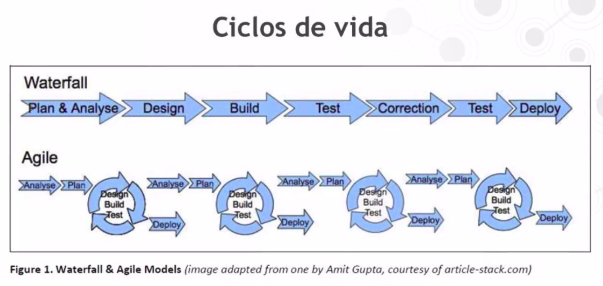
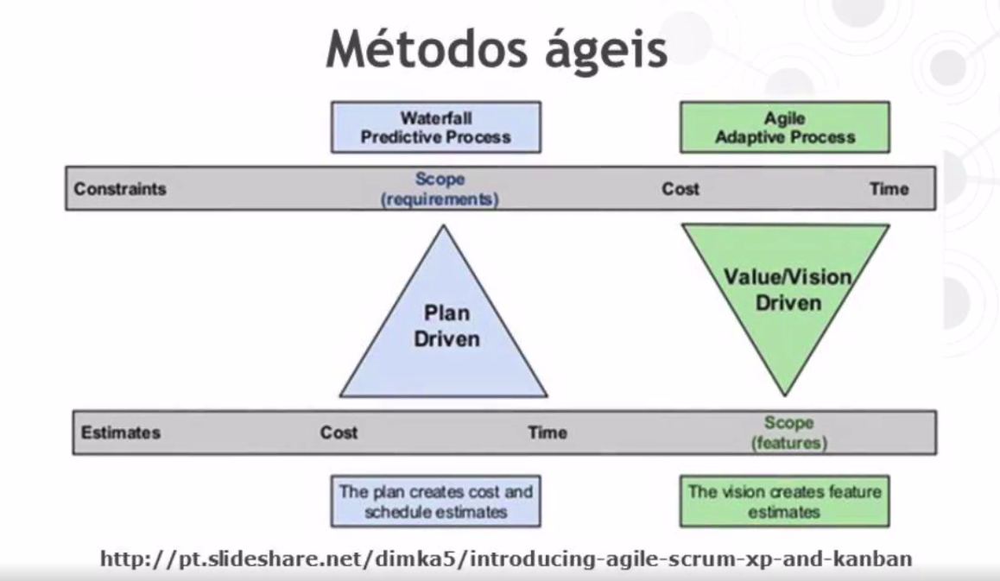
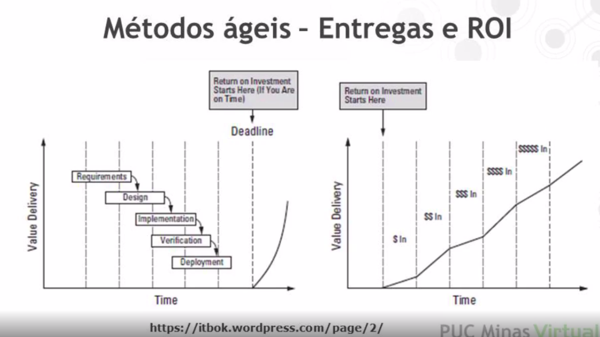

<h1>Unidade 03 - Métodos Ágeis</h1>

<h2>Métodos Ágeis</h2>

<h3>Introdução aos Métodos Ágeis</h3>

* Os métodos ágeis têm sido usados para o desenvolvimento de software desde 2001, quando o Manifesto ágil foi publicado. Este manifesto contem princípios que nortearam todos os métodos considerados ágeis desde então.

* A modelagem dos métodos ágeis são muito mais uma atitudes, não sendo um processo prescritivo de software.

* Um processo prescritivo nos diz exatamente o que fazer em cada momento do desenvolvimento de software. Temos templates, passos para a execução das atividades. A modelagem ágil, os métodos ágeis não são considerados métodos prescritivos. Pelo contrário, eles não dizem o que deve ser feito.

* Possuem um conjunto de princípios e valores que precisam ser seguidos para que os resultados pregados por esses métodos sejam de fato alcançados. Alguns autores não gostam de utilizar o termo métodologia ágil, pois o termo "métodologia" nos da uma ideia de processo, uma ideia de algo um pouco mais prescritivo, mas é claro que no dia a dia utilizamos o termo, mas pelos autores mais radicais não fossem um termo muito adequado.

* A proposta desses métodos é que eles vão resultar em um software de melhor qualidade e com um desenvolvimento mais rápido.

* Motivação
    * Princípio da Incerteza - inerente e inevitável em projetos e processos de software. Nos métodos tradicionais, nos processos precritivos, partimos da ideia que precisamos fechar um escopo, levantar bem os requisitos do software, para depois desenvolvermos o software. O recorte pode ser desde uma especificação completa, como em um processo em cascata, para depois desenvolver o software, ou ele pode ter recortes menores, como em um processo mais iterativo, posso especificar pequenos modulos e iniciar o desenvolvimento. Como todo nosso planejamento de desenvolvimento do software são projetados pelos requisitos levantados, se os requisitos mudam, eu preciso atualizar meu planejamento. Nos processos tradicionais é trabalhado com uma gestão mais forte, mais rigorosa do escopo, entretanto no meio do desenvolvimento do software mudanças vão acontecer. A motivação parte do principio da incerteza. Não adianta ir contra essas solicitações de mudança.

* Manifesto Ágil
    * Reunião de grupo de profissionais experientes com motivação de melhorar o desenvolvimento de software. Criaram o Manifesto para o Desenvolvimento Ágil.
    * Alguns profissionais experientes que estavam cansados de verificar esses problemas de desenvolvimento de software.
    * Criaram um grupo chamado de Aliança Ágil (www.agilealliance.com)
    * Formada em 2001.

* Quando tratamos de métodos ágeis, iremos partir de 4 princípais diretrizes. Essas diretrizes opões valores empregados nos métodos ágeis em contra posição a valores pregados nos métodos tradicionais. A ideia que não se abandone totalmente aquilo que os métodos tradicionais pregam, mas existe uma ideia de valorização de algumas coisas que os métodos ágeis colocam como mais importantes.

* Valorização de...
    * Indivíduos e interação entre eles é mais importante que o uso de processos e ferramentas.
        * Processos prescritivos são bem baseados na descrição detalhada desses processos. O mundo ágil prega que esses indivíduos e a promoção de um interação entre eles vai ter um resultado melhor do que seguir necessáriamente um processo muito padronizado que pode não ser adequado a todas as equipes, ou a todos os projetos em todos os casos. Não prega que não devemos usar processos, mas prega que devemos usar mais indivíduos e a interação entre eles e menos processos. É muito mais uma ideia de adequação.
    
    * É mais importante software em funcionamento do que uma documentação abrangente. Os métodos traducionais partem de um escopo bastante detalhado e definido para o projeto. O escopo definido e os requisitos detalhados são a parte princípal dos projetos tradicionais. No mundo ágil o software é mais importante.
        * Os requisitos já estão detalhados no software e não nos documentos. O software passa a ser o mecanismo de controle. O que precisa ser mais controlado.
        * Nos métodos tradicionais existe uma gerência de escopo muito forte.
        * Nos métodos ágeis existe uma gerência com a correção do software muito forte.
        * Não significa que não deva existir uma documentação. Será utilizado uma documentação quando a equipe entender que isso trará algum resultado.

    * Colaboração com o cliente é mais importante que negociação de contratos.
        * É uma das mais dificeis de serem alcançadas na prática. A negociação de contratos partem da ideia de que o escopo foi definido. Está muito bem fechado e qualquer alteração demanda uma gestão desse escopo.
        * A ideia dos métodos ágeis é que seja fechado com o cliente com base no fato de que mudanças vão acontecer e fechamos com ele uma colaboração. Fica acordado que ele pode sim realizar mudanças e que o software vai ter um prazo e uma equipe trabalhando nele. Essas mudanças vão levar a requisitos que ele quer mais rapidamente, mas isso implica que alguns casos ele tenha que abrir mão de algumas coisas.
        * O cliente está próximo para validar o que foi feito, para dar feedback, para priorizar os requisitos e para entender que ele faz parte de um time. Orienta o trabalho da equipe.

    * Responder a mudanças mais importante do que seguir um plano.
        * Deixa as mudanças acontecer e se adeque as mudanças que será desenvolvido um software que atende o cliente mais rapidamente.

* Além disso podemos citar 12 princípios.

* Princípios
    * 1- A prioridade é satisfazer ao cliente através de entregas contínuas e frequentes;
        * Métodos ágeis trabalham com entregas curtas
        * Feedback deve ser rápido
        * Não sera desenvolvimento muito software e só no final mostrar para o cliente como esta ficando.
        * Qualquer mudança tem que ser percebida rapidamente.
        * Se as entregas são curtas, existe um feedback muito rápido do cliente e é possível adequar aquele software para estar mais próximo para o que o cliente espera.
    
    * 2- Receber bem as mudanças de requisitos, mesmo em uma fase avançada do projeto;
        * Por isso a importância da colaboração do cliente.
    
    * 3- Entregas com frequência, sempre na menor escala de tempo;
        * Alguns métodos pregam inclusive como boa prática que tenhamos entregas com a mesma frequência, que isso seja padronizado para que o cliente tenha uma ideia de quando recebera essas entregas e a equipe também tenha uma idéia de sua produção.
    
    * 4- As equipes de negócio e de desenvolvimento devem trabalhar juntas diariamente;
    
    * 5- Manter a equipe motivada fornecendo ambiente, apoio e confiança necessários;
        * Método tradicional parte de um gerente coordenando uma equipe
        * Método ágil parte para uma equipe mais autodirigida mais automotivada autoorganizada
    
    * 6- A maneira mais eficiente da informação circular através de uma conversa cara-a-cara
        * Reuniões rápidas ao invés de relatórios grandes.
    
    * 7- Ter o sistema funcionando é a melhor medida de progresso;
        * Através disso é possível saber se esta atendendo ou não os requisitos do cliente com o sistema funcionando.
        * O código fonte parte a ser nosso princípal item de produção, ao contrário dos métodos tradicionais.
    
    * 8- Processos ágeis promovem o desenvolvimento sustentável;
        * Se todas essas diretrizes são aplicadas o desenvolvimento se sustenta no sentido de que é possível prosseguir no mesmo ritimo sem ter as equipes cansadas e motivadas com o desenvolvimento.
    
    * 9- Atenção contínua a excelência técnica e um bom projeto aumentam a agilidade;
        * Bom design, boa arquitetura.
    
    * 10- Simplicidade é essencial;
        * Facilita na evolução do software.
    
    * 11- As melhores arquiteturas, requisitos e projetos provêm de equipes organizadas;
    
    * 12- Em intervalos regulares, a equipe deve refletir sobre como se tornar mais eficaz;
        * Algo como lições aprendidas e melhoria contínua.

* Existem cenários onde o método ágil é adequado e cenários onde os métodos tradicionais sejam mais adequados.

* Quando não usar ágil
    * Quando você precisa formalmente documentar cada fase do ciclo de vida do software.
    * Necessário seguir processo tradicional.
    * Usuários não estão sempre acessíveis.
    * Exigência do cliente.

<h3>Prescritivos x Ágeis</h3>

* Para melhor compreender os princípios ágeis, é importante comparar com os métodos chamados tradicionais ou prescritivos, usados ainda hoje em dia.

* Métodos Prescritivos ou Métodos Convencionais
    * Adotam a estratégia de previsibilidade. Tenta-se levantar todos os requisitos antes de dar inicio ao processo de desenvolvimento.
    * Levantar todos os requisitos antes de codificar os requisitos, tendo-se um maior controle do que será desenvolvido.
    * Métodos convencionais acontecem por meio de processos bem detalhados, bem documentados, também chegamos na mesma estratégia e no mesmo objetivo da previsibilidade.
    * Se é adotado sempre os mesmos processos, será alcançado os mesmos resultados. Vai ter formas de medir a produtividade, metricas mais faceis para comparação.
    * Com os requisitos e o escopo do projeto bem definido, é feito o planejamento. Essas mudanças são controladas entre o processo em todo o método tradicional. Esse controle de mudanças passa a ser um controle rígido. O controle rígido nao quer dizer que as mudanças não possam ser implementadas, mas existe todo um fluxo para fazer a mudança, uma análise de impacto, do custo, do prazo, etc.

* Métodos Ágeis
    * Optam pela adaptabilidade. Buscam levantar aos poucos os requisitos e o planejamento é contínuo. Há adaptação às mudanças.
    * Os aspectos humanos durante o desenvolvimento do software são bastante enfatizados, como a integração entre a equipe, o feedback, a importância da equipe estar satisfeita, ao contrário dos métodos tradicionais.
    * Não são centrados nos artefatos. É claro que alguns métodos ágeis tem alguns artefatos previstos, mas eles não tem conjunto grande de artefatos produzidos como nos métodos tradicionais.
    * O certo é ter uma documentação quando necessário e em um nível apropriado para evitar redundancias e excessos.
    * Não gastar tempo, dinheiro e recursos escrevendo uma documentação extensa, completa e detalhada, que será difícil manter, ou até mesmo não será mantida, tendo uma documentação desatualizada e ficar dentro de uma gaveta sem consulta-la. Só irá desenvolver documentações sempre que necessário.

* Existem mudanças em relação do ciclo de vida dos métodos tradicionais e dos métodos ágeis.

* Comparação do método cascata e um método ágil.
* Método cascata uma fase só é iniciada quando a fase anterior é concluída. Só se tem um produto pronto no final. Demorar para ter um feedback do cliente. Chega no final com um risco grande de que o produto não anteda as necessidades do cliente
* Método ágil possuem vários ciclos, como se fosse um PDCA, algo contínuo. Existem os giros de desenvolvimento e testes com entregas. Giros rápidos com entregas contínuas e frequentes para adaptar as necessidades do cliente.

* Na figura existem dois triangulos, na primeira parte o triangulo azul mostra a estrutura para os projetos tradicionais, projetos em cascata. Na parte de cima existe um retangulo mostrando as restrições. Em um projeto tradicional, orientado a planos o que é fixo o que é restrição é o escopo. O escopo é fechado e bem definido. Em cima do escopo temos a estimativa, que está na parte cinza de baixo da figura. O projeto que está estimado para 500 ponto de função vai ter um custo x e vai durar cerca de y horas.
* Nos métodos ágeis tudo é invertido, no inicio do projeto temos a discução das principais funcionalidades sem fechar o escopo. Existe um certo norte ao inicio do projeto mas isso vai sendo mudando com o tempo com a ajuda do usuário.

* Outra diferença está relacionada a entregas e velocidade das entregas e como perceber um retorno dos investimento desses projetos.
* Caso aconteça algo que o projeto pare de ser desenvolvido, no projeto em cascata a especificação irá estar completa e não existe um software que funcione e tenha algo operacional de fato. Esse projeto teria um retorno muito baixo. Não é possível usar a especificação, é preciso de algo. Tem retorno contínuo em relação ao projeto, mesmo que não seja em sua totalidade.

* A metodologia ágil trabalha com equipes pequenas, pela ideia da comunicação rápida, da conversa cara a cara os times precisam ser pequenos. Ao contraŕio da metodologia tradicional que os times são grandes.
* A metodologia ágil trabalha sem a especificação de papeis, tende todo mundo a ser equipe. Nos métodos tradicionais os processos são muito bem definidos.
* Equipe ágil não deve exceder 14 pessoas.
* Equipes pequenas
* Método Scrum: de Scrum de Scrums (Scrum of Scrums), varias pequenas equipes que tem que ser entregadas e cada equipe pequena utiliza seus métodos ágeis.

* Fatores Humanos
    * Pessoas capacitadas e com experiência são fator chave para metodologias ágeis.
    * Como existem menos a diversificação de papeis as pessoas tem que ser mais curingas.
    * Compromentimento e disponibilidade do cliente.
    * Processo fica mais atraente e isso reflete na cultura da organização. Vai conseguir ser ágil as organizações mais soltas e menos burocráticas.

* Fatores de riscos
    * Usados em aplicações que podem ser construídas rapidamente e não necessitam garantia extensiva da qualidade.
    * Sistemas críticos que demandam alta confiabilidade e segurança são mais adequados para uma metodologia prescritiva.
    * São tendencias e não quer dizer que pode existir métodos prescritivos com algumas características ágeis e ao contrário também acontece.

* Se o cliente não participa e a organização não tem estrutura para ágil. É um projeto que demanda algo mais processual talvez não seja necessário usar o ágil.

* Não existe uma metodologia boa ou ruim, mas existe sim algo adequado para a organização ou para o projeto.
* Existem organizações que trabalham com as duas metodologias. Odotam o método tradicional ou o metodo ágil.

<h3>XP - Extreme Programming</h3>

* Para ilustrar as características apresentadas dos métodos ágeis, apresentamos um dos primeiros métodos que foi usado em ampla escala, o Extreme Programming ou XP.

* Introdução ao XP
    * Metodologia ágil de desenvolvimento de software para times pequenos e médios.
    * Leva as melhores práticas ao "extremo".
    * Talvez seja a primeira metodologia ágil mais conhecida ou mais difundida na prática.
    * Enfatiza colaboração, criação de software cedo e rápida, prática de desenvolvimento.
    * Fundamentada em 4 valores básicos.

* Valores do XP
    * Comunicação - Primeiro valor
        * Comunicação ocorre entre

<h2>Scrum</h2>

<h2>Histórias de usuário</h2>

<h2>Arquitetura em métodos ágeis</h2>

<h2>Adoção de métodos ágeis</h2>

