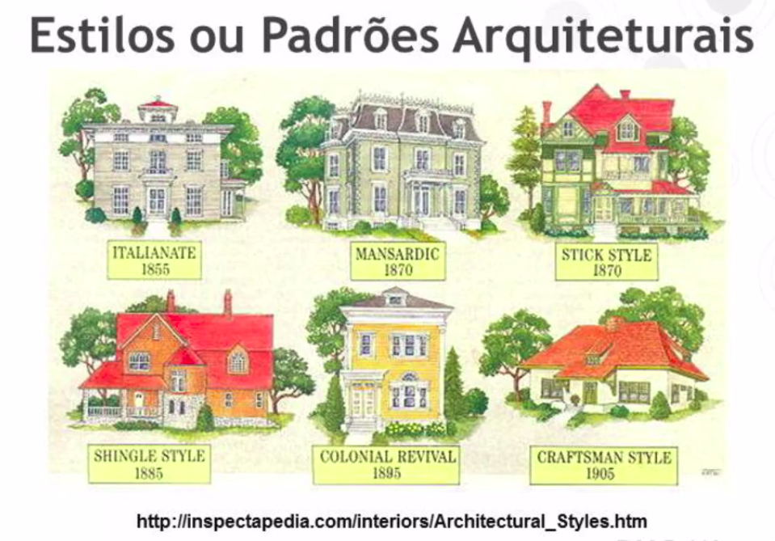

<h1>Unidade 04 - Estilos e Padrões Arquiteturais</h1>

<h2>Estilos Arquiteturais</h2>

<h3>Estilos Arquiteturais</h3>

* Estilos e padrões arquiteturais são estilos de padrões de projetos que podem ser reutilizaveis.
* São resolvidos dentro de um contexto especifico.
* Nesse cenário é importante lembrar que muitas vezes os problemas se repetem.
* Suas características se encontram em contextos de sistemas diferentes.
* Diante de problemas semelhantes, podemos usar padrões arquiteturais ja validados e conhecidos como solução para esses problemas.
* Forma um conhecimento comum e compartilhado.
* Existem diferentes estilos arquiteturas e incluse o nome entre autores diferentes.
* Alguns autores vão citar mais ou menos estilos de padrões arquiteturais.
* Muitos autores podem agrupar estilos e padrões.
* O importânte é entender e saber entender qual padrão utilizar ao problema que temos em questão.

<h2>Serviços</h2>

<h2>Tópicos em estilos arquiteturais</h2>