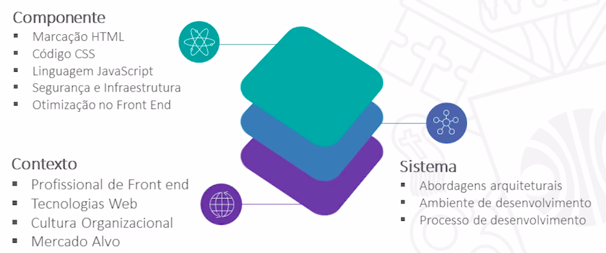
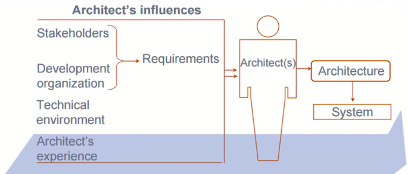
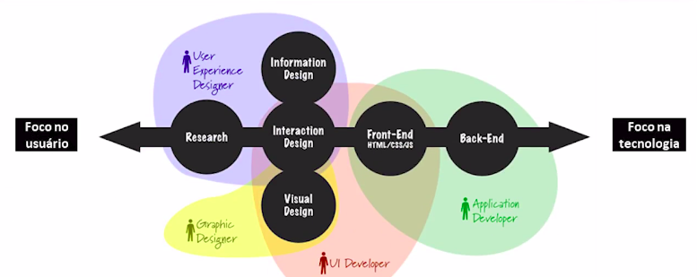
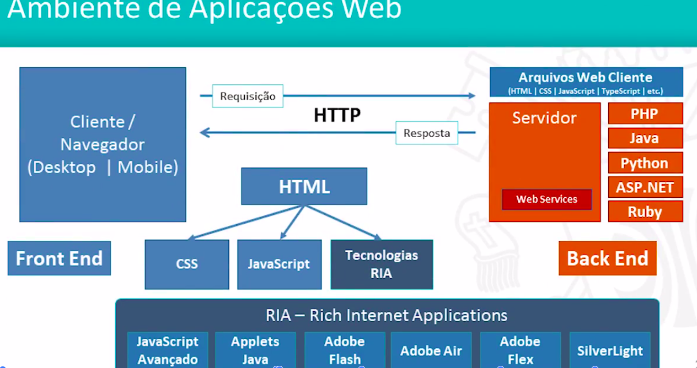
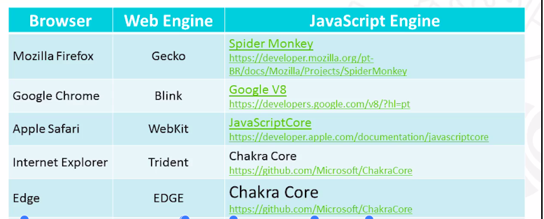
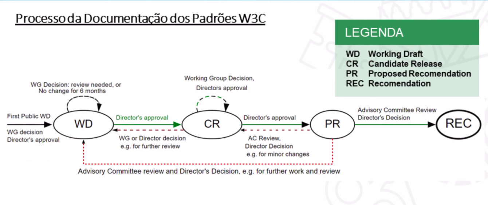

<h1>Arquitetura de Front end</h1>

<h2>Aspectos Arquiteturais de Front end</h2>

* Será avaliado 3 perspectivas

* Aspectos arquiteturais de front end
    * Contexto
        * Profissional de Front end
        * Tecnologias Web
        * Cultura Organizacional
        * Mercado Alvo

    * Sistema
        * Abordagens arquiteturais
            * Multi Page / Single Page Application / Progressive Web Apps / Serverless Computing
        * Ambiente de Desenvolvimento e Componentes
            * Frameworks | Package and Dependency Managers | Task Managers | Bundlers
        * Processo de Desenvolvimento
            * Configuration Management | Testes de Software | Continuous Integration | Continuous Delivery | DevOps
    
    * Componentes
        * Marcação HTML
            * HTML Semântico (HTML 5 e Microdata) | Acessibilidade WAI-ARIA
        * Código CSS
            * Guias de Estilos | Padrão de código (RSCSS, BEM, SMACSS, OOCSS) | Frameworks CSS | Pré-processadores (Sass) | Layout (Flexbox e Grid) | Responsividade
        * Linguagem JavaScript
            * ES6 | ReactiveX | Frameworks
        * Segurança e Infraestrutura
            * Open Authorization(OAuth) | Cross-origin Resource Sharing (CORS) | Cross-site Scripting (XSS)
        * Otimização Front end
            * Avaliação de desempenho | Estrutura do HTML | Redução de requisições | Otimização de Conteúdo | Controle de Cache

<h2>Profissional de Front end</h2>

* Papel do Arquiteto de Software

* Profissional de Front end

* Funções
    * Refinar requisitos com Gerentes de Produtos e UX Designers identificando estratégias arquiteturais
    * Pesquisar e avaliar tecnologias e frameworks de front end
    * Estabelecer o ambiente e as definições arquiteturais das aplicações Web (framework, linguagens visuais, estilos de aplicação, semântica do HTML).
    * Desenvolver componentes chave para a criação, otimização e manutenção de Web Sites.
    * Projetar designs responsivose multi-plataforma.
    * Orientar equipes quanto à implementação dos sistemas.

<h2>Tecnologias de Aplicações Web</h2>

* Ambiente de Aplicações Web

* Visual Frameworks

* Web e JavaScripts Engines

<h2>Evolução da Web</h2>

* Conceito da Web
    * Em inglês web significa "teia". A World Wide Web é um sistema de informação interligado por hipertexto (textos, imagens, vídeo, som, etc), cujo acesso se dá por meio de software denominados navegadores (browsers).
    * A Web como é simplesmente chamada, considerada a teia mundial informações.
    * Linha do tempo da web: http://www.webdirections.org/history/

* Evolução da Web
    * 1.0
        * HTML - READ
    * 2.0
        * XML, PHP, RSS, ASP, JSON - Seach - TAG COLLABORATE READ - WRITE
    * 3.0
        * RDF (Resource Description Framework - Descrever as informações ali representadas), XHTML, RDFS, OWL - Personalization knowledge. Read - Write Understand

* O W3C - World Wide Web Consortium
    * O W3C é uma comunidade internacional que mantém e evolui os padrões da web.

    * Padrões tais:
        * Design e Aplicações Web (HTML, CSS, CSV, AJAX, Acessibilidade)
        * Arquitetura da Web (Protocol HTTP, URI)
        * Web Semântica (Linked Data - RDF, OWL, SPARQL);
        * Tecnologia XML (XML, XML Schema, XSLT);
        * Entre outras

<h2>Reflexões sobre a Arquitetura de Front end</h2>

* O que é Arquitetura de Software
    * Arquitetura é a organização fundamental de um sistema, compreendido pelos seus componentes, o relacionamento entre elese os princípios que direcionam seu projeto e sua evolução.
    * Identificação dos componentes e o relacionamento entre os componentes.

* Atributos de Qualidade de Arquitetura de Software
    * Para usuário
        * Desempenho
        * Disponibilidade
        * Usabilidade
        * Segurança
        * Consistência
    
    * Para o desenvolvedor
        * Desempenho
        * Produtividade
        * Manutenibilidade
        * Testabilidade

* Reflexões sobre a Arquitetura de Front end
    * Navegador é uma plataforma
        * Atualmente o mesmo código gerado para o navegador, é executado em smartphones, tablets, desktops e outros dispositivos.
    * O desenvolvimento do front end vai muito além
        * O espectro de atuação vai desde a definição de elementos visuais até a complexa lógica que orquestra o comportamento das páginas da web.
    * As tecnologias Web são abertas
        * As plataformas evoluem muito rápido e se adaptar a isso é fundamental para sobreviver no mundo da web.
    
    * Em um projeto temos analistas, designers, desenvolvedores de front e back end, além do público externo.

    * Inicie com uma marcação (HTML) ruim e você estará escrevendo códigos CSS e JavaScript ruins para mascarar isso. Inicie com uma grande marcação e você conseguirá escrever códigos CSS e JavaScript mais escaláveis e manuteníveis. (Front Architecture for Design Systems - 2016).
    * Conhecer as tecnologias de back end, seus desafios e suas características ajuda a projetar melhor os ambientes de front end.

<h2>Material Complementar</h2>
<a href="https://www.infoq.com/br/presentations/criando-arquitetura-front-end?itm_source=infoq&itm_campaign=user_page&itm_medium=link">Criando uma arquitetura escalável de front-end do zero</a>
<a href="https://medium.com/webtraining/what-is-a-front-end-architect-12a955f96363">What is a Front-end Architect?</a>

<h1>Fundamentos da Web</h1>

<h2>Arquitetura da Web</h2>

* O Ambiente Cliente se comunica com o Ambiente Servidor. No meio a internet. (REDE)
* Cliente requisição para o servidor e o servidor faz uma resposta.

* Ambiente Cliente
    * O Cliente Web é um programa ou aplicação específica, na maioria das vezes um Navegador ou Browser, que envia requisições via protocolo HTTP(S) a uma outra aplicação, o Servidor Web através de uma rede como a internet.

* Ambiente Servidor
    * O Servidor Web é um programa que recebe requisições HTTP(S), interpreta a URL e em seguida envia resposta ao Cliente Web com o recurso solicitado (arquivo HTML, CSS, JavaScript, imagens, vídeos, folhas de estilo) por meio da rede.

* Internet
    * A internet é uma rede mundial de computadores beaseada no protocolo TCP/IP, onde todo computador conectado é denominado host (hospedeiro) e possui um identificador endereço IP (Internet Protocol) no padrão A.B.C.D (ex: 200.20.15.22).
    * Os seres humanos utilizam nomes como www.pucminas.br que são traduzidos em endereços ip antes que ocorra a comunicação.

* Protocolo HTTP
    * É a forma como clientes e servidores se comunicam na rede. As requisições e as respostas obedecem aos padrões estabelecidos pelo protocolo HTTP.
    * A requisição HTTP é um pacote de dados enviado pela rede pelo Cliente Web para o Servidor Web e identifica o recurso solicitado. A resposta HTTP é formada por pacotes de dados enviados pelo Servidor Web para o Cliente Web com recursos solicitados.

<h2>URI, URN, URL</h2>

* URI (Uniform Resource Identifier) é um padrão para endereçamento que identifica de forma precisa recursos disponíveis na rede.
* A URI engloba o conceito de:
    * URL (Uniform Resource Locator)
    * URN (Uniform Resource Name)

* URL (Uniform Resource Locator) é um padrão de URI que serve para referenciar um recurso e sua localização, normalmente na internet.

<h2>Protocolo HTTP</h2>

<h2>Linguagem HTML</h2>

<h2>Linguagem CSS - Introdução</h2>

<h2>Linguagem CSS - Sintaxe das Regras</h2>

<h2>Linguagem CSS - Prioridade de Seletores</h2>

<h2>Linguagem CSS - Box Model, Unidades e Cores</h2>

<h2>Linguagem JavaScript - Histórico e Poder da Linguagem</h2>

<h2>Linguagem JavaScript - Conceitos básicos da Linguagem</h2>

<h2>Linguagem JavaScript - Ajax</h2>

<h2>Biblioteca jQuery</h2>

<h2>Material Complementar</h2>

<a src="http://nicolasgallagher.com/about-html-semantics-front-end-architecture/">About HTML semantics and front-end architecture</a>

<a src="https://cssguidelin.es/">CSS Guide Lines</a>

<a src="http://oocss.org/">Object-Oriented CSS</a>

<a src="http://smacss.com/">Scalable and Modular Architecture for CSS - SMACSS</a>