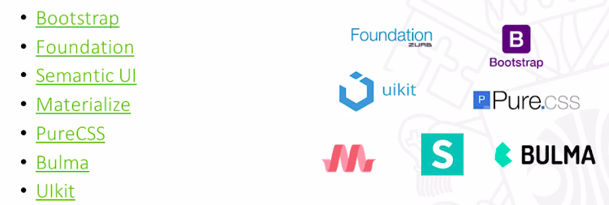

<h1>Arquitetura de Front end</h1>

<h2>Aspectos Arquiteturais de Front end</h2>

* Será avaliado 3 perspectivas

* Aspectos arquiteturais de front end
    * Contexto
        * Profissional de Front end
        * Tecnologias Web
        * Cultura Organizacional
        * Mercado Alvo

    * Sistema
        * Abordagens arquiteturais
            * Multi Page / Single Page Application / Progressive Web Apps / Serverless Computing
        * Ambiente de Desenvolvimento e Componentes
            * Frameworks | Package and Dependency Managers | Task Managers | Bundlers
        * Processo de Desenvolvimento
            * Configuration Management | Testes de Software | Continuous Integration | Continuous Delivery | DevOps
    
    * Componentes
        * Marcação HTML
            * HTML Semântico (HTML 5 e Microdata) | Acessibilidade WAI-ARIA
        * Código CSS
            * Guias de Estilos | Padrão de código (RSCSS, BEM, SMACSS, OOCSS) | Frameworks CSS | Pré-processadores (Sass) | Layout (Flexbox e Grid) | Responsividade
        * Linguagem JavaScript
            * ES6 | ReactiveX | Frameworks
        * Segurança e Infraestrutura
            * Open Authorization(OAuth) | Cross-origin Resource Sharing (CORS) | Cross-site Scripting (XSS)
        * Otimização Front end
            * Avaliação de desempenho | Estrutura do HTML | Redução de requisições | Otimização de Conteúdo | Controle de Cache

<h2>Profissional de Front end</h2>

* Papel do Arquiteto de Software

* Profissional de Front end

* Funções
    * Refinar requisitos com Gerentes de Produtos e UX Designers identificando estratégias arquiteturais
    * Pesquisar e avaliar tecnologias e frameworks de front end
    * Estabelecer o ambiente e as definições arquiteturais das aplicações Web (framework, linguagens visuais, estilos de aplicação, semântica do HTML).
    * Desenvolver componentes chave para a criação, otimização e manutenção de Web Sites.
    * Projetar designs responsivose multi-plataforma.
    * Orientar equipes quanto à implementação dos sistemas.

<h2>Tecnologias de Aplicações Web</h2>

* Ambiente de Aplicações Web

* Visual Frameworks

* Web e JavaScripts Engines

<h2>Evolução da Web</h2>

* Conceito da Web

<h2>Reflexões sobre a Arquitetura de Front end</h2>

<h2>Material Complementar</h2>
<a href="https://www.infoq.com/br/presentations/criando-arquitetura-front-end?itm_source=infoq&itm_campaign=user_page&itm_medium=link">Criando uma arquitetura escalável de front-end do zero</a>
<a href="https://medium.com/webtraining/what-is-a-front-end-architect-12a955f96363">What is a Front-end Architect?</a>

