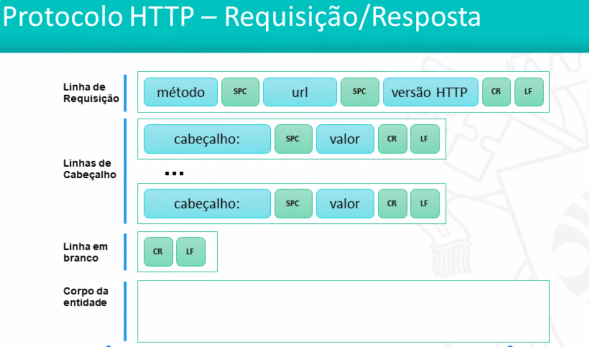
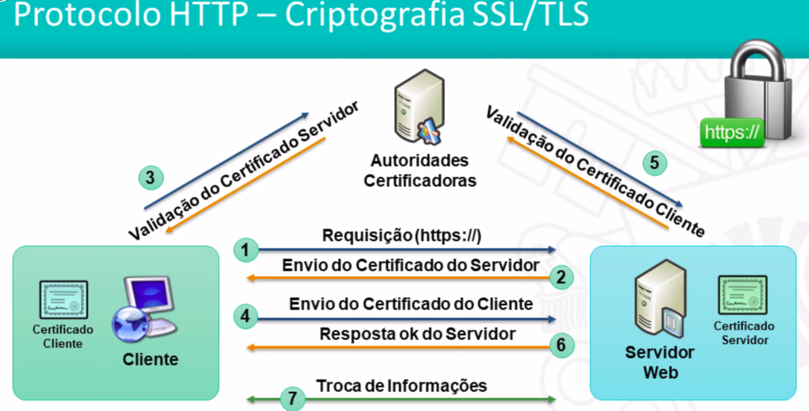

<h1>Fundamentos da Web</h1>

<h2>Arquitetura da Web</h2>

* O Ambiente Cliente se comunica com o Ambiente Servidor. No meio a internet. (REDE)
* Cliente requisição para o servidor e o servidor faz uma resposta.


* Ambiente Cliente
    * O Cliente Web é um programa ou aplicação específica, na maioria das vezes um Navegador ou Browser, que envia requisições via protocolo HTTP(S) a uma outra aplicação, o Servidor Web através de uma rede como a internet.

* Ambiente Servidor
    * O Servidor Web é um programa que recebe requisições HTTP(S), interpreta a URL e em seguida envia resposta ao Cliente Web com o recurso solicitado (arquivo HTML, CSS, JavaScript, imagens, vídeos, folhas de estilo) por meio da rede.

* Internet
    * A internet é uma rede mundial de computadores beaseada no protocolo TCP/IP, onde todo computador conectado é denominado host (hospedeiro) e possui um identificador endereço IP (Internet Protocol) no padrão A.B.C.D (ex: 200.20.15.22).
    * Os seres humanos utilizam nomes como www.pucminas.br que são traduzidos em endereços ip antes que ocorra a comunicação.

* Protocolo HTTP
    * É a forma como clientes e servidores se comunicam na rede. As requisições e as respostas obedecem aos padrões estabelecidos pelo protocolo HTTP.
    * A requisição HTTP é um pacote de dados enviado pela rede pelo Cliente Web para o Servidor Web e identifica o recurso solicitado. A resposta HTTP é formada por pacotes de dados enviados pelo Servidor Web para o Cliente Web com recursos solicitados.

<h2>URI, URN, URL</h2>

* URI (Uniform Resource Identifier) é um padrão para endereçamento que identifica de forma precisa recursos disponíveis na rede.
* A URI engloba o conceito de:
    * URL (Uniform Resource Locator)
    * URN (Uniform Resource Name)


* URL (Uniform Resource Locator) é um padrão de URI que serve para referenciar um recurso e sua localização, normalmente na internet.


* URL é uma URI que tem essa estrutura
* Estruturas de um URL
    * Esquema - Forma de interação entre cliente e servidor, Ex: http, ftp, entre outros
    * User:pass - Informações de usuário
    * Hostname - nome ou número IP onde se encontra a aplicação do servidor
    * Porta - porta TCP no servidor. Por padrão, HTTP usa a porta é 80 e pode ser omitida.
    * Caminho - indica o local exato onde o recurso se encontra
    * Query - dados não hierarquicos de uma consulta sob a forma de pares nome e valor
    * Fragmento - identifica uma seção no recurso


* URN (Uniform Resource Name)
    * É um padrão de URI que identifica um recurso (NSS) pelo nome em um determinado namespace (NID).
    

* Exemplos de URI
    * URL ->


<h2>Protocolo HTTP</h2>

* Protocolo HTTP - Histórico de Versões
    * O HTTP 0.9 foi lançado em 1991
    * O HTTP 1.0 foi lançado em 1996
    * O HTTP 1.1 traz:
        * Conexões TCP persistentes diferentemente do HTTP 1.0
        * Suporte a Virtual Host (Cabeçalho Host)
        * Autenticação Digest
        * Possibilidade de compressão de dados.
    
    * Google propões o SPDY em 2009. -> Fazia diversas melhorias de desepenho ao HTTP
    * O HTTP 2.0, lançado em 2015, trazendo:
        * Compressão de dados obrigatória
        * Cabeçalhos binários
        * Requisições paralelas
        * Envio apenas de cabeçalhos alterados nas próximas requisições
        * Priorização de requisições
        * Server PUSH - Envio automático de arquivos adicionais


* Formato de uma Requisição
    * 

* Tipos de métodos
    * 

* Códigos de Retorno
    * 

* Criptografia SSL/TLS
    * HTTPS identifica a comunicação segura por meio do protocolo HTTP, na porta 443 (por padrão), utilizando os protocolos TLS ou SSL.

    * Características
        * Fornece conexão criptografada com identificação de cliente e servidor.
        * Baseado em certificados digitais emitidos por autoridade certificadoras
        * Requer que servidores Web sejam configurados com certificados digitais.
        * Requer que navegadores reconheçam as autoridades certificadores emissoras dos certificados do servidor.



* Autoridades certificadoras são chamadas de Cartórios Digitais

<h2>Linguagem HTML</h2>

* O que é HTML?
    * HTML ou HyperText Markup Language é a linguagem de marcação, baseada em tags (ou marcas), utilizada para produção de documentos ou páginas Web, no formato de hipertextos, que são interpretados pelos Navegadores.
    * Os hipertextos são documentos que utilizam hiperlinks para outros documentos relacionados, daí o nome Web (teia)
    * A linguagem HTML foi inicialmente uma aplicação do padrão SGML (Standard Generalized Markup Language), utilizado para definir linguagens de marcação. Na versão 5, isto foi abandonado.


* HTML - Estrutura do Documento


* Atributos
    * Os atributos podem ser incluídos em elementos HTML.
    * Um atributo não se repete em um elemento.
    * São definidos pelo par nome/valor, podendo ter valor nulo.
    
    * Recomenda-se utilizar aspas duplas
    * Os atributos alteram o funcionamento dos elementos do HTML.
    * Cada elemento possui um conjunto próprio de atributos.
    * Os atributos possuem valores livres ou pré-definidos.

* Comentários
    * Os comentários não são exibidos pelo navegador
    * São delimitados por ```html <!-- -->```
```html
    <!-- Os comentários documentam o código HTML-->

```


* Quirks Mode
    * Se voce não inserir o DOCTYPE ele vai utlizar o Quirks Mode que pega vários padrões de todos os HTMLs, podendo causar problemas
* Strict Mode
    * Acontece quando voce utiliza o DOCTYPE


* Cabeçalho - Tags mais comuns
    * title: Define o título do documento
    * style: Define o código de formatação no padrão CSS
    * script: Define códigos de scripts em alguma linguagem própria
    * link: Definem ligações com outros arquivos como: CSS, scripts, etc
    * meta: Informações sobre o documento tais como codificação de caracteres, descrição, palavra-chave, autor, etc.

* Corpo -
    * Segunda parte do arquivo HTML, representada pela tag ```html <body> ```, que inclui todo o conteúdo da página exibido ao usuário pelo Navegador. É composto por textos, links, imagens, vídeos, tabelas, formulários.

<h2>Linguagem CSS - Introdução</h2>

* O Cascading Style Sheet (CSS) é uma linguagem para definição de regras de apresentação em documentos HTML e XML.

* Seu objetivo é promover a seprar entre o formato e o conteúdo em um documento.
* Formato = CSS
* Conteúdo = HTML


* Formas de utilização em páginas HTML
    * Arquivo CSS Externo
    * Bloco interno
    * Inline

* Priopridade de Aplicação
    * Inline -> Bloco Interno -> Arquivo CSS Externo -> Browser Default


* Formas de utilização em páginas HTML
    * Arquivo CSS Externo
        * Considerada a forma mais recomendada de implementação
        * Separa completamente formato e conteúdo
        * Permite atualizar as definições de CSS em um único lugar
    
    * Bloco interno
        * útil em algumas circunstâncias, com regras locais para um conteúdo específico.
        * Requer a atualização em todos os locais em que for usado

    * Inline
        * Não utilize este formato, a menos que não tenha alternativas.
        * Requer a atualização em diversos locais no mesmo arquivo.
        * Dificulta a legibilidade do HTML e mistura conteúdo e formatação.


<h2>Linguagem CSS - Sintaxe das Regras</h2>

<h2>Linguagem CSS - Prioridade de Seletores</h2>

<h2>Linguagem CSS - Box Model, Unidades e Cores</h2>

<h2>Linguagem JavaScript - Histórico e Poder da Linguagem</h2>

<h2>Linguagem JavaScript - Conceitos básicos da Linguagem</h2>

<h2>Linguagem JavaScript - Ajax</h2>

<h2>Biblioteca jQuery</h2>

<h2>Material Complementar</h2>

<a src="http://nicolasgallagher.com/about-html-semantics-front-end-architecture/">About HTML semantics and front-end architecture</a>

<a src="https://cssguidelin.es/">CSS Guide Lines</a>

<a src="http://oocss.org/">Object-Oriented CSS</a>

<a src="http://smacss.com/">Scalable and Modular Architecture for CSS - SMACSS</a>