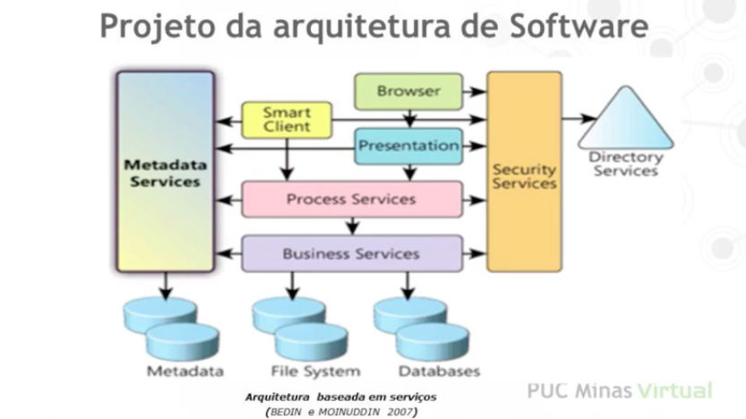
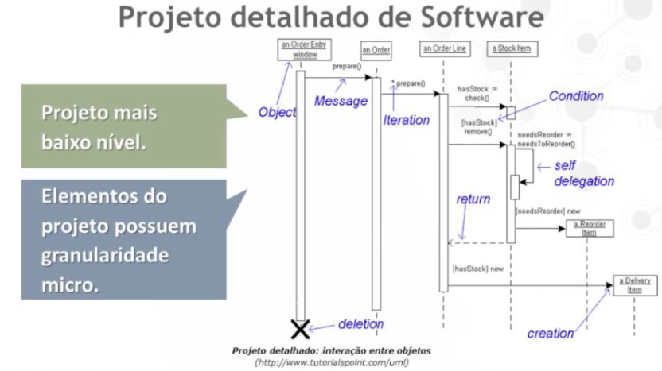

<h1>Introducao ao Projeto Arquitetural</h1>

- Projeto de Software
  - Composto por 2 atividades:
    - Projeto da arquitetura de software
    - Projeto detalhado do software

* Projeto de Arquitetura de Software

  - Mais alto nível.
  - Possui uma granularidade macro.
  - Definicao dos seus componentes macros e da interface de comunicacao entre eles.
  - O objetivo é satisfazer os requisitos de qualidade.
    

* Projeto detalhado de software

  - Projeto mais baixo nível.
  - Elementos do projeto possuem granularidade micro.
  - Definicao dos seus objetos e da forma de colaboracao entre eles para realizar as funcoes.
  - O objetivo é satisfazer os requisitos funcionais.
    

* Projeto Arquitetural x Detalhado

  - O arquiteto deve gratantir cobertura arquitetural dos requisitos do cliente.
  - A arquitetura é definida na primeira iteracao da etapa de projeto.
  - O projetista deve garantir que os requisitos projetados de acordo com a arquitetura, implementados e satisfeitos.
  - O proejto detalhado é definido nas iteracoes posteriores da elaboracao do sistema.

* Razoes para se projetar uma arquitetura
  - Permitir uma avaliacao da arquitetura antes de se construir o produto.
  - Concentrar no problema em um nível adequado de abstraçao para isolar parte da sua complexidade.
  - Apoiar o planejamento da construcao do produto possibilitando estimativas custo, esforco, prazo e a definicao das partes que poderao ser reusadas.
  - Facilitar a comunicacao definindo um vocabulário apropriado.

- Problemas típicos
  - Requisitos mudam e afetam a arquitetura de um sistema.
    - Adiar e depois voltar para o requisito.
  - Avaliaçao da arquitetura pode levar a resultados errados.
  - Implementacao da arquitetura modelada que pode nao ser a correta.

<h1>Diferenciacao entre Arquitetura e Projeto Detalhado: Exemplo</h1>

- Contexto: Livraria Virtual

- Uma Livraria Virtual disponibiliza seu site na Web aos seus clientes. O cliente tem acesso ao estoque de livros utilizando seu navegador Web. O cliente pesquisa pelos livros do seu interesse e compra os livros que desejar realizando seu pagamento via Web.

- Arquitetura de software da Livraria Virtual:
  - Mostra as grandes partes de software que compoem o sistema da Livraria.
    - Diagrama de componentes.
  - Mostra também em quais máquinas essas partes de software executam.
    - Diagrama de implantaçao.
