<h1>Introducao ao Projeto Arquitetural</h1>

- Projeto de Software
  - Composto por 2 atividades:
    - Projeto da arquitetura de software
    - Projeto detalhado do software

* Projeto de Arquitetura de Software

  - Mais alto nível.
  - Possui uma granularidade macro.
  - Definicao dos seus componentes macros e da interface de comunicacao entre eles.
  - O objetivo é satisfazer os requisitos de qualidade.
    

* Projeto detalhado de software

  - Projeto mais baixo nível.
  - Elementos do projeto possuem granularidade micro.
  - Definicao dos seus objetos e da forma de colaboracao entre eles para realizar as funcoes.
  - O objetivo é satisfazer os requisitos funcionais.
    

* Projeto Arquitetural x Detalhado

  - O arquiteto deve gratantir cobertura arquitetural dos requisitos do cliente.
  - A arquitetura é definida na primeira iteracao da etapa de projeto.
  - O projetista deve garantir que os requisitos projetados de acordo com a arquitetura, implementados e satisfeitos.
  - O proejto detalhado é definido nas iteracoes posteriores da elaboracao do sistema.

* Razoes para se projetar uma arquitetura
  - Permitir uma avaliacao da arquitetura antes de se construir o produto.
  - Concentrar no problema em um nível adequado de abstraçao para isolar parte da sua complexidade.
  - Apoiar o planejamento da construcao do produto possibilitando estimativas custo, esforco, prazo e a definicao das partes que poderao ser reusadas.
  - Facilitar a comunicacao definindo um vocabulário apropriado.

- Problemas típicos
  - Requisitos mudam e afetam a arquitetura de um sistema.
    - Adiar e depois voltar para o requisito.
  - Avaliaçao da arquitetura pode levar a resultados errados.
  - Implementacao da arquitetura modelada que pode nao ser a correta.

<h1>Diferenciacao entre Arquitetura e Projeto Detalhado: Exemplo</h1>

- Contexto: Livraria Virtual

- Uma Livraria Virtual disponibiliza seu site na Web aos seus clientes. O cliente tem acesso ao estoque de livros utilizando seu navegador Web. O cliente pesquisa pelos livros do seu interesse e compra os livros que desejar realizando seu pagamento via Web.

- Arquitetura de software da Livraria Virtual:

  - Mostra as grandes partes de software que compoem o sistema da Livraria.
    - Diagrama de componentes.
  - Mostra também em quais máquinas essas partes de software executam.
    - Diagrama de implantaçao.

- Componentes da Arquitetura da Livraria

  - MVC
    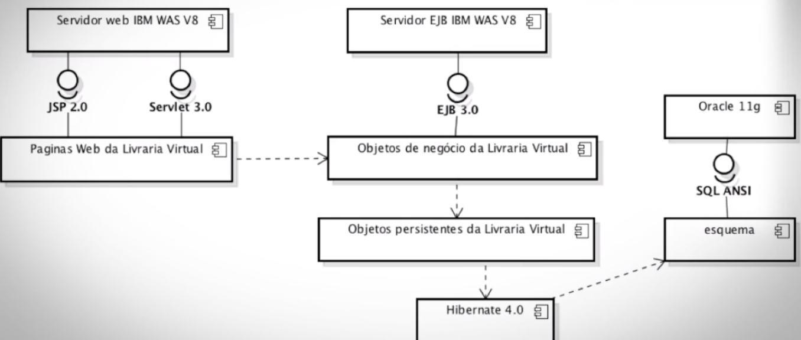

- Máquinas para a distribuicao da Livraria Virtual
  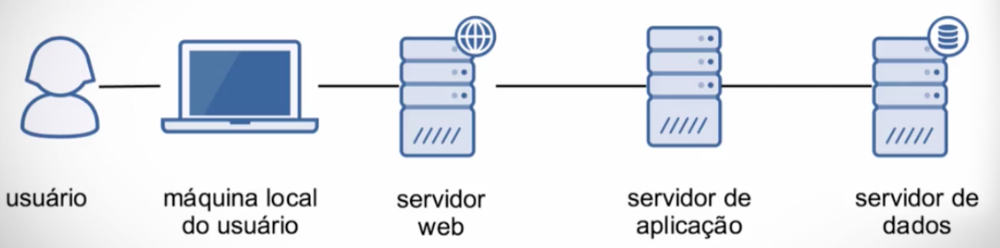

- Implantacao da Arquitetura da Livraria
  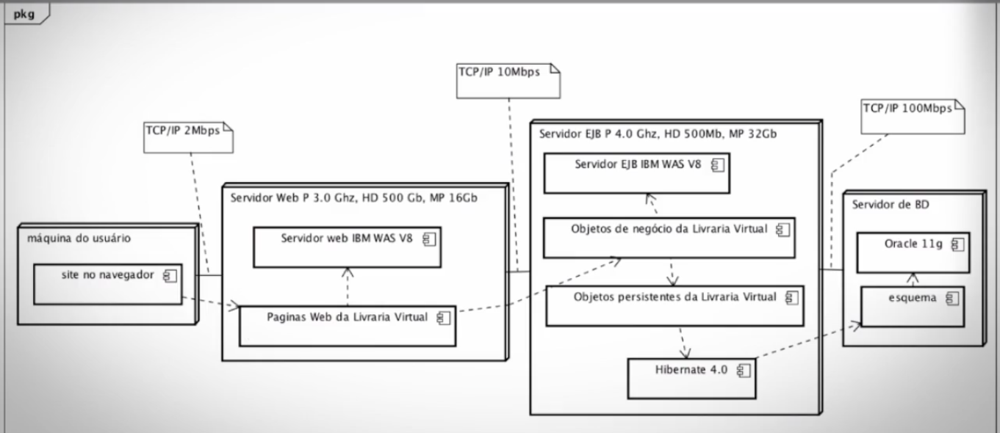

<h1>Princípios e Técnicas de Projeto</h1>

- Técnicas de Projeto Arquitetural

  - Abstração
  - Ocultaçao de Informacoes
  - Modularizacao / componentização
  - Separação de Preocupaçoes
  - Acoplamento e Coesão
  - Separaçao de Políticas e Implementações
  - Separação de interfaces e implementações.

- Abstraçao
  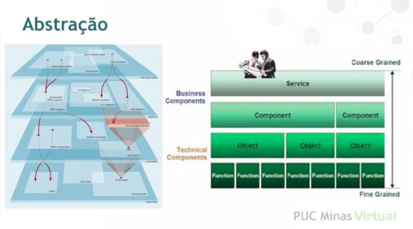

- Ocultaçao de Informaçoes

  - Cada modulo de ter informacoes privadas que ocultam de outros modulos.
  - Modulos se comunicam entre sí sem saber o que cada modulo faz com sua informacao
  - Cliente -> Interface Pública - Ocultaçao da implementaçao

- Modularizaçao / Componentizaçao

  - A facilidade da modulazaçao sao:
    - Facilitar o entendimento;
    - Facilitar o desenvolvimento;
    - Paralelizar o desenvolvimento diminuindo o tempo de implementacao do sistema;
    - Promover a flexibildiade e reutilizacao.

- Separaçao de Preocupaçoes

  - Modelo View Controller
  - Fortemente ligada a modularizacao

- Acoplamento e coesao
  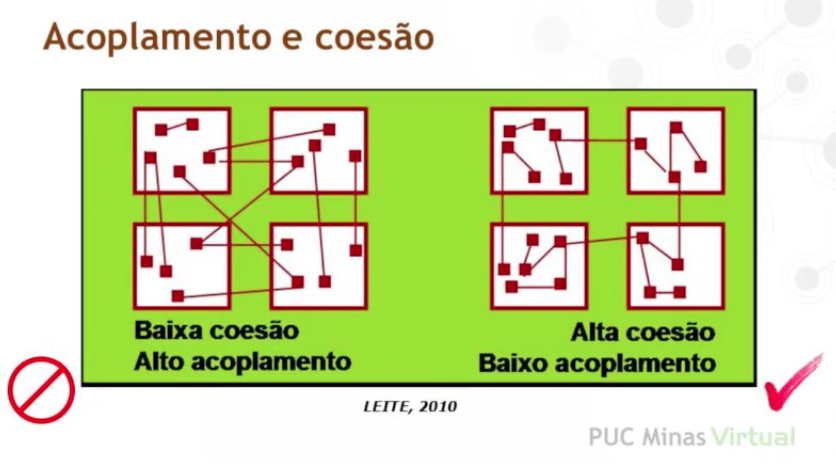

- Sepraçao de políticas e implementaçoes

  - Separaçao da lógica de negócio com os sistemas de tecnologia.

- Separacao de interfaces e implementacoes
  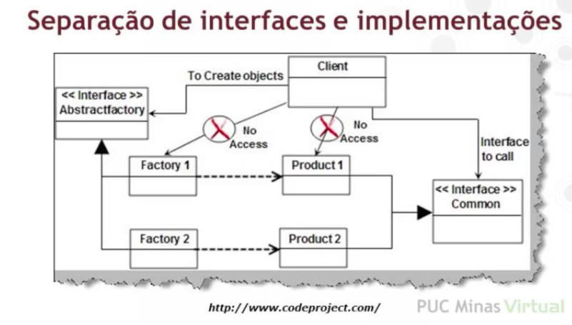

<h1>Processo de Projeto Arquitetural</h1>

- Elementos ao se projetar a arquitetura

  - Objetivos: requisitos funcionais e nao-funcionais do software sendo projetado.
  - Retricoes: definem o contexto de uma arquitetura tornando-a viável ou nao.
  - Alternativas: Diferentes possibilidades de solucoes e a escolha da solucao eleita.
  - Representacoes: Diferentes formas de representar a arquitetura de um sistema.
  - Soluçoes: Descricao possibilitando a construcao do sistema.

* Projetar a arquitetura envolve definir
  - Componentes do sistema e suas interfaces (estrutura)
    - Componentes serao desenvolvidos, adaptados, reutilizados, comprados?
  - Interacoes entre componentes (comportamento)

- Avaliar a arquitetura

  - A arquitetura satisfaz os requisitos funcionais e nao funcionais do sistema?
  - A arquitetura pode ser entendida pelos implementadores e testadores do sistema?
  - Quais sao as características diretivas da arquitetura?

- Exemplo: Avaliando o projeto HBase
  - HBase nao adota o uso de um cliente magro
    - Cliente precisa conhecer o protocolo de escrita e leitura do HBase e precisa acessar tanto o master node quanto os data nodes.
    - Mudancas no protoclo afetam cliente e servidor dificultando o desenvolvimento, a operabilidade e a evolucao do software.
  - A funcionalidade do HBase fica condicionada a disponibilidade do master node.
    - Um ponto único de falhas.

<h1>Alternativas Arquiteturais: Exemplo</h1>

- Rede Social Virtual

  - Um Rede Social Virtual permite que usuários encontrem seus amigos, enviam solicitacoes de amizade e depois de aceita passam a compartilhar fotos, vídeos e mensagens através da Web.

- Alternativa centralizada para a Rede Social

  - Arquitetura Cliente/Servidor.
  - Todos os clientes se conectam a um servidor onde os dados dos perfis de usuários estao centralizados.
    

- Alternativa Descentraliada para a Rede Social.

  - Arquitetura Ponto a Ponto
  - Todos os pontos possuem os dados dos seus amigos armazenados localmente de forma replicada.
  - Quando um usuário acessa a rede através de um site e faz sua autenticacao, o sistema encontra outros computadores (pontos) que também estao rodadno o mesmo software da rede social e busca informacoes atualizadas de seus amigos. (consumidor da informacao).
  - Ao mesmo tempo este computador (ponto) que acabou de se autenticar na rede, transmite informacoes atualizadas para outros computadores que estao na rede e que nao possuem estas atualizacoes mais recentes. (fornecedor de informacoes).
  - Para evitar que um usuário veja informacoes do perfil de um outro usuário do qual ele nao é amigo, as informacoes de perfis devem ser criptografadas usando um esquema de chaves públicas-privadas (PGP).
    

- Comparando as alternativas arquiteturais
  - Centralizada
    - Depende da capacidade de atendimento de requisicoes simultaneas: servidor é o gargalo
    - Disponiblidade dos dados depende da disponibilidade do servidor.
    - Servidor é um hardware de custo elevado.
    - Dados sempre atualizados.
    - Nao precisa lidar com a redundancia dos dados, dados estao sempre consistentes.
  - Descentralizada
    - Todos os pontos funcionam como fornecedores: nao existe um único gargalo.
    - Disponibilidade dos dados depende do número de usuários na rede em um determinado momento.
    - Todas as máquinas sao comuns, de custo padrao.
    - Dados podem estar desatulizados.
    - Redundancia dos dados precisa ser tratada para aumentar a consistencia dos dados.

<h1>Fundamentos de Arquitetura de Software</h1>

- O que é arquitetura de software?

  - Definicoes históricas sob perspectiva de projeto arquitetural
    - Perry e Wolf (1992)
    - Garlan e Shaw (1994)
    - Bass, Clements e Kazman (1998)
    - Padrao ISO/IEE 1471-2000 (2007)

- Definicao de Perry e Wolf

  - Fórmula
    - Arquitetura = {Elementos, Organizacao, Decisoes}
  - A arquitetura de software é um conjunto de elementos arquiteturais que possuem alguma organizacao.
  - Os elementos e sua organizacao sao definidos por decisoes tomadas para satisfazer objetivos e restricoes.
  - Sao destacados tres tipos de elementos:
    - Elementos de processamento:
      - Usam ou transformam informacao;
    - Elementos de dados:
      - Contem a informacao a ser usada e transformada;
    - Elementos de conexao:
      - Ligam elementos de qualquer tipo entre si.
  - A organizacao dita as relacoes entre os elementos arquiteturais
    - Possuem propriedades
    - Restringem como os elementos devem interagir de forma a satisfazer os objetivos do sistema.
    - Devem ser ponderadas de modo a indicar sua importancia no processo de selecao de alternativas.

- Definicao de Garlan e Shaw

  - A arquitetura de software se torna necessária quando o tamanho e a complexidade dos sistemas de software crescem.
  - O problema de se construir sistemas vai além da escolha dos algoritmos e estruturas de dados certos. (Projeto Detalhado).
  - Esse problema envolverá também decisoes sobre as estruturas que formarao o sistema, a estrutura global de controle que será usada, protocolos de comunicacao, sincronizacao e acesso a dados, atribuicao de funcionalidade a elementos do sistema, ou ainda sobre distribuicao física dos elementos do sistema. (Projeto Arquitetural)
  - O problema envolverá decisoes que impactarao no comportamento do sistema em termos de escala e desepenho, entre outros atributos de qualidade.

- Definicao de Bass, Clements e Kazman

  - A arquitetura de um programa ou de sistemas computacionais é a estrutura ou estruturas do sistema, a qual é composta de elementos de software, as propriedades externamente visíveis desses elementos, e os relacionamentos entre eles.

- Definicao da ISO/IEEE 1471-2000

  - Arquitetura é a organizacao fundamental de um sistema incorporada em seus componentes, seus relacionamentos com o ambiente, e os princípios que conduzem seu design e evolucao.

- Evolucao de Software
  - Fenomeno de mudanca que ocorre no software ao longo dos anos e das múltiplas versoes, desde seu início até o completo abandono do sistema.
  - Essa manutencao pode melhorar ou deteriorar
    - Atributos externos de qualidade do software, percebidos pelos usuários.
    - Atributos internos de qualidade do software, percebidos pelos envolvidos no desenvolvimento.

<h1>Atributos de Qualidade</h1>

- Atributos de qualidade

  - Requisitos nao-funcionais
  - Como o sistema executará funcionalidades.

- Tres tipos de atributos:

  - Do Produto
  - Organizacionais
  - Externos

- Atributos de qualidade do produto

  - Escalabilidade
  - Desempenho, throughput
  - Disponibilidade
  - Nível de entendimento
  - Portabilidade

- Atributos organizacionais

  - Políticas ou procedimentos
  - Padroes ou regras impostas por organizacoes.

- Atributos externos

  - Leis impostas sobre software.
  - Requisitos de interoperabilidade entre sistemas.

- Atributos de Qualidade

  - As relacoes entre os elementos arquiteturais tem efeito sobre atributos de qualidade do sistema.
  - Exemplo: Imagine um sistema com uma arquitetura projetada em tres camadas:
    - Apresentacao
    - Lógica de negócio
    - Persistencia

- Exemplos de atributos de qualidade percebidos pelo usuário

  - Disponibilidade do sistema.

- Exemplos de atributos de qualidade percebidos pelo desenvolvedor.

  - Desacoplamento entre a apresentacao e persistencia.

- Critério de aceitacao

  - Atributos de qualidade precisam ser medidos.
  - Métricas devem ser quantitativas.

- Usabilidade

  - Critérios de medicao de usabilidade (Tyldesley, 1988)
    - Tempo para o usuário realizar uma tarefa
    - Percentual de tarefa concluído
    - Percentual de tarefa concluído por unidade de tempo
    - Taxa de sucessos/falhas
    - Tempo consumido com erros.
    - Percentual de erros
    - Número de comandos utilizados
    - Número de comandos disponíveis nao utilizados
    - Frequencia de uso do help ou documentacao

- Relacionamento entre atributos de qualidade

  - Atributos de qualidade se relacionam entre si
    - Podem até ser conflitantes.
  - Cabe a arquitetura resolver, ponderar, ou ao menos mediar esses conflitos, considerando assim os diversos trade-offs envolvidos para se alcancar os objetivos do software.

- Exemplo
  - Jogo para Celular
  - Bom desempenho em diversos aparelhos
  - Minimizar tempo de portar o software.
  - Requisitos conflitatntes:
    - Desempenho e portabilidade.
      - Portabilidade => Camadas de abstracao.
      - Camadas de abstracao => perda de desempenho.
  - A arquitetura do sistema terá que ponderar entre as técnicas disponíveis de modo que atenda em parte cada requisito.

<h1>Elementos Arquiteturais</h1>

- Elementos estáticos

  - Partes do sistema
  - Organizacao
  - Tempo de Projeto
  - Elementos de Software
  - Elementos de Dados.
  - Elementos de Hardware.

  - Organizacao:
    - Associacoes
    - Composicoes

- Elementos Dinamicos

  - Comportamento do sistema
    - Processos, módulos, protocolos, ou classes
    - Como o sistema reage a estímulos.

- Decisao arquitetural

  - Escolha entre alternativas de design
  - Objetivo é alcancar atributos de qualidade.
  - Descricao de princípios
  - Objetivos das decisoes
  - Fundamentacao - Pq tal decisao foi tomada

- Rastreabilidade

  - Rastreamento de requisitos
    - Ligar requisitos a estruturas arquiteturais.
    - Facilita o entendimento e a manutencao.

- Evolucao
  - Regras para a evolucao de sistemas
  - Tipos de regras
    - Adicao de funcionalidade
    - Remocao de funcionalidades
    - Modicacao de funcionalidades
    - Atendimento a atributos de qualidade.
  - Exemplo:
    - Regras para adicao de funcionalidade ao sistema
      - Uma nova funcionalidade nao poderá adicionar carga superior a mil requisicoes por segundo ao BD.
    - Regras para remocao ou desativacao de funcionalidade
      - Caso o consumo de recursos computacionais ultrapasse 80% do total, servicos podem ser desativdados.
    - Regras para modificacao ou manutencao de funcionalidades.
      - Nao haverá modificacao do Web Service.
      - Se for necessárioa a modificacao, dois Web Services ficarao disponíveis.
    - Regras de atendimento a atributos de qualidade
      - A disponibilizacao de nova funcionalidade no sistema será feita em etapas para 10%, 25%, 50%, 100% dos usuários

<h1>Dívida Técnica</h1>

- Melhores práticas de projeto arquitetural

  - Determinar requisitos de qualidade
  - Selecionar requisitos significantes
  - Justificar decisoes arquiteturais
  - Documentar elementos arquiteturais
  - Definir a arquitetura de forma iterativa e incremental.
  - Concetrar-se nas interfaces
  - Prototipar e tstar a arquitetura
  - A perfeicao é inimiga do razoavelmente bom.
  - Alinhar a arquitetura com os stakeholders.

- O que evitar?

  - Regidez
  - Fragilidade
  - Imobilidade
  - Viscosidade - Fazer coisas corretas no projeto é mais dificil do que fazer as coisas erradas e acabamos pegando os atalhos mais curtos do projeto.
  - Complexidade desnecessária
  - Repeticao desnecessária
  - Opacidade

- Dívida Técnica

  - Termo cunhado por Ward Cunningham.
  - Dívida que se assume ao escolher um design ou abordagem fácil no curto prazo mas com impacto negativo no longo prazo.

  - Martin Fowler explica:
    - A dívida técnica é similar á dívida financeira. Assim como a dívida financeira, a dívida técnica exige o pamaento de juros. Estes vem na forma de escorco extra, que devem ser pagos em desenvolvimentos futuros por conta da escolha de um design mais rápido e de baixa qualidade.
    - Nós podemos optar por continuar pagando estes juros e quitar de uma vez a dívida fazendo uma refatoracao, transofrmando um design de baixa qualidade em um design melhor. Apesar dos custos para saldar a dívida, ganhamos reduzindo os juros no futuro.

<h1>Arquitetura no RUP</h1>

- Princípios essenciais do RUP

  - Atacar os riscos principais de forma rápida e contínua.
  - Garantir que se está provendo algo de valor ao cliente.
  - Concetrar-se em produzir software executável.
  - Acomodar mudancas no projeto.
  - Definir arquitetura o mais cedo possível
  - Construir o sistema com componenetes.
  - Trabalhar em equipe.
  - Fazer da qualidade uma forma de vida.

- Atacar os riscos

  - Atacar primeiro os problemas de maior risco.
    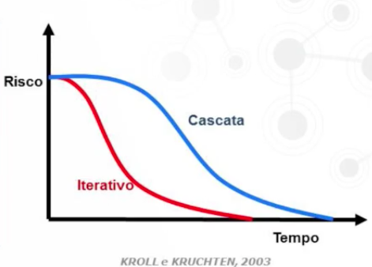
  - Mitigacao e contingencia

- Definir a arquitetura o mais cedo possível

  - A arquitetura é a descricao dos componentes principais do sistema e de suas interfaces.
  - Iniciar por projetar, implementar e testar a arquitetura.
    - Protótipos arquiteturais.
  - Vantagens
    - Refinar estimativas
    - Familizar-se com as tecnologias utilizadas.
    - Atacar principais riscos.

- Construir o sistema com componentes

  - Separam a interface da implementacao
  - Possibilitam a reutilizacao de partes
  - Reduzem o impacto de mudancas

- Desenvolvimento Iterativo
  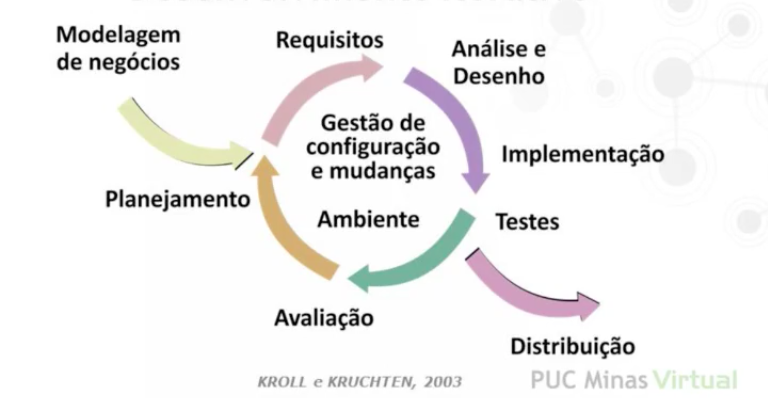

- Fases do RUP
  - Concepcao
    - Entender o escopo
    - Construir o caso de negócios
  - Elaboracao
    - Reduzir riscos técnicos.
    - Criar a arquitetura
    - Entender o que é necessário para a construcao.
  - Construcao
    - Construir uma versao operacional do sistema.
  - Transicao - Construir a versao final do produto e entregá-la ao cliente.
    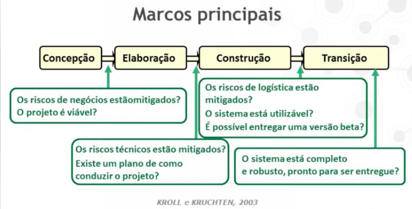
    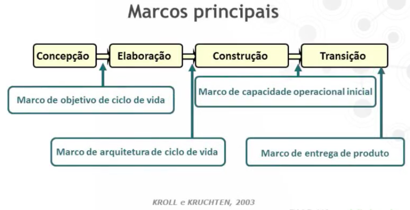

<h1>Arquitetura na Elaboracao do RUP</h1>

- Elaboraçao

  - Iteracoes
    - Uma ou mais iteracoes
    - Primeira iteracao
      - Projetar, implementar e testar alguns cenários críticos.
      - Identificar, implementar e testar um conjunto de mecanismos arquiteturais.
      - Projeto lógico do BD.
      - Fluxos dos casos de uso prioritários.
      - Validar a arquitetura, tendo em vista os riscos arquiteturais.
    - Segunda iteracao
      - Consertar problemas encontrado.
      - Projetar, implementar e testar o restante dos cenários arquiteturalmente relevantes.
      - Implementar concorrencia e distribuicao.
      - Identificar, implementar e testar os mecanismos arquiteturais restantes.
      - Detalhar os casos de uso ainda nao detalhados.
      - Estabilizar a arquitetura.
        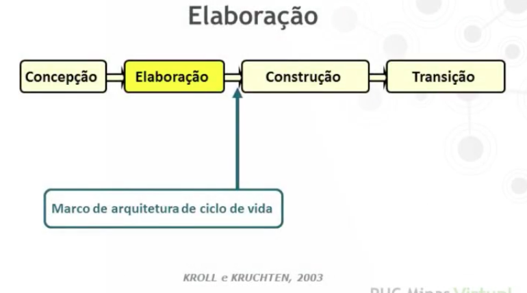

- Elaboracao

  - Objetivos
    1 - Detalhar os requisitos
    2 - Projetar, implementar e validar a arquitetura.
    3 - Mitigar os riscos principais.
    4 - Revisar as estimativas de prazo e custo
    5 - Refinar o processo.
    6 - Implantar as ferramentas.

- Projetar. implementar e validar a arquitetura

  - Projetar
    - Componentes e interfaces (estrutura).
    - Decidir se scada componente será desenvolvido, adaptado, reutilizado, comprado.
    - Interacoes entre componentes (comportamento).
  - Implementar

    - Toda arquitetura deve ser executável -> Protótipo Arquitetural
    - Projetar casos de uso críticos.
    - Consolidar e "empacotar classes".

    - Protótipo Arquitetural
      - Definicao baseada nos casos de uso mais significativos e nos requisitos nao funcionais.
    - Cobertura arquitetural
      - Garantir que toda a arquitetura está sendo exercitada com os testes.

  - Validar
    - O protótipo deve exibir as características desejadas.
    - Desempenho mínimo, taxas de transmissao necessárias, capacidade e escalabilidade esperadas.

- Mitigar os riscos principais

  - Validar
    - Protótipo arquitetural deve evidenciar riscos técnicos.
    - Alguns riscos sao solucionados.
    - Iteracoes servem para trazer a tona riscos relacionados a equipe.
    - Identifica-se fraquezas em relacao a capacidade de desenvolvimento da arquitetura definida.
    - Medidas de mitigacao.

- Ao final da elaboracao tem-se informacoes mais precisas:

  - Requisitos detalhados
  - Arquitetura executável
  - Riscos mitigados

- Deve-se revisar as estimativas.
