<h1>Descricao Estímulo / Resposta para requisitos de qualidade</h1>

- Critérios de aceitacao

  - Requisitos de qualidade precisam ser descritos indicando um critério de aceitaçao mensurável e quantificável.
  - Por exempo: 90% das transacoes submetidas ao sistema devem executar em até 3ms.

- Estímulo -> Resposta
  - Requisitos de qualidade devem ser definidos com base em cenários de estímulo e resposta identificando:
    - Fonte de estímulo: um ator humano, um sistema de software que gera um estímulo.
    - Estímulo: a condição que precisa ser considerada quando chega ao sistema.
    - Ambiente: o estímulo acontece em certas condições, o sistema pode estar sobrecarregado ou ocioso quando o estímulo acontece.
    - Artefato: Algum artefato é estimulado, pode ser o sistema todo ou apenas uma parte dele.
    - Resposta: a atividade que será realizada pelo sistema depois da chegada do estímulo.
    - Medida da Resposta: quando a resposta acontece, esta resposta precisa ser medida, quantificada de alguma forma paara garantir que o requisito possa ser testado.

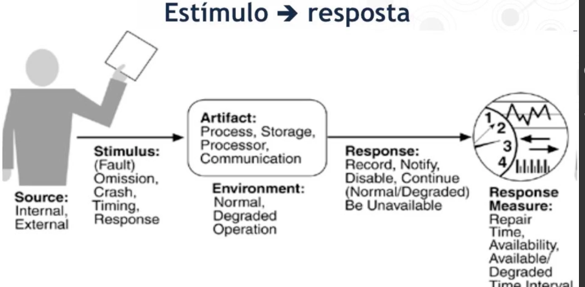

- Exemplo 1:

  - Cenário de qualidade: recuperação rápida.
    - Estímulo: Uma falha ocorre em um componente de software ou hardware do Gerenciador de Trilhos.
    - Fonte do Estímulo: Um componente de software ou hardware do Gerenciador de Trilhos falha.
    - Ambiente: Diversos clientes de software usam esse serviço. Na ocasião da falha, o componente pode estar atendendo a vários clientes concorrentemente.
    - Artefato: Gerenciador de Trilhos.
    - Resposta: Todas as consultas feitas por clientes antes e durante a falha devem ser atendidas. Pedidos de atualização podem ser ignorados por até dois segundos sem perda de precisão.
    - Medida da Resposta: A réplica secundária deve ser promovida a primária e começar a processar pedidos de atualização em até dois segundos após a ocorrência da falha. Quaisquer respostas a consultas que estão a caminho (ou que foram feitas próximas ao momento da falha) devem ser respondidas em até três segundos (em média).

- Exemplo 2:
  - Cenário de qualidade: Renicialização.
    - Estímulo: Uma nova réplica é iniciada como standby.
    - Fonte de Estímulo: O gerenciador de recursos do sistema inicia o standby.
    - Ambiente: uma única réplica está atendendo a requisições sob condições normais. Nenhuma outra réplica está presente.
    - Artefato: Nova réplica do gerenciador de trilhos.
    - Resposta: A inicialização da nova réplica tem impacto transiente sobre as requisições de serviço.
    - Medida da Resposta: Requisições de serviço sofrerão efeito transiente da inicialização da nova réplica por no máximo 2 segundos.

<h1>Exemplos de requisitos descritos no padrão estímulo-resposta 1</h1>

- Contexto: Rede Social Virtual

- Rede Social Virtual

  - Uma empresa de jogos chamada Zynga solicitou o desenvolvimento de uma Rede Social Virtual para seus jogadores. O sistema de rede deve permitir que usuários encontrem seus amigos, enviem solicitação de amizade e depois de aceita passem a compartilhar fotos, vídeos e mensagens através da Web.

- O que vamos exercitar?

  - Descrição de cenários de qualidade utilizando a abordagem estímulo => resposta considerando atributos de qualidade ou requisitos arquiteturais da rede social virtual.

- Cenário de Desempenho: Tempo de Resposta

  - Um usuário deve ser capaz de acessar o perfil de um amigo em até 0.5 segundos quando o sistema se encontra com alta carga de requisições.

  - Estímulo: Solicitação de visualização de um perfil de amigo.
  - Fonte do Estímulo: Usuário interessado em visualizar o perfil do amigo.
  - Ambiente: Sistema com alta carga de requisições.
  - Artefato: Rederizador das fotos e texto dos perfis.
  - Resposta: Renderização da UI para visualização das fotos do perfil do amigo.
  - Medida da Resposta: Fotos de até 3 MB devem ser exibidas em no máximo 0.5 segundos.

- Cenário de Desempenho: Interface front-end
  - Um usuário deve ser capaz de utilizar o sistema em um smartphone e a interface deve se comportar de forma responsiva e manter a identidade visual do site da empresa Zynga.
  - Estímulo: Acesso a qualquer página do sistema.
  - Fonte do Estímulo: Usuário acessando o sistema de um smartphone.
  - Ambiente: Funcionamento com carga normal.
  - Artefato: Módulo de Apresentação (Front-end).
  - Resposta: A camada de apresentação exibe de forma responsiva a página de resultado com layout semelhante ao site da zynba.com.
  - Medida da Resposta: Identidade visual com cores e elementos visuais semelhantes ao site da empresa, sendo que os elementos foram redimensionados automaticamente para o tamanho da tela e os elementos menores não foram exibidos.

<h1>Táticas Arquiteturais</h1>

- Como atingir qualidade em uma arquitetura?

  - Usamos um conjunto de táticas arquiteturais para atingir a qualidade dos diversos requisitos em um software.
  - As táticas sao destinadas a controlar as respostas aos estímulos.

- Disponibilidade
  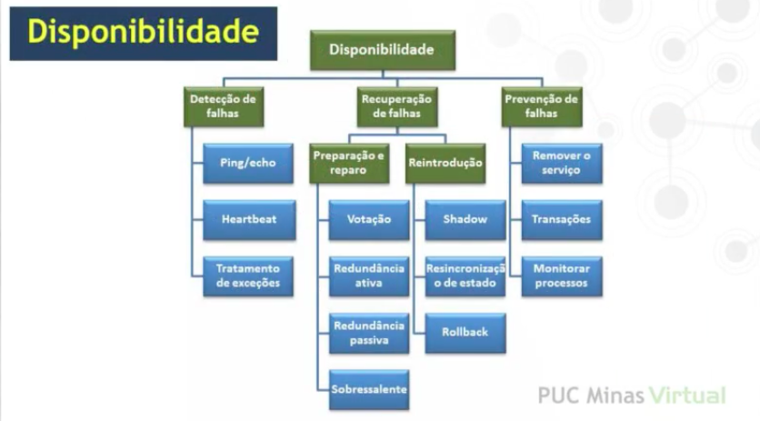

- Modificabilidade
  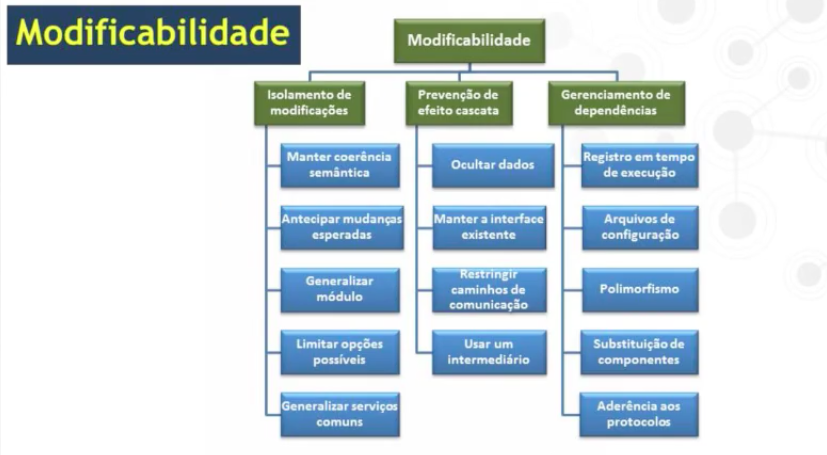

- Desempenho
  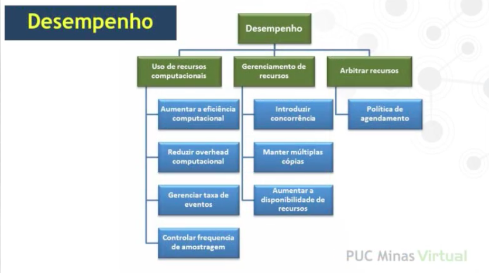

- Segurança
  

- Testabilidade
  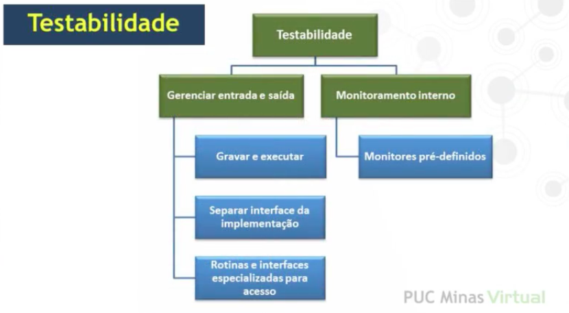

- Usabilidade
  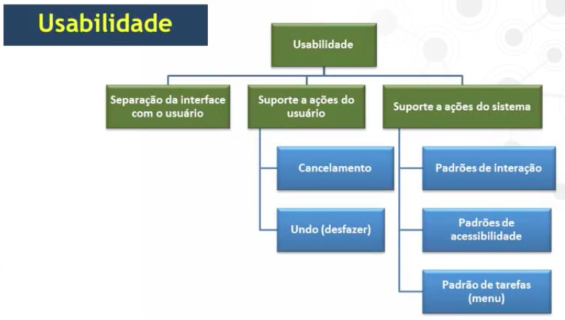

<h1>Fatores que influenciam o desempenho</h1>

- Tática de desempenho

  - Controlam o tempo entre a chegada de um evento no sistema e a geração de uma resposta ao evento.

- Fatores que influenciam o desempenho

  - Uso de recursos computacionais consome tempo.
  - Tempo de bloqueamento quando concorrendo por um recurso.

- Recursos computacionais

  - Recursos incluem CPU, armazenamento de dados, banda de comunicação em redes e memória, mas podem também incluir elementos definidos pelo sistema sendo projetado como um buffer ou uma memória compartilhada entre dois componentes.

- Eventos a serem processados

  - Os eventos podem ser de tipos variados:
    - A chegada de uma mensagem.
    - O término de um intervalo de tempo.
    - A detecção de uma mudança significativa no estado do ambiente do sistema.

- Latência total

  - Processamento de um evento - Exemplo

    - Uma mensagem é gerada por um componente;
    - É enviada pela rede, chega a outro componente
    - Colocada em um buffer;
    - Transformada de alguma forma;
    - Processada de acordo com algum algoritmo;
    - Transformada em saída;
    - Colocada em um buffer de saída; e
    - Enviada para outro componente, para outro sistema, ou para o usuário.

  - Bloqueamento
    - Uma computação é impedida de usar o recurso por:
      - Concorrência ou disputa pelo recurso.
      - Indisponibilidade do recurso.
      - Dependência de outras computações ou resultados que ainda não foram finalizados.
        - Sincronização.

- Livro: BASS, Len, CLEMENTS, Paul, KAZMAN, Rick. Software Architecture in Practice. Addison-Wesley, 2012

<h1>Táticas Arquiteturais de Desempenho</h1>

- Táticas de desempenho

  - Controlam o tempo entre a chegada de um evento no sistema e a geração de uma resposta ao evento.

- Três categorais de táticas de desempenho:

  - Demanda por recursos
  - Gerência de recursos
  - Arbitragem de recursos

- 1 - Demanda por recursos

  - Característica crítca ou mais preocupante em fluxos de eventos:
    - Tempo entre eventos.
    - Quantidade de recurso consumido por evento.
  - Aumentar a eficência computacional
    - Melhorar algoritmos, armazenar valores intermediários para evitar o cálculo desnecessário.
  - Reduzir o overhead computacional
    - Uso de intermediários para mehlorar a modificabilidade aumenta a latência.
  - Gerenciar a quantidade de dados nos eventos
    - Ajax
  - Gerenciar a taxa de eventos
    - Cache no cliente.

- 2 - Gerência dos recursos

  - Introduzir paralelismo
    - Reduz o tempo de bloqueio se houver balanceamento de carga na alocação das linhas de execução aos recursos.
  - Manter múltiplas cópias dos dados ou computações.
    - Caching no cliente.
    - Manter as cópias consistentes e sincronizados se torna uma responsabilidade que o sistema precisa assumir.
  - Aumentar e/ou melhorar os recursos disponíveis.
    - Processadores mais rápidos, memória adicional e redes mais rápidas têm o potencial para reduzir a latência.
    - Custo pode ser proibitivo.

- 3 - Arbitragem de recursos
  - Disputa pelo recurso => Escalonamento
    - Arquiteto precisa escolher uma estratégia de escalonamento para o uso do recurso.
    - Política de escalonamento
      - Atribuição de prioridades
      - Despacho do evento
  - Políticas de Escalonamento
    - FIFO
    - Escalonamento de prioridade fixa
      - Importância semântica.
      - Tempo - As requisicoes mais rápidas sao feitas primeiro
    - Escalonamento de prioridade dinâmica
      - Round-robin - Fatias do tempo daquele recurso sao alocadas naquela funcionalidade. Salvando o estado e voltando para a fila.

<h1>Visão geral do método Attribute Driven Design - ADD</h1>

- Attribute Driven Design

  - Método para projeto/desenho de uma arquitetura guiado pelos atributos de qualidade.
  - Produzido pelo Software Engineering Institute.

- Visão Geral

  - Planeje
    - Atributos de qualidade e restrições de projeto são considerados para selecionar quais tipos de elementos serão utilizados na arquitetura.
  - Execute
    - Elementos arquiteturais são instanciados para satisfazer atributos de qualidade e atributos funcionais.
  - Verifique
    - O projeto arquitetural resultando é analisado para determinar se os requisitos foram satisfeitos.
      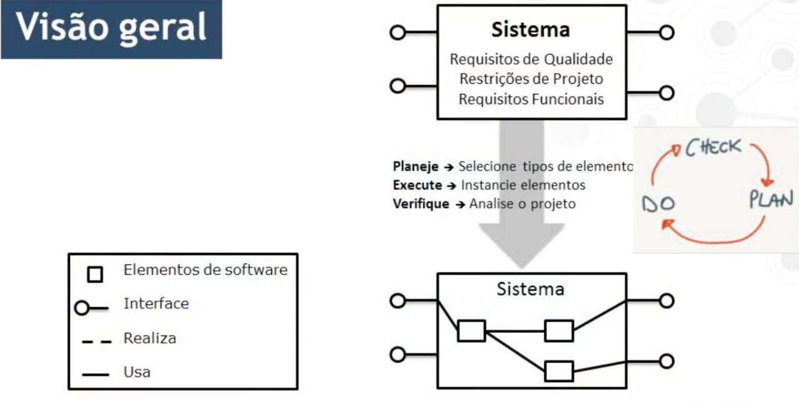
      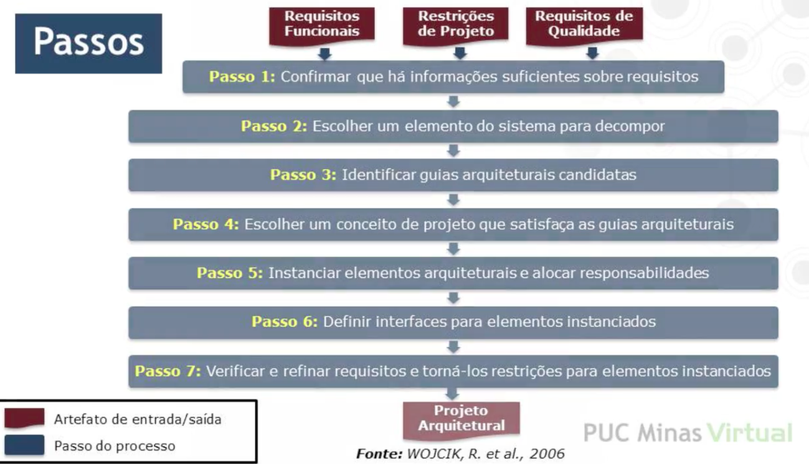

- Entradas para o ADD

  - Lista completa de requisitos priorizada pelos stakeholders de acordo com a missão e os objetivos do negócio incluido:
    - Requisitos funcionais;
    - Restrições de projeto;
    - Requisitos de qualidade.

- Restrições do Projeto

  - Exemplos:
    - Oracle deve ser usado para persistência.
    - O sistema deve estar acessível na web.
    - O sistema deve ser implementado usando C#.
    - O sistema deve interagir com outros sistemas exclusivamente através do paradigma de comunicação publish/subscribe.
    - O sistema deve executar nas plataformas Windows e Unix.
    - O sistema deve se integrar com sistemas legados.

- Saída esperada do ADD
  - Um projeto de arquitetura definido em termos de elementos de software, suas propriedades, papéis e responsabilidades desempenhados por estes elementos e os relacionamentos entre estes elementos.
  - A partição do sistema nos principais elementos de software.
  - A organização dos elementos indicando quais elementos fazem parte das diferentes estruturas do sistema.
  - As interações entre os elementos.

<h1>ADD passos 1 e 2</h1>

- Passo 1
  - Confirmação de que existe informação suficiente sobre requisitos.
  - Requisitos que não foram priorizados necessitam de atenção dos stakeholders.
  - Requisitos de qualidade que não foram especificados com critérios de aceitação quantificáveis precisam ser revistos.
- Passo 2

  - Escolha de um elemento de software para ser decomposto.
    - Se é a primeira iteração "o sistema" deve ser o elemetno escolhido.
    - Se é uma das iterações subsequentes, já existe uma decomposição anterior do sistema e um dos elementos precisa ser selecionado para ser decomposto.

- Critérios para a seleção
  - O conhecimento atual da arquitetura
    - O número (muito grande ou muito pequeno) de dependências com outros elementos.
  - Risco e dificuldade
    - O quão difícil será atingir os requisitos associados ao elemento.
    - O quão familiar a equipe está em realizar/atingir os requisitos associados ao elemento.
    - O risco envolvido para realizar/atingir os requisitos associados ao elemento.
  - Fatores relacionados ao negócio
    - O papel que o elemento desempenha no desenvolvimento incremental do sistema e nas entregas incrementais das funcionalidades.
    - Se o elemento será comprado, construído, licenciado, reusado de código aberto.
    - O impacto que ele tem no tempo de colocação do produto no mercado (time to market).
    - Se o elemento será implementado usando componentes legados.
    - A disponibilidade de pessoal para desenvolver o componente.
  - Critérios organizacionais
    - O impacto na utilização de recursos computacionais e humanos.
    - O nível de habilidade requerido no desenvolvimento do elemento.
    - O impacto que o desenvolvimento do componente tem na melhoria das habilidades da equipe na organização.
    - Alguém com autoridade faz a seleção do componente.

<h1>ADD Passo 3</h1>

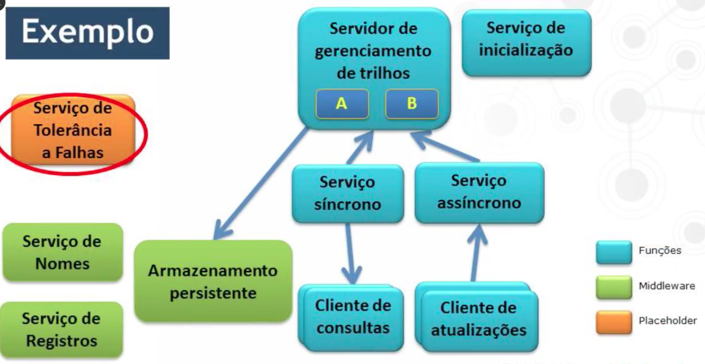

- Identificação de requisitos que serão utilizados como guias arquiteturais do elemento.
  - Com base na lista de requisitos priorizados pelos stakeholders atribuída ao elemento selecionado no passo anterior.
- Priorizar os requisitos de acordo com seu impacto na arquitetura do software utilizando três categorias (Alta, média e baixa).
  - Cada requisito deve pertencer a um dos grupos segundo sua importância e dificuldade de serem implementados.
  - (AA)(AM)(AB)(MA)(MM)(MB)(BA)(BM)(BB)
  - Selecionar por volta de 5 ou 6 requisitos do grupo (AA),
  - Este são os candidatos a guias arquiteturais deste elemento em decomposição.

<h1>ADD Passo 4</h1>

- Escolha um conceito de projeto, ou um padrão arquitetural que satisfaça as guias arquiteturais do elemento em decomposição.

- Passo 4.1

  - Identificar preocupações de projeto em cada uma das guias arquiteturais candidatas. - Por exemplo, para disponibilidade do sistema as preocupações seriam detecção de falahas, recuperação de falhas e prevenção de falhas.
    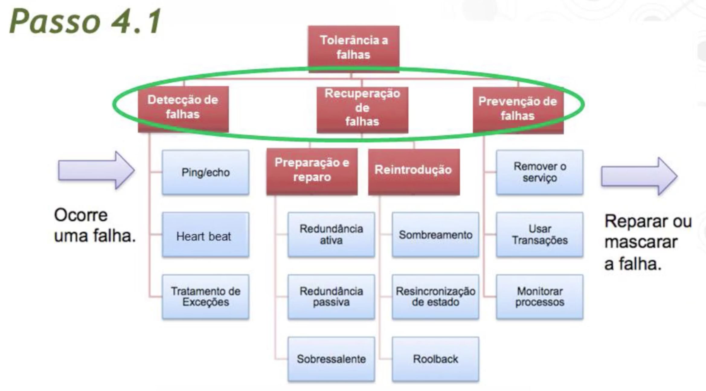

- Passo 4.2

  - Identificar alternativas de padrões que tratam as preocupações de projeto identificadas no passo anterior.
  - Para cada um dos padrões identificados determinas:

    - Os parametros discriminatórios.
    - Uma estimativa dos valores de cada parametro.

  - Por exemplo: Tempo de reinicialização após uma falha utilizando os padrões reinicialização fria ou quente.
  - Número de dependências entre os elementos de um padrão (camadas, MVS) usado para satisfazer um requisito de modificabilidade.

- Passo 4.3

  - Selecionar da lista produzida no passo anterior, padrões que sejam as soluções mais apropriadas para satisfazer as guias arquiteturais candidatas.
    - Registrar as motivações/razões a cada seleção de padrão.
  - Reflita sobre
    - As vantagens e desvantagens de cada padrão analisando os ganhos e as perdas em cada possível escolha.
    - A combinação/integração dos padrões se forem colocados juntos para compor uma solução.
    - Existe exclusão mútua no grupo de padrões selecionados? (se padrão A for escolhido o padrão B não pode fazer parte da solução).
    - Faça as escolhas de padrões com base nesta reflexão.
  - Exemplo:
    - Decisão: usar o padrão de reinicialização quente.
    - Motivação/razões:
      - Segundo o requisito do cenário de falha o tempo de reinicializaçåo precisa ser menor do que 2s. O padrao reinicializacao fria é descartado por apresentar tempo de reinicializacao superior ao necessário. O padrao de reinicializacao quente é escolhido pois a principio é mais simples de ser implementado do que os outros padroes.

- Passo 4.4

  - Descreva os novos padroes advindos da combinação dos padrões anteriores.
    - Quais elementos dos padrões estão relacionados?
    - Quais elementos não estão relacionados?
    - Quais funcionalidades dos padrões possuem interseção? dica para combinar os padrões.

- Passo 4.5

  - Descreva os padrões identificados no passo anterior utilizando diferentes visões como: - Módulos, componentes e conectores, distribuição/alocação. - Utilize templates das visões para criar esta documentação.
    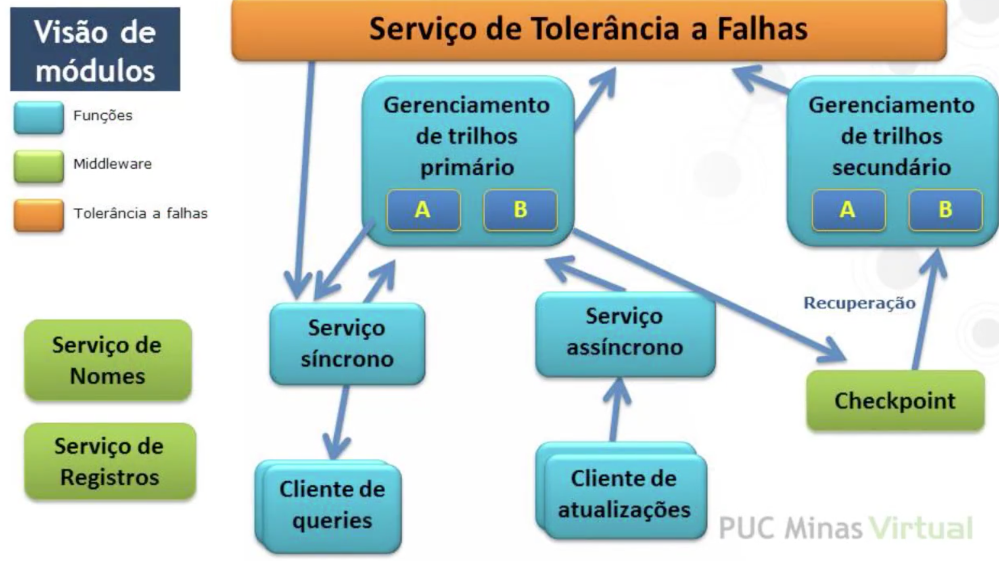

- Passo 4.6

  - Avalie e encontre incosistências no projeto arquitetural do elemento em questão.
    - Avalie o projeto produzido em relação as guias arquiteturais candidatas.

- Passo 5

  - Instanciação dos elementos arquiteturais e alocação das responsabilidades.
    - Instancie os elementos (filhos).
    - Atribua as responsabilidades aos elementos.
  - Aloque as responsabilidades do elemento em decomposição (pai) aos elementos filhos que acabaram de ser instanciados.
  - Analise e documente as decisões arquiteturais tomadas até o momento.
  - Utilize diversas visões.
  - Instancia do Monitor de Saúde, suas responsabilidades e relacoes com outros elementos do sistema.
    - O monitor de saúde usa um timer para verificar se recebeu o heartbeat de A, B, A'e B'. Se nāo receber o heartbeat antes do timer terminar, ele notifica o proxy.

- Passo 6

  - Definicao de interfaces entre os elementos instanciados.
    - A interface é o conjunto de servicos e propriedades que os elementos de software fornecem e requerem.
  - Intefaces podem incluir:
    - A sintaxe de operações (assinatura).
    - A semântica de operações (pré- e pós-condições).
    - Informações compartilhadas (eventos, dados globais).
    - Requisitos de qualidade de operações.
    - Tratamento de erros.
  - Deve-se seguir esses 3 subpassos?
    - 1 - Exercitar os requisitos funcionais que involverem os elementos instanciados no passo 5;
    - 2 - Observar as informações que sao produzidas por um elemento e consumidas por outro;
    - 3 - Registrar o que foi encontrado na documentacao da interface de cada elemento.

- Passo 7

  - Verificar e refinar os requisitos, transformando-os em restricoes aplicadas aos elementos instanciados.
    - Ou seja, verificar que a decomposicao até agora atende aos requisitos funcionais e de qualidade.
  - Deve-se seguir esses 3 subpassos: - Verificar se todos os requisitos atribuídos a um elemento pai foram alocados a um ou mais elementos filho na decomposição; - Transformar responsabilidades atribuídas a elementos filho em requisitos funcionais; - Refinar requisitos de qualidade de elementos filho individuais, quando necessário.
    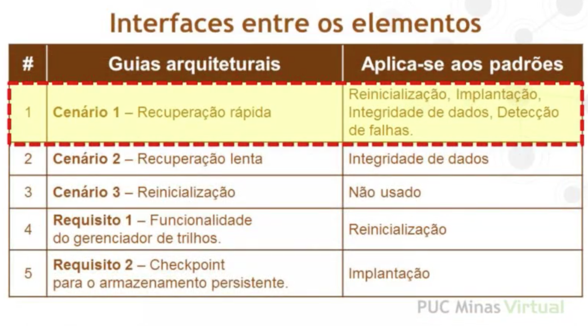

- Passo 8
  - Repetir os passos 2 a 7 para o próximo elemento do sistema que se deseja decompor.
