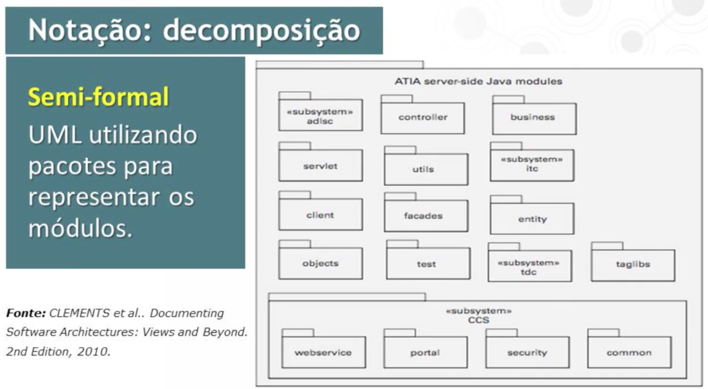
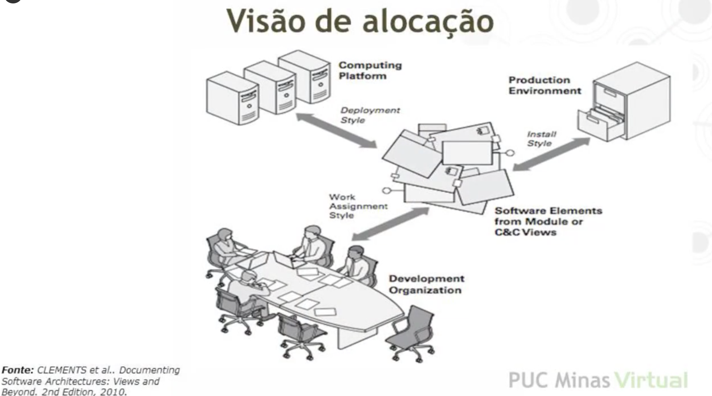

<h1>Introdução</h1>

- Qual o papel das visoes e estilos arquiteturais?

  - Impossível representar todas característicos em um único estilo arquitetural.
  - As visoes e os estilos arquiteturais devem ser utilizados de forma a documentar partes específicas da arquitetura.
  - Visao de Modulos

    - Decomposicao
    - Usa
    - Generalizacao
    - Camadas
    - Aspectos
    - Repositórios de dados compartilhados.

  - Visao de Componentes e Conectores

    - Pipe e filtro
    - Cliente-servidor
    - Ponto a ponto
    - Arquitetura Orientadas a Serviços
    - Publicador-assinante

  - Visao de Alocação

    - Implantação
    - Instalação

  - Documentacao de Interfaces
  - Como documentar arquitetura usando a UML

<h1>Visão de Módulos</h1>

<h1>Práticas de documentação de arquitetura de software</h1>

- Regras de uma boa documentação

  - Use o ponto de vista do leitor.
  - Evite repetições
  - Evite ambiguidade.
  - Siga um template padrao.
  - Registre as motivacoes
  - Mantenha a documentacao atualizada.
  - Revise a documentacao.

- Notações

  - Informais

    - Caixas e setas;
    - Descricoes em linguagem natural.

  - Semiformais

    - UML

  - Formais
    - ADLs (Architecure Description Languages).

- Notações Informais

  - C1 -> C2
  - O que significa a seta?
    - C1 chama C2
    - Existe fluxo de dados em C1 para C2
    - C1 envia mensagem para C2
    - C1 instnacia C2
    - C1 É SUBTIPO DE c2
    - C2 é um repositório de dados e C1 escreve em C2.
    - C1 é um repositório de dados e C2 le de C1.

- Estilos x Padrões

  - Padrão Arquitetural = {problema, contexto}
    - Abordagem Arquitetural.
  - Estilo Arquitetural = Abordagem Arquitetural.

- Tipos de visões

  - Visão de módulos

    - Estrutura.

  - Visao de componentes e conectores

    - Comportamento em tempo de execução.

  - Visão de alocação
    - Distribuiçao dos elementos de software.

<h1>Visao de Módulos I</h1>

- Módulo

  - Unidade de implementação de software que prove um conjunto coerente de responsabilidades.

- Responsabilidade

  - Papel que o módulo assume para atender os atributos de qualidade ou a funcionalidade de um sistema.

- Relações

  - É-parte-de (agregações);
  - Depende-de (usa, permitido-usar, crosscuts);
  - É-um (especialização/generalização).

- Propriedades

  - Regras para:
    - Guiar a implementação do módulo;
    - Analisar os módulos e suas relações.

- Estilos associados a visao de módulos
  - Decomposicao
  - Usa
  - Generalizacao
  - Camadas
  - Aspectos
  - Modelo de Dados

- Decomposição
  - Usado para decompor um sistema em módulos.
  - Mostra
    - Agregações entre módulos;
    - Hierarquia de decomposições de módulos.
  - Relação: é-parte-de.
  - Propriedades/Restrições:
    - Nao podem existir ciclos
    - Cada módulo só pode ter um pai

- Usa
  - Mostra dependencias entre módulos.
  - Relação: depende-de.
  - Usado para planejar incrementos/subconjuntos de desenvolvimento.
  - Propriedades:
    - Evitar uso de ciclos.
      
    - Evitar uso de fan-out largos.
      
    - Evitar longas cadeias de dependencias.
      
  - Nao esperessam necessariamente o estilo:
    - Chamadas entre módulos;
    - Inclusao de módulos.
      
      
      

<h1>Visão de Módulos II</h1>

- Generalização

  - Utiliza a relação é-um.
    - Permite extensão e evolução da arquitetura do software.
  - Módulos organizados para expressarem parte comuns e variações.
  - Módulos podem ser abstratos.
  - Propriedades / Restrições:
    - Módulos podem possuir mais de um pai (design perigoso).
    - Não se permite ciclos nas relações de generalização.
  - Deve ser usado para:
    - Permitir extensão e evolucao da arquitetura de forma incremental.
    - Capturar características comuns e representar as variações nos módulos filhos.
    - Dar suporte ao reuso.
      

- Camadas
  - Divisão em unidades de chamadas camadas
    - Conjunto de módulos;
    - Interface bem definida.
  - Relação: permitido-usar
    - Especialização da relação depende-de.
  - Propriedades / Restrições:
    - Relação unidirecional.
    - Acíclica.
    - Cada módulo pertence a uma única camada.
  - Relação de ordem:
    - Camadas Superiores podem usar camadas inferiores;
  - Se (A,B) são camadas.
    - A é permitida-usar os serviços de B através de sua interface.
  - Usado para promover:
    - Modificabilidade e portabilidade;
    - Reuso;
    - Speração de interesses ou preocupações;
    - Testabilidade.
  - Camadas nao existem em tempo de execução.
    - Mecanismos de organização e abstração do projeto.
      
      

* Aspectos
  - Módulos são aspectos que representam interesses cruzados.
  - Relação: Crosscuting concerns.
  - Restrições / Propriedades:
    - Um aspecto pode ter relação de crosscuting concern com outros aspectos ou com módulos regulares.
  - Um aspecto não deve ter relação de crosscuting concern com ele mesmo.
  - Usado para melhorar a modificabilidade da arquitetura.
    - Evita que a funcionalidade do domínio e a dos crosscuting concerns seja distribuída entre diversos objetos.
      
      
      

<h1>Visão de Componentes e Conectores</h1>

- Componentes

  - Unidade de processamento de software ou de armazenamento de dados presente em tempo de execução.
  - Componentes possuem portas (interface) através das quais interagem com os conectores.

- Conector

  - Forma de interação entre componentes.
  - Conectores possuem papéis (interface) que determinam como os componentes podem interagir.

- Relações

  - Ligação (attachment):

    - Componentes conectam-se através de conectores.
    - Formam um grafo.

  - Delegação de interface:
    - portas dos componentes podem se associar a portas internas de uma sub-arquitetura.
    - Papéis dos conectores podem ter suas interfaces delegadas.

- Restrições

  - Componentes devem estar ligados a conectores.
  - Conectores só podem estar ligados a componentes.
  - Ligações só podem acontecer entre portas (componentes) e papéis (conectores) compatíveis.
  - Delegação de interfaces
    - Entre duas portas compatíveis, ou
    - Entre dois papéis compatíveis.
  - Conectores precisam estar conectados a componentes.

- A visão deve ser usada para:
  - Mostrar o funcionamento do sistema.
  - Guiar o desenvolvimento indicando a estrutura e o comportamento dos elementos em execução.
  - Ajudar os arquitetos a discutir/argumentar sobre os atributos de qualidade.
    
    

<h1>Visão de componentes e conectores - Estilos associados</h1>

- Pipe e filtro
- Cliente-servidor
- Ponto a ponto
- SOA
- Publish and Subscribe
- Repositório de dados compartilhado.

<h1>Pipe-filtro e cliente-servidor</h1>

- Pipe e Filtro

  - É um estilo de fluxo de dados.
  - Componentes:
    - Filtros que transformam dados.
    - Podem executar de forma concorrente.
  - Conectores:
    - Pipes passam dados entre filtros.
    - Preservam a ordem e o formato dos dados.
  - Todos filtros precisam usar o mesmo formato de dados.
    - Normalmente formato ASCII
  - Pode exigir que seja acíclico.
    - Pipeline.
  - Necessitam de buffers.
    - Armazenam a parte do fluxo de dados ainda não processada.
  - Deve ser usado para:
    - Melhorar a reusabildiade.
    - Melhorar o throughput através da paralelização de filtros.
  - Propriedades a documentar:
    - Capacidade do buffer dos pipes.
    - Forma de sinalizar o fim dos dados.
    - Tipo de bloqueio em buffers cheios ou vazios.
    - Transformação de dados do filtro.

- Cliente-servidor
  - Pertence a categoria dos estilos de chamada e retorno
  - Componente cliente inicia requisições ao componente servidor.
  - Componente servidor provê serviços aos componentes clientes.
  - Servidor possui:
    - Número máximo de clientes simultâneos.
    - Capacidade máxima de requisições por minuto.
  - Conector segue o padrão requisição / resposta.
    - Conexão sincrona.
      - Clientes realizam uma requisição ao servidor e aguardam pela resposta.
  - Restrições
    - Conexões através de requisições / respostas.
      - Comunicação síncrona.
    - Servidores podem ser clientes de outros servidores.
    - Clientes precisam conhecer os servidores.
    - Servidores só conhecem clientes no momento da requisição.
  - Deve ser usado para:
    - Melhorar a escalabilidade e a disponibilidade de serviço.
      - Replicação de servidores.
    - Analisar a dependabilidade entre componentes.
      

<h1>Ponto a ponto e SOA</h1>

- Ponto a ponto

  - Cada ponto é um componente que pode ser:
    - Cliente, iniciando uma requisição, ou
    - Servidor, respondendo a uma requisição.
  - Chamada-e-retorno
    - Conector
      - Liga clientes a rede ponto a ponto.
      - Permite buscas de outros pontos.
      - Permite chamar serviços de outros pontos.
  - Propriedade
    - Relações de ligação podem ser criadas e destruídas em tempo de execução.
      - Resiliência a mudancas na rede.
      - A rede nao sai fora do ar por falta de um ponto.
  - Restrições
    - Número de conexões a portas de um ponto pode ser limitado.
      - Importante para balancear a carga da rede.
    - Pontos especiais podem prover serviços de roteamento, indexação.
    - Especializações podem impor restrições de visibilidade entre pontos.
      - Indicam quais componentes podem ser conhecidos por outros.
  - Usado para
    - Melhorar disponibilidade, escalabilidade, flexibilidade.
    - Tornar viável sistemas largamente distribuídos.
      

- Arquitetura Orientada a Serviços (SOA)
  - Pertence a categoria dos estilos de chamada e retorno.
  - Componentes:
    - Provedores de serviços.
    - Consumidores de serviços.
    - ESB (Enterprise Service Bus)
      - Elemento intermediário para rotear e transformar mensagens entre provedores e consumidores.
    - Diretório de registro e descoberta de serviços.
    - Servidor de orquestração
      - Coordena a interação entre consumidores e provedores de serviços.
        - Usa scripts que definem um fluxo de trabalho.
  - Conectores
    - Conector SOAP
      - Protocolo SOAP (Simple Object Access Prontocol) para comunicação síncrona entre Web Services sobre HTTP.
      - Portas são descritas em WSDL (web-service description languagem).
    - Conector REST
      - Operações de requisição / resposta do protocolo HTTP.
    - Conector de mensagens
      - Oferece troca de mensagens assíncronas.
  - Restrições:
    - Consumidores de serviços sao conectados a provedores de serviços.
    - Componentes intermediários.
      - Barramento ESB;
      - Diretório de serviços.
    - ESBs definem a topologia hub-and-spoke para a rede de serviços.
    - Provedores de serviços também podem atuar como consumidores.
  - Usada para:
    - Interoperabilidade entre componentes distribuídos em plataformas distintas.
    - Integrar sistemas legados.
    - Permitir reconfiguração dinâmica.
      
      

<h1>Anunciante-Assinante e Repositório Compartilhados de Dados</h1>

- Anunciante-Assinante (Publish and Subscribe)

  - É um estilo baseado em eventos
    - Exemplos:
      - Sistemas de interfaces gráficas baseados em eventos.
      - Frameworks MVC.
      - Aplicações de redes sociais com notificações.
  - Componentes podem ser de qualquer tipo.
    - Devem ter interface anunciante (publisher) ou interface assinante (subscriber).
  - Conectores do tipo anunciante ou assinante.
    - Anunciam ou escutam componentes que querem publicar ou assinar um serviço.
  - Relação indica quais componentes anunciam eventos e quais desejam receber eventos.
  - Restrições:
    - Componentes são conectados a um distribuidor de eventos.
    - Portas com interface publish sao conectadas a papéis de anunciantes.
    - Portas do tipo subscribe sao conectadas aos papéis de escuta.
    - Um componente pode ser amboa anunciante e assinante.
  - Usado para:
    - Enviar eventos para consumidores desconhecidos.
    - Prover funcionalidade para sistemas diversos.
      

- Repositório de dados compartilhados
  - Componentes são um ou mais repositórios e outros componentes de diversos tipos que acessam dados.
  - Conectores realizam leitura e escrita de dados.
  - A relação de ligação indica conexão entre componentes de acesso a dados e repositórios.
  - Usado para.
    - Desacoplar produtores de dados de seus consumidores.
    - Permitir que componentes distribuídos acessem dados persistentes.
      

<h1>Visão de Alocação</h1>

- Descreve o mapeamento entre

  - Elementos de software;
  - Elementos do ambiente onde será instalado, executado ou produzido.

- Elementos:

  - Elementos de software.
  - Elementos de ambiente
    - Provêm propriedades aos elementos de software.

- Relação:

  - Elementos de software são alocados aos elementos de ambiente.

- Estilo: Implantação

  - Elementos de software são alocados a plataforma de execução.
  - Elementos de ambiente incluem todo tipo de hardware:
    - Processadores, memórias, discos, roteadores, etc.
  - Propriedades dos elementos de ambiente relevantes para a documentação:
    - Velocidade do clock;
    - Número de Processadores;
    - Capacidade da memória;
    - Velocidade do barramento;
    - Velocidade de execução das instruções;
    - Capacidade de armazenamento;
    - Largura da banda de comunicação;
    - Mecanismo de detecção de falha de hardware.
  - Propriedades dos elementos de software relevantes para a documentação.
    - Consumo de recursos;
    - Requisitos para os recursos;
    - Elementos de segurança crítica.
      

- Estilo: Instalação
  - Descreve o mapeamento dos elementos de software para o sistema de arquivos.
  - Elementos de software devem lsita propriedades
    - Incluindo requisitos do ambiente que necessitam para a execução:
      - O SGBD, ambiente de execução, servidor de aplicação, sistema operacional.
  - Elementos de ambiente representam arquivo ou pasta no ambiente de produção.
  - Relações:
    - Um elemento de software é alocado a um arquivo ou pasta.
    - Arquivos e pastas podem estar contidos em outras pastas.
    - As relações de estar contido obedecem a uma hierarquia de uma árvore.
  - Notação UML - Estereótipos: - `uml <<artifact>>` - Qualquer arquivo. - `uml <<manifest>>` - Relação de que um componente ou classe se manifesta em um arquivo, artefato.
    
