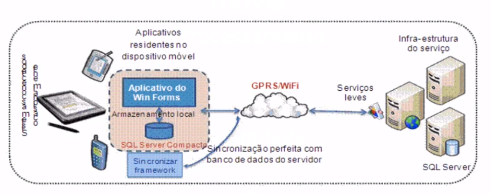

<h1>Referências</h1>

* ESPOSITO, Dino. Architecting Mobile Solutions for the Enterprise. Microsoft Press; 1 edition. 2012.

<h1>Computação Móvel</h1>

* A computação móvel (CM) é a área da tecnologia que amplia o domínio da Computação Distribuída. Pois, faz uso da comunicação sem fio para eliminar a limitação da mobilidade. Onde através de um dispositivo portátil é possível se comunicar com a parte fixa da rede e com outros computadores móveis. A esse ambiente de computação se dá o nome de computação móvel ou computação nômade.
* Dessa forma, a computação móvel amplia o conceito tradicional de comutação distribuída. Isso é possível graças a comunicação sem fio que elimina a necessidade do usuário manter-se conectado à uma infra-estrutura fixa e, em geral estática.

* Portátil vs Móvel
    * Smartphone é portátil. Existe toda uma ergonomia associada ao dispositivo e não simplesmente um computador móvel.

* Estrutura básica da computação móvel
    * Processamente + Mobilidade + Comunicação sem Fio.
    * Padrões e Protocolos

* Estrutura

    

* Limitações
    * Interface
        * Telas pequenas
        * 3.5 polegadas 
    * Processamento
        * Não tem hardware ilimitado.
        * Hardwares simples
    * Comunicação
        * Nem sempre o usuário está em uma área visível.
        * Sem 3G / Internet
    * Energia
        * Gerenciamento da Energia
        * Baterias dura muito poucas.
    * A energia disponível em cada unidade móvel é um fator de alta limitação, comprometendo o tempo de uso pelo usuário e também exigindo sofisticados algoritmos para o rastreamento dessas unidades.
    * As questões de privacidade e segurança são bastante delicadas, apeas do ganho conseguido com os sistemas digitais.
    * Pode-se dizer que a computação móvel é um caso especial de computação distribuída onde os problemas de conexão e desconexão são constantes. Neste sentido, a computação móvel representa o "pior cenário", possível de um sistema distribuído.
    * Um dos problemas mais comuns que devem ser pensados são: a necessidade do projeto de aplicações, de interoperabilidade ao longo de diferentes ambientes de acesso sem fio.
    * Pontos chaves no projeto de tais aplicações são: capacidade de identificação das condições do ambiente, adaptabilidade da apresentação das informações em tais condições e continuidade da prestação do serviço ao longo de mudanças de rede.    

<h1>Exercícios</h1>

* 1 - Qual a estrutura básica de tecnologia utilizada na computação móvel?
    * R: Processamento, mobilidade e comunicação sem fio. Os componentes básicos de tecnologia para computação móvel são: Processamento: uma unidade computacional deve processar demandas de software; Mobilidade: o hardware e software é projetado para ser portátil e poder ser carregado junto com usuário sem componentes de conexão físicos. Comunicação sem fio: a possibilidade do tráfego de dados sem necessidade de conexão física.

* 2 - Dos itens listados abaixo, qual NÃO pode ser considerado uma limitação da computação móvel nos dias atuais?
    * R: Portabilidade. Em dispositivos móveis a interface, geralmente por ser em tela menores deve ser projetada com características específicas o que gera uma limitação na representação de informações, os hardwares também não projetados para desempenho maximizado, o que faz que que o processamento possa ser uma barreira. A energia é um grande problema nesses devices, muitos não consegue suprir o consumo do usuário. Já a portabilidade do hardware não pode ser considerada uma limitação, e sim um benefício.

* 3 - Porque a computação móvel pode ser considerada o “pior cenário” de um sistema distribuído?
    * R: Porque problemas de conexão e desconexão são constantes. Sem dúvida um dos maiores desafios de um sistema distribuído na computação móvel é a eficiência e qualidade do canal de comunicação com o sistema fixo. Visto que o usuário transita entre protocolos e meios de comunicação diversos. E o sistema deve ser capaz de manter uma qualidade de conexão entre mudanças de meio.

* 4 - No projeto de aplicações móveis muitos itens devem ser considerados no desenvolvimento. Dentre as alternativas abaixo, qual item NÃO é precisa ser estimado?
    * R: Focar no uso de uma tecnologia. Dentre as diversas possiblidades que o desenvolvimento de aplicativos móveis nos fornece, uma delas é a possibilidade da integração com diversas tecnologias. Cada camada de software pode apresentar uma abordagem tecnológica diferenciada. Já os outros itens devem receber atenção especial no projeto de arquitetura.

* 5 - Existem muitos impactos sociais na adoção de uma tecnologia móvel, dos itens abaixo qual é listada como um das maiores preocupação de desenvolvedores e empresas?
    * R: Segurança. Todas as questões listadas são importantes, mas a segurança dos dados sensíveis de usuário é uma das maiores preocupações no desenvolvimento de aplicações móveis. É um item transversal que deve ser trabalhado pelo S.O e aplicações.

* 6 - Na visão do usuário qual dos itens abaixo NÃO é uma preocupação eminente e muitas vezes é deixado de lado?
    * R: Configurações de Segurança. Na visão do usuário o dispositivo com o sistema operacional e aplicativos já tem todas as configurações de privacidade e segurança melhor adaptado a suas necessidades, muitos usuários até desconhecem que devem ter essa preocupação.