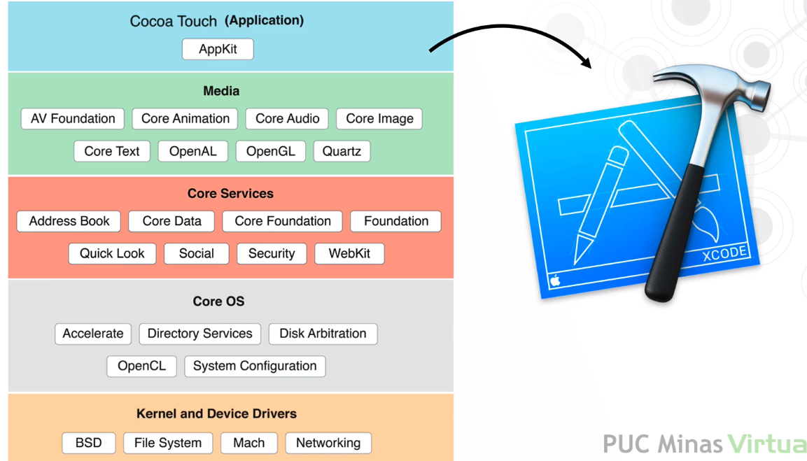
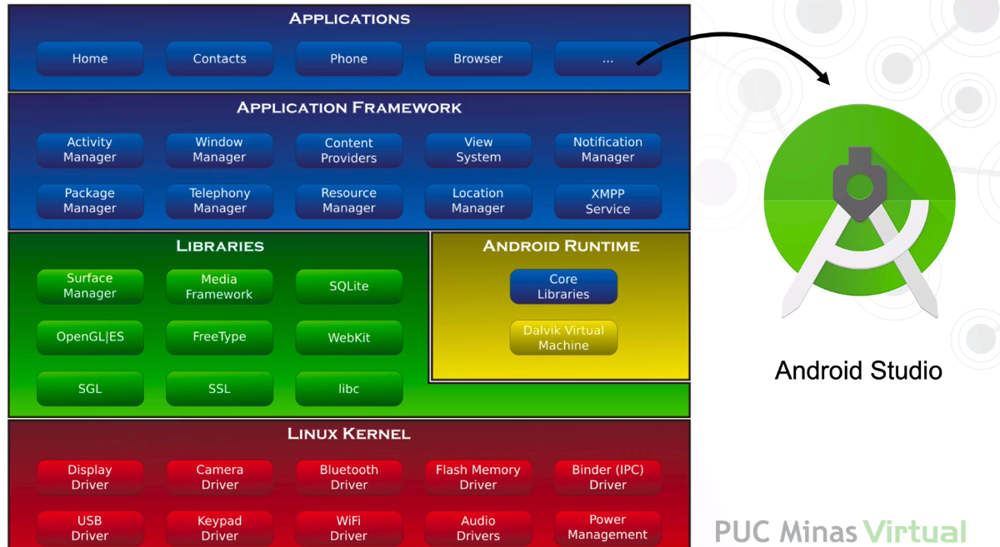
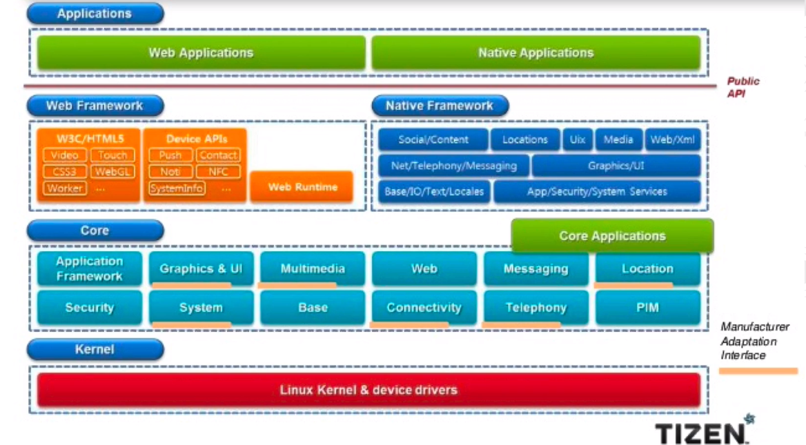
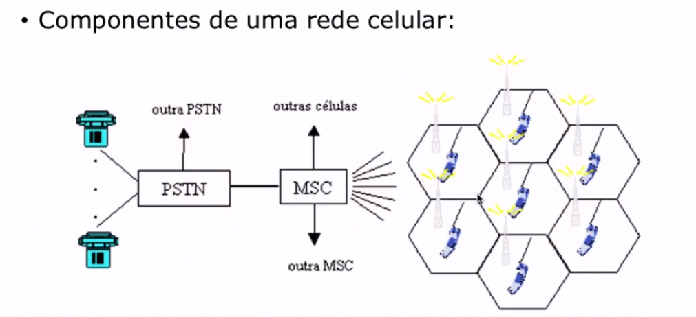
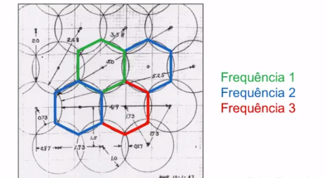

<h1>Referencias</h1>

* KRUMM, John. Ubiquitous Computing Fundamentals, Chapman & Hall. 2009

<h1>Sistemas Operacionais e Dispositivos</h1>

* Dispositivos
    * Dispositivo móvel
        * Um dispositivo móvel, designado popularmente em inglês por handheld é um computador de bolso
* Tipos 
    * Smarthphone;
    * Tablet;
    * Smartwatch
    * Console Portátil.

* Smartphone
    * É um telefone celular com funcionalidades estendidas por meio de programas executados no seu Sistema Operacional.
    * Usualmente um smartphone possui características superiores de hardware, sendo as principais: conexão por infravermehloe e/ou bluetooth, capacidade de sincronização dos dados com sistemas do desktop pessoal e câmera para fotos e vídeos.
    * Características atuais dos Smartphones:
        * Poder computacional próximo a computadores pessoais;
        * Armazenamento é um pouco limitado.
        * Variedade de sistemas operacionais
        * Possibilidade de estender as funções do aparelho por meio de aplicativos.
        * Telas de alta resolução e densidade de pixel;
        * Recursos como GPS, acelerômetro, bússula e outros;
        * Conectividade com redes móveis e recebimento de notificações o tempo todo;
        * Limitador bateria;

* Principais sistemas operacionais:
    * iOS;
    * Android,

* Loja de aplicativos:
    * A grande descoberta;
    * Nova forma de monetizar
    * Flexibilidade e criatividade ao alcance dos desenvolvedores

* Tablet
    * Um tablet é um dispositivo pessoal em formato de prancheta que pode ser usado para acesso à Internet, organização pessoal, visualização de fotos, vídeos, leitura de livros, jornais e revistas e para entretenimento com jogos 3D.
    * Apresenta uma tela touchscreen. Não deve ser igualado a um computador completo ou um smartphone, embora possua diversas funcionalidades dos dois.

* Smartwatch
    * Um relógio inteligente é um rlógio de pulso computadorizado com funcionalidades que vão além de mostrar as horas.
    * Tais dispositivos podem incluir funções como acelerômetro, termômetro, altímetro, barômetro, bússola, cronógrafo, calculadora, telefone celular (chamadas telefônicas), tela touch, navegação GPS, visualizador de mapas, infográficos, alto falante, calendário eletrônico, acesso à internet, repordutor multimídia, etc.

* Console Portátil
    * Um console portátil é um aparelho eletrônico de dimensões reduzidas para que possa ser facilmente transportado. Tem como objetivo executar jogos eletrônicos como em um vídeo game. Para isto, o aparelho possui tela, controles e caixas de som acoplados juntamente com o console alimentado por pilhas ou baterias.
    * Aplicações e recursos:
        * Dotados de grande capacidade computacional gráfica e sistema de áudio de qualidade;
        * Possuem nas gerações mais atuais, wifi e aplicativos para estender suas funções, para navegação na internet e leitura de documentos;
        * Desenvolvimento de aplicativos e distribuição restrito a uso de SDKs específicos do fabricante.

* Sistemas Operacionais
    * iOS
        * É o sistema operacional para dispositivos móveis da Apple. Desenvolvido originalmente para o iPhone, também é usado em iPad e Apple TV. A Apple não permite o sistema operacional rodar em hardware de terceiros.
        * Rápido e estável;
        * Faz um ótimo gerenciamento da memória e possui uma invejável compatbilidade com seu hardware.
        * Amigável integração com outros dispositivos Apple;
        * Plataforma muito segura devido a alto grau de exigência na aprovação das aplicações disponibilizadas ao seu público. 
        * Por ser pioneira na criação da loja de aplicativos, possui uma gama enrome de aplicativos disponíveis.

* Android
    * É um sistema operacional (SO) baseado no núcleo Linux e atualmente desenvolvido pela empresa de tecnologia Google.
    * Extremamente Flexível;
    * Possui uma enorme quantidade de dispositivos usando;
    * Possui código aberto;
    * Liberdade de customização e configurações
    * Variedade enorme do aplicações e opções para tarefas diversificadas;
    * Maior número de aplicativos gratuitos entre as lojas

* Chrome OS
    * Chrome OS é desenvolvido pelo GOogle que é baseado no núcleo do Linux e usa o navegador web Google Chrome como a sua principal interface de usuário. COmo resultado disso, o Chrome OS suporte primariamente aplicativos da web.
    * Duração da bateria;
    * Menos sucessível a vírus;
    * Sistema livre e de código aberto;
    * Facilidade de desenvolvimento de aplicações.

* Tizen OS
    * Tizen é um sistema operacional de código aberto baseado no Linux Kernel sendo desenvolvido pela Linux Foundation em parceria com a Samsumg, Panasonic e Intel para funcionar em smartphones, tablets, smart TVs, netbooks, veículos e todos os outros tipos de sistemas embarcados
    * Para a criação de aplicativos, o TIzen facilidade
    * Boa documentação das APIs
    * Domina o mercado de smart TV;
    * Amigável ao usuário;

* webOS
    * Sistema Operacional exclusivo das Smart TVs da LG. A plataforma teve lançamento no Brasil em 2014 e está presente na maioria dos televisores da fabricante anunciados desde então. O software conta com navegador próprio, lojas de aplicativos e interface simples.
    * Velocidade;
    * Multitarefa;
    * Intefaces amigáveis;
    * Privacidade aprimorada;

<h1>Conectividade</h1>

* Mobilidade
    * Definição:
        * É a capacidade de acessar ou executar sistemas através de dispositivos portáteis, facilitando trabalhos que antes eram restritos a grandes dispositivos.

* Tecnologia Móvel
    * Tudo isso só foi possível através da evolução da tecnologia móvel e telecomunicação, que permite que diversos dispositivos possam se conectar às redes. Alguns exemplos que podemos citar sobre conexões de redes: Wi-Fi, BLuetooth, GSM, GMS, EDD, CDMA, 3G E 4G.
    * A mobilidade iniciou como uma facilidade, mas hoje em dia tornou-se uma necessidade. Mas porque a evolução deste segmento foi tão rápida? Simples. Porque este tipo de tecnologia permite o acesso a dados e informações em qualquer momento e em qualquer lugar. Isto torna-se um poderoso atrativo.

* Redes Celulares
    * Procurava resolver o problema da interferência dos sinais de rádio.
    * Cada usuário do rádio ocupava uma faixa de frequência, que não poderia ser utilizada por outro usuário.
    * O conceito de célula permite que usuários em células adjacentes não utilizem a meesma frequência, mas células mais distantes podem utilizá-las.
    * O conceito de redes celulares surgiu em 1947 nos laboratórios Bell, nos EUA.
    * Utiliza a ideia de ter várias estações de comunicação, chamadas radio-base, para permitir uma ampla cobertura do sinal de rádio.
    * Handoff: conceito em que um usuário trafega de uma estação rádio-base para que outra sem perder a conexão.
    * Componentes de uma rede celular:
        * Estação móvel (Dispositivo móvel).
        * Estação Rádio-Base (Antena)
        * MSC - Mobile Switching Center - Central de Comutação Móvel.
        * PSTN - Public Switched Telephone Network - Central de COmutação de Telefonia Pública.

* Características da Rede Celular:
    * Roaming
    * Controle de Energia.
    * Reuso de frequência
    * Handoff

* Roaming
    * Permite que um usuário utilize o telefone celular fora da área de cobertura de sua operadora
        * Pode ser fora do estado, região ou país.
        * Pode ser a utilização da infraestrutura de outra operadora.
        * Normalmente envolve custos adicionais para o usuário.

* Controle de Energia
    * A antena da estação rádio-base controla o nível de potência do sinal do telefone celular.
    * Isto permite que o celular possa utilizar apenas a energia necessária para manter a qualidade da chamada.
    * Quanto menor a potência transmitida, maior o tempo de duração da bateria.

* Reuso de frequências
    * Células adjacentes utilizam canais diferentes

* Handoff
    * É a passagem, de forma transparente, de um usuário móvel de uma célula para outra.
    * Permite continuar a conexão de voz e dados de um usuário móvel, permitindo a continuidade do serviço de comunicação.
    * O handoff pode ser controlado pela estação rádio-base, pelo telefone celular ou ambos:
        * Controlado pela Rede:
            * Realizado de forma centralizada. A MSC toma a decisão de fazer o handoff.
        * Handoff assistido:
            * Telefone celular auxilia a MSC fazendo medições do sinal para realizar o handoff.
        * Controlado pelo telefone celular: A estação móvel toma a decisão de solicitar o handoff para a estação rádio-base.
    * Existem 2 tipos de handoff:
        * Soft: A transição entre uma célula e outra é realizada de forma suave. Normalmente não ocorre perda de conexão. Utiliza na primeira geração de telefonia celular.
        * Hard: Ocorre uma pequena interrupção durante a mudança de células. Pode ocorrer perda de conexão. Utilizada a partir da segunda geração de telefonia celular.

* Gerações do Celular

    * 1G
        * Primeira geração de telefonia celular.
        * Utilizava comutação de circuitos e modulação analógica
        * Tecnologia FDMA
            * Orientado à conexão.
            * Alocava uma faixa de frequência para cada conexão.
    
    * 2G
        * Sinal digital, permitiam um número maior de usuários por faixa de frequência.
        * Utilizava comutação de circuito.
        * Modulação com TDMA e também com CDMA
        * Transmissão de dados de até 14Kbps.

    * 2.5G
        * Melhoria da tecnologia 2G.
        * Permitiu a comutação de pacotes.
        * Transmissão de dados de até 144 Kbps
        * Implementada sobre a 2G
        * Inclusão do protocolo GPRS (redes GSM).
    
    * 2.75G
        * Melhoria da tecnologia GPRS.
        * Transmissão de dados de até 473Kbps (teórico).
        * Protocolo EDGE (redes GSM).
        * Pode ser implementado na mesma faixa de frequência utilizada pelas operadoras.
    
    * 3G
        * Rede comutada a pacotes.
        * Velocidade de 384Kbps para usuários móveis e 7Mbps para usuários estacionários.
        * Padronização mundial de telefonia celular.
    
    * UMTS - Universal Mobile Telecommunication System
        * Utiliza o padrão de comunicação W-CDMA.
        * Velocidades de até 2Mbps
        * Projetado para banda larga móvel.
            * Internet Móvel.
            * Aplicações Multimídia.
    
    * HSDPA - High-Speed Downlink Packet Access (rede 3.5G)
        * Evolução do W-CDMA/UMTS
        * Velocidades de até 14,4 Mbps para Download
    
    * HSUPA
        * High Speed Uplink Packet Access - 5,76Mbps para upload.
    
    * 4G - LTE - Long Term Evolution
        * Padrão em desenvolvimetno
        * Velocidades de até 150Mbps (podendo evoluir).
        * Em testes chegou a 3,3Gbps (condições ideais).
        * Padrão a ser adotado no Brasil
            * Proposto para 2,5Ghz, operadoras querem 700Mhz.
        * Os grandes atrativos do 4G são a convergência de uma variedade de serviços ate então somente acessíveis na banda larga fixa, bem como a redução de custos e investimentos para a ampliação do uso de banda larga na sociedade, trazendo benefícios culturais, melhoria na qualidade de vida e acesso a serviços básicos tais como comunicação e serviços públicos antes indisponíveis ou precários à população.
        * 4G está sendo desenvolvido prevendo oferecer serviços baseados em banda larga móvel tais como: vídeo chat, mobile tv, conteúdo HDTV, serviços básicos como voz e dados, sempre no conceito de uso em qualquer local e a qualquer momento. Todos os serviços deverão ser prestados tendo como premissas a otimização do uso de espectro, troca de pacotes em ambiente IP.
    
* Wireless
    * É uma tecnologia capaz de unir terminais eletrônicos, geralmente computadores, entre si devido às ondas de rádio ou infravermelho, sem necessidade de utilizar cabos de conexão entre eles. O uso da tecnologia wireless vai desde de rádio como walkie-talkies até satélites artificais no espaço.
    * Seu uso mais comum é em redes de computadores, onde a grande maioria dos usuários utiliza-se da mesma para navegar pela Internet no escritório, em um bar, um aeroporto, um parque, em casa, etc. Uma rede de computadores sem fios são redes que utilizam ondas eletromagnéticas ao invés de cabos.

* Bluetooth
    * É uma especificação industrial para áreas de redes pessoais sem fio (Wireless personal area networks - PANs). O Bluetooth provê uma maneira de conectar e trocar informações entre dispositivos como telefones celulares, notebooks, computadores, impressoras, câmeras digitais e consoles de videogames digitais através de uma frequência de rádio de curto alcance globalmente não licenciada e segura.