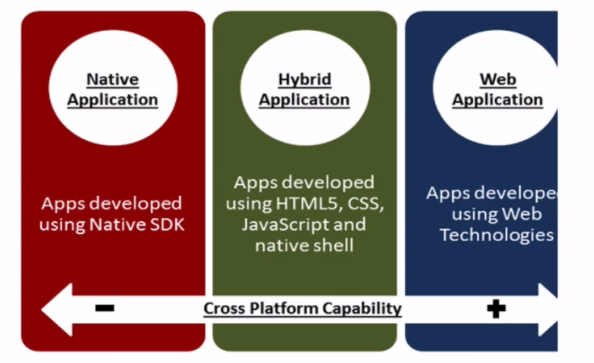

<h1>Referências</h1>

* ESPOSITO, Dino. Architecting Mobile Solutions for the Enterprise. Microsoft Press; 1 edition. 2012. 

* LEE, Valentino; SCHEIDER, Heather; SCHELL, Robbie. Aplicações Móveis - Arquitetura, Projeto e Desenvolvimento. MAKRON Books. Primeira edição. 2005

<h1>Arquitetura de aplicações multiplataforma para dispositivos móveis</h1>

* Melhorando a experiência do usuário no mundo digital.

* Melhorar a Experiência dos Usuários melhora os resultados de negócio.

* Experiência diferente de algo bonito.

* "A Experiência é o conditor de valor mais moderno e é uma influência maior no comportamento de compra no futuro. Uma boa experiência para o cliente estimula a fidelidade". Gartner.

* Para o usuário, uma grande experiência é:
    * Útil, Usável e Desejável.

* Para Organização, uma grande experiência é:
    * Eficiente, Efetiva e Lucrativa.

* Arquitetura de Software
    * Os fatores que compreendem o projeto no nível arquitetural e estão diretamente relacionados com a organização do sistema e, portante, afetam os atributos de qualidade (também chamados de requisitos não funcionais) como desempenho, portabilidade, confiabilidade, disponibilidade, entre outros.
    * O entendimento das arquiteturas permite aos engenheiros tomarem decisões sobre alternativas de projeto;
    * Uma especificação arquitetural é essencial para analisar e descrever propriedades de um sistema complexo, permitindo o engenheiro ter uma visão geral completa do sistema.
    * O conhecimento de notações para descrever arquiteturas permite engenheiros comunicarem novos projetos e deciões arquiteturais tomadas a outros membros da equipe.
    * A arquitetura define a estrutura do sistema, de modo consistente para implementações, já que está diretamente relacionada aos atributos de qualidade como confiabilidade e desempenho.
    * Dividir a arquitetura em várias camadas (4 ou 5) pode degradar o desempenho do sistema se houver um elevado grau de acoplamento entre os componentes.
    * No caso de dispositivos móveis o uso de múltiplas camadas que facilita a manutenção contribui para degradar o desempenho do sistema. Uma tática tem sido usada é reduzir o nível de acoplamento. Se adotarmos uma redução no nível de acoplamento dos componentes, teremos menor necessidade de comunicação entre si, o que resulta num melhor desempenho.
    * Observações importantes para definição do estilo arquitetural a ser usado em dispositivos móveis:
        - Idetificação de componentes: autenticação, cadastro etc;
        - Identificação de mecanismos de interação: Troca de mensagem entre componetnes;
    
* Estilos de arquitetura de software
    * Camadas - A arquitetura do sistema de software é organizada num conjunto de camadas, oferecendo maior flexibilidade e suporte a portabilidade. A identificação do nível de abstração nem sempre é evidente e perde-se desempenho à medida que o número de cmadas cresce. Exemplo desse estilo compreende os sistemas Web de múltiplas camadas que separa cliente, servidores de aplicações, servidores Web e outros clientes Web.
    * Objetos - Essa arquiteura combina dados com funções numa única entidade (objeto), facilitando a decomposição do problema, manutenção e reuso. É comum utilizar a arquitetura orientada a objetos em sistemas de informação como sistemas de consulta e empréstimos online de bilbiotecas de instituições de ensino que dispõem de componentes de cadastro de usuários e componentes de autenticação de usuários.
    * Invocação implícita - Diferentemente do estilo baseado em objetos, no qual um componente invoca outro diretamente por meio da passagem de mensagens, a invocação implícita requer que componentes interessados em receber ou divulgar eventos se registrem para receber ou enviar.
    * Eventos - Trata-se de um estilo no qual os componentes podem ser objetos ou processos e a interface define os eventos de entrada e saída permitidos. Conetores são implementados através do 'binding' evento-procedimento.
    * Um ponto muito importante aqui é não confundir o design patterns MVC que é projeto de software com desenvolvimento em camadas que é uma arquitetura de software. O modelo em camadas é uma arquitetura cliente-servidor e as camadas representam sistemas distintos é fundamental que a camadas de apresentação nunca acesse os dados diretamente, isto é, deve passar pela camadas intermediária ou pelas camadas intermediárias, pois pode haver n camadas.
    * Qual é a melhor para dispositivos móveis?
        * Não existe uma única, depende do modelo de desenvolvimento escolhido: Web App, App Híbrida ou App Nativa.
        * A mais comum é a de camadas.
        * Para melhorar a questão de performance, usa-se o binding e filtros de notificação.

* Desafios
    * Não se deve pensar em apenas replicar para smartphones e tablets os sistemas escritos para PC.
    * Sistemas inovadores, que explorem os recursos dos equipamentos:
        * Câmeras
        * Microfones
        * Giroscópios
        * Acelerômetros
        * GPS e diversos outros.
    * A multiplicidade de sensores destes equipamentos nos permite criar aplicativos que capturem e processem dados oriundos das mais diversas fontes. Isto por si só é um desafio, pois os diversos fabricantes configuram estes recursos de formas diferentes. Além disso, estes recursos podem gerar volumes de dados significativos como os vídeos.
    * Também as interfaces via reconhecimento de voz e som demandam novas maneiras de pensar os aplicativos. Os programas têm que explorar a capacidade do prórpio dispositivo, mas também precisam da imensa capacidade computacional que estará rodando em background, na nuvem.
    * Um exemplo: Um APp que grave um vídeo e o envie para processamento na núvem para que seja feito um reconhecimento de imagens que identifique determinado indivíduo ou produto neste vídeo e forneça características sobre ele.
    * Outra análise a ser feita para as aplicações móveis é o grau de computação que deverá ser feita offline, quando o acesso à rede não for possível. Pode acontecer do app ter que operar em determinados moentos em locais onde o sinal seja muito fraco ou mesmo sem possiblidade de conexõa à Internet. Na prática, podemos pensar em um modelo mais flexível que o cliente-servidor.
    * A grande capacidade computacional de um smartphone ou tablet permite que ele seja, em determinados momentos, cliente de servidores na núvem (client-cloud). A sincronização com a núvem deverá ser feita quando a conexão se restabelecer, de forma automática e transparente para o usuário do app.
    * Outro desafio: criar arquiteturas para apps híbridos, adotando HTML5 e código nativo para Android, iOS e Windows. Isto implica em conhecimentos não apenas de HTML5, mas também da tecnologia específica dos demais ambientes móveis, como dos diversos meios de comunicação destes dispositivos com a núvem.
    * Por exemplo, se o acesso for a partir da parcela nativa do app, deverá ser feita via API específica da plataforma. Se for a partir do código HTML5, será via Ajax (RESTful). Enfim, são decisões arquitetônicas que deverão ser tomadas antes de escrever o código.

* Resumo dos desafios
    * Conectividade
        * Largura de Banda Limitada.
        * Conectividade Ocasional
        * Protocolos eficientes
        * Caching local de informações
        * Sincronização ocasional.
    * Processamento
        * Algoritmos eficientes.
        * Processamento remoto.
        * APIs otimizadas para minizar consumo de bateria.
        * Quantidade limitada de Memória.
        * Baixo poder de processamento.
        * Fonte de energia finita (bateria).
        * Execute processamentos longos em background.
    * Usabilidade Desenvolvimento
        * Espaço de display
        * Prototipe a interface
        * Minimize a entrada de dados.
    * Segurança
        * Segurança de Comunicações
        * Informações confidenciais x Dispositivos Pouco Seguros.
        * Destruição Remota de Dados.

* Soluções para desenvolvimento
    * O uso de aplicativos móveis tem apresentado altas taxas de crescimento ao redor do mundo todo. Isso porque as pessoas estão cada vez mais conectadas aos seus tablets e smartphones, utilizando os aplicativos seja para se comunicar, para jogar ou para comprar produtos. Tendo em vista esse cenário, as empresas têm percebido a importância de desenvolver aplicativos móveis caso queiram estar presentes na vida das pessoas e atender às necessidades de seus clientes. Mas como escolher a melhor solução?

* Plataformas
    * No mercado existe uma explosão no número de smartphones e consequentemennte começa a haver uma necessidade de apoiar todo um conjunto de plataformas populares tais como iOS, Android, Windows Phone, etc.

* Vantagens
    * Diversidade de público.
    * Atingir o maior número de usuários;
    * Independência de dispositivos;
    * FOntes de receita diversificada;
    * Estratégia de venda diversificada.

* Problema no desenvolvimento
    * Falta de requisitos mínimos por dispositivos;
    * Dificuldade na elaboração das interfaces;
    * SDKs diferentes;
    * Dificuldade de encontrar profissionais capacitados nas tecnologias;
    * Custo de desenvolvimento;
    * Políticas diferentes em cada loja.

* Desenvolvimento
    * De modo a compreendermos a arquitetura multiplataformas temos que primeiro compreender os tipos de estratégias usadas no desenvolvimento de aplicações para dispositivos móveis.
        * Aplicação Nativa;
        * Aplicação Web.
        * Aplicação Híbrida.

* Aplicações Nativas
    * São aplicações desenvolvidas no SDK da plataforma.
    * Vantagens:
        * Alto desempenho;
        * Permite maior integração com o S.O;
        * Interface dentro do padrão do S.O;
        * Comunicação entre aplicações do S.O.;
        * Publicação na loja;
        * Captura de notificações;
        * Funciona de modo off-line;
        * Acesso aos dispositivos;
    * Desvantagens:
        * Código complexo de ser migrado;
        * Alto custo de desenvolvimento;
        * Tempo de desenvolvimento largo;
        * Manutenção com pouco reaproveitamento de código;

    * Exemplo de aplicativos nativos:
        * Redes sociais;
        * Jogos;
        * Aplicativos que usam componentes dos smartphone (Câmera, GPS, Mapas, Lista de Contato, Microfone e etc).

* Web App
    * São sites que possuem uma versão para dispositivos móveis. O "aplicativo" é, na verdade, um site com um layout otimizado para dispositivos com tela pequena e sem uso de mouse para interagir. Com o uso de JavaScript, um site desse tipo pode ter tanta interatividade quanto um aplicativo nativo.
    * Vantagens:
        * Multiplataforma;
        * Tecnologias já conhecidas;
        * Fácil manutenção para todos os sistemas;
        * Custo de produção menor;
        * Tempo de produção baixo;
    * Desvantagens:
        * Baixa integração com o Sistema Operacional; - O que menos conversa com o S.O.
        * Interface fora do padrão da plataforma;
        * Desempenho baixo;
        * Atrelada as limitações dos navegadores móveis;
        * Alto consumo de dados;
        * Não funciona sem conexão de dados;
        * Não está presente nas lojas;
        * Não acessa os periféricos dos dispositivos.
    * BOM PARA MVPS
    * BOM PARA PRIMEIRAS VERSÕES DE UM PROJETO
    

* Aplicações Híbridas
    * Em uma arquitetura multiplataforma são utilizados híbridos, a aplicação pode ser desenvolvida usando tecnologias Web tais como HTML5, Javascript e CSS mas que rodam dentro da "Shell" nativo da plataforma Mobile, ou podem ser gerados códigos nativos traduzidos pela ferramenta. Graças à sofisticação cada vez maior de ferramentas multiplataforma, o desempenho está melhorado drasticamente.
    * Realmente um app instalado
    * Só que quando eu abro o app pode ser um web view que acessa recursos javascript.
    * Vantagens:
        * Permite comunicação com hardware via plugins ou tradução para código nativo.
        * O código pode ser utilizado para várias plataformas;
        * Usa somente uma tecnologia para exportar para vários S.O.s;
        * Integração com a UI;
        * Funciona de modo off-line;
        * Aumenta o número de usuários a um custo baixo
        * Aproveita o processamento do dispositivo do cliente.
    * Desvantagens:
        * Não permite alta integração com o S.O para acesso a aplicações;
        * Os códigos são padronizados para as funções que existem em todas as plataformas;
        * Possui uma performance média.
        

* Cross Platform Architecture

* Algumas ferramentas para desenvolvimento móvel
    * PhoneGap
    * Sench Touch - JavaScript, Html5, CSS
    * Xamarin
    * AppFactory - JS, HTML5, CSS
    * Intel XDK
    * Titanium
    * Cordova
    * Ionic
    * App Studio

<h1>Exercícios</h1>

* 1 - Como pode ser conceituada uma camada arquitetural em um sistema?
    * R: É um nível de abstração utilizado para organizar, dar flexibilidade e suporte. A arquitetura do sistema de software é organizada num conjunto de camadas, oferecendo maior flexibilidade e suporte a portabilidade. A identificação do nível de abstração nem sempre é evidente e perde-se desempenho à medida que o número de camadas cresce. Exemplo desse estilo compreende os sistemas Web de múltiplas camadas que separa cliente, servidores de aplicação, servidores Web e outros clientes Web.

* 2 - Qual item melhor reflete um desafio de conectividade em um sistema?
    * R:  Sincronização ocasional. Um grande desafio que envolve a conectividade é que sistemas de computação móvel sofrem de sincronização ocasional, visto que não é 100% do tempo que o device está em uma rede de dados. Esse desafio faz com que desenvolvedores criem processos para tratar a ida esporádica a internet em seus apps.

* 3 - Qual item melhor reflete um problema que deve ser tratado no desenvolvimento de um app móvel?
    * R: Falta de requisitos mínimos por dispositivos. Os principais problemas no desenvolvimento de aplicações móveis são: Falta de requisitos mínimos por dispositivos; Dificuldade na elaboração das interfaces; SDKs diferentes; Dificuldade de encontrar profissionais capacitados nas tecnologias; Custo de desenvolvimento; Politicas diferentes em cada loja;
    * Existe na internet muita documentação e exemplo para construção de apps, cada plataforma oferece uma IDE especifica para o desenvolvimento mas cada desenvolvedor ainda pode optar por outra de sua preferencia. (exceto o iOS com o XCODE). Nenhuma plataforma nativa compartilha SDK’s, somente as híbridas.

* 4 - Sobre a arquitetura de aplicações nativas, é CORRETO afirmar?
    * R: Permite uma maior integração com o S.O. As principais vantagens do desenvolvimento de aplicações nativas são: Alto desempenho; Permite maior integração com o S.O.;Interface dentro do padrão do S.O.;Comunicação entre aplicações do S.O.;Publicação na loja; Captura de notificações;Funciona de modo off-line; Acesso aos dispositivos;

* 5 - Sobre a arquitetura de aplicações web, é INCORRETO afirmar?
    * R:Têm um alto custo e tempo de desenvolvimento. As principais vantagens do desenvolvimento de aplicações web são: Multiplatafoma; Tecnologias já conhecidas; Fácil manutenção para todos os sistemas; Custo de produção menor; Tempo de produção baixo.

* 6 - Sobre a arquitetura de aplicações hibridas, pode ser considerada uma desvantagem:
    * R: Os códigos são padronizados para as funções que existem em todas as plataformas. As principais desvantagens do desenvolvimento de aplicações híbridas são: Não permite alta integração com o S.O. para acesso a aplicações; Os códigos são padronizados para as funções que existem em todas as plataformas; Possui uma performance média.

* 7 - Sobre a arquitetura de aplicações hibridas, pode ser considerada uma vantagem:
    R: Usa somente uma tecnologia para exportar para vários S.O.s; As principais vantagens do desenvolvimento de aplicações híbridas são: Permite comunicação com hardware via plugins ou tradução para código nativo; O código pode ser utilizado para várias plataformas; Usa somente uma tecnologia para exportar para vários S.O.s; Integração com a UI; Funciona de modo off-line;