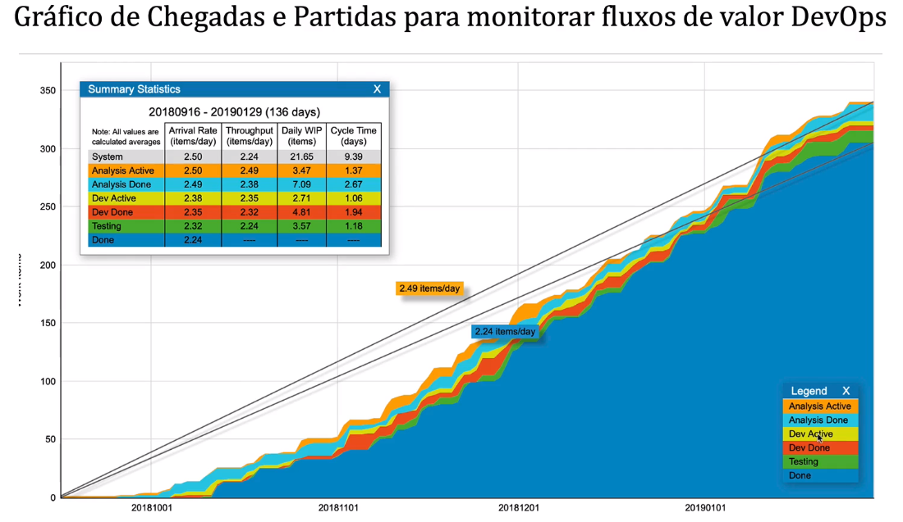
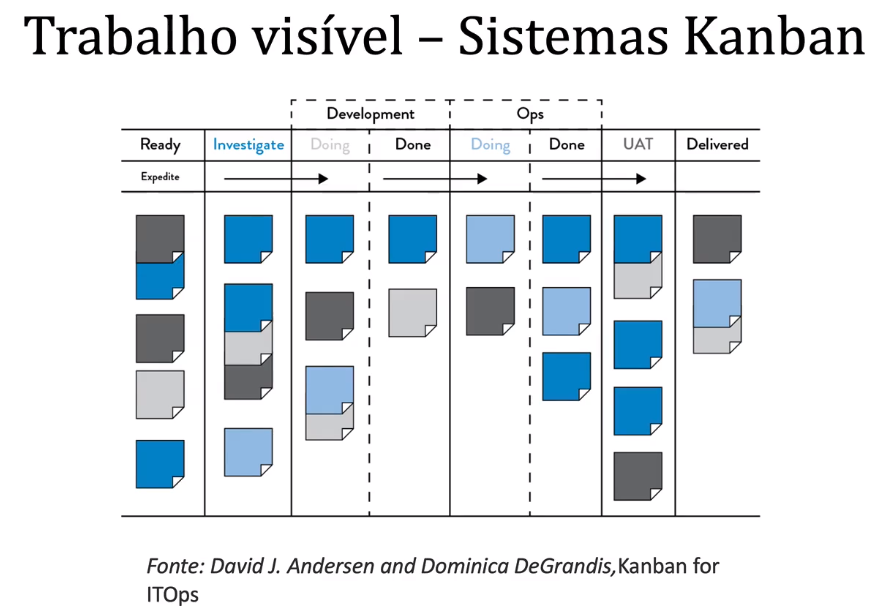
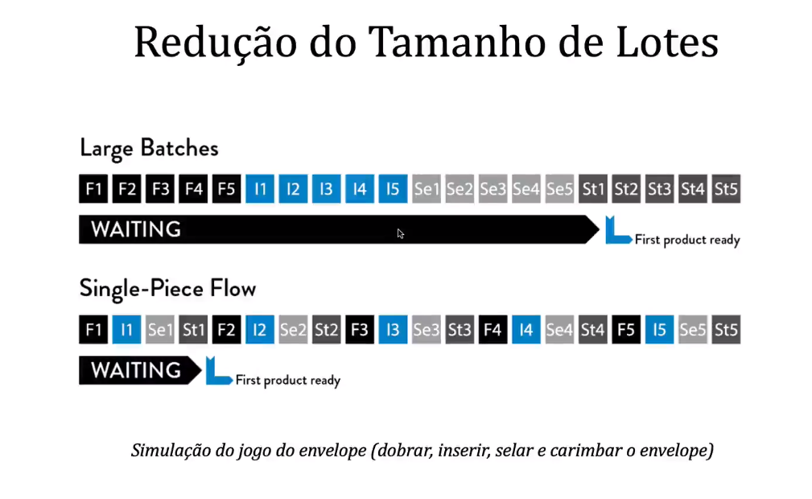
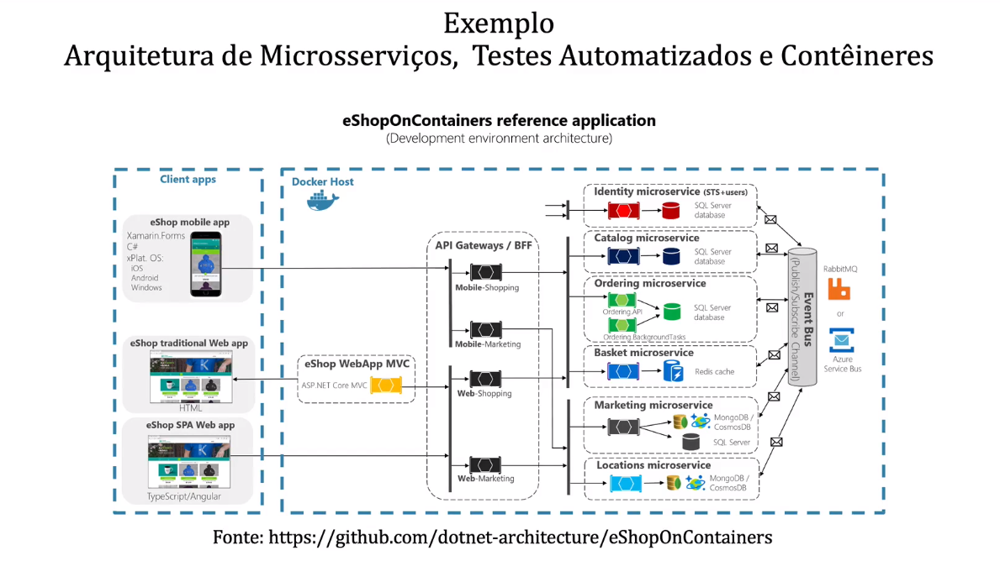
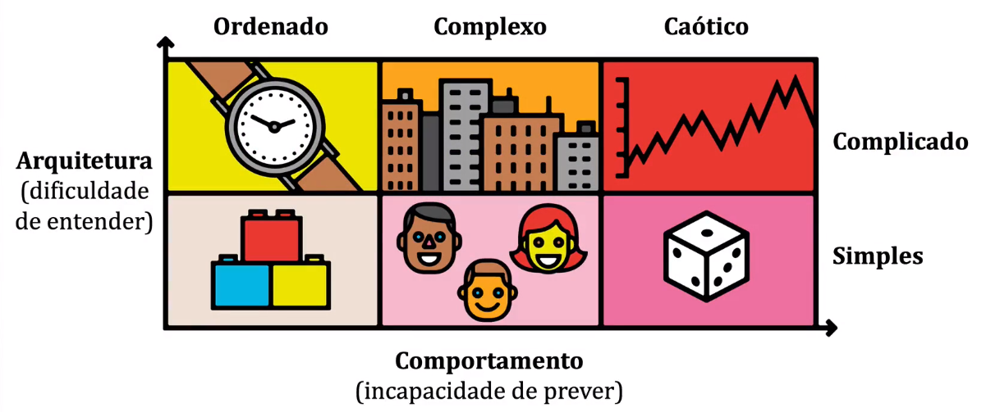
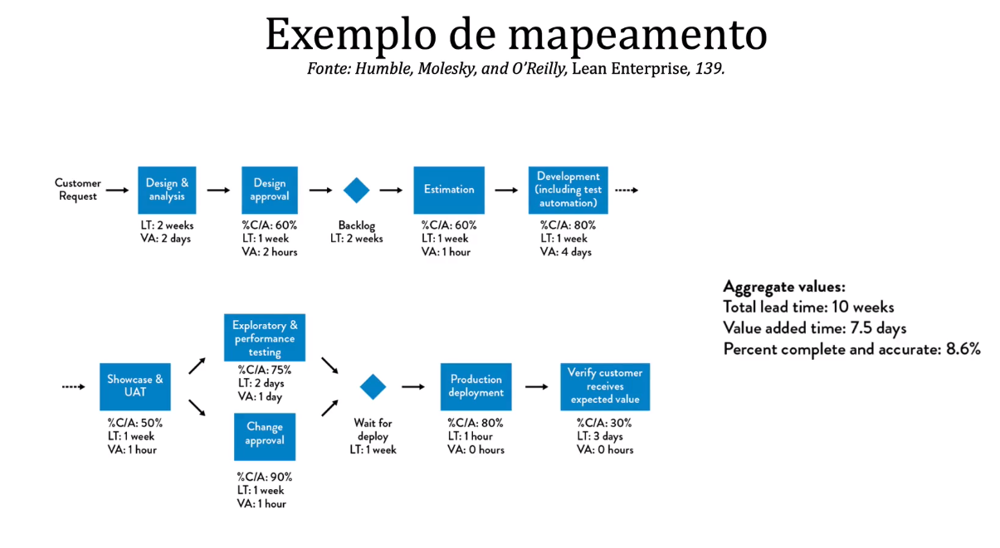
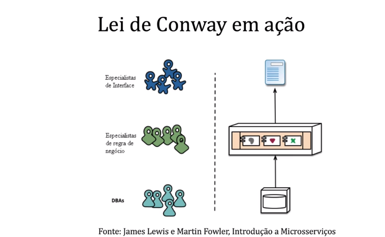

<h1>Referências</h1>

* Sharma, S., & Coyne, B. (2013). DevOps for dummies. Limited IBM Edition’book.

* Kim, G., Behr, K., & Spafford, K. (2014). The phoenix project: A novel about IT, DevOps, and helping your business win. IT Revolution.

* Humble, J., & Farley, D. (2010). Continuous Delivery: Reliable Software Releases through Build, Test, and Deployment Automation (Adobe Reader). Pearson Education.

* Mendes, Marco - Blog sobre DevOps - https://marco-mendes.com/devops/

<h1>Conteúdo do Curso</h1>

* O conteúdo da disciplina de DevOps
    * O que é o DevOps?
    * Os três caminhos DevOps - Fluxo, Feedback e Experimentação
    * Escolha do Fluxo de Valor para Iniciar o DevOps
    * Automação de Builds.
    * Automação de Testes.
    * Integração Contínua.
    * Automação de Releases.
    * Telemetria de Negócio.
    * Engenharia do Caos.
    * DevSecOps - Práticas de Segurança integrada ao pipeline.
    * Desenho de pipelines DevOps - Pipelines são fluxos automatizados que reduzem lacunas entre áreas e reduzem o trabalho manual.
    * Arquiteturas para Entrega Contínua.

<h1>Os caminhos do DevOps</h1>

* Os três caminhos do DevOps

* O primeiro caminho do DevOps
    * Fluxo
    * Unidades que você entrega por unidade de tempo
    * O primeiro caminho permite um fluxo rápido de trabalho da esquerda para a direita de Desenvolvimento para Operações para o cliente.
    * Dev -> Ops
    * Para maximizar o fluxo, precisamos tornar o trabalho visível, reduzir o tamanho dos lotes e intervalos de trabalho, aumentar a qualidade evitando que os defeitos sejam passados para os centros de trabalho mais à direita e otimizar constantemente as metas globais.
    * As práticas resultantes incluem processos contínuos de construção, integração, teste e implantaçao; criando ambientes sob demanda; limitando o trabalho em progresso (WIP); e construir sistemas e organizações que sejam seguros para mudar.

* O segundo caminho do DevOPs
    * Feedback
    * O segundo caminho permite o fluxo rápido e constante de feedback da direita para a esquerda em todos os estágios do fluxo de valor.
    * Dev -> Ops -> Dev ...
    * Isso exige que ampliquemos o feedback para evitar que os problemas aconteçam novamente ou para permitir uma detecção e recuperação mais rápidas. Ao fazer isso, criamos qualidade na origem e geramos ou incorporamos conhecimento onde é necessário - isso nos permite criar sistemas de trabalho cada vez mais seguros, nos quais os problemas são encontrados e resolvidos muito antes de ocorrer uma falha catastrófica.

* O terceiro caminho do DevOps
    * Experimentação
    * O terceiro caminho possibilita a criação de uma cultura generativa de alta confiança que apoie uma abordagem dinâmica, disciplinada e científica à experimentação e tomada de riscos, facilitando a criação de aprendizado organizacional, tanto de nossos sucessos como fracassos.
    * Além disso, ao encurtar e aompliar continuamente nossos ciclos de feedback, criamos sistemas de trabalho cada vez mais seguros e temos mais condições de assumir riscos e realizar experimentos que nos ajudam a aprender mais rápido do que nossos concorrentes e a ganhar no mercado.

<h1>Sistemas de Fluxos em DevOps</h1>

* Um fluxo de valor na TI
    * Desenvolvimento -> Teste Automatizado -> Teste Exploratório -> Implatanção em Produção.

* Fluxo de Valor
    * A sequência de atividades que uma organização realiza para cumprir uma solicitação do cliente.

* Tempos de ciclo em um fluxo de valor
    * Desenolvimento (4 horas) -> Teste Automatizado (10 minutos) -> Teste Exploratório (1 hora) -> Implatação em Produção (30min)

* Gráfico de Chegadas e Partidas para monitorar fluxos de valor DevOps

<h1>O primeiro caminho do DevOps</h1>

* A palavra DevOps veio apartir de um caso da empresa flickr
    * Foi comentado como ela conseguiu criar um fluxo para fazer 10 implantações por dia (2009).

* Para maximizar o fluxo, precisamos tornar o trabalho visível, reduzir o tamanho dos lotes e os intervalos de trabalho, aumentar a qualidade evitando que os defeitos sejam passados para os centros de trabalho mais à direita e otimizar constantemente as metas globais.

* Trabalho visível - Sistemas Kanban

* O trabalho visível na agenda DevOps.
* Queremos saber o que priorizar primeiro.
* Colocando todo o trabalho para cada centro de trabalho em filas e tornando-o visível, todos os stakeholders podem priorizar mais facilmente o trabalho no contexto de metas globais. Isso permite que cada centro de trabalho para tarefa única no trabalho de prioridade mais alta até que ele seja concluído, aumentando a taxa de transferência.

* Limitação do Trabalho em Progresso
    * Dominica DeGrandis, um dos principais especilistas em usar Kanbans em fluxos de valor DevOps, observa que "controlar o tamanho da fila (WIP) é uma ferramenta de gerenciamento extremamente poderosa, pois é um dos poucos indicadores principais do tempo total de entrega".
    * Limitar o WIP também torna mais fácil ver problemas que impedem a conclusão do trabalho. Por exemplo, quando limitamos o WIP, achamos que talvez não tenhamos nada a fazer porque estamos esperando por outra pessoa. Embora possa ser tentador para iniciar um novo trabalho (ou seja, "é melhor estar fazendo algo do que nada"), uma ação muito melhor seria descobrir o que está causando o atraso e ajudar a corrigir esse problema. Muitas vezes, a multitarefa incorreta ocorre quando as pessoas são atribuiídas a vários projetos, resultando em muitos problemas de priorização.

* Desafio: Porque o WIP importa no mundo DevOPs
    * Minha esposa e eu temos um acordo. O lado direito do bar é meu, o lado esquerdo é dela. Eu só bebo uísque. Meu lado do bar comporta 12 garrafas de uísque. Sempre que uma garrafa termina, eu a removo do bar. Então eu abro um novo e adiciono no bar. Meu bar é um sistema estável: a taxa na qual as garrafas de uísque entram no bar é a taxa na qual elas saem.
    * O número de garrafas de uísque no meu bar é constante: 12 garrafas. Por ano, eu termino uma média de 6 garrafas de uísque.
    * Então, qual é o tempo médio que uma garrafa fica no meu bar?
    * R: 2 anos e não 2 meses.

* Redução do Tamanho de Lotes
    * O equivalente ao fluxo de peça única (lotes pequenos) no fluxo de valor de tecnologia é realizado com a implantação contínua, onde cada alteração comprometida com o controle de versão é integrada, testada e implementada na produção imediatamente.
    

* O problema do número de repasses (handoffs)
    * No fluxo de valor de tecnologia, sempre que temos longos tempos de implatanação medidos em meses, muitas vezes é porque existem centenas (ou até milhares) de que operações necessárias para mover nosso código do controle de versão para o ambiente de produção. Para transmitir código por meio do fluxo de valor, vários departamentos precisam trabalhar em uma variedade de tarefas, incluindo testes funcionais, testes de integração, criação de ambientes, administração de servidores, administração de armazenamento, rede, balanceamento de carga e segurança de informações.

* A abordagem DevOps para reduzir o número de repasses (handoffs)
    * Para mitigar esses tipos de problemas, nos esforçamos para reduzir o número de handoffs, seja automatizando partes significativas do trabalho ou reorganizando equipes para que eles possam fornecer valor para o próprio cliente, em vez de que ser constantemente dependente de outros. Como resultado, aumentamos o fluxo reduzindo a quantidade de tempo que que o nosso trabalho gasta aguardando na fila, bem como a quantidade de tempo gasto com coisas que não tem valor agregado.

<h1>Instrumentos Técnicos do primeiro caminho do DevOps</h1>

* Para maximizar o fluxo, precisamos tornar o trabalho visível, reduzir o tamanho dos lotes e os intervalos de trabalho, aumentar a qualidade evitando que os defeitos sejam passados para o centros de trabalho mais à direita e otimizar constantemente as metas globais.

* Criação de ambientes
    * Não podemos alcançar implatanações sob demanda se sempre tivermos que esperar semanas ou meses para ambientes de produção ou teste. A contramedida é criar ambientes sob demanda e totalmente autossuficientes, de modo que eles estão sempre disponíveis quando precisamos deles. (docker, kubernetes)

* Implatanção de Código
    * Não podemos alcançar implantações demanda se cada uma de nossas implatanações de código de produção levar semanas ou meses para executar.
    * A contramedida é automatizar nossas implamntações, tanto quanto possível, com o objetivo de ser completamente automatizado para que eles possam ser feitos self-service por qualquer desenvolvedor. (Heroku, Azure DevOps, puppet).

* Configuração e Execução de Testes
    * Não podemos alcançar implantações sob demanda se cada implantação de código exigir duas semanas para configurar nossos ambientes de teste e conjuntos de dados, e outras quatro semanas para executar manualmente todos os nossos testes de regressão.
    * A contramedida é automatizar nossos testes para que possamos executar implantações com segurança e paralelizá-las para que a taxa de teste possa acompanhar nossa taxa de desenvolvimento de código. (JUnit 5, specflow, Jasmine, SoapUI)

* Acoplamento de Arquiteturas
    * Nós não podemos alncaçar implantações sob demanda se a arquitetura excessivamente acoplada significa que cada vez que queremos fazer uma mudança de código, temos que enviar nossos devs para dezenas de reuniões a fim de obter permissão para fazer as nossas alterações.
    * A nossa contramedida é criar uma arquitetura mais ffracamente acoplada para que as mudanças possam ser feitas com segurança e com mais autonomia, aumentando produtividade do desenvolvedor. (API, Microsserviços).

<h1>Primeiro caminho do DevOps - Exemplo</h1>

<h1>O segundo caminho do DevOps</h1>

* O segundo caminho permite o fluxo rápido e constante de feedback da direita para a esquerda em todos os estágios do fluxo de valor.

* Em qual quadro os sistemas de software normalmente estão posicionados?

* Ambinetes de TI estão normalmente dentro de sistemas complexos
    * Na tecnologia da informação, o nosso trabalho acontece quase inteiramente dentro de sistemas complexos, com um alto risco de consequências inesperadas e eventualmente catastróficas.

* Em busca de ambientes mais seguros
    * Nós fazemos o nosso sistema de trabalho mais seguro através da criação rápida e frequente de um flxuo de informação de alta qualidade em todo o nosso fluxo de valor e nossa organização, que inclui feedback e feedfoward.
    * Isso nos permite detectar e remediar problemas enquato eles são menores, mais baratos e mais fáceis de corrigir; Evitar problemas antes de causarem catástrofes; e criar aprendizado organizacional que integramos no trabalho futuro.
    * E quando correm falhas e acidentes, nós os tratamos como oportunidades de aprendizado, ao invés de punição e culpa.

* Laços de Feedback
    * No excelente livro A QUinta Disciplina o autor Peter SEnge descreve loops de feedback como uma parte crítica das organizações de aprendizagem e do pensamento sistêmico.
    * Os loops de feedback e feedforward causam componentes dentro de um sistema para reforçar ou neutralizar uns aos outros.

* O aprendizado com o sistema Toyota de Produção A corda Andon
    * Quando o cabo Andon é puxado por um trabalho na Toyota, o líder da equipe supervisionando no centro de trabalho especificado tem 50 segundos para resolver o problema. Se o problema não tiver sido resolveido de 50 segundos, o veículo parcialmente montado atravessará uma linha fisicamente desenhada no chão e a linha de ontagem será completamente interrompida.
    * Depois de 60 anos, você imagina quantas vezes na média a corda Andon é puxada por dia na Toyota?

* Ausência de feedbacks em sistemas de TI
    * No fluxo do valor da tecnologia, nós frequentemente temos resultados ruins por causa da ausência de feedback rápido.
    * Por exemplo, em um projeto de software em cascata, podemos desenvolver código por um ano inteiro e não obter feedback sobre a qualidade até começarmos a fase de testes - ou pior, quando lançamos nosso software para os clientes.
    * Quando o feedback é atrasado e infrequente, é demasiado lento para impedir resultados indesejáveis.

* Caso real de sistemas de feedback na TI
    * 5000 testes de unidade são executados 20 vezes por dia por um pipeline de integração contínua em um portal de venda de matérias de construção em uma grande empresa brasileira (JUNit 5, Jenkins, GIT).

<h1>O terceiro caminho do DevOps</h1>

* O terceiro caminho possibilita a criação de uma cultura generativa de alta confiança que apoie uma abordagem dinâmica, disciplinada e científica à experimentação e tomada de riscos, facilitando a criação de aprendizado organizacional, tanto de nossos sucessos como fracassos.

* Topologia de Organizações
    * Ron Westrum foi um dos primeiros a observar a importância da cultura organizacional sobre segurança e desempenho.
    * Ele observou que, nas organizações de saúde, a presença de culturas "generativas" foi um dos principais preditores da segurança do paciente.
    * As organizações patológicas são caracterizadas por grandes quantidades de medo e ameaça. As pessoas muitas vezes escondem informações por razões políticas ou as distorcem para se tornarem mehlores. A falha é escondida frequentemente.
    * As organizações burocráticas são caracterizadas por regras e processos, muitas vezes para ajudar os departamentos individuais a manter a sua "grama". O fracasso é tratado através de um sistema de julgamento, resultando em punição ou justiçamento.
    * As organizações generativas são caracterizadas por buscar ativamente e compartilhar informações para melhor permitir que a orngaização atinja sua missão. As responsabilidades são compartilhadas em todo o fluxo de valor e a falaha resulta em reflexão em inquérito genuíno.

* Organizações patológicas e burocráticas na TI.
    * No flxuo de valor da TI, quando evitamos corrigir nossos problemas, baseando-nos em jeitinhos, nossos problemas e dívidas técnicas se acumulam até que tudo o que estamos fazendo é executar puxadinhos, tentando evitar desastres, sem tempo algum para fazer trabalho produto.
    * É por isso que Mike Orzen, autor do livro Lean IT, observou, "ainda mais importante do que o trabalho diário é a melhoria do trabalho diário".
    * Uma cultura de alta ciança geradora, é preditor de maior desempenho organizacional em fluxos de valor de TI.

* Caso Real: Alcoa
    * COnsidere o exemplo a seguir que melhorou a segurança no trabalho na ALcoa, um fabricante de alumínio com quase 8 bilhoões em receita em 1987. A fabricação de alumínio exige calor extremamente elevado, pressões elevadas e produtos químicos corrosivos. Em 1987, a Alcoa teve um histórico de segurança assustador, com 2% dos 90 mil trabalhadores feridos a cada ano, que são sete lesões por dia.
    * Quando Paul o'Neill começou como CEO, seu primeiro objetivo era ter zero ferimentos aos empregados, contratantes e visitantes.
    * O'Neill quis ser notificado em até 25 horas sobre qualquer novo acidente. Não para punir, mas para assegurar e promover que os aprendizagens estavam sendo gerados e incorporados para criar um lcoal de trabalho mais seguro.
    * Ao longo de dez anos, a Alcoa reduzir a taxa de ferimentos em 95%.

* Organizações generativas em TI
    * No fluxo de valor da TI, devemos criar mecanismos semelhantes para criar conhecimento global.
    * Exemplos incluem:
        * Fazer que todas as nossas lições aprendidas sejam pesquisáveis por equipes tentando resolver problemas semelhantes.
        * Criar repositórios de código fonte compartilhados que abrangem o organização inteira, onde o código compartilhado, as bilbiotecas e as configurações possa incorporar o melhor conhecimento coletivo de toda a organização e que podem ser facilmente utlizados.
    * Todos esses mecanismos ajudam a converter a expertise individual em artefatos que o resto da organização pode usar.

* Netflix Simian Army - Cria falhas no sistema para ver o quão o sistema suporta.

* Exemplo de Ferramenta de Aprendizagem Organizacional
    * Gremlin
    * Break things on purpose.
    * DOwntime is expensive and damages customer trust. Gremlin's Failure as a Service finds weaknesses in your system before they cause problems.

* Engenharia do Caos como exemplo do Terceiro Caminho DevOps
    * A Engenharia do Caos é a disciplina de realizar experimentos sobre sistemas distribuídos com o intuito de construir confiança sobre a capacidade de um sistema distribuído suportar condições adversas em produção.

<h1>Pontos de partida em uma iniciativa DevOps</h1>

* A escolha de um fluxo de valor para a transformação DevOps merece considração cuidadosa.
* Não só o fluxo de valor que escolhemos ditam a dificuldade de nossa transofrmação, mas também dita quem estará envolvido na transformação.
* Isso afetará a forma como precisamos organizar em equipes e como podemos melhor habilitar as equipes e os indivíduos nela.

<h1>Projetos DevOps Verdes e Marrons</h1>

* Marrons - Sistemas Legados.
* Verde - Sistemas novos.

* DevOps para projetos verdes e marrons
    * Embora muito acreditem que DevOps é principalmente para projetos verdes, o DevOps tem sido usado para transformar com sucesso projetos marrons de todos os tipos.
    * Mais de 60% das histórias de transformação compartilhadas no DevOps Enterprise SUmmit em 2014 foram para projetos marrons. Nesses casos, houve uma grande lacuna de desempenho entre o que o cliente precisava e o que a organização estava entregando atualmente, e as transofrmações do DevOps criaram um tremendo benefícios comercial.

* Aprendizado da indústria
    * Um dos achados do 2015 estado do relatório DevOps validado que a idade da aplicação não foi um preditor significativo de desempenho; em vez disso, o desempenho rpevisto era se o aplicativo foi arquitetado (ou poderia ser re-arquitetado) para testabilidade e implantabilidade.

<h1>A escolha das pessoas corretas em iniciativas DevOps</h1>

* Não comece com o time mais conservador e não faça big bangs
    * Especialmente nos estágios iniciais, não vamos gastar muito tempo tentando converter os grupos mais conservadores. EM vez disso, vamos focar a nossa energia na criação de sucessos com grupo com menor aversão ao risco e construir a nossa base de lá.
    * Mesmo que tenhamos os mais altos níveis de patrocínio executivo, evitamos a abordagem Big Bang, escolhendo em vez de focar nossos esforços em algumas áreas da organização, garantindo que essas iniciativas sejam bem-sucedidas e expandindo de lá.

* Ache os inovadores e os primeiros adeptos
    * No começo, nós focalizamos nossos esforços em equipes que realmente querem ajudar. Estes são nossos companheiros de viagem que são os primeiros a se voluntariar para iniciar uma jornada DevOps.
    * No cenário ideal, estas são também as pessoas que são respeitadas e têm um alto grau de influência sobre o resto da organização, dando a nossa inciiativa mais dredibilidade.

* Construa massa crítica e maioria silenciosa
    * Na próxima fase, buscamos expandir as práticas de DevOps para mais equipes e fluxos de valor com o objetivo de criar uma base estável de suporte.
    * Ao trabalhar com equipes que são receptivas às nossas ideias, mesmo que não sejam os grupos mais visíveis ou influentes, expandimos a nossa coligação para gerar mais sucessos, criando um "efeito de manada" que aumenta ainda mais a nossa influência.

* Identifique os sabotadores
    * Os sabotadores são o alto perfil, detratores influentes que são mais propensos a resistir (e talvez até mesmo sabotar) nossos esforços.
    * Abordamos este grupo apenas depois de alcançarmos uma maioria silenciosa, quando estabelecemos sucessos suficientes para proteger com sucesso a nossa iniciativa.

<h1>Mapeamento do custo do trabalho no fluxo de valor da sua TI</h1>

* Todo o trabalho realizado na sua TI pode ser descrito através de um fluxo de valor. Identificar o trabalho e os envolvidos nesses fluxos de valor é fundamental para buscar melhorar o sistema de trabalho.

* Use métricas para propor melhorias com DevOps
    * Utilizamos as métricas do nosso mapa de fluxo de valor para orientar os nossos esforços de melhoria. No exemplo Nordstrom, eles se concentraram nas taxas de baixo % C/a no formulário de solicitação apresentado pelos gerentes de departamento, devido à ausência de números de funcionários.
    * Em outros casos, poderia ser longos prazos de entrega ou taxas ruins % C/A ao fornecer ambientes de teste configurados corretamente para equipes de desenvolvimento, ou pode ser o tempo de execução ao longo exigido para executar e passar o teste de regressão antes de cada versão de software.
    * Uma vez que identificamos a métrica que queremos melhorar, devemos realizar o próximo nível de observações e medições para entender melhor o problema e, em seguida, construir um mapa de fluxo de valor idealizado, futuro, que serve como uma condição de destino para alcançar.

<h1>Desenho da sua organização e a sua arquitetura com a Lei de Conway</h1>

* "Qualquer empresa que projeta um sistema (definido em termos gerais) irá produzir um produto0 cuja estrutura é uma cópia da estrutura de comunicação da organização." Melvin Conway, 1967

* A Lei de Conway para o DevOps
    * Em outras palavras, a forma como organizamos nossas equipes tem um efeito poderoso no software que produzimos, bem como nos resultaos arquitetônicos e de produção resultantes. A fim de obter um fluxo rápido de trabalho de desenvolvimetno em operações, com alta qualidade e grandes resultados dos clientes, temos de organizar as nossas equipas e nosso trabalho para que a lei de Conway trabalha a nosso favor.
    * Se mal feita, a lei de Conway impedirá que as equipes trabalhem de forma segura e independente; em vez disso, eles serão firmemente acoplados, todos esperando uns aos outros para o trabalho a ser feito, com até mesmo pequenas mudanças criando potencialmente global, consequências catastróficas.

* Arquétipos Organizacionais e o impacto para DevOps
    * As orngaizações funcionais - Orientadas para a especialização do conhecimento, divisão do trabalho ou reduzindo do custo. Essas organizações centralizam o esxpertise, o que ajuda a possibilitar o crescimento da carreira e o desenvolvimento de habilidades, e muitas vezes têm estruturas organizacionais hierárquicas altas. Este tem sido o método predominante de organização para operações (ou seja, administradores de servidor, administradores de rede, administradores de banco de dados, e assim por diante são todos organizados em grupos separados) e construção de produtos (desenvolvedores e QAs).
    * As organizações orientadas para o mercado - Otimizam para responder rapidamente às necessidades do cliente. Essas organizações tendem a ser planas, compostas por várias disciplinas multifuncionais (por exemplo, marketing, engenharia, etc), que muitas vezes levam a possíveis redundâncias em toda a organização. E asssim que muitas organizações proeminentes que adota o DevOps operam - em exemplo extremos, como na Amazon ou Netflix, cada equipe de serviço é simultaneamente responsável pela entrega de recursos e suporte a serviços.
    * Organizações matriciais - Tentam combinar a orientação funcional e de meccado. No entanto, como muitos que trabalham ou gerenciam organizaçõess matriciais observam, as organizações matriciais geralmente resultam em estruturas organizacionais complicadas, como contribuintes individuais relatando a dois gerentes ou mais, e as vezes alcançando nenhum dos objetivos do orientação funcional ou de mercado.

<h1>Melhorando as COmpetencias dos TImes em Iniciativas DevOps</h1>

* Colocar mais ênfases em produtos que projetos facilita iniciativas DevOps.
    * A organização de times que criam e sustentam produtos, ao invés de uma lógica centrada em projetos, facilita a adoção de práticas, melhoria nos sistemas de trabalho, redução dos tempos de ciclo e melhorias no retrabalho.
* Carreiras em T (ou E)
    * Forme "especialistas em generalização" que se aprofundam em uma área, mas também se desdobram em outras áreas.
* Mantenha equipes pequenas
    * Os membros da equipe se tornam menos produtivos à medida que o tamanho do grupo aumenta.
    * Se possível, mantenha as equipes pequenas, mas suficientes para cobrir um fluxo de valor.
        * Jacob Morgan, The Future of WOrk