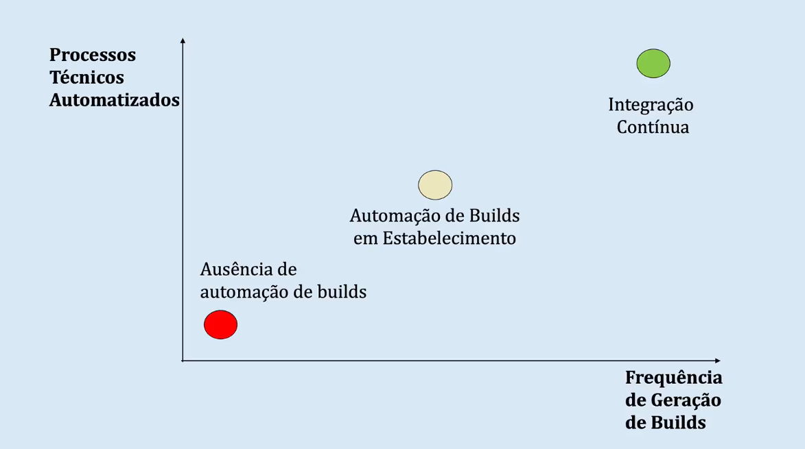
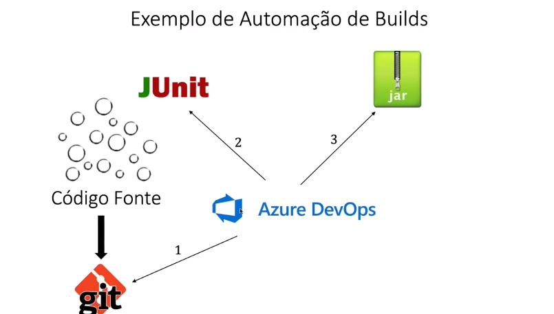
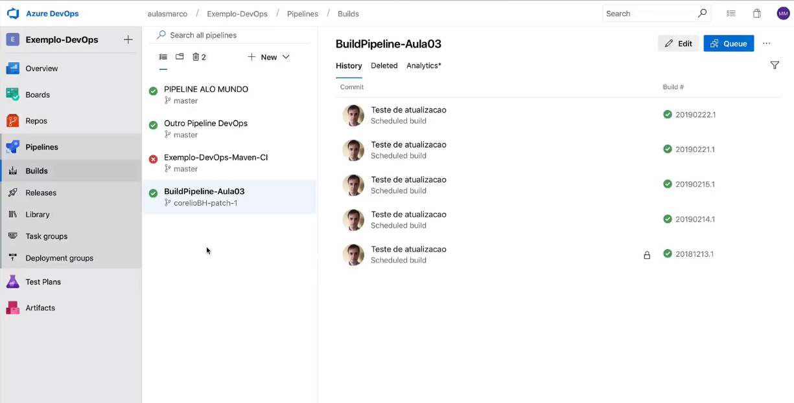
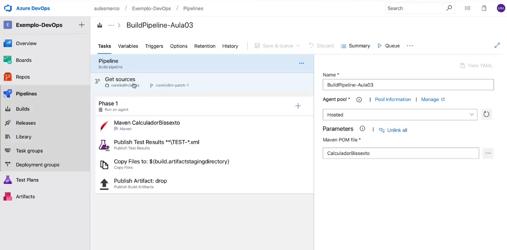
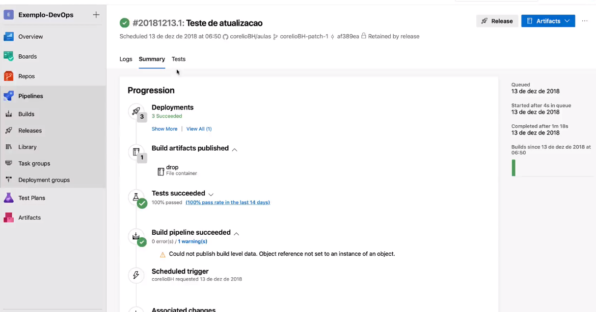
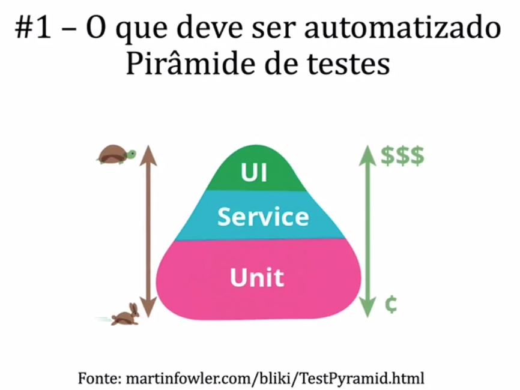
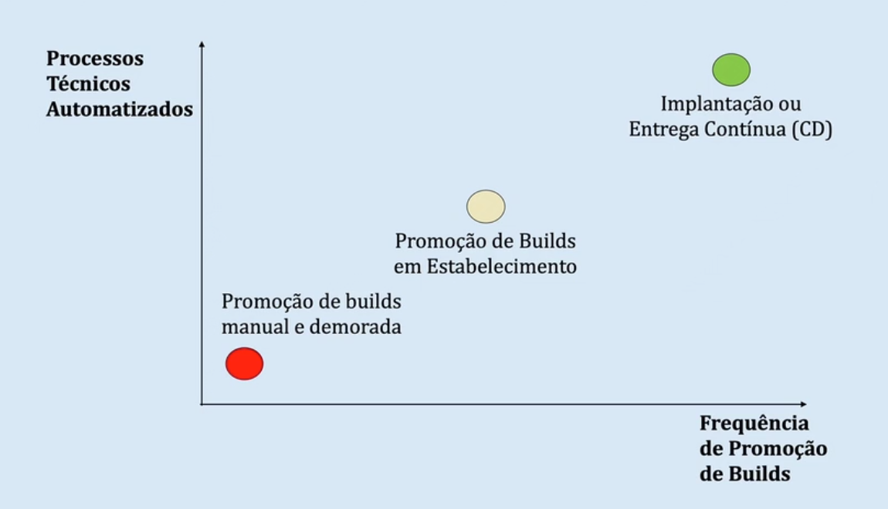
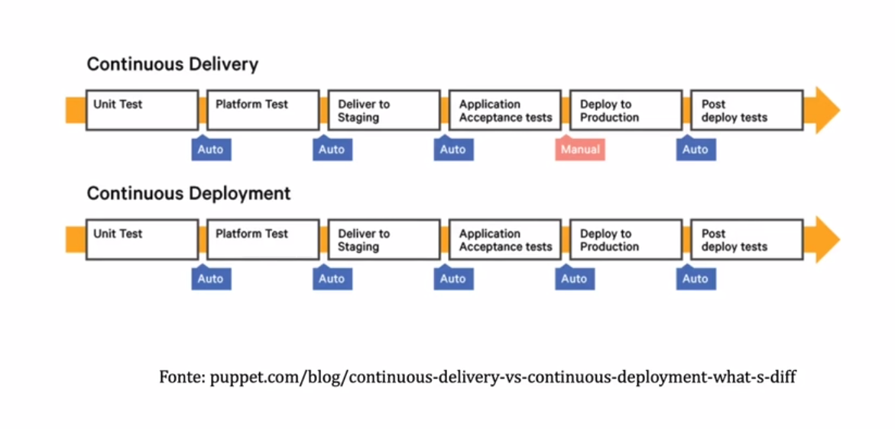

<h1>Referências</h1>

* Sharma, S., & Coyne, B. (2013). DevOps for dummies. Limited IBM Edition’book.

* Kim, G., Behr, K., & Spafford, K. (2014). The phoenix project: A novel about IT, DevOps, and helping your business win. IT Revolution.

* Humble, J., & Farley, D. (2010). Continuous Delivery: Reliable Software Releases through Build, Test, and Deployment Automation (Adobe Reader). Pearson Education.

* Mendes, Marco - Blog sobre DevOps - https://marco-mendes.com/devops/

<h1>Pipelinas e Linhas de Montagem DevOps</h1>

* Pipelines DevOps
    * Tubulação - Tradução para Pipeline
    * Completar parte com fluidez
    * Mecanismos automatizados para reduzir o tempo de entrega de demandas, aumentar o feedback entre pessoas e também habilitar experimentos e inovações.

* Exemplo simples de pipeline
    * Build automatizado -> Tstes automatizados -> Entrega no ambiente de testes
    * Continous Integration

* Outro exemplo de pipeline
    * Provisiona ambiente com o Docker
    * Publica aplicação em conteiner Docker
    * Habilita contêiner em ambiente de produção

* Um terceiro exemplo de pipeline - SecOps
    * Identifica ambientes com vulnerabilidades -> Aplica patch de segurança de forma automatizada -> Gera dados analíticos para time de segurança.

* Linhas de montagem DevOps
    * As linhas de montagem DevOps estão focadas em automatizar e conectar atividades realizadas por várias equipes, como CI para desenvolvedores, provisionamento de infraestrutura e gerenciamento de configuração para operações, teste de automação para teste, patch de segurança para SecOps, portais de aprovação e versionamento semântica para gerentes de liberações e assim por diante.

* Benefícios de negócio de pipelines e linhas de montagem
    * Gatilhos automáticos ou aprovação manual entre pipelines ou centros de trabalho.
    * Métricas e análises em pipelines para ajudar a identificar gargalos.
    * Visibilidade em cada pipeline ou centros de trabalho.
    * Trilhas de auditoria.
    * Reduçao do tempo de execução para executar as tarefas nos centros de trabalho.
    * Capacidade de definir facilmente fluxos de trabalho em vários pipelines
    * Automação da infraestrutura de DevOps, incluindo VMs e containers.
    * Capacidade de transmitir estado e outras informações (feedback e feedfoward).

<h1>Automação de Builds e Integração Contínua (CI)</h1>

* Times tradicionais
    * Passam a maior parte do tempo de um projeto com o software sem funcionar.
    * Operam durante muito tempo com códigos isolados.
    * Adiam tarefas de integração e testes de aceite para o final do projeto.

* Ferramentas:
    * Jenkins, Gitlab

* A automação de builds é prática essencial para garantir que os executáveis dos seus produtos sejam gerados de forma consistente, em base diária. Esta prática busca evitar o problema comum do código funcionar apenas máquina do desenvolvedor.
* A automação de builds externaliza todas as dependências de bibliotecas e configurações feitas dentro de uma IDE para scripts e que possa ser consistentemente executado por robôs. Ela é pilar básico para avançarmos em direção a fluxos de CI.
* Embora a automação de builds, na sua definição inicial, lide apenas com a construção de um build, a prática comum de mercado é que builds devam executar um conjunto mínimo de testes de unidade automatizados (smoke tests) para estabelecerem confiabilidade mínima ao executável sendo produzido.

* Você só terá integração contínua quando o número de builds for diários ou até menor.

* Requisitos para a Gestão de Builds
    * Acordos entre o time -> Gestão de configuração -> Compilação automatizada -> Checkins diários de código -> Testes de unidade automatizados -> Suíte abrangente de testes -> Processo leve de compilação e testes 

<h1>Exemplo Prático de Automação de Builds</h1>

* A automação de builds é prática essencial para garantir que os executáveis dos seus produtos sejam gerados de forma consistente, em base diária. Esta prática busca evitar o problema comum do código funcionar apenas máquina do desenvolvedor

* Azure Devops
* Exemplo de Automação de Builds

<h1>Aumento de Maturidade na Gestão de Builds</h1>

* 1 - No início, existem builds manuais e dependências do ambiente do desenvolvedor. Precisamos compreender onde estão as fontes de ineficiências que atacam os três princípios DevOps.

* 2 - Depois, usamos ferramentes como NuGet, Maven, Gradle, NPM ou Yarn para eliminar a dependências de IDEs e do ambiente específico.

* 3 - Com builds gerados por scripts e robôs, criamos ambientes dedicados e limpos para testar o processo fora do ambiente de desenvolvimento.

* 4 - Aumentos a frequência de geração de builds. Queremos aumentar o feedback.

* 5 - Agora, queremos buscar um ambiente onde os commits sejam diários.

* 6 - Simultaneamente, incentivamos a escrita diária de testes de unidade automatizados. QUeremos robustez nos nossos builds.

* 7 - Incentivamos o uso de métricas e incentivamos qualidade contínua no processo de automação de builds.

<h1>Princípios de Automação de Testes para DevOps</h1>

* Automação de testes é peça fundamental nos processos DevOps.

* 1 - O que deve ser automatizado

    * Pirâmide de testes

    

    * Quem escreve os testes unitários são os desenvolvedores.

* 2 - Teste de fumaça (Smoke Test)
    * Veio que componentes de hardware para verificar se o hardware estava soltando fumaça ou não e veio para o meio de software, também.

* 3 - Como devemos investir o tempo do time de testes.
    * Pareamento com o time de desenvolvimento, mais que trabalho isolado para pegar defeitos.

* 4 - Testes ao longo de todo o pipeline DevOps

<h1>Automação de Liberações, Implatação e Entrega Contínua (CD)</h1>

* A automação das liberações é uma prática que buscar garantir que o processo de promoção do executável para os ambientes de testes, homologação e produção sejam automatizados e assim tornados consistentes e eficientes. (Release Management)
    * Não pode envolver a recompilação da aplicação.
    * Movimentação de um build que ja foi aprovado no processo de build.
    * Automação de build -> Automação de Release

* Benefícios
    * Reduzir o tempo para entregar um novo build em ambiente de produção através da automação da instalação e configuração de ferramentas e componentes arquiteturais;
    * Reduzir erros em implantação causadas por parâmetros específicos que não foram corretamente configurados pelos times de desenvolvimento e operações.
    * Minimizar a fricção entre os times de desenvolvimento, QA e operações.
    * Prover confiabilidade e segurança no processo de implantar aplicações.

* Avaliar o processo na automação de releases

* Entrega Contínua
    * A entrega contínua habilita a promoção de builds com grande frequência e automação de todo o ciclo.
    * Na entrega contínua, entretanto, a etapa de publicação para o ambiente de produção requer aprovação humana, em conformidade por exemplo com regulatórios exigidos por ITIL.

* Implantação Contínua
    * Com a entrega contínua implantada, é possível automatizar até mesmo a transferência de objetos para a produção. Isso é desejado em ambientes altamente dinâmicos como startups e aplicações que não estejam submetidos a elementos regulatórios de ITIL ou SOX.

* A integração continua (Continuous Integration) é o processo contínuo de compilar o código em ambiente limpo, rodar testes e outros processos de qualidade e gerar um build, disparado por commits em algum branch do repositório de código.

* A entrega contínua (Continuous Devilery) habilita a promoção continua de builds para ambientes na sua TI.

* A implatação contínua (Continuous Deployment) habilita a promoção contínua de builds para ambientes de produção.

<h1>Exercícios</h1>

* 1 - Podemos dizer que a integração contínua o seguinte, exceto.
    * R: Que ela envolve a compilação, montagem de builds e a execução de smoke tests sobre builds por ferramentas

* 2 - Podemos afirmar o seguinte sobre pipelines DevOps:
    * R: Que eles são arranjos de ferramentas usadas para encadear e automatizar tarefas em times de desenvolvimento, qualidade e infraestrutura. Os pipelines são conduites que encadeiam tarefas, permitindo repetição de tarefas (jobs) em ambientes de nuvem e ambientes privativos. Ferramentas como o AzureDevOps, GitLab ou Jenkins são populares no mercado brasileiro para esse fim.

* 3 - Podemos descrever a relação de arquitetos com pipelines DevOps da seguinte forma:
    * R: Pipelines DevOps devem ser trabalhados em conjunto entre os times de desenvolvimento, segurança, qualidade e operações, com a mediação do time de arquitetura para fazer provas de conceito e experimentações. 
    * Como pipelines DevOps envolvem a escolha e integração entre várias tecnologias, arquitetos podem ajudar na mediação do processos de definição tecnológicas entre times de devs, qa, sec e ops.

* 4 - Considere a seguinte afirmação: " O processo DevOps X permite automatizar até mesmo a transferência de objetos para a produção. Isso é desejado em ambientes altamente dinâmicos como startups ou para aplicações que não estejam submetidos a elementos regulatórios como SoX, ISO ou afins." Podemos falar que o processo X representa:
    * R: Implantação Contínua. Veja na apostila (material 1.2.6/página 8) a definição de implantação contínua: "A implantação contínua (Continuous Deployment) habilita a promoção contínua de builds para ambientes de produção." Veja também as definições abaixo: "A entrega contínua (Continuous Delivery) habilita a promoção contínua de builds para ambientes na sua TI. A integração contínua (Continuous Integration) é o processo contínuo de compilar o código em ambiente limpo, rodar testes e outros processos de qualidade e gerar um build, disparado por commits em algum branch do repositório de código."

* 5 - Podemos dizer sobre a automação de testes e a cultura DevOps o seguinte:
    * R: A cultura DevOps enfatiza que devemos investir na automação de testes, especialmente testes de unidade que são baratos para criar e rodar. Um dos princípios DevOps diz que devemos promover feedback ao longo de toda a cadeia de desenvolvimento e operações. E a automação de testes é o principal mecanismos para aumentar esse feedback.