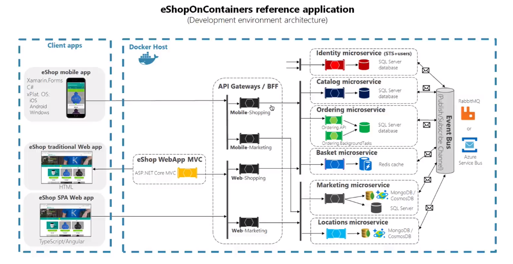

<h1>Orientação de Estudos</h1>

* Docker
* Docker Compose
* GitLab
* Ansible
 
* Na perspectiva de práticas iremos trabalhar com os seguintes conceitos:

* Conteinerização
* Automação de Builds
* Infraestrutura como Código
* Provisionamento de infraestrutura através de código

<h1>Conteiners para Aceleração de Pipelines DevOps</h1>

* O primeiro caminho do DevOps
    * Para maximizar o fluxo precisamos tornar o trabalho visível, reduzir o tamanho dos lotes e os intervalos de trabalho, aumentar a qualidade evitando que os defeitos sejam passados para os centros de trabalho mais à direita e otimizar constantemente as metas globais.
    * As práticas resultantes inlcuem processos contínuos de construção, integração, teste e implatanção;
    * Criando ambientes sob demanda;
    * Limitando o trabalho em progresso (WIP);
    * E construir sistemas e organizações que sejam seguros para mudar.

* O surgimento de tecnologias de virtualização como Hypervisor e programas como o VMWare e VirtualBox começou a facilitar a administração de servidores.


* Ainda assim, você precisa fazer muita coisa. A instalação e configuração de muitos aplicativos continua manual, mesmo em máquinas virtuais.

* Entram em cena os contêineres.
    * Docker (2013, 2014)

* Contêineres
    * São um método de virtualização em nível de sistema operacional que permite executar uma aplicação e suas dependências como processos e com recursos isolados que simulam uma máquina virtual.
    * Permitem empacotar facilmente o código, as configurações e as dependências de uma aplicação em elementos fundamentais que oferecem consistência ambiental, eficiência operacional, produtividade de desenvolvedores e controle de versões.
    * Podem ajudar a garantir rapidez, confiabilidade e consistência de implatação, independentemente do ambiente de implantação.
    * Além disso, eles oferecem um controle mais granular dos recursos, aumentando a eficiência da infraestrtura.


* Docker Engine
    * Como se fosse um mini sistema operacional.
    * Mais leve que uma máquina tradicional.

* Docker
    * O Docker é uma tecnologia Open Source que permite criar, executar, testar e implantar aplicações distribuídas dentro de containers de software.
    * Ele permite que você empacote um software de uma padronizada para o desenvolvimento de software, contendo tudo que é necessário para a execução: código, runtime, ferramentas, bibliotecas, etc.
    * O Docker permite que voce implante aplicações rapidamente, de modo cinfável e estável, em qualquer ambiente.

* Exemplo de como "instalar e rodar" o mysql com o apoio do Docker

```
- docker pull mysql
- docker run mysql

```

<h1>Exemplo de Uso de Contêineres com o Docker</h1>

* Comandos básicos do docker

```
//PROCURA IMAGENS EM REPOSITÓRIOS NA WEB OU PRIVATIVOS DA EMPRESA
//PESQUISA NO REPOSITÓRIO DO DOCKER COMO DEFAULT
- docker search mysql
- docker search redis


//ESPERA O NOME DA IMAGEM QUE VAI INSTANCIAR O CONTAINER
// -d DISPARA O PROCESSO EM BACKGROUND
- docker run -d redis

//MOSTRA OS CONTEINERS INSTANCIADOS
- docker ps

// -p É A PORTA DO SISTEMA OPERACIONAL NATIVO VAI BATER NO CONTEINER
- docker run -d -p 6379:6379 redis


//6380 É A PORTA DO SISTEMA OPERACIONAL NATIVO
- docker run -d -p 6380:6379 redis

```

<h1>Provisionando um Site Web com o Docker</h1>

* Dockerfile
```
FROM nginx:alpine
COPY . /usr/share/nginx/html
```

* Construir a imagem
* Necessita ir no diretório do coker e executar o comando.
* Só é possível ter um dockerfile por diretório
 * docker build -t webserver-image:v1 .

* Rodar a imagem
    * docker run "NOME DA IMAGEM"

* Porta 80 do SO nativo para a porta 80 do container
* docker run -d -p 80:80 webserver-image:v1

* Se alterar o arquivo é possível buildar de novo o arquivo em uma nova versão

* IaC (Infrastructure as a Code)
    * Provisiona o ambiente através de código.

<h1>Provisionando uma Aplicação Node.JS com o Docker</h1>


* RUN roda comando dentro da imagem
* WORKDIR é o diretório default quando instanciar um container.
* COPY copia o package.json que são as libs que o app usa.
* RUN executa o comando npm install
* EXPOSE - expõe a porta 3000
* CMD - Executa comando no CMD
```
FROM node:10-alpine

RUN mkdir -p /src/app

WORKDIR /src/app 

COPY package.json /src/app/package.json

RUN npm install

COPY . /src/app

EXPOSE 3000

CMD [ "npm", "start" ]
```

* docker build -t my-nodejs-app .
* docker run -d -p 3000:3000 my-nodejs-app
* docker ps // MOSTRA CONTAINERS DE PÉ
* curl localhost:3000


<h1>Provisionando uma Aplicação ASP.NET Core com o Docker</h1>


* dot.netapp.csproj -> DLLs
* dotnet restore -> executa as DLLs
* Dockerfile
```
FROM microsoft/dotnet:1.1.1-sdk

RUN mkdir /app
WORKDIR /app

COPY dot.netapp.csproj .
RUN dotnet restore

COPY . .
RUN dotnet publish -c Release -o out

EXPOSE 5000/tcp
CMD ["dotnet", "out/dotnetapp.dll"]

```

* docker build -t aspnet-app:v1 .
* Método mais simples é utilizar um único Dockerfile
* Em ambientes reais, vai ter um Dockerfile para uma imagem e outra para puxar as DLLs.
* docker run -d -p 5000:5000 aspnet-app:v1

<h1>Orquestrando Conteiners com o Docker Compose</h1>

* No mundo real irá ter multiplas imagens.
* Como lidar com vários containers de uma vez?
* Orquestração de containers


* docker-compose.yml

* Roda o arquivo docker-compose e prepara as imagens
* docker-compose up -d

* docker-compose ps

* Escala os conteiners web
* Provisiona 3 containers web
* docker-compose scale web=3

* Transformar Infraestrutura como código, temos consistencia e diminuímos ruídos.

<h1>Orquestração de Conteineres para Arquitetura de Microsserviços</h1>

* http://github.com/dotnet-architecture/eShopOnContainers



<h1>Pipelines como Código</h1>

* Exemplos:
* https://gitlab.com/help/ci/examples/README.md

<h1>Infraestrutura como Código Exemplo com o Ansible</h1>

* Ansible
    * Reforçar os pilares da infraestrutura como código.

* IAC - O que é? (Infraestrutura como Código)
    * A Infraestrutura como Código (IaC) é o gerenciamento de infraestrutuura (redes, máquinas virtuais, contêineres, balancemaneto de carga e topologias) em um modelo descritivo, usando o mesmo controle de versão que a equipe de DevOps usa para o código-fonte. Como o princípio de que o mesmo código-fonte gera o mesmo binário, um modelo IaC gera o mesmo ambiente toda vez que é aplicado. O IaC é uma prática chave de DevOps e é usado em conjunto com a entrega contínua.

* ansible-playbook -c local playbook.yml

* ansible-playbook -i inventory.txt playbook.yml