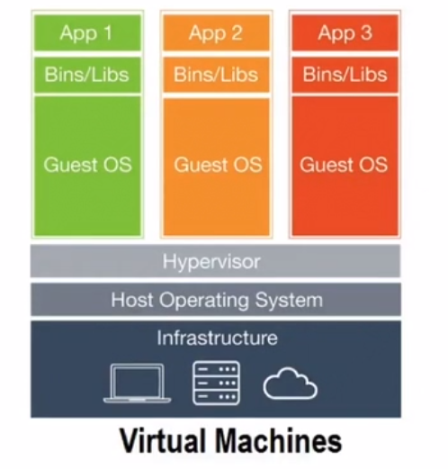
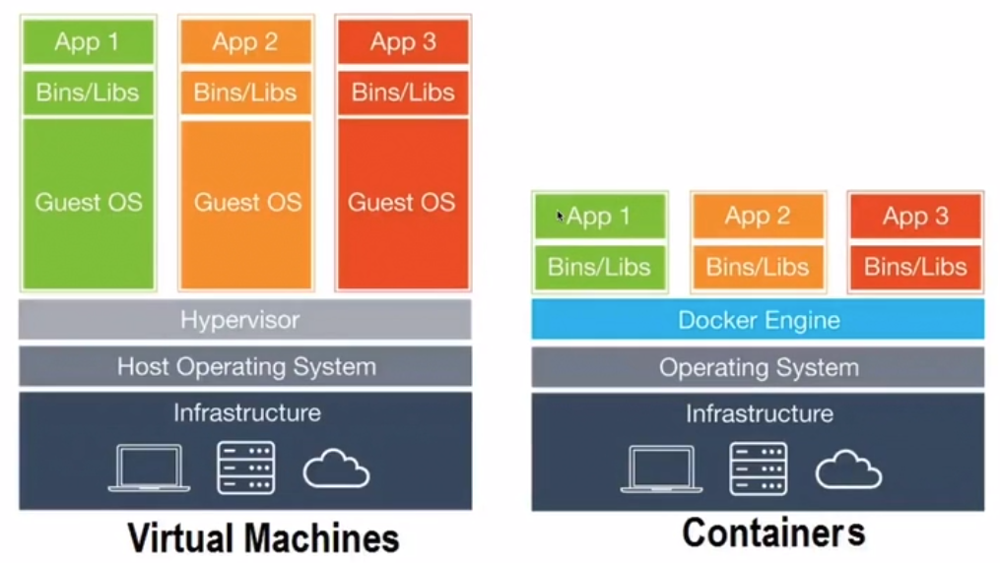

<h1>Orientação de Estudos</h1>

* Docker
* Docker Compose
* GitLab
* Ansible
 
* Na perspectiva de práticas iremos trabalhar com os seguintes conceitos:

* Conteinerização
* Automação de Builds
* Infraestrutura como Código
* Provisionamento de infraestrutura através de código

<h1>Conteiners para Aceleração de Pipelines DevOps</h1>

* O primeiro caminho do DevOps
    * Para maximizar o fluxo precisamos tornar o trabalho visível, reduzir o tamanho dos lotes e os intervalos de trabalho, aumentar a qualidade evitando que os defeitos sejam passados para os centros de trabalho mais à direita e otimizar constantemente as metas globais.
    * As práticas resultantes inlcuem processos contínuos de construção, integração, teste e implatanção;
    * Criando ambientes sob demanda;
    * Limitando o trabalho em progresso (WIP);
    * E construir sistemas e organizações que sejam seguros para mudar.

* O surgimento de tecnologias de virtualização como Hypervisor e programas como o VMWare e VirtualBox começou a facilitar a administração de servidores.


* Ainda assim, você precisa fazer muita coisa. A instalação e configuração de muitos aplicativos continua manual, mesmo em máquinas virtuais.

* Entram em cena os contêineres.
    * Docker (2013, 2014)

* Contêineres
    * São um método de virtualização em nível de sistema operacional que permite executar uma aplicação e suas dependências como processos e com recursos isolados que simulam uma máquina virtual.
    * Permitem empacotar facilmente o código, as configurações e as dependências de uma aplicação em elementos fundamentais que oferecem consistência ambiental, eficiência operacional, produtividade de desenvolvedores e controle de versões.
    * Podem ajudar a garantir rapidez, confiabilidade e consistência de implatação, independentemente do ambiente de implantação.
    * Além disso, eles oferecem um controle mais granular dos recursos, aumentando a eficiência da infraestrtura.



* Docker Engine
    * Como se fosse um mini sistema operacional.
    * Mais leve que uma máquina tradicional.

* Docker
    * O Docker é uma tecnologia Open Source que permite criar, executar, testar e implantar aplicações distribuídas dentro de containers de software.
    * Ele permite que você empacote um software de uma padronizada para o desenvolvimento de software, contendo tudo que é necessário para a execução: código, runtime, ferramentas, bibliotecas, etc.
    * O Docker permite que voce implante aplicações rapidamente, de modo cinfável e estável, em qualquer ambiente.

* Exemplo de como "instalar e rodar" o mysql com o apoio do Docker

```
- docker pull mysql
- docker run mysql

```

<h1>Exemplo de Uso de Contêineres com o Docker</h1>

* Comandos básicos do docker

```
//PROCURA IMAGENS EM REPOSITÓRIOS NA WEB OU PRIVATIVOS DA EMPRESA
//PESQUISA NO REPOSITÓRIO DO DOCKER COMO DEFAULT
- docker search mysql
- docker search redis


//ESPERA O NOME DA IMAGEM QUE VAI INSTANCIAR O CONTAINER
// -d DISPARA O PROCESSO EM BACKGROUND
- docker run -d redis

//MOSTRA OS CONTEINERS INSTANCIADOS
- docker ps

// -p É A PORTA DO SISTEMA OPERACIONAL NATIVO VAI BATER NO CONTEINER
- docker run -d -p 6379:6379 redis


//6380 É A PORTA DO SISTEMA OPERACIONAL NATIVO
- docker run -d -p 6380:6379 redis

```