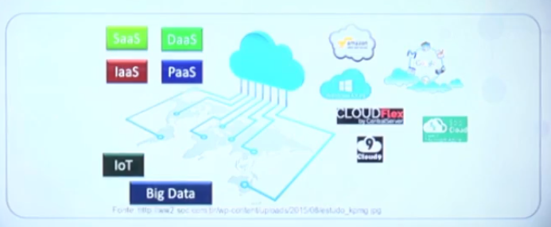
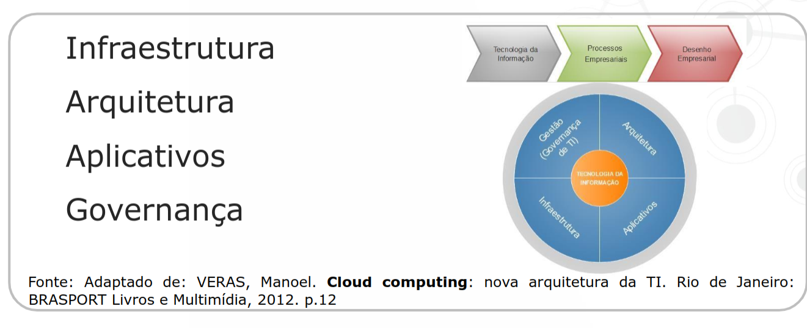
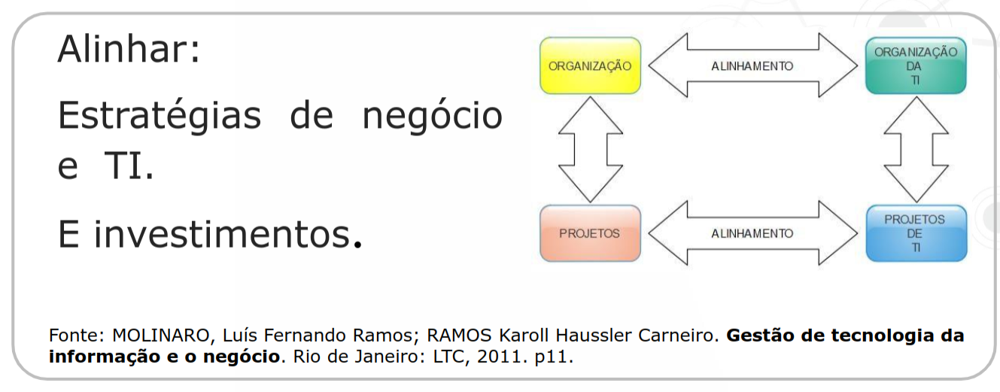
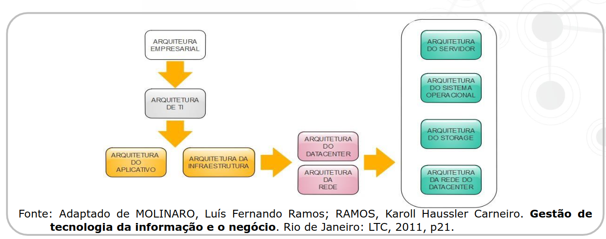
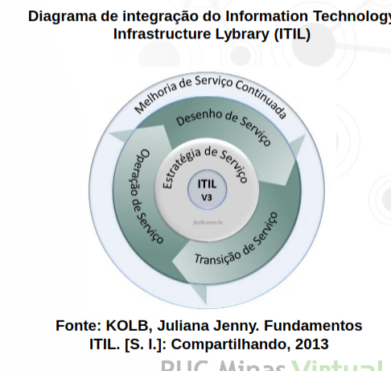
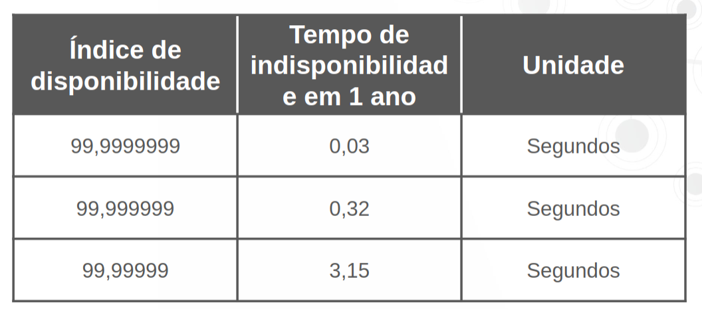
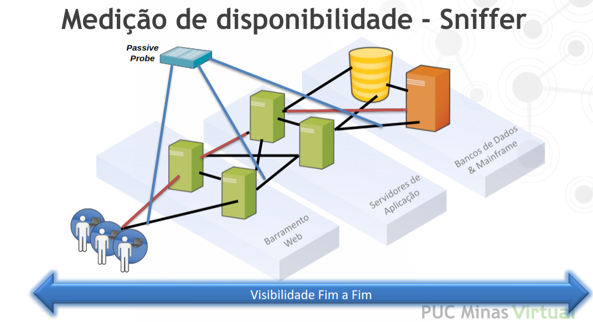
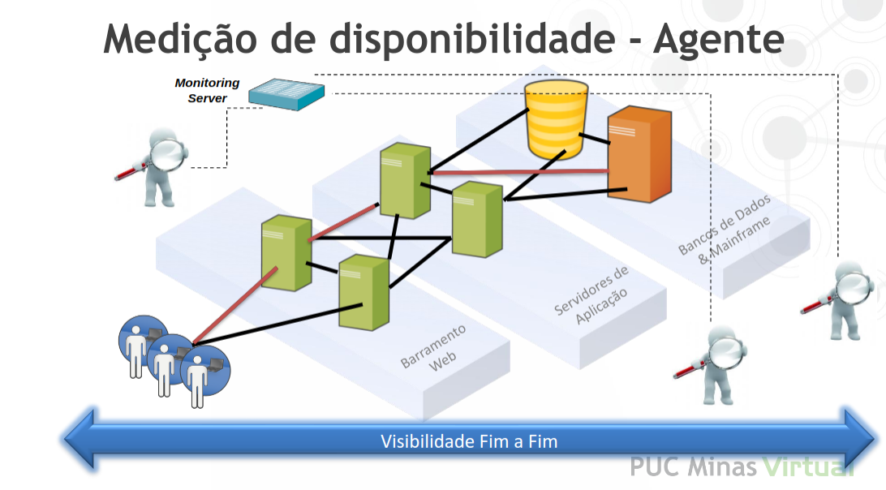
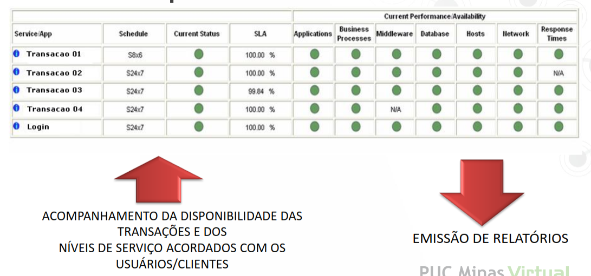
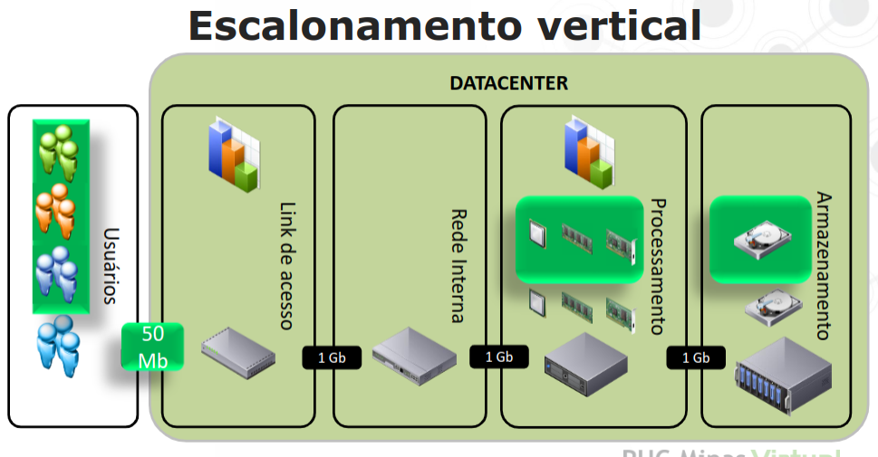

<h1>Referências</h1>

* MOLINARO, Luís Fernando Ramos; RAMOS, KarollHausslerCarneiro. Gestão de tecnologia da informação e o negócio. Rio de Janeiro: LTC, 2011. 

* ALMEIDA, Virgílio A. F., MENASCE Daniel A. CapacityPlanning for Web Performance: metrics, modelsandmethods. UpperSaddleRiver: Prentice-Hall, 1998. 

* FERNANDES, Aguinaldo Aragon; ABREU, Vladimir Ferraz de. Implantando a governança de TI: da estratégia à gestão dos processos e serviços. 2. ed. Rio de Janeiro: BRASPORT, 2008. 

* http://omnett.com.br/10-pontos-para-gestao-niveis-servico-itil/

<h1>Introdução à Computação em Nuvem</h1>

* Introdução

* O que os usuários procuram?
    * É notável a mudança no comportamento dos usuários finais de TIC (Tecnologia da Informação e COmunicações) nos últimos tempos.
    * Observa-se não só evolução dos usuários mas também dos serviços.
    * Primeiramente é não ter surpresas desagradáveis ao utilizar um serviço.
    * É possível identificar uma busca dos usuários por características que se fazem importantes:
        * Economia
        * Autonomia
        * Facilidade
        * Praticidade
        * Flexibilidade
        * Performance

* Como os usuários localizam as ofertas?
    * Inúmeros serviços ofertados.
    * Muita informação disponível nas ferramentas web.
    * Provedores com necessidade de expansão.
    

* Qual a facilidade da núvem?
    * Não te exigirá alguns custos:
        * Com aquisição de hardware.
        * Com manutenção de hardware.
        * Com equipe especializada.
    
* Mas como eu devo começar a pensar?
    * Quantas vezes já vimso projetos de TIC fracassarem por não termos recursos para investimento?
    * Suporte à grandiosidade e à criticidade destes projetos é uma questão bem complexa.
    * Infraestrutura
    * Arquitetura
    * Aplicativos
    * Governança

* Promover o alinhamento com o negócio!

* Um dos maiores desafios é...

* Mas temos outros...
    * Determinar o tamanho da infraestrutura.
    * Entender os riscos de migração dos dados.
    * Analisar os investimetnos que precisamos fazer.

<h1>Gestão de Níveis de Serviço e Recomendações de Gestão</h1>

* Conceitos
    * Cliente é quem contrata
    * Usuário é quem usa

* Serviços de TI
    * Os clientes e as corporações buscam cada vez mais garantias de viabilidade para a execução de projetos.
    * Já consagrada na área de infraestrutura há uma referência de mercado para que se sigam as melhores práticas.

* Biblioteca ITIL
    * O framework Information Technology Infrastructure Lybrary (ITIL), segundo Molinaro e Ramos (2011), é um conjunto de melhores práticas para gerenciamento de serviços de TI que surgiu no final dos anos 80 por necessidade do governo britânico.
    * Desta forma, foi solicitado o desenvolvimento de uma abordagem de melhores práticas gerenciamento dos recursos de TI independente dos negócios e dos fornecedores envolvidos. (FERNANDES 2008).
    * Para atingir eficiência e eficácia na tulizacação de recursos, atingindo um grau de maturidade e qualidade em níveis de classificação elevadors, recomenda-se adotar as práticas ITIL.
    * Foca-se sempre na manutenção do alinhamento e na integração entre clientes e usuários, tendo em vista as etapas de DESENHO, OPERAÇÃO E TRANSIÇÃO DE SERVIÇO sempre sob supervisão da etapa de MELHORIA CONTINUADA.
    * De uma forma sistêmica há a integração entre todas as atividades, pessoas e processos estabelecidos.
    * A integração entre os níveis hierárquicos da empresa é ponto importante para o sucesso da implantação sendo que, quando abastecidos com as melhores informações para tomada de decisão, os gestores têm tendência a apoiar a implatanção de mais processos.

* Atualmente o framework encontra-se na versão 3.

* Mas porque abordar este assunto?
    * É necessário ter embasamento técnico tanto para entrar quanto para sair da nuvem.
    * Enquanto ARQUITETOS DE SOFTWARE este é um bom caminho para iniciar os estudos e aproximar da área de infraestrutura.
    * Mais que isto o framework do ITIL nos apresenta uma disciplina que é fundamental para todos os conceitos que veremos a partir de agora.
    * A disciplina é titulada de GESTÃO DE NÍVEIS DE SERVIÇO.

* Gestão de níveis de Serviço (ITIL)
    * "Serviço é uma forma de entregar valor para os clientes de tal maneira que ele atinja os resultados esperados mais facilmente sem arcar com os custos e os riscos específicos." Silva (2010 p.41).
    * ACORDO de nível de serviço é um documento formal assinado entre o cliente (quem paga) e provedor de serviços.
    * Disponibilidade implica em um nível de serviço que geralmente é alto, onde interrupções planejadas ou não, tem um valor declarado.
    * Fazer a gestão destes níveis de serviço quer dizer fiscalizar DOCUMENTOS ASSINADOS (contratos) que preveem quão DISPONÍVEL O AMBIENTE CONTRATADO deve estar em um intervalo de tempo, geralmente um mês.
    * Caso estes níveis de serviços, GERALMENTE DE DISPONIBILIDADE, sejamm descumpridos há a aplicação de uma SANSÃO CONTRATUAL, GERALMENTE MULTA, que desconta o valor referente ao período de INTERRUPÇÃO do fornecimento deste serviço.

* Como funcionam estes contratos?
    * É determinado um tempo máximo de parada para o serviço durante um mês para que se possa garantir o acesso dos clientes.

* Tabela de indisponibilidades (Quantos noves tem?)

<h1>Conceitos de Alta Disponibilidade</h1>

* Alta disponibilidade
    * De acordo com as exigências dos clientes e a formalização dos contratos só nos resta agora, enquanto detentores do desenho de solução de TIC, torna-la com alta disponibilidade.
    * O que devemos fazer?
        * Alta disponibilidade exigida pelos clientes nos determina a implementar um desenho de solução para não causar percepção de interrupção ao usuário final.
    
* Mas como medir a disponibilidade?
    * A visão do usuário que importa ao prestador de serviços se chama fim-a-fim.
    * A ideia é medir o acesso do dispositivo do usuário, seja ele qual seja até o serviço que utiliza-se no provedor.
    * O monitoramento pela Rede é uma boa opção para quem deseja acompanhar o que acontece no Datacenter sem interferir no funcionamento da aplicação.
    * O monitoramento com a instalação dos agentes em cada servidor também é bastante utilizado e temos uma série de ferramentas de código aberto que podemos utilizar.

* Agente é um software que vai monitorar.
* Objetivo do agente é verificar o consumo de memória/processamento.

* Ferramentas Open Source de Apoio (Agentes)
    * Nagios
    * Zabbix
    * Cacti
    * Opennms
    * Icinga

* É importante monitorar?
    * A ferramenta nos garantirá o acompanhamento da prestação de serviço TIC seja ela qual for e se estiver localizada em um Datacenter ou na nuvem.
    * Ter estes números em mãos é fundamental para argumentação com os decisores do projeto de migração (ou não) para a nuvem.

* A tabela de noves pode se converter nisto...

<h1>Disponibilidade</h1>

* Como funciona o produto de hospedagem
    * Atualmente um dos produtos oferecidos no mercado é a disponibilização aos clientes de infraestrutura para hospedagem de sistemas.
    * A questão fundamental é que este modelo está pautado à aquisição de hardware físico para provimento de serviço.

* Características deste ambiente
    * Precisa ser escalável: Permitir o aumento da capacidade de atendimento de um serviço aumentando a quantidade de acessos e/ ou requisições sem alterar o design (codificação ou componentes ou licenças) que provê a aplicação.
    * Precisa ser confiável: É necessário dar garantias de funcionamentos em condições pré estabelecidas e em um período de tempo especificado, geralmente em contrato.
    * Precisa ser manutenível: Deve facilitar a possibilidade de execução de manutenções no produto ou em seus componentes isolando problemas, corrigindo defeitos, e possibilitando substituir compoenentes de hardware com falha sem proporcionar interrupção em outros componentes que estão em funcionamento.

* Tipos de escalonamento
    * Escalonamento vertical: É quando se tem um hardware que não tem a capacidade para processamento de todo o serviço e acrescenta-se recursos (processador, memória ou rede) neste componente.
    * Problemas: 
        * Existe um custo de hardware mas para qualquer manutenção de componentes é necessário interrupção do serviço. Mais que isto existem componentes que não podem ser duplicados em uma única caixa, por exemplo placa mãe.
        * O risco de violação de disponibilidade de um provimento adotando-se este tipo de escalonamento é alto.
        * O USUÁRIO PERCEBERÁ INEVITAVELMENTE A INDISPONIBILIDADE.

