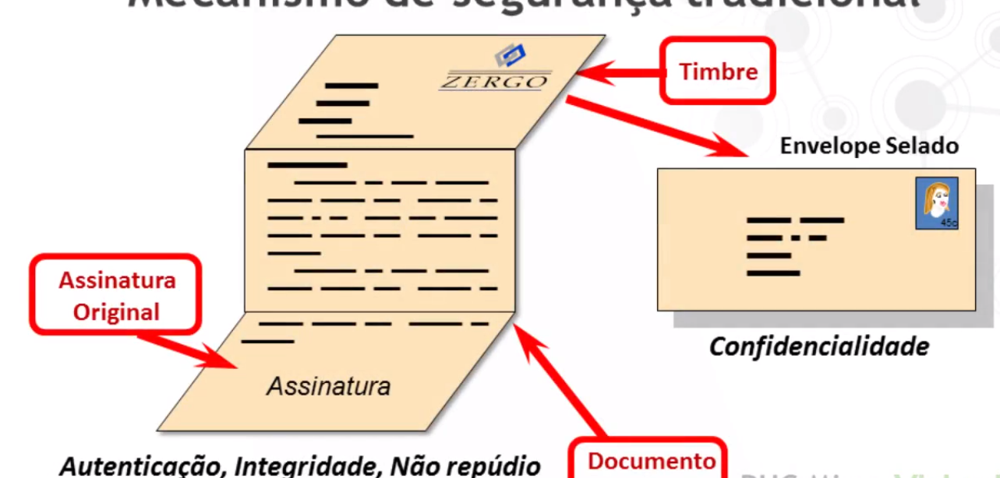

<h1>Referências</h1>

* Galvão, Michele da Costa. Fundamentos da Segurança da Informação. 1ª ed. São Paulo. Ed. Pearson: 2015, p. 41-43.

* STALLINGS, William; Criptografia e Segurança de Redess: Princípios e Práticas; 6ª ed. São Paulo Ed. Pearson: 2015, p. 1-20.

* STEIN, Clifford; DRYSDALE, Robert, BOGART, Kenneth. Matemática Discreta para Ciências da Computação, 1a ed. Pearson Education – BR, 2013, p. 49-91

<h1>Os 5 pilares de Segurança da Informação e a Introdução à Criptografia</h1>

* Mecanismo de Segurança Tradicional
    * 

* 5 pilares da segurança
    * Confidencialidade
        * Garantia de que a informação não pode ser lida ou copiada por alguém não autorizado a fazê-lo.
        * Fundamental em transações eletrônicas onde a informação não pode ser revelada para terceiros. Exemplo: Dados pessoais de indivíduos.
    * Integridade
        * Garantai de que a informação se mantém consistente, ou seja, não houve modificação não autorizada da mesma.
        * Fundamental em transações legais; funanceira etc.
    * Disponibilidade
        * Garantia de que a informação está sempre disponível para os usuários autorizados.
        * Fundamental para prestação de serviços via Internet:
            * Exemplo: agendamento on-line de consultas e exames na saúde pública.
    * Autenticidade
        * Garantia de que a informação só será criada ou enviada por pessoas autorizadas.
        * O pedido de cancelamento de marca foi feita pelo representante legal da empresa ou um impostor?
    * Não-Repúdio
        * Atributo que protege contra a intenção de um dos participantes refutar a ocorrência de uma comunicação e/ou transação.
            * Exemplos: recebimento de e-mail; realização de uma transação bancária, etc.

* Confiança Eletrônica
    * Confidencialidade
        * Garantia da privacidade na comunicação.
        * Criptografia
    * Autenticação
        * Identificação inequívoca das partes envolvidas no processo.
        * Certificados
    * Integridade
        * Garantia que as informações não foram modificadas.
        * Assinatura Digital.
    * Irretratabilidade
        * A autoria das comunicações não pode ser contestada.
        * Assinatura Digital e Certificados

<h1>Criptografia Básica</h1>

* Tipos de Criptografia - Técnicas Básicas
    * Cifra de transposição: Reorganiza a ordem dos bits, caracteres ou blocos de caracteres.
    * Cifra de substituição: Troca dos bits, caracteres ou bloco de caracteres por outros.

* Anagrama
    * (go grego ana = "voltar" ou "repetir" + graphein = "escrever") é uma espécie de jogo de palavras, resultando do rearranjo das letras de uma palavra ou frase para produzir outras palavras, utilizando todas as letras originais exatamente uma vez.
    * 
    * 
    * 

* Código Morse
    * Samuel Morse (1791-1872) desenvolve o código que recebeu o seu nome;
    * Na verdade não é um código, mas sim um alfabeto cifrado em sons curtos e longos.

* Código Braile
    * Louis Braille (1809-1852)
    * O Código Braille consiste de 63 caracteres, cada um deles consittuído por 1 a 6 pontos dispostos numa matriz ou célula de seis posições;
    * O sistema Braille é universalmente aceito e utilizado até os dias de hoje.
    * 

<h1>Processo de Criptografia Simétrico e Assimétrico</h1>

* Conceito básico de criptografia
    * Criptografia é o processo de converter 
    * Decriptografia é o processo de reconverter um texto cifrado em texto aberto.

* Criptografia Simétrica
    * Esse método não agrega a segurança necessária para algumas aplicações, pois a troca de chaves entre seus participantes pode se tornar inviável.
    * 
    * 
    * Exemplos de algoritmos:
        * DES - Data Encryption Standard
            * Chave pequena (56 bits);
            * Considerado inseguro para muitas aplicações;
            * A Eletronic Frontier FOundation levou 22 horas e 15 minutos para quebrar uma chave DES.
        * 3DES - Triple Data Encryption Standard
            * Baseado no DES
            * Utiliza 3 chaves de 64 bits
            * Mais lento, porém mais seguro.
        * AES - Advanced Encryption Standard
            * Chave de 128, 192 e 256 bits;
            * Um dos mais populares algritmos simétricos;
            * Tornou-se padrão efetivo em 2002.

* Criptografia Assimétrica
    * Neste sistema, cada pessoa tem duas chaves: a pública e a privada. As mensagens criptografadas com uma das chaves do par só podem ser decriptografadas com a outra chave correspondente do par; portanto, qualquer mensagem cifrada com a chave privada só pode ser decifrada com a chave pública e vice-versa.
    * A criptografia assimétrica é conhecida como Criptografia de Chave Pública (Public Key Cryptography)
    * A chave pública é divulgada
    * A chave privada é proprietária (deve ser armazenada com segurança)
    * A chave privada é usada para criptografar e só a chave pública pode descriptografar.
    * 
    * Exemplos: 
        * RSA - Rivest Shamir Adleman
            * Foi desenvolvido por 3 professores do MIT;
            * É considerado o mais seguro (768 a 4096 bits);
            * Foi o primeiro algoritmo que possibilitou a assinatura digital.
        * Diffie-Hellman
            * Foi desenvolvido por WHitfield Diffie e Martin Hellman;
            * É utilizado em VPN's (Virtual Private Net)
            * Foi o primeiro sistema comercial a utilizar chave pública