<h1>Referências</h1>

* Blog do Barbi - Carlos Barbieri - Uma das maiores referências em governança de dados e qualidade do Brasil;

* http://www.eiminstitute.org/library/eimi-archives/volume-2-issue-3-june-2008-edition/201cwhat2019s-in-your-data-architecture-201d-part-two

<h1>Arquitetura de Dados</h1>

* Conceitos
* Arquitetura empresarial é a prática de aplicar um método compreensivo e rigoroso, para descrever:
    * Uma estrutura para um processo organizacional, presente ou futuro;
    * Sistemas de Informação;
    * Recursos Humanos;
    * Sub-unidades organizacionais, etc.

* Na prática arquitetura empresariais envolvem:
    * Dados
    * Processos
    * Aplicações
    * Tecnologia
    * Arquitetura de negócios

* No contexto de arquitetura empresarial os sistemas de informação tem muita relevância.
    * Dados: São elementos fundamentais dos sistemas de informação.
    * Dados: São elementos fundamentais no processo de Competitividade das Empresas.

* Urge a necessidade de termos uma arquitetura de dados para suportar a estratégia empresarial.

* Podemos definir a arquitetura de dados como um conjunto integrado de artefatos de especificação que:
    * Definirão os requisitos estratégicos de dados.
    * Integração dos dados
    * Alinhamento para os investimentos em dados.

* Arquitetura de Dados é um todo: Estruturas formadas por componentes (partes) de dados, que se relacionam.

* São gerenciadas por Regras de negócios, Políticas, Padrões, Processos, etc que definem como os dados são gerados, usados, integrados, terminados e gerenciados.

* Integra com as outras arquiteturas da empresa.

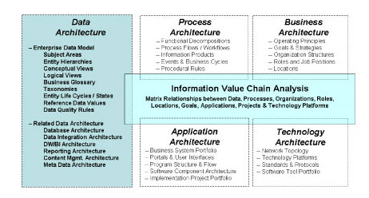

* Arquitetura de dados não defini apenas o que, mas defini também o como.
* Veja exemplo de uma arquitetura de dados para BI (Business Intelligence).

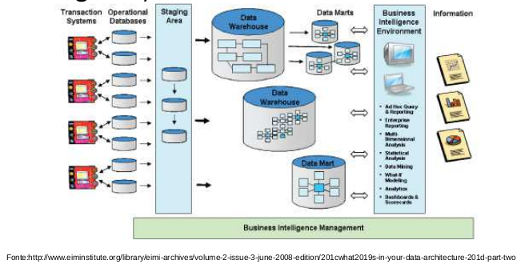

* O componente essencial da arquitetura de dados empresarial é o Modelo de Dados Empresarial (MDE).
* O MDE é essencial, integrado e orientado por assuntos:
    * Essencial = Dados do MDE são essenciais para operações e decisões críticas nas empresas;
    * Integrados = Entedidades, atributos, regras e referências são definidas sem redundâncias;
    * Orientado por assunto = Divido em assuntos empresariais de acordo com os processos da empresa.

* MDE - Esquema

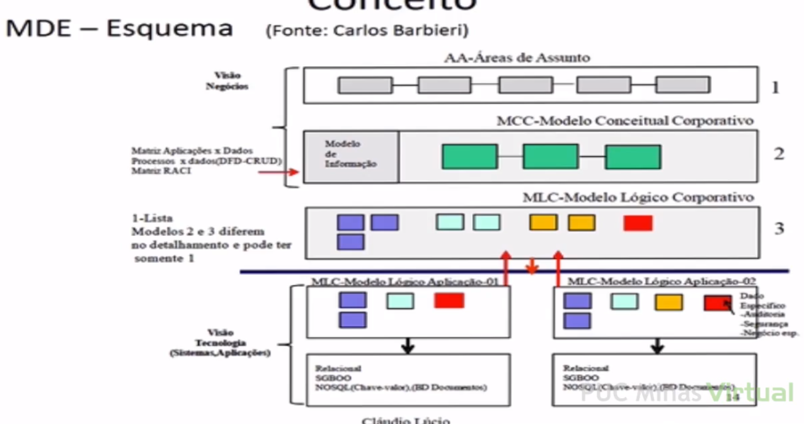

* Alguns MDE também incluem:
    * Glossário de negócio (além dos termos dos dados, inclue processos, perfis e organizações).
    * Responsáveis pelos dados (Date stewardship) - Responsáveis pela qualidade dos metadados e dados que estão nos modelos e nas empresas como um todo;
    * Requisitos de qualidade dados: quão atualizado os dados devem ser? Qual o grau de completude do dado?
    * Mapeamento dos estados do dado: diagrama de transição dos dados.

* MDE - Comentários pragmáticos.
    * Muitas (maioria) trabalham apenas no nível lógico e físico:
        * Arquiteto de dados
        * Administrador de banco de dados
    * Infelizmente, atualmente poucas empresas vem trabalhando com visão conceitual dos dados:
        * Administrador de Dados.
    * No entanto, a temática da Governança de dados, tem crescido: problemas que aparecem na gestão dos dados.

<h1>Governança de Dados</h1>

* AD - Administração de Dados - Anos 70 e 80
    * Movimento de sucesso relativo.
    * Morreu por fatores:
        * Qualidade não era um fator da época.
        * ERP e seus modelos de dados prontos.
    * Retorno:
        * GD - Governança de Dados
        * Outros fatores: Internet, regulações, alto volume de informações, alta competitividade, riscos de reputação, de quebras de normas/regulamentos.
    
* Conceito
    * É um estrutura de pessoas, processos e tecnologias que habilitam, entregam e mantem todo o gerenciamento de dados em uma compania;
    * Governança de dados propões a responsabilidade da informação por toda empresa: Cada um sabe o seu papel e quais dados será de responsabilidade de quem;
    * Define expecitativas, autoridades e processos de monitoração dos dados;
    * Inclue príncipios, processos, padrões, regras, perfis e responsabilidades para o gerenciamento de dados.

* Data Stewarship
    * Habilitar o gerenciamento de dados por todas empresas;
    * Capacidade organizacional fundamental para sustentar a qualidade de dados;
    * É implementada por um 'Data Steward'.

* Implementação Organizacional

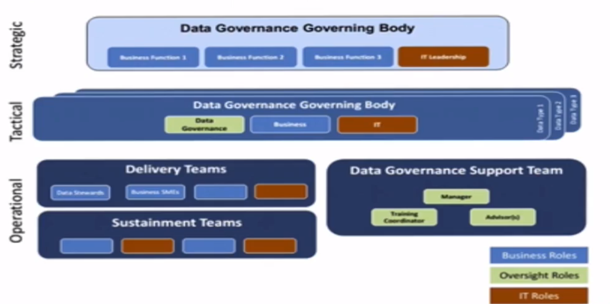

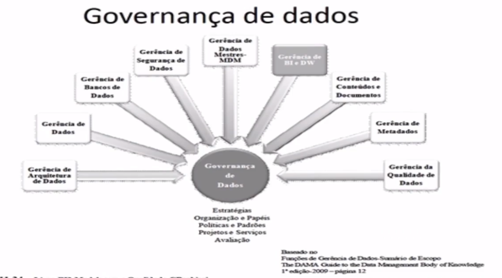

* O modelo DMM
    * 25 Áreas de Processos
    * 300+ Práticas
    * 300+ Produtos de trabalho

<h1>Introdução e Conceitos - NoSQL - Big Data - Introdução</h1>

* Termo NoSQL:
    * Duas palavras: "No" e "SQL";
    * NonRel: "No Relational";
    * Not Only SQL (RDBMS);
    * Mais pragmaticamente:
        * Um termo geral para tecnologias de bancos de dados que não utilizam os princípios relacionais;
        * Uso em grandes conjuntos de dados: Maior que bilhões de linhas;
        * É toda uma classe de produtos e tecnologias para lidar com o paradigma de dados da web: Big Data

* BigData:
    * Ocasionado por aumento de dispositivos que utilizamos.
    * Tipos de dados diferentes. Vídeos, textos etc.
    * Grande velocidade
    * 3 ou 4 V's: Variedade, Velocidade, Volume + Valor para os negócios.
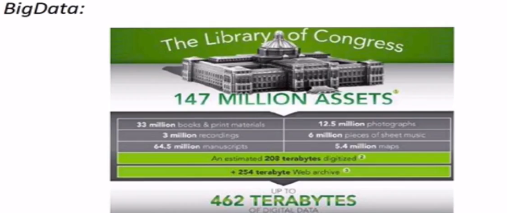

* Big Data, valor agregado para os negócios:
    * Uma rede de supermercados manterá todo o histórico de comrpas de clientes por produtos, assim como sua rota (RFID) de comrpa nas lojas;
    * Uma rede de locadoras de carro irá reter dados do GPS existente em seus carros. A ideia é entender como os clientes utilizam os carros e oferecer pacotes de descontos de acordo com o uso;
    * O Tribunal de Justiça do estado deseja estruturar todos os seus processos, permitindo buscas por advogado, juízes, relatores, redatores, palavras chaves, tipo de causa e outros.
    * Um atacadista deseja cruzar o histórico de 5 anos de comrpas de cada um de seus clientes por produto (novas oportunidades de vendas): 5.000 produtos * 100.000 clientes * 1825 dias.

* Big Data - Desafios
    * Processamento de volume de dados em milissegundos;
    * Armazenar e acessar grandes quantidade de dados. Adicionalmente: tolerância a falhas e política de backups aceitáveis;
    * Manipulação eficiente de grandes volumes de dados envolve processamento paralelo e recuperação de falhas em curto espaço de tempo;
    * Gerenciamento e manutenção de metadados para dadados semi-estruturados e não estruturados gerados de forma contínua por diversos tipos de fontes;

* Movimento NoSQL:
    * Não é a panacéia: "One size fits all".
    * É mais adequado para BigData:
        * Alto desempenho;
        * Escalabilidade para web;
        * Análise de grande volume de dados;
    * Aderente a computação nas nuvens:
        * Escalabilidade ao custo acessível a medida que o volume de dados aumenta;
        * Soluções NoSQL são oferecidas como serviços web;

* NoSQL - Definição
    * Not Only SQL (Not Only RDBMS)
    * Um conjunto de produtos e tecnologias para lidar como o paradigma de dados da web;

<h1>Introdução e Contexto NoSQL/BigData - Histórico</h1>

* Contexto SQL:
    * Scalability, Reliability, Linked Data, Social Networks, Agile Development, Decument-Data, BI/Data Warehouse, Large Data Sets.

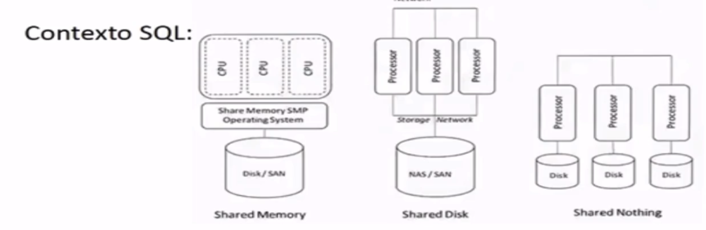

* SQL Executada em paralelo;
* Esquemas de particionamentos (shared nothing);
* Tolerância a falhas? E escalabilidade?

* Business Intelligence:
    * Necessidade de processar históricos.
    * Modelagem dimensional;
    * OLAP e agregações;
    * Cubos;
    * Multi-Dimensional eXpressions - MDX, criado pela Micrsoft (primeira especificação 1997).
    * Alguns não consideram como uma tecnologia NoSQL, pois é centrada na definição de esquemas: tabelas fato, cubos e dimensões.

* Google:
    * Artigo do Google sobre o Algoritmo Map Reduce para indexar páginas da Web utilizando um grande conjunto de máquinas de baixo custo - 2004;
    * Outro artigo sobre a utilização da plataforma Big Table para manipular dados estruturados - 2006;

* XQuery
    * Surge a Xquery como a primeira linguagem padronizada (W3C) para consultar dados estruturados e documentos.
    * Utilziada por várias produtos SQL.

* Amazon
    * Apresenta sua implementaçao para armazenamento distribuído e processamento paralelo: Dynamo;
    * Em janeiro de 2012 foi anunciado o DynamoDB (chave-valor) como um serviço web. O serviçço promete: escalabilidade, desempenho (utilizam SSD), integridade transacional e baixo custo;

* Hadoop
    * Projeto da fundação Apache;
    * Implementa o Map Reduce e DFS (HDFS), adicionando mais uma elevada gama de outros produtos.   

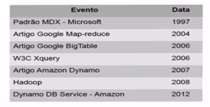

<h1>Introdução e Contexto - NoSQL - Big Data - Motivações</h1>

* Movimento NoSQL - Motivações:
    * Elevado Throughput
        * A solução Bigtable (Google) permite buscas locais em 1 bilhão de celulas de dados;
        * Bigtable (Google) processa 20 petabytes por dia utilizando a abordagem map reduce;
    * Escalabilidade Horizontal utilizando hardware de baixo custo
        * Custo de uma solução Oracle Real Application Clusters (RAC) com Automatic Storage Management (ASM);
    * Evitar mapeamento objeto-relacional.
        * Eleva complexidade e custo de desenvolvimento web;
    * Movimentos de linguagens de programação e Frameworks para dados.
        * Java Persistence API - JPA;
        * Ruby on Rails - RoR;
        * Django - Python;
    * Novos paradigmas para processamento paralelo;

* NoSQL - Mudança de Paradigma:
    * SQL
        * Dados organizados em tabelas
        * Foco no servidor: I/O, memória, cache e CPU. Abordagem principal: Escalabilidade vertical.
        * Utiliza mapeamento objeto relacional (ferramentas) para automaticamente gerar SQL (consultas) a partir da camada de objetos.
        * Utiliza código procedural e gerenciamento de estado para gerenciamento de transações.
        * Equipe é treinada em como fazer debug de código procedural e avaliar utilização de servidores.
        * Analistas de dados fazem modelos lógicos e físicos para construir esquemas de dados precisos de acordo com os padrões da corporação.
        * Todas as transações seguem o preceito ACID. Todos os relatórios são consistentes.
        * Bancos de dados são criados em hardware proprietários que são gerenciados por equipe prórpia.
    * NoSQL
        * Dados não são organizados apenas em tabelas: árvores, grafos, pares chave-valor. Melhor estrutura para resolver o problema.
        * Problema é distribuído. Número de CPU's de acordo com problema. Abordagem principal: Escalabilidade horizontal.
        * Mapeamento objeto relacional não é necessário. Utiliza documentos/estrutura de dados na aplicação.
        * Utiliza programação funcional e algoritmos Map Reduce para particionar o problema em tarefas independentes.
        * Equipe é treinada em programação funcional (rapidez) e avalia a transformação dos dados na arquitetura da solução.
        * Analistas estão preparados para carregar dados a medida que eles surgem e adptam esquemas de acordo com a necessidade.
        * Utiliza o preceito ACID quando necessário mas o foco é não bloquear escritas. O sistema é eventualmente consistente (dados em processamento).
        * Banco de dados são serviços baseado em computação nas nuvens e não requerem equipe de sustentação internas operacionais.
    

<h1>Introdução NoSQL Big Data - Conceitos e fatos</h1>

* Conceitos e Fatos

* Fatos: Precisamos de outra abordagem.

* Características de SGBDR:
    * Armazenamento orientado para discos locais e estrutura de índices;
        * Mas e a lei de Moore? COnsiderando memória RAM.
    * Multithreading para lidar com latência.
    * Mecanismos de controle de concorrência baseado em lock;
    * Recuperação baseada em log (write ahead);

* As características dos SGBDR não refletem os paradigmas e desafios de computação atuais?

* Stonebraker et al. tentou responder esta qeustão em seu artigo: THe end of an architectural era: (It's time for a complete rewrite):
    * Desenvolveu um protótipo de BD chamado H-Store;
    * Foi testado utilizando TPC-C benchmark e mostrou-se 82 vezes mais rápido que solução comercial mais comum;

* Características da solução de Stonebraker et al., H-Store:
    * Executa em um grid computacional;
    * Faz uso intensivo de memória (linhas das tabelas, grande parte, em memória);
    * Faz particionamento lógico por estação de trabalho;
    * Cada estação de trabalho é completamente independente com seus próprios índices (B-Tree para armazenamento) e particionamento de memória;
    * Thread única e transações não são interrompidas - sempre que possível executada em uma única máquina do grid;
    * Executa apenas transações pré-definidas implementadas como Stored Procedures;
    * Não faz uso de redo-log e sempre tenta evitar escritas do tipo redo. Caso seja necessário faz uso de "transaction commit".
    * Mantém replicas de cada tabela. Comandos de leitura podem acessar qualquer estação do grid e atualizações são feitas em todas as replicas;
    * Em resumo: particionamento horizontal, replicação no cluster e campos indexados.
    * Considerações:
        * Novos desafios: Data warehouses, Bases textuais, banco de dados científicos (arrays), dados semi-estruturados.
        * Novas abordagens;
        * Novos paradigmas;
        * Novo "mindset";

* Conceitos:

* Teorema CAP - Eric Brewer (2000)
    * Consistência: como sistema fica consistente após uma operação.
        * Em um sistema distribuído a consistência acontece se: Depois de uma alteração por um 'escritor' a alteração pode ser visualizada por todos os 'leitores';
    * Disponibilidade (availability): tolerância a falhas
        * Em um sistema distribuído após a falha de qualquer nó, a operação/tarefa global não é afetada;
    * Tolerância a Partição (escalável): pode ser entendido como a capacidade de adicionar/remover nós do cluster em conjunto com a capacidade de distribuir dados pelos mesmos nós;

* Brewer alega que apenas 2 destas características podem ser atendidas em sistemas para compartilhamentos de dados;
* No caso de consistência e particionamento serem requisitos, propriedades ACID são necesśarias;
* Se disponibilidade e particionamento são favorecidos, então o sistema possui propriedades BASE;

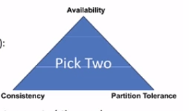
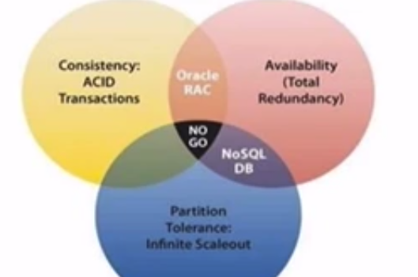

* SGBDR: Consistência e disponibilidade
* Amazon's Dynamo: Disponibilidade e particionamento.
    * Ex: Atualização de cliente não é imdediatamente visualizada pelos outros processos leitores;
* Google's Bigtable: Consistência e disponibilidade;

* Propriedades BASE:
    * Brewer: 'Basically available', 'Soft-state', 'Eventual consistency';
    * Basicamente disponível: Não garante disponibilidade, mas oferece suporte a função A do teorema CAP;
    * Estado: Indica que os estados do sistema pode mudar a medida que o tempo passa;
    * Consistência eventual: Sistema não esta consistente a todo momento;

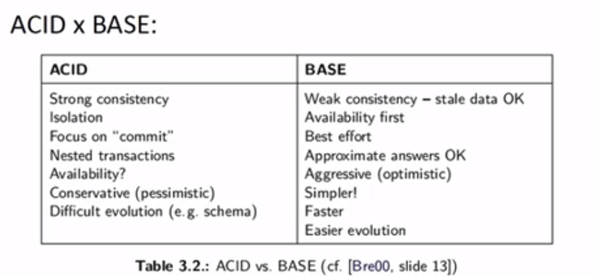

* Propriedades Base - Consistência eventual
    * O sisema retorna o último valor escrito;
    * Eventualmente pode acontecer de fazer leituras 'inconsistentes', a medida que atualizações estiverem em progresso (ex: 500ms);
    * Exemplo: em banco de dados replicado as atualizações são feitas em um 'nó' e serão replicadas para os demais que irão conter as réplicas. Consultas podem ocorrer antes da atualização;

* Particionamento
    * Para o Big Data é necessário utilizar a capacidade de mais de uma única máquina;
    * O dado também deve ser replicado para garantir tolerância a falha;
    * De acordo com o tamanho da base de dados e necessidade de escalabilidade adota-se as seguintes abordagens para o partcionamento:
        * Memory Cache: Utilização de que parte do dado vai para memória RAM. Pode ser utilizada em vários servidores;
    * Cluster: Particionamento entre várias máquinas (críticas para os bancos relacionais em que este conceito foi adaptado - Stonebraker et al.);
    * Leitores e escritores separados: Utiliza o esquema de 'mestre/escravo'. O mestre determina máquinas para leitura e outras máquinas para escrita. Os dados são particionados nesta estrutura;
    * Sharding: Particionamento dos dados na forma que eles são requisitados e atualizados em conjunto. De forma que fiquem na mesma partição ou nó de execução. Ainda propõe o uso de replicação para tolerância a falhas.

<h1>Introdução NoSQL Big Data - Abordagens</h1>

* Abordagens

* Existem várias abordagens de implementação NoSQL:
    * Baseado em chave valor;
    * Baseado em documentos;
    * Baseado em grafos;
    * Baseados em colunas;
    * Outras;

* Baseado em chave valor:
    * Estrutura muito simples (binômio): chave e valor;
    * Imagine uma tabela com dois campos apenas;
    * Funções para armazenar as chaves e valores e outras função para resgatar os valores dada uma/várias chave(s) (simplicidade);
    * Para estes sistemas há escalabilidade horizontal/tolerância a partição: automaticamente adiciona CPU's e discos aos sistema - "Sharding";
    * É ineficiente quando há o requisito de consistência;
    * Problemas para atualização de parte do valor associado a chave;
    * Pode ser difícil construir estruturas de dados mais complexas;
    * Exemplos: Scalaris, VOldermort, BerkeleyDB e pode ser facilmente implementado em uma linguagem de programação.

* Baseado em documentos:
    * Armazena os dados em uma estrutura de dados de árvore. Exemplos mais comuns: JSON e XML;
    * São extremamente flexíveis (árvores podem ter sub-árvores), e muito utilizadas para ambientes WEB (paradigma natual);
    * Documentos podem ser adicionados a qualquer momento na estrutura;
    * Suporta grande variabilidade de dados (tipos);
    * Acesso aos níveis 'folhas' mesmo em um grande volume de documentos (milhões e bilhões) pode ter excelente desempenho: utiliza os metadados como documentos e estes são indexados;
    * Armazenam textos diretamente e permitem a utilização de componentes de indexação de textos (ex: Apache Lucene);
    * É capaz de identificar entidades diretamente no texto (descrição) e armazenam estes metadados para rápida recuperação. Ex: Um catálogo de produto pode conter tag's para preço, prazo de garantia, cor e tamanho.
    * Alguns autores acreditam que esta tecnologia é a evoluçaõ da abordagem chave-valor, pois permite aramzenagem de valores agrupados.
    * Exemplos: MongoDB, CouchDB, RavenDB e outros;

* Baseados em grafos
    * Estrutura simples, ao invés de duas colunas, tuliza três colunas (nó-arco-nó: unidade básica);
    * Também conhecidos como 'Triple-store';
    * Capacidade de junção de grafos através dos identificadores dos nós. A mescla de dois grafos é feita automaticamente mesmo se os sistemas são não relacionados: A->B e B->C, logo A->C;
    * Grafos são a base para alguns sitemas semânticos da WEB que utilizam 'Resource Description Framework' - RDF;
    * Estes sistemas usam uma linguagem chamada SPARQL;
    * Exemplos: Neo4j, FlockDB e outros.

* Baseados em colunas:
    * Não são uma novidade. Ex: Sybase IQ;
    * Estruturas colunares armazenam dados de uma coluna;
    * As páginas de dados das colunas são armazenadas nas ordens das linhas;
    * As consultas são processadas de forma diferente:
        * Exemplo: Uma consulta com 3 colunas implica que 3 estruturas de colunas são acessadas, os resultados são mesclados pelo ID da linha. Resultado é materializado;
    * A ideia básica dos bancos de dados colunares é minimizar o tráfico de dados (DIsco e CPU):
        * As consultas não precisam de linhas completas (todas as colunas) o que sobrecarrega o sistema;
        * Usando apenas as colunas necessárias há a minimização de utilização de recursos;
    * Muitos bancos de dados por linhas estão buscando estas opções: SQL SERVER 2012;
    * Exemplo HBase, Cassandra e outros.
    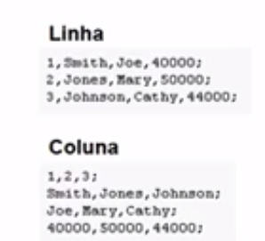

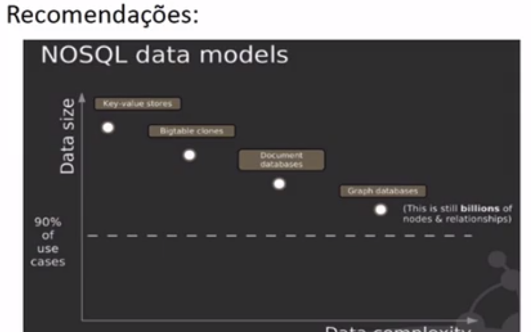

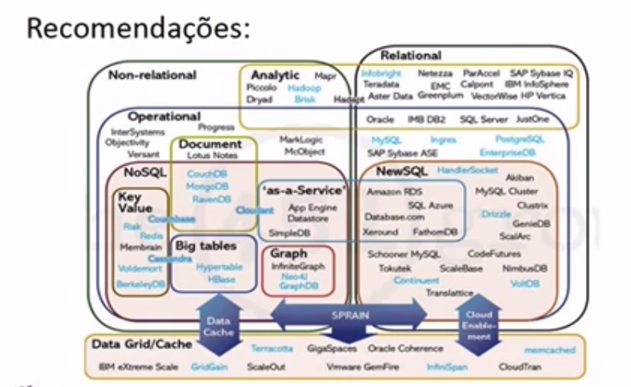

* Recomendações:
    * Para introdução desta tecnologia recomenda-se começar com um projeto piloto;
    * Este tipo de projeto tem a meta de desmitificar a tecnologia na organização;
    * Algunas dicas:
        * Encontre um patrocinador (área de negócio) que entenda as necessidades e características da base de dados e tenha interesses: custos, Big Data, agilidade;
        * Avalie o tamanho do projeto e verifique se o uso de NoSQL realmente será um benefício;
        * Procure envolver mais pessoas da equipe de TI durante todo o processo de desenvolvimento da solução. Lembre-se que não haverá necessidade de mapeamento objeto-relacional e isto pode simplificar o processo.
        * Pense em uma estratégia para comunicar todo o projeto;

<h1>Exercícios</h1>

* 1 - Considerando o Guia de Aula e os textos disponibilizados sobre Big Data. Selecione a alternativa que define, corretamente, Big Data:
    * R: Processamento (eficiente e escalável) analítico de grandes volumes de dados complexos produzidos por (várias) aplicações. Processamento (eficiente e escalável) analítico de grandes volumes de dados complexos produzidos por (várias) aplicações.Justificativa: No GUIA DE AULA temos esta definição, ou seja, Big Data é processamento de grandes volumes de dados complexos (pela variedade ou frequência de atualização).

* 2 - Considerando o teorema CAP, selecione a opção que o define corretamente:
    * R: Características de sistemas distribuídos (para tais sistemas é impossível ter as três características: Consistência, Tolerância a partição e disponibilidade). Justificativa: Teorema CAP – Eric Brewer (2000): Consistência: como sistema fica consistente após uma operação. Em um sistema distribuído a consistência acontece se depois de uma alteração por um 'escritor' a alteração pode ser visualizada por todos os 'leitores'. Disponibilidade (availability): tolerância a falhas. Em um sistema distribuído após a falha de qualquer nó, a operação/tarefa global não é afetada. Tolerância a Partição (escalável): pode ser entendido como a capacidade de adicionar/remover nós do cluster em conjunto com a capacidade de distribuir dados pelos mesmos nós.Brewer alega que apenas 2 destas características podem ser atendidas em sistemas para compartilhamentos de dados. 

* 3 - Considerando as propriedades BASE dos sistemas distribuídos, indique a alternativa que apresenta a característica que não pertence aos sistemas com propriedades BASE:
    * R: Transações aninhadas. Basicamente disponível: não garante disponibilidade, mas oferece suporte a função A do teorema CAP. Estado: indica que os estado do sistema pode mudar a medida que o tempo passa. Consistência eventual: sistema não esta consistente a todo momento. Veja o Slide 60 da GUIA DE AULA.

* 4 - Considerando as abordagens utilizadas em bancos de dados NoSQL, marque a opção que não representa um abordagem para bancos de dados NoSQL:
    * R:: Árvores AVL. 

* 5 - É correto afirmar sobre os bancos de dados NoSQL:
    * R: É um tipo de tecnologia mais adequada para lidar com dados distribuídos e dados da web. Apresenta funcionalidades para sistemas distribuídos. 

* 6 - Em relação aos bancos de dados baseados em família de colunas, assinale a opção CORRETA:
    * R: É uma abordagem de bancos de dados que economiza espaço, além de ser mais rápido para leituras de dados. Justificativa: Armazenamento em colunas minimiza a quantidade de espaço necessário quando os dados não existem para alguns casos. As outras alternativas: Alternativa a: não pode ser considerado evolução, mas sim complementar.Alternativa b: não é utilizado apenas para sistemas analíticos, pode até ser mais usado neste cenário, mas não "apenas".
    Alternativa d: em muitos casos o acesso acontece com SQL padrão.