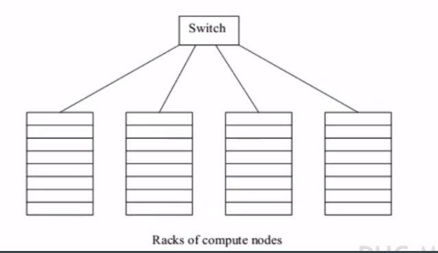
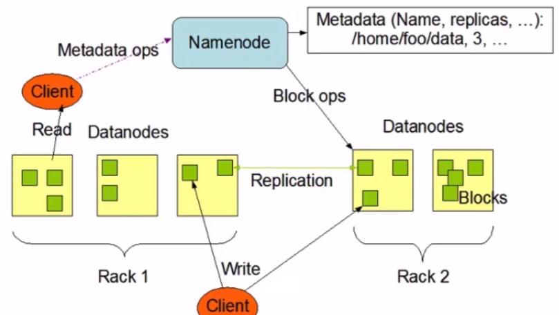
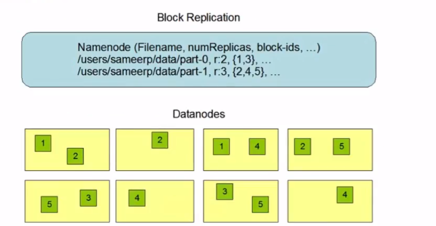
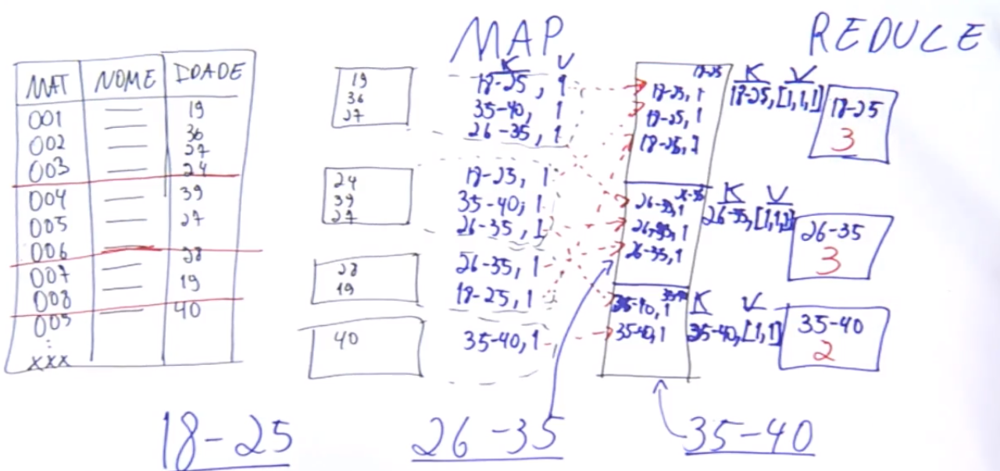
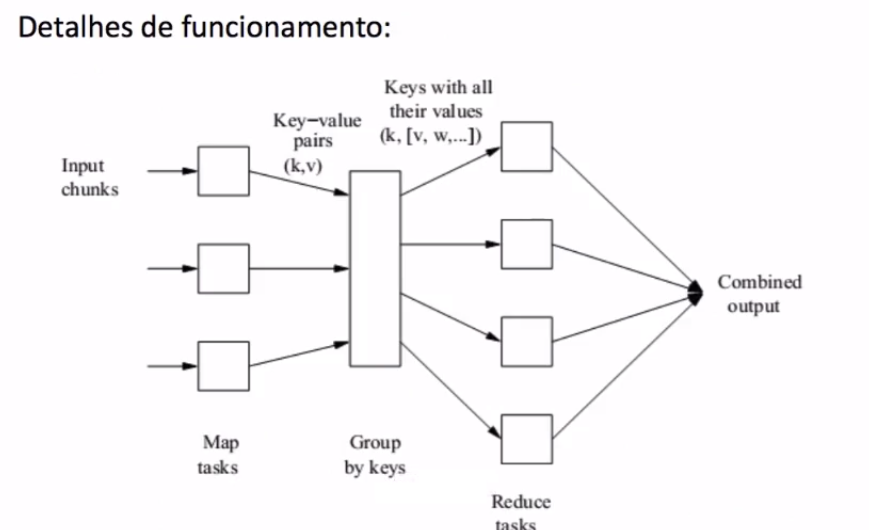
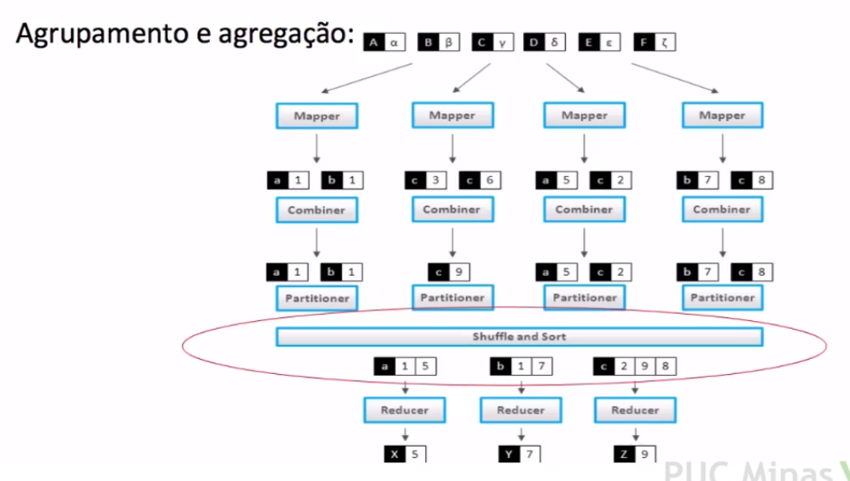
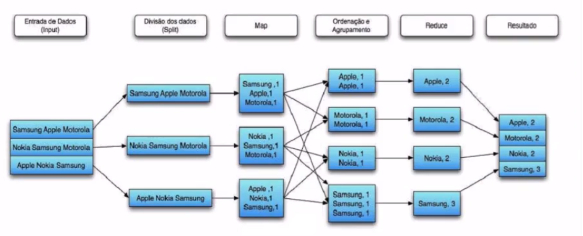
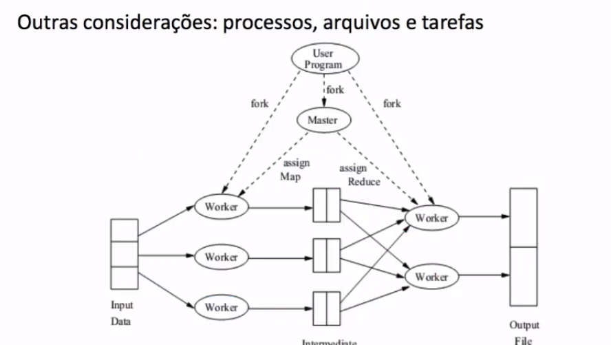
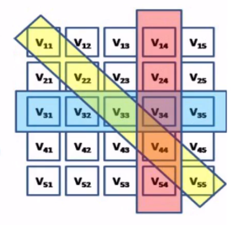
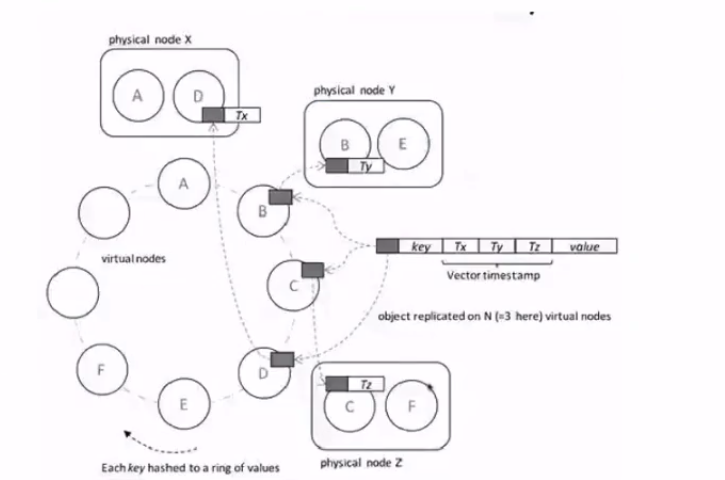

<h1>Paradigmas de computação - Distribuída e bancos de dados - Introdução</h1>

* Muitas soluções NoSQL buscam:
    * Resolver problemas Big Data;
    * Demandar estrutura de computação paralela;
    * Esquemas de particionamentos (shared nothing);
    * Tolerância a falhas;
    * Escalabilidade.

* Alguns paradigmas de computação são fundamentais:
    * Várias soluções vão utilizar sistemas de arquivos distribuídos;
    * Esquemas de controle de réplicas e consistência dos dados;
    * Algortimos para execução paralela em conjunto com estruturas de arquivos;

<h1>Sistema de Arquivos Distribuídos</h1>

* Histórico:
    * Processamento intensivo era feito em hardware especializado (processadores, cache, discos e memória).
    * A Web e o Big Data exigem processamento intensivo, mas em outra estrutura de hardware:
        * Centenas ou milhares de computadores em rede (nós);
        * Operação destes computadores de forma mais ou menos indepentende;
        * Cada um dos nós é um 'commodity hardware' - custo reduzido;
        * A estrutura em geral é tolerante a falhas;
        * Utilizam sistemas de arquivos especializados;

* Organização física da estrutura:
    * A organização física destas máquinas pode seguir este exemplo:
        * Nós são armazenados em racks (8-64 em um rack);
        * Os nós em um rack são conectados via rede (gigabit Ethernet);
        * Conjuntos de racks são disponíveis na estrutura formando uma espécie de cluster;
        * A conexão entre os racks também pode ser otimizada;
        * Quanto maior o número de racks ou nós, maior a probabilidade falha (de um dos nós);
    

* Computação neste estrutura:
    * Cálculos computacionais nesta estrutura podem levar minutos ou mesmo horas;
    * Os cálculos não podem ser reiniciados toda vez que um componente (racok ou nó de execução) falha;
    * Proposta de solução:
        * Arquivos armazenados de forma redundante (Distributed File System - DFS);
        * Cálculos devem ser divididos entre os nós, de forma que se algum nó falahr, somente o trabalho atribuído ao nó deve ser reexecutado;

* Características DFS:
    * Arquivo devem ser 'grandes', gigabytes, pelo menos;
    * Arquivos menores não fazem sentido no DFS;
    * Arquivos no DFS são raramente atualizados (write-once-read-many). Adicionalmente dados são adicionados para os arquivos (periodicidade, processamento batch);
    * Arquivos são divididos em partes ('chunks' ou blocos), normalmente 64 megabytes e replicados para, pelo menos, 3 nós (em racks diferentes).
    * Os Itens acima são customizáveis;
    * As informações dos blocos e replicas é controlado utilizando metadados e com uma figura central no cluster: 'name node' ou 'master node';
    * Name node:
        * Gerencia o sistema de arquivos (réplicas, blocos, nós e racks): abrir, fechar, renomear arquivos;
        * Gerencia o acesso dos clientes aos arquivos;
    * Os outros nós do cluster são chamados de 'data node' ou 'slave node'.
        * Executam as operações enviados pelo 'Name node': criação, exclusão e replicação de blocos;
    * Possuem regras de sistemas de arquivos: rack, 'data node', namespaces, diretórios e arquivos;
    * Além disto o DFS gerencia os blocos e sua distribuição/replicação nos 'data nodes';
    * Padrão de réplicas 1/3 (fora do rack) e 2/3 (no rack);
    * O 'name node' periodicamente recebe um relatório de blocos do 'data node';
    * O 'name node' é replicado para outra estrutura no DFS e também possui log de alterações;
    * A estrutura de arquivos é, tipicamente, mantida em memória;
    * 'Name node' também faz rebalanceamento de carga: elevada demanda para um bloco, por exemplo;

* Implementações DFS:
    * 'Google File System' (GFS), implementação original e primeira a ficar 'famosa';
    * Hadoop Distributed File System (HDFS), open-source. É disponibilizada pela fundação apache e implementada em java;
    * CloudStore, é outra implementação DFS open-source, originalmente desenvolvida pela Kosmix;

<h1>Algoritmo Map Reduce</h1>

* Origens:
* Patente Original é do Google, mas é utilizado em várias outros sistemas de computação paralela;
* A ideia é derivada da programação funcional:
    * Map e Reduce são dois tipos de funções comuns;
    * Map:
        * Aplica uma função ou operação para cada elemento em uma lista; Ex: multiplicação por 2; [1,2,3,4] Map function -> [2,4,6,8]
        * Não altera o dado original. Evita o principio 'Shared Data';
        * Pode ser executado de forma paralela;
    * Reduce:
        * É uma função de agrupamento ou compreensão;
        * Aplica uma função em conjunto de dados reduzindo para um simples valor;
        * Pode ser executado de forma paralela;
        * Ex: [2,4,6,8] -> Reduce function -> [20]
    * De forma geral:
        * O algoritmo pode ser usado sempre que hovuer uma lista;
        * Para cada elemento da lista uma função que transforme;
        * Outra função que possa ser aplicada ao conjunto de dados transformados de forma a agregá-los.

* Detalhes de funcionamento:
    * A implementação do algoritmo é utilizada para realizar computação no DFS para arquivos 'grandes' e com execução tolerante a falha;
    * É necessário escrever as duas funções: Map e Reduce;
    * O sistema lida com os demais detalhes:
        * Execução paralela;
        * Coordenação de tarefas (Map e Reduce);
        * Lidar com a tolerância a falhas;

* Detalhes de funcionamento:

* Seguintes passos de execução:
    * Um arquivo é armazenado em DFS com vários blocos em vários nós e racks;
    * Um conjunto de tarefas do tipo Map é criado, para cada Map existe um ou mais blocos que serão processados; As tarefas Map vão transformar o dado em uma estrutura chave valor ou tuplas;
    * As estruturas chave valor são coletadas pelo controlador master e ordenadas pelas suas chaves;
    * As chaves serão agrupadas e divididas para as tarefas do tipo Reduce (uma chave, com vários valores será processado por uma e só um tarefa Reduce);
    * As tarefas do tipo Reduce vão então agrupar os dados pelas chaves.
    

* Tarefas Map:
    * Um bloco no DFS possui vários 'membros' que serão processados. Cada membro só pertence a apenas 1 bloco;
    * A estrutura chave valor é importante pois permite a execução de várias tarefas Map em paralelo;
    * A funçaõ Map é respnsável por converter os dados para a estrutura chave valor;
    * Chaves não são 'chave', no sentido estrito, não precisam ser únicas;
    * Exemplo clássico - Contar o número de palavras em uma coleção de documentos:
        * Cada tarefa Map lê um documento ou vários documentos;
        * Cada palavra será considerada uma chave: w1, w2,..., wn;
        * A seguinte estrutura chave valor será criada:
            * <w1, 1>
            * <w2, 1>
            * <wn , 1>
        * Sugestões para melhorar a função Map???

* Agrupamento e agregação:
    * São realizados, sempre da mesma forma, independente do que as funções Map e Reduce façam
    * O "Name Node" controla este processo:
        * O número de tarefas reduce já são conhecidos: r (pode ser previamente determinada);
        * Cria uma função hash (0 até r-1) que é aplicada nas chaves;
        * Cada chave gerada pela tarefa Map é então gravada em um dos r arquivos locais;
        * APós todas as tarefas map serem finalizadas o "master node" faz um merge dos arquivos e que são então.
    
* Agrupamento e agregação:

* Tarefas Reduce:
    * Para cada chave k, a tarefa reduce recebe um conjunto de apres na forma (k, [v1,v2,v3,...,vn]) oriundos de várias tarefas map na forma (k, v1)(k,v2)...(k,vn);
    * A tarefa reduce deve combinar os valores de alguma forma;
    * Exemplo clássico: Contar o número de palavras em uma coleção de documentos:
        * A função reduce apenas faz a soma dos valores para cada uma das chaves wn.
        * Desta forma a saída da função reduce será um conjunto de chaves-valor na forma (w,m);
        * Em que m é o total de vezes que a palavra w aparece em todos os documentos;
    ]
    

* Outras considerações:
    * Revisão: processos, arquivos e tarefas
        * O 'Name node' é responsável pela criação das tarefas de Map e REduce nos 'data nodes';
        * É ideal que se crie uma tarefa map para cada bloco;
        * O número de tarefas reduce deve ser mais reduzido, a intenção é evitar a explosão do número de arquivos gerados pela tarefa map (um arquivo para cada reduce);
        * O 'name node' acompanha a execução das tarefas (em espera, executando, completo); Quando um processo termina ele comunica para o 'name node';

<h1>Consistência em bancos de dados não relacionais</h1>

* Consistência Estrita
    * Todas as operações da leitura devem retornar dados da última operação de escrita completa;
    * Operações de leitura e escrita em um único nó.
    * Utilização de protocolos de transação distribuída;
    * De acordo com o teorema CAP, não pode ser conseguida em conjunto com disponibilidade e tolerância a partição.

* Consistência eventual
    * As operações de leitura irão, eventualmente, ler dados da última operação de escrita;
    * Pode haver leituras incosistentes pois o sistema geral esta em atualização;
    * Em um cluster uma leitura pode ser feita a partir de uma réplica que ainda não foi atualizada, pois o último processo de escrita aconteceu em outra réplica do dado;
    * Em alguns sistemas este tempo de atualização das réplicas pode ser 500 milisegundos;
    * Se bancos de dados são distribuídos (vários nós), há a chance de dados serem lidos e alterados em qualquer nó;
    * Consistência estrita não é possível neste cenário;
    * Desta forma existe a necessidade de controlar modificações e versões concorrentes para quais o estado final do banco de dados vai convergir;

* Tratamento e versionamento: ambientes distribuídos
    * Timestamp: exige a necessidade de um relógio sincronizado em todo cluster;
    * Vetores e relógios: muito usado, mas exige alguma forma de resolver conflitos;

* Vetores de relógios
    * Item i da cópia local - diagonal;
    * O que a replica sabe sobre a atualização das demais replicas-linhas da matriz;
    * O que todos sabem sobre uma determinada réplica - colunas da matriz;
    
    
    * As resoluções de conflitos, assim como os vetores de relógios, possuem uma teoria mais extensa;
    * Outras tecnologias NoSQL utilizam outras abordagens;
    * A propagação e resolução dos conflitos envolve:
        * Propagação de dados;
        * Propagação de operações;
        * Vetores de relógios também podem estar nos clientes;
        * Sistemas de filas para replicas operações - negociação entre as replicas sobre a ordem das alterações;

* Trabalho prático - Map Reduce;
* Reflexão
    * Quais são as principais características dos sistemas de arquivos distribuídos?
    * Qual a proposta do paradigmas de processamento Map Reduce? Podem ser aplicados em qualquer cenário de computação?
    * O que as funções Map e Reduce fazem especificamente?
    * Que tipo de problemas existem no quesito consistência, considerando: um banco de dados distribuído, orientado a tolêrancia a partição e disponbilidade.
    * Em que cenários a consistÊncia eventual não seria um problema?

<h1>Exercícios:</h1>

* 1 - Considerando o DFS, é incorreto afirmar:
    * R: O DFS possui um protocolo de transações distribuídas e pode e é gerenciado pelos data nodes.
    Justificativa: O DFS não possui mecanismos de controle de transação. Mesmo se tivesse, todo o gerenciamento é feito pelo name node (versão hadoop 1.0, por exemplo)

* 2 - Considerando o algoritmo MAP e REDUCE, a opção que melhor define o que função MAP faz é:
    * R: Aplica uma função, que deve ser executada de forma independente, em cada membro de uma estrutura de dados, gerando uma estrutura chave e valor. O algoritmo pode ser usado sempre que houver uma lista; Para cada elemento da lista uma função que a transforme; Outra função que possa ser aplicada ao conjunto de dados transformados de forma a agregá-los;

 