<h1>Banco de Dados Baseados em Chave Valor</h1>

* Conceitos

* Proposta Chave Valor:
    * Modelos de dados simples;

* Em essência:
    * Estrutura de mapas (hash maps) ou dicionários (chave-valor);
    * Permitir os clientes: put(chave, valor) e get/request(chave);

* Boa parte das soluções chave valor favorecem a escalabilidade (versus consistência);

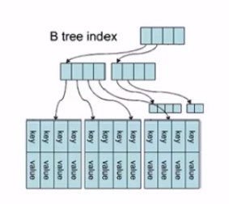

* Origem: Distributed Hash Table - DHT;

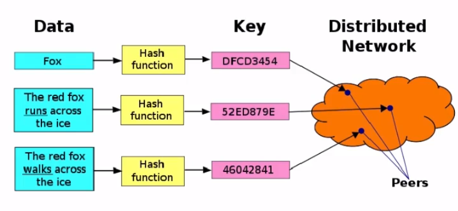

* Proposta:
    * Ausência de algumas funções analíticas: junções e agregações;
    * Armazenamento das chaves é limitado (bytes) e normalmente não há restrições para os valores;
    * Pode se dizer 'ausência de esquema':
        * Chave valor;
        * Algumas soluções, REDIS, transforma o valor em listas, grupos ou hash;

* Algumas soluções:
    * Redis:
        * site: http://redis.io/
        * Histórico: Iniciado em 2009 por Salvatore Sanfilippo em sua startup (http://llogg.com/). VMWare patrocina o projeto;
        * Linguagem: Foi implementado em C;
        * Métodos de acesso: Conjunto de métodos e operações que podem ser acessados através de linhas de comando ou utilizando bibliotecas de linguagens como: Java, Python e Ruby;

    * Riak:
        * Site: http://wiki.basho.com
        * Histórico: Criado pela empresa Basho (empresa criada em 2008);
        * Linguagem: Foi implementado em Erlang, faz uso também de C e JavaScript;
        * Métodos de acesso: possui interface para JSON (sobre HTTP). Existem bibliotecas para Erlang, Java, Ruby, Python, PHP e JavaScript;
    
    * Voldemort:
        * Site: http://project-voldemort.com
        * Histórico: Criado pelo time de dados e analytics do Linkedin;
        * Linguagem: foi implementado em Java;
        * Métodos de acesso: Java e pode ser usado com HADOOP;
        * Linkedin faz uso desta solução;

<h1>Banco de Dados Baseados em Chave Valor - Amazon Dynamo DB</h1>

* Características:
    * Arquitetura Distribuída - 'Shared Nothing';
    * Orientado para desempenho:
        * Na criação da tabela deve se especificar as características de desempenho (leitura/escrita);
        * Automaticamente aloca os recursos para a tabela e faz a partição dos dados de acordo com o número de servidores disponíveis e desempenho especificado;
    * Não existe limite (volume) para uma tabela;
    * Escalabilidade horizontal: centenas de servidores;
    * API simplificada - itens:
        * Get, Put, Delete e Update;
        * API disponíveis em .NET, PHP e Java;
    * Operações com tabelas
        * Permite a criação, atualização e exclusão de tabelas;
        * A atualização pode alterar aspectos relativos ao desempenho;
        * Função de descrição da tabela (metadados) - describe;
        * Possui operações de query e scan table;
    * Segurança:
        * Provê mecanismos de autenticação e autorização;
        * Mecanismo de segurança integrado com outros produtos Amazon;
    * Administração: interface simples para gerenciamento e manutenção - AWS Management Console;
    * Possui integração com o Amazon EMR - Amazon Elastic MapReduce:
        * HADOOP no cloud Amazon;
    * Também com outros produtos Amazon;

* Modelos de dados:
    * Inclui tabelas, itens e atributos;
    * Banco de dados: coleção de tabelas;
    * Tabela: coleção de itens;
        * Toda tabela deve possuir uma chave primária;
    * Item: coleção de atributos;
        * Não há limite no número de atributos;
        * Existe um limite de 64KB no tamanho do item (soma do tamanho dos atributos);
    * Atributos:
        * Cada atributo é um par: Nome e valor;
        * Atributos podem ser multi valorados;
        * Tipos de dados:
            * Escalares: Number, String e Binary;
            * Multi-valorados: String Set, Number Set e Binary Set.
        * Não permite campos nulos ou vazios (strings);

    * Ausência de esquema;
        * 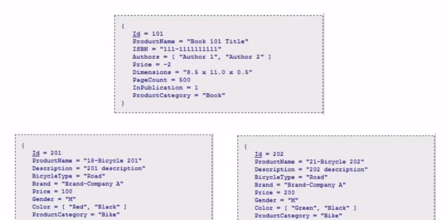
    
    * Chave Primárias:
        * Tipo Hash: Índice Hash não ordenado;
        * Tipo Hash e intervalar:
            * Dois atributos;
            * O primeiro é o hash;
            * O segundo é o intervalar: índice ordenado no hash;
        * 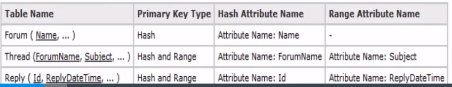
    
    * No site da Amazon existem algumas recomendações de 'melhores práticas' para utilização:
        * Valor em tabelas diferentes.
        * Utilizar tabela '1 para muitos' ao invés de grandes conjuntos de atributos:
        * 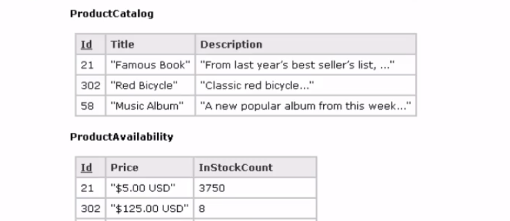
        * Compactação de grandes conjuntos de atributos;
        * Partição de grandes atributos em múltiplos itens:
        * 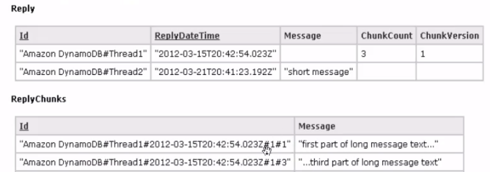

* Escalabilidade (tolerância a partição):
    * Não há diferenças entre os nós do cluster, todos tem o mesmo papel;
    * Suporta nós com diferentes configurações de hardware: faz balanceamento de carga considerando estes quesitos;
    * Uma requisição de cliente pode ser atendida por qualquer nó do cluster;
        * Um processo fica responsável por fazer a indicação de 'roteamento' chave - nós de cluster;
        * Biblioteca cliente determina o particionamento das chaves nos nós do cluster;
    * Utiliza o algoritmo 'consistent hashing' para particionar as chaves para nós do cluster;
    * Um hash map é criado apra chaves e nós do cluster;
    * Em um sentido horário:
        * Os intervalos das funções hash são distribuidos para um nó;
        * Cada nó também faz uso de seu vizinho para repassar réplicas;
        * De forma que se ele deixa o clsuter o vizinho tem condição de assumir a chave;
    * Neste algoritmo os próprios clientes podem usar a função hash para determinar em quais nós a chave deve residir;
    * 'Consistent Hashing' - Exemplo:
    * 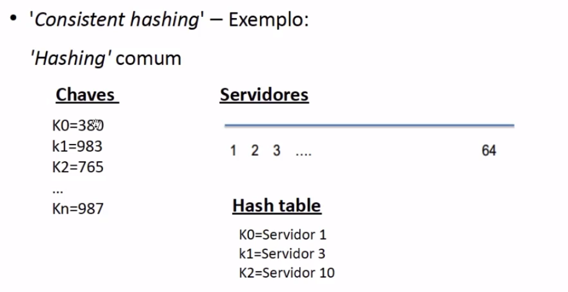
    * 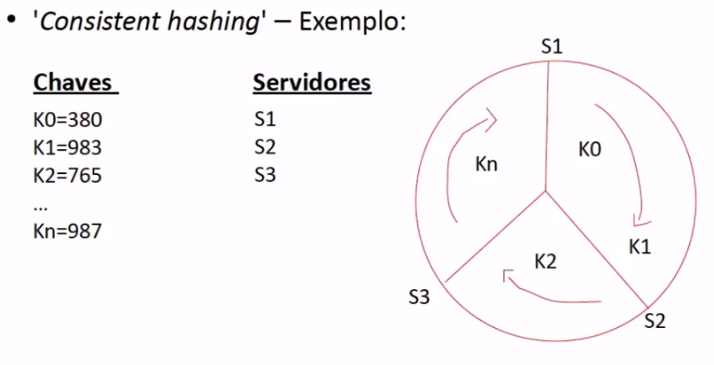
    * Dada uma solicitação para encontrar a chave;
        * Todos os servidores mantém uma estrutura de distribuição das chaves (hash map);
        * A requisição pode ser atendida por qualquer servidor;
        * Se ele possuir o dado, a requisição será atendida imediatamente, caso contrário ele já sabe qual servidor possui a chave e encaminha a requisição;

* Consistent Hashing
    * No Dynamo houve alteração no algoritmo original;
    * Original:
        * A distribuição dos nós no anel é aleatória (posição);
        * Esta distribuição para a função hash pode causar um desbalanceamento no caso de máquinas heterogênes;
    * Dynamo:
        * Utiliza o conceito de virtual node;
        * Máquinas com mais recursos possuem mais virtual nodes e vice versa;

* Réplicas
    * Se um nó deixa o cluster, os dados armazenados ficam indisponíveis, caso não tenham sido replicados;
    * No caso de um novo nó no cluster, nós adjacentes deixam de ser responsáveis por uma porção dos dados, mas ainda retém os dados;
    * Existe fator de replicação - r: os próximos r nós adjacentes (sentido horário) devem reter réplicas dos dados e serem também responsáveis pelos dados (lista de nós).
    * Exemplo com fator de replicação r = 3;
    * 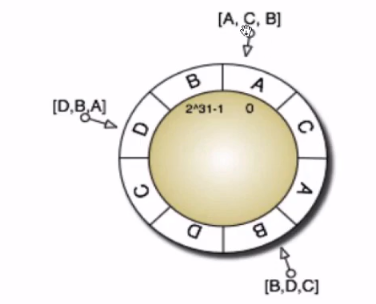

* Disponibilidade:
    * Possui um processo para descobrir nós que não estão mais ativos no cluster;
    * No caso de uma atualização em nó preferencial:
        * Se o nó não está disponível.
            * Processo coordenador indica outro nó (auxiliar) e faz uma réplica temporária dos dados com a atualização;
            * Assim que o nó retorna ao cluster a atualização com base na réplica temporária é realizada;
            * Replica temporária é excluída do nó auxilar;
    * O processo de adição e remoção de nós cluster é feito por administrador;
    * Na adição ou remoção o 'gossip protocol' é utilizado para repassar a informação da exclusão/inclusão do nó;
    * A adição de nós no cluster gera a alteração de faixas de chaves no anel do 'consistent hash';
        * Quando os nós descobrem que um nó foi adicionado, há a determinação de chaves que não estão mais sobre seu controle;
        * As transferências das chaves é realiazada;
        * De acordo com o caso, as chaves são excluídas do nó antigo;
    * Quando um nó é removido o processo acontece da mesma forma: ordem reversa;
    * A utilziação de réplicas também é utilizada para garantir a disponibilidade;

* Réplicas:
    * POde ser configurado para perceber que os nós estão em mais de um data center;
    * Inconsistências entre as réplicas são automaticamente gerenciadas:
        * Reconciliação sintática: não existe conflitos e a última versão pode ser considerada
        * Reconciliação semântica: há conflitos e será resolvido pelo cliente;
    
* Consistência:
    * A resposta de uma solicitação de escrita possui durabilidade (escrita realizado em mútiplos servidores);
    * Existe um período de tempo necessário para a propagação da atualização em todas as réplicas:
        * Consistência eventual;
    * Há a chance de algumas atualizações não serem realizadas em algumas réplicas, em caso de falhas de nós;
    * Oferece a possibilidade de uma leitura requisitar o dado mais atualizado possível: Leutra consistente/resolução de conflitos;
    * Para o caso de detecção e resolução de conflitos utiliza o vetor de relógios;
    * TOda operação de update necessita de um contexto: O vetor de relógios, para determinar qual réplica será atualizada;
    * Atualização condicional
        * Especificar uma condição na atualização de um item:
            * Item só é escrito se a condição é atendida;
        * Exemplo (lost-update)
            * Na atualização o cliente verifica se a versão anterior (cópia obtida) continua 'vigente' no servidor;
            * SE sim faz a atualização, caso contrário recebe a nova versão e repete a operação de atualização;
        * Possui a funcionalidade de "atomic counter": adicionar ou subtrair de contador de forma atômica.
    
<h1>Banco de Dados Baseados em Documentos</h1>

* Conceitos
    * Não são sistemas de gerenciamento de documentos (CMS).
    * Alguns consideram os bancos de dados baseados em documentos como a próxima evolução dos bancos chave e valor;
    * O termo documento = conjunto estruturado de chaves e valores;
    * Bancos de dados relacionais possuem forte esquema (tabelas e colunas)
    * Bancos de dados chave valor trabalham com valores tratados na forma de difícil interpretação;
    * Bancos de dados de documentos optam por um terceiro caminho: dados estão contidos em documentos que não possuem um esquema fixo;
    * Este esquema é conhecido pelas aplicações que consomem os dados, assim como pelo próprio banco de dados;
    * O documento é tratado como um todo e não como chave valor;
    * Oriundo do JSON (JavaScript Object Notation)
    * 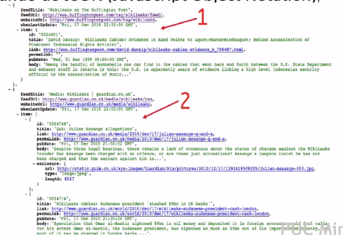
    * Utilizam o termo de coleção de documentos;
    * No nível da coleção é possível agrupar vários documentos;
    * Diferentemente dos bancos de dados chave valor, no banco de dados baseados em documentos é possível indexar os documentos com base nas suas propriedades;

* MongoDB
    * Site: http://www.mongodb.org
    * Histórico: Criado pela empresa 10gen;
    * Linguagem: Foi implementado em C++;
    * Método de acesso: possui uma linha de comando JavaScript e possui bibliotecas de acesso em C, C#, C++, Erlang, Haskell, Java, JavaScript, Perl, PHP, Python, Ruby e Scala.
    * Vantagem: SQL-like

* CouchDB:
    * Site: http://couchdb.apache.org
    * Histórico: Criado em 2006 e incubado no projeto Apache em 2008;
    * Linguagem: foi implementado em Erlang com algumas implementações em C e JavaScript;
    * Méotod de acesso REST (Representattional State Transfer)
    * Utilização: Apple, BBC, Facebook (aplicativos) e outros;

<h1>Banco de Dados Baseados em Documento - CouchDB</h1>

* Características:
    * CouchDB = "Cluster of Unreliable Commodity Hardware Database"
    * Descendente do 'Lotus notes';
    * Utiliza a filosofia RESTful;
        * Arquitetura de aplicativos da Web fracamento acoplados que contam com recursos nomeados: Localizador Uniforme de Recursos (URL), Indentificador Uniforme de Recursos (URI) e Nome de Recurso Uniforme (URN);
        * RESTful possibilita sistemas altamente escaláveis, enquanto são fracamente acoplados aos dado subjacentes;
    * Utiliza a filosofia RESTful;
        * Utilizam aspectos do protocolo HTTP como pedidos GET e POST;
        * Pedidos são mapeados para necessidades de aplicativo de negócio, como CRUD: Create, read, update e delete
    * Em resumo: banco de dados de documentos que é acessado via RESTful HTTP;
    * Documentos são schema-free;
    * Considerado por alguns como banco de dados semi-estruturado;
    * Com a base de documentos:
        * Funções de seleção e agregação dos documentos podem ser criadas no paradgima 'map reduce' -> visões do banco de dados;
        * São replicadas entre 'data nodes';
    * Cada documento possui um único ID;
    * Utiliza o conceito de múltiplas versões do mesmos documentos;
    * Para as várias versões de um mesmo documento o banco de dados detecta conflitos e delega para os clientes a resolução;
    * Possui um mecanismo simples de segurança de documentos e usuários;
    * Funções especiais JavaScript podem ser escritas para serem executadas antes da gravação dos arquivos no disco. Se houver erro retorna e não grava o arquivo;

* Modelo de Dados
    * Documentos
        * Conjunto de nomes e valroes
        * Os nomes devem ser únicos em um documento;
        * Os valores podem ser dos tipos: carácter, número, lógico, data, lista ordenada e outros;
        * Pode haver links entre os documentos (URL ou URI), mas não há validação da referência;
        * O ID do documento é uma chave com 128 bits e o número da revisão contém 32 bits;
    * Visões
        * É a forma de apresentar 'consultas' a partir dos dados semi-estruturados;
            * Ex: Obter o número de documentos por tipo do documentos. Para o banco de dados eles continuam sendo apenas documentos;
        * As visões são definidas em JavaScript;
        * As funções são armazenadas nos bancos de dados e são funções map/reduce;
            * A função map: recebe o documento como parâmetro e realiza operações nos dados, logo após emite os dados: document id, chave e valor;
            * A função reduce: é opcional e pode fazer uma agregação nos dados;
        * São executadas e materialzadas quando as visões são acionadas pela primeira vez;
        * Existe um processo chamado 'view-builder': responsável por atualizar as views:
            * COmpara o id do ducmento e revisão das views com o banco de dados;
            * Verifica documentos excluídos e criados desde a atualização da visão;
            * Atualização da visão é eficiente: 'append-only';
            * Durante a tualização da visão, a versão anterior continua disponível;
        * Se o ducmento possui uma nova revisão, somente a função map para aquele documento é executada;
        * As visões são aramzenadas em uma estrutura B-tree, da mesma forma que os documentos;
        * As visões são aramzenadas em arquivos separados e ajustados para maior desempenho;
        * Não existe limitação para o número de visões por bancos de dados;
    * Bancos de dados
        * Cada banco de dados consiste em um conjunto de documentos - o servidor gerencia os ID's dos documentos;
        * Um 'server node' pode conter mais do que banco de dados;
        * Os documentos são retidos no disco como arquivos XML ou serializados no formato JSON;
        * Uma indexação B-TREE é feita para os ID's dos documentos e número de revisão;
        * Realiza periodicamente (agendada ou de acordo com threshold) a compactação do banco de dados (espaço em disco) - Append-only; É realizado sem parar o banco;
    
* Escalabilidade (Tolêrancia a Partição):
    * Não possui papeis especiais para os nós: 'server nodes';
    * Faz replicação de documentos ou partes de documentos entre diferentes 'server nodes';
    * O cluster possui um processo de replicação que opera de forma incremental (avaliando as versões) e por documento (parcial);
    * A distribuição de documentos por nós pode ser manual ou automática;
    * Utiliza o algoritmo 'consistent hashing' para atribuir os dados para os nós;
    * Os documentos são armazenados nos nós em partições: metadadoss de documento ID por partição;
    * No caso de nvoas máquinas as partições são movidas ou replicadas: de acordo com o caso usando 'consistent hashing';

* Disponibilidade:
    * Para a tolerância a falhas recomenda-se a utilização das replicas de documentos e múltiplos bancos de dados;
    * Nesta configuração o cluster possui:
        * Elevada disponibilidade;
        * Faz balanceamento de carga;
    * A adição de 'servers nodes' melhora o desempenho e a tolerância a falhas;

* Consistência
    * Usa o MVCC - Multi-Version Concurrency Control: Todas as versões dos documentos nos nós;
    * MVCC = 'append only';
    * A consistência, em um cenário clluster, é eventual;
    * A resolução de conflitos deve ser feita em tempo de leitura:
        * Regras pré-definidas na replicação;
        * Pelo próprio cliente no momento da leitura;
        * Observe que na resolução de conflitos todas as versões dos dados estarão disponíveis;
    * Administração de usuários
        * Modelo de controle de acesso de documentos: listas de usuários autorizados a ler o documento ('readers');
        * Esta mesma restrição é válidas para as visões que acessam o documento;
        * Existe o perfil do adminsitrador: criar bancos e usuários;

* Atividade e Reflexão
    * Atividade
        * Demonstração utilizando o CouchDB
    * Reflexão
        * Faz sentido uma evolução do chave valor para os documentos?
        * O termo 'schemaless' é válido para os bancos de dados de documentos ou eles são semi-estruturados?
        * A importÂncia do paradigma Map/Reduce para o CouchDB e banco de dados de documentos?
        * Importância de ser avaliar o teorema CAP em uma solução NoSQL?

<h1>Bancos de dados baseados em colunas</h1>

* Conceitos
    * Origem: ANalytics e Business Intelligence;
    * Exemplo de produto: Sybase IQ - 2002;
    * A proposta é um armazenamento em colunas:
        * 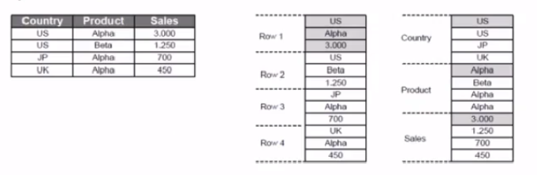
    * Orientada a linhas: fácil de adicionar novas linhas, leitura de colunas (dados) adicionais;
    * Orientado a colunas: Somente lê colunas necessárias, necessidade de 'busca' na adição de novas linhas;
    * Abordagem economiza espaço. Se a coluna for nula, não será armazenada.
    * Orientado para leituras (Data Warehouse):
        * Desempenho para várias agregações e leituras;
        * Escritas são executadas em lote;
        * Normalmente esta no Top 3 do TPC-H (Exasol, ParAccel, e Kickfire);
    * Cada unidade do dado (linha no SGBDR) é um conjunto de pares chave valor;
    * A unidade do dado é identificada com a ajuda de uma chave primária ('row key');
    * Um conjunto de colunas é chamado de família de colunas;
    * Dentro da família de colunas, as chaves primárias são armazenadas de forma ordenada;
    * Considere o seguinte exemplo:
        * 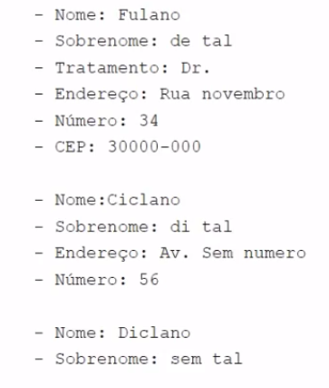
        * 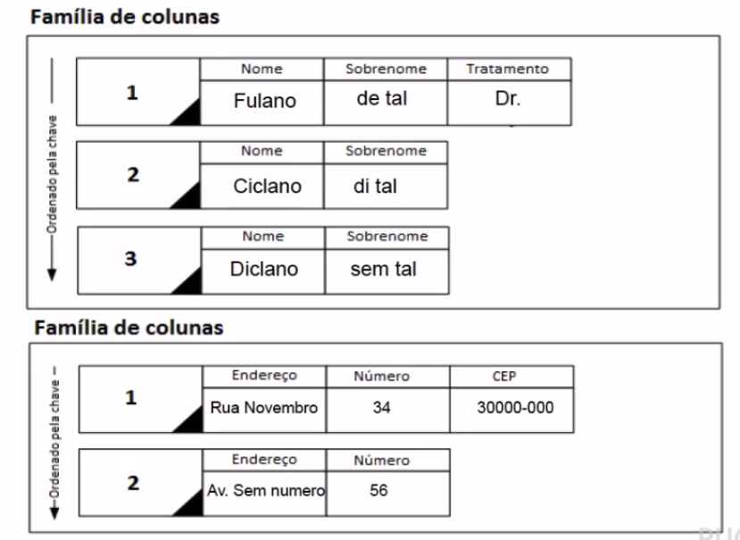
    * Cada coluna e linha possui controle de versão;
    * Milhões de colunas;
    * As colunas podem ficar em memória ou podem ser compactadas;
    * Família de colunas
        * Na prática as famílias de colunas não ficam fisicamente isoladas;
        * Definida no momento de criação dos dados;
        * É recomendável que não tenha alterações muito frequentes;
        * Cada família de colunas é uma estrutura chave valor. Cada família de colunas possui uma chave e a linha é então um 'hash-map':
            * 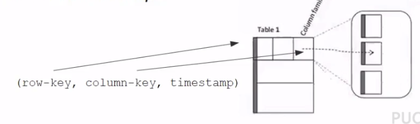
        * As chaves ordenadas propiciam a eficiência para leitura;
        * No acesso aos dados (leitura) além da chave ordenada, as colunas podem conter estruturas para melhorar as consultas:
            * 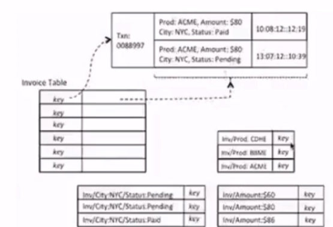
        * Lógica de acesso aos dados
            * (Table, RowKey, Family, Column, Timestamp) -> Value
            * SortedMap<RowKey, List<SortedMap<Column, List<Value,Timestamp>>>>
        * O primeiro 'SortedMap' é a tabela contendo a lista de família de colunas;
        * A família de colunas por sua vez, contém outro 'SortedMap' com as colunas e seus valores e versões;

    * Armazenamento
        * Todos os dados pertencentes a uma chave e são retidas em um conjunto;
        * O armazenamento dos dados é ordenado, mas o processo de partição entre os nós pode ser aleatório ou não;
        * Normalmente faz uso de DFS, desta forma a tolerância a falhas pode ser garantida com a replicação de dados em nós diferentes do 'cluster';
        * Arquivos de dados e logs são armazenados nos 'data nodes';
    
    * Arquitetura:
        * Alguns produtos utlizam os 'server nodes' e em outros não há figura de um controlador central;
        * Retêm metadados para:
            * Local de armazenamento de cada tabela;
            * Servidores disponíveis;
            * Informações de esquema: famílias de colunas;
            * Listas de controles de acesso;
        * No Google Bigtable um serviçoo central consiste de um cluster com 5 réplicas ativas. Em uma nova requisição, uma delas é eleita como 'master' e faz toda execução;
        * Exemplo HBASE:
            * 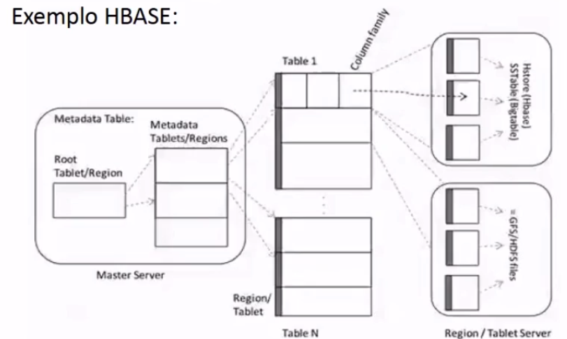
        * Exemplo Google BigTable:
            * 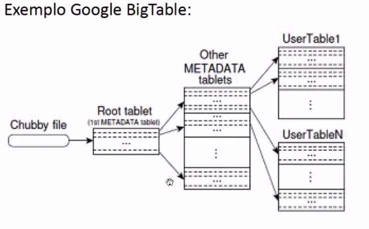
        * Possui arquivos de log (comum em vários produtos);
        * Também é comum nos bancos colunares o uso de 'write ahead log';
        * Exemplo HBase:
            * Cliente modifica o dado(put(), delete(), ...);
            * Modificações são tratadas para estrutura chave valor;
            * Dados são encontrados no Servidor(HRegionServer) e no arquivo (HRegion).
            * 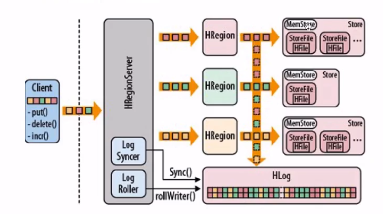
    
    * HBase:
        * Site: http://hbase.apache.org
        * Histórico: Criado pela empresa Powerset. Doado a fundação Apache antes de ser adquirida pela Microsoft em 2007;
        * Linguagem: Foi implementado em Java;
        * Métodos de acesso: REST (Representational State Transfer) e Java API; Outro projeto Apache introduz SQL neste banco de dados: Hive (http://hive.apache.org)
        * Utilização: Facebook, StumbleUpon, Mahalo, Yahoo e outros;

    * Cassandra:
        * Site: http://cassandra.apache.org/
        * Histórico: Desenvolvido no Facebook. Projeto teve ser código aberto em 2008. Foi doado para a fundação Apache;
        * Linguagem: Foi implementado em Java;
        * Métodos de acesso: Java API e outras linguagens: Python, Grails, PHP, .NET e Ruby; Possui o CQL - 'SQL-like' para manipulação de dados;
        * Utilização: Facebook, Twitter
    
<h1>Bancos de Dados baseados em colunas - Cassandra</h1>

* Cassandra

* Características:
    * Utiliza cocneitos tanto do AMazon DynamoDB quanto do Google Bigtable;
    * Em alguns livros e artigos é tido como um banco de dados chave valor;
    * Possui um API para os clientes simplificada (get, insert e delete);
    * Não possui nó central, utiliza um protocolo GOssip, em que troca de mensagens entre os servidores de forma intensiva;
    * Todos os servidores possuem log;
    * Possui também uma estrutura de dados em memória (Memtable). Dados são escritos no disco quando a memória esta cheia;
    * Nós podem ser adicionados em tempo real ao cluster;
    * Não utiliza uma DFS como o Google Bigtable. Dados são gravados localmente e, se for o caso, replicados;
    * Os arquivos de dados são compactados com certa periodicidade, por um processo de plano de fundo;
    * POssui uma linguagem 'SQL like': Cassandra Query Language -CQL (DDL, DML);
    * Um nó servidor no cluster cassandra executa alguns módulos:
        * Particionamento;
        * Mecanismo de armazenamento;
        * Detecção a falha e nó do cluster;
    * Todos os módulos são implementados em Java;
    * No caso de uma nova requisição;
        * Identifica-se qual nó possui a chave;
        * A requisição é enviada para o nó identificado e a requisição é atendida;
        * Caso haja falha na resposta, indica para o cliente e procura pela última réplica e response;

* Modelos de Dados:
    * 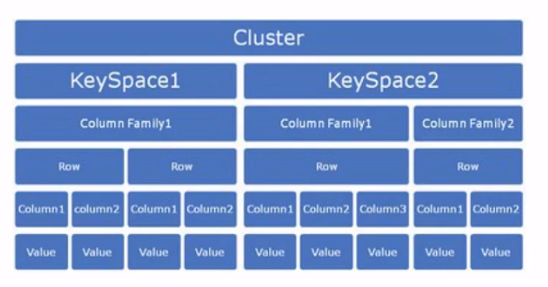
    * Coluna
        * É o elemento mais granular na hierarquia do Cassandra;
        * Possui a seguinte estrutura:
            * 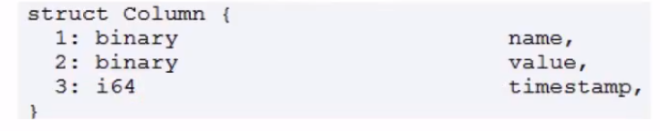
        * O valor 'timestamp' é fornecido pelo cliente e pode ser utilizado para resolução de conflitos;
        * O nome e valor são binários, podem ser serializados utilizando strings UTF8;
    * Famílias de colunas
        * É um repositório para linhas, analogamente, seriam as tabelas nos SGBDR's;
        * Cada linha em uma família de colunas é referenciada por sua chave;
        * O armazenamento das chaves nas famílias de colunas é ordenado, sendo configurável a ordenação aplicada (ASCII, UTF-8, Long, etc.);
        * Colunas relacionadas (serão acessadas em conjunto) devem ser armazenadas na mesma família de colunas;
        * Famílias de colunas - exemplo dinâmico:
            * 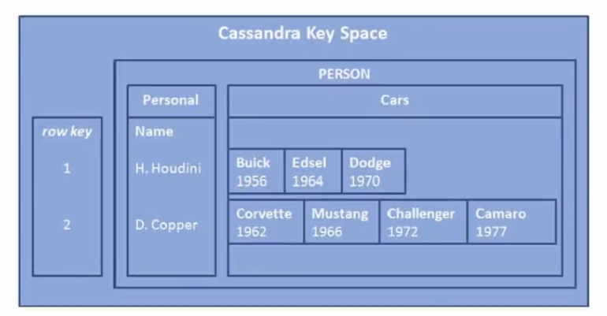
    * Linhas
        * Cada família de colunas é armazenada em um arquivo separado e o arquivo é ordenado por linhas;
        * A chave da linha é o que determina em qual nó do cluster será armazenado o dado;
        * Para cada chave pode haver dados em múltiplas famílias de colunas;
    * Super colunas:
        * As supercolunas são uma especie de agrupamento de colunas;
        * Mais especificamente é um 'hashmap' de colunas:
        * Exemplo:
        * 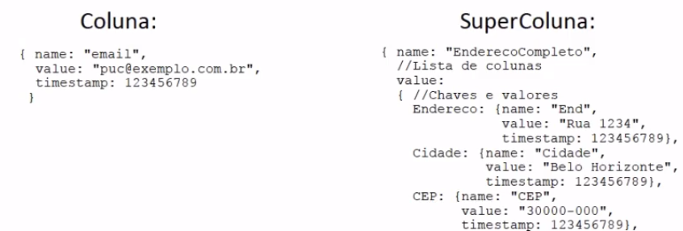
        * 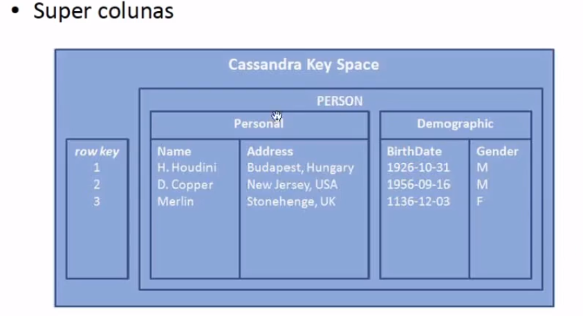
    * KeySpace
        * Pode ser considerado como esquema ou banco de dados (primeiro hash map do armazenamento no Cassandra);
        * Armazena as famílias de colunas;

* Escalabilidade (tolerância a partição):
    * Não possui papeis especiais para os nós: 'server nodes';
    * Os dados de uma família de colunas são particionados e distribuídos entre os nós utilizando o algoritmo 'consistent hashing' que preserva a ordem das chaves;
    * O algoritmo 'consistent hashing' possui uma alteração comparada com a do Amazon DynamoDB: não utiliza o conceito de 'virtual node';
    * Faz analise constante das cargas nos servidores e se necessária altera a ordem dos servidores no anel para o 'consistent hashing': foca no balanceamento da carga;
    * Os particionamentos são feitos pelas chaves: aleatório ou ordenados;
    * O particionamento dos dados é controlado por um arquivo de configuração: cassandra.yaml;
    * Uma vez que um cluster é iniciado com uma opção de particionamento, o mesmo não pode ser alterado sem que haja a recarga dos dados no cluster;

* Disponibilidade:
    * Utiliza o protocolo Gossip entre os nós do cluster;
    * No cluster cada nó tenta localizar e detectar se outro nó esta ativo/desativo (evitar tentativas de requisições que vão falhar);
    * As réplicas são controladas por um fator que é chamado de 'replication factor';
    * O fator de replicação é determinado por keyspace (banco de dados);
    * Um fator de replicação de 5, signifca que 5 réplicas de cada linha serão gerenciadas pelo cluster;
    * Existem alguns tipo de replicações:
        * Simples: utiliza o 'consistent hashing';
        * Grupo: permite implementar o conceito de diferentes 'rack's' ou múltiplos data center's; Arquivo: cassandra-topology.properties
        * 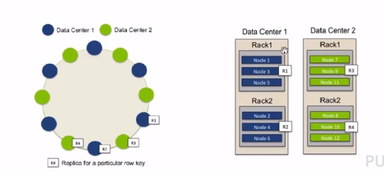
    
* Consistência:
    * A consistência pode ser escolhida (por requisição): escrita ou eventual;
    * No processo de escrita as seguintes opções são válidas:
        * Any (Eventual): a escrita é bem sucedida se é escrita em qualquer nó disponível;
        * One: A escrita é bem sucedida se é escrita em um nó responsável pela linha;
        * Quorun: a escrita é bem sucedida se é escrita em um conjunto de nós da réplica ((fator de replicação/2) + 1)
        * Local Quorun: A escrita é bem sucedida se é escrita em um conjunto de nós da réplica no mesmo local;
        * All (estrita): a escrita é bem sucedida se é escrita em todos os nós que contenham a chave;
    * Processo de reparação para leitura:
        * Garante que dados acessados com elevada frequência estaão sempre consistentes;
        * No processo de leitura há uma comparação dos dados oriundos das réplicas: se existe inconsistência um processo de escrita é acionada para as demais réplicas;
        * O processo de reparação para leitura vem configurado como padrão.
        * A configuração pode ser feita por família de colunas;
    * Passos para o processo de escrita, exemplo:
        * Processo tenta fazer a escrita para todos os nós que contenham a linha;
        * Se todos os nós não estão disponíveis, dados são armazenados em um nó descrevendo todo o procesos de escrita (espécie de log);
        * Se algum nó volta a ativa ou é contatado, a atualização é realizada;
    * Algumas opções de escrita estão disponíveis para leitura (Any, One, Quorum, Local_Quorum e All)
    * 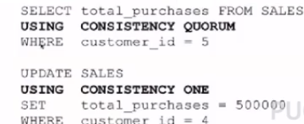

* Atividade:
    * Demonstração utilização mostrando o Cassandra

* Reflexão:
    * Em quais cenários os bancos de dados baseados em colunas são recomendáveis?
    * Como é tratada a consistência no Cassandra?
    * Importância de ser avaliar o teorema CAP em uma solução NoSQL?

<h1>Atividade Objetiva</h1>

* 1 - Considerando os bancos de dados chave e valor, é incorreto afirmar:
    * R: A consistência é facilmente configurada nesses produtos, pois eles têm um fraco suporte para tolerância a partição. Boa parte das soluções chave valor favorecem a escalabilidade (versus consistência);

* 2 - Considerando os bancos de dados baseados em documento, selecione a afirmação correta:
    * R: Na grande maioria dos casos, cada banco de dados consiste em um conjunto de documentos – o servidor gerencia os IDs dos documentos (um exemplo é o CouchDB). Justificativa a) não podemos afirmar que todos tem o nó central, o CouchDB, por exemplo não o tem. c) não podemos afirmar que todos fazem Map reduce e d)Nem todos os produtos possuem esta flexibilidade 

* 3 - Considerando os bancos de dados baseados em famílias de colunas, é incorreto afirmar:
    * R: Possuem esquema pré-estabelecido na criação de tabelas.  Justificativa: Bancos de dados baseados em colunas também pode ser schemaless, ou seja, fracamente dependentes de esquema de tabelas;

* 4 - Considerando os bancos de dados baseados em famílias de colunas, assinale o conceito que não se relaciona com o tema:
    * R: Subgrupos. Não existe o conceito de sub grupos em bancos de dados baseado em coluna

