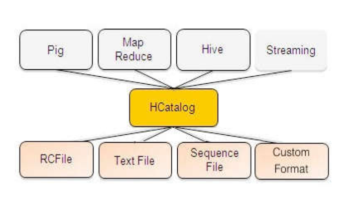

<h1>Introdução ao Hadoop</h1>

* Plataforma para processamento paralelo e distribuído.
* Hive - Produto do Hadoop capaz de processar os arquivos utilizando SQL

<h1>Hadoop - Introdução</h1>

* Motivação:
    * Estrutura de arquivos convecional não é capaz de lidar com dados massivos;
    * É necessário um paradigma que comporte escalabilidade elástica;
    * Bancos de dados relacionais utilizam conceitos, que às vezes, não são um requisito para dados massivos;
    * Um infra estrutura tolerante a falhas e que permita computação paralela é necessária;

* Mudança Arquitetural:
    * 
    * Requisitos:
        * Demandar estrutura de computação paralela;
        * Esquemas de particionamentos (shared nothing);
        * Tolerância a falhas;
        * Escalabilidade horizontal e elástica;
    * Alguns paradigmas de computação são fundamentais:
        * Várias soluções vão utilizar sistemas de arquivos distribuídos;
        * Esquemas de controle de réplicas e consistência dos dados;
        * Algoritmos apra execução paralela em conjuto com estruturas de arquivos;

* Visão Geral
    * 
    * 
    * 

* Hadoop
    * Plataforma para acesso a dados estruturados, semi estruturados (logs, tweets, sensor data) e não estruturados;
    * Executar o ciclo de: obter, reter e analisar grandes volumes de dados;
    * Open Source e mantida pela fundação Apache;
    * Características:
        * Escalabilidade;
        * Replicação de dados distribuída;
        * Utilização de 'commodity hardware' (NOW);

* Hadoop versus SGBDR
    * 

* Hadoop Componentes - Core
    * Hadoop: Plataforma para processamento e armazenamento de dados massivos (larga escala).
    * HDFS
        * Sistem de arquivos distribuídos para dados estruturados, semi-estruturados e não estruturados. Arquivos são divididos em bloco e armazenados com redundância no cluster;
    * Map Reduce
        * Framework para execução de processamento paralelos em mútliplos nós de trabalho para posteriormente combinar os resultados;
    * YARN (Hadoop 2.0)
        * Gerenciamento da execução das aplicações no cluster;

* Hadoop Componentes - Data Services
    * 
    * WEBHDFS
        * API REST que permite acesso via HTTP ao HDFS: movimentação de arquivos (entrada e saída) exclusão de arquivos;
        * Executar funções de arquivos e diretórios;
        * webhdfs://<host>:<http port>/path
    * Flume
        * Serviço distribuído para coleta, agregação e movimentação de streams de logs de dados para o HDFS;
        * Executar funções de streaming com capacidade de recuperação e tolerante a falhas;
        * Uso principal é para movimentação de arquivos de log diretamente para o HDFS/Hadoop;
    * Sqoop
        * Movimentação de dados para dentro do Hadoop a partir de bancos de dados relacionais e vice versa;
        * Ferramentas e conectores que permitem dados de bancos de dados relacionais (Oracle, DB2, MySQL) serem armazenados e obtidos do Hadoop;
    * PIG
        * Possibilitar a escrita de programas de transofrmação e movimentação de dados utilizando uma linguagem simples de script;
        * Pig Latin é a linguagem que define um conjunto de transformações nos dados permitindo: junção, agregação, ordenação entre outros;
        * A linguagem também pode ser estendida utilizando UDF's que podem ser escritas em JAVA e executadas a partir de comando Pig Latin;
    * Hive
        * Interface SQL para o Hadoop que possibilita sumarização de dados, consultas ad-hoc e análise de grandes volumes de dados;
        * Existem conectores que utilizam Hive e permitem conexões de algumas ferramentas de BI: Microstrategy, Excel, PowerPivot, Tableau e outros;
        * HiveQL (HQL) é a linguagem utilizada no Hive: 'compatbilidade' com o SQL;
    * HCatalog
        * Serviço de metadados que permite usuários acessarem dados no hadoop como um conjunto de tabelas sem a necessidade de fornecer detalhes sobre onde e como os arquivos estão armazenados;
        * Possibilita compartilhamento e interoperabilidade entre outras ferramentas de data service: Pig, Map Reduce e Hive;
        * Permite também interoperabilidade e acesso de dados para outros bancos de dados como SQL Server e Teradata(conexão hadoop via HCatalog);
    * HBase
        * Banco de Dados NoSQL (colunar - 'big table clone') para utilização de dados de forma interativa (não batch);
        * Comumente utilizando para servir aplicações inteligentes: recomendações de produtos, predição de comportamento de usuários;
    

* Hadoop - Hortonworks
    * 

* Hadoop - Hortonworks - BI Approach
    * 

<h1>Hive: Conceitos</h1>

* Conceitos

* Hive
    * Software para 'data warehouse' que facilita a consulta e gerenciamento de grandes massas de dados residentes em sistema de armazenamento distribuído;
    * Catacterísticas Hive:
        * Ferramentas capazes de realizar processos de ETL;
        * Mecanismo que cria uma estrutura para arquivos (independente do formato);
        * Acesso a arquivos residentes no HDFS ou outras fontes de dados, HBase por exemplo;
        * Execução de consultas utilizando HQL ou via MapReduce;
    * 'Estruturar' dados não estruturados;
    * Acessar este dados utilizando uma ferramenta 'SQL-like': HiveQL - HQL;
    * Algumas verdades:
        * Não é um banco de dados relacional. Dados estão no HDFS;
        * Não foi desenvolvido para processamentos on-line. Consultas executam no Hadoop: Map Reduce. Pode haver latência elevada;
        * Não é recomendado para consultas de tempo real ou para fazer atualizações nos dados;
    * Caso de uso:
        * 
    * Você precisa:
        * Fazer consultas 'ad-hoc';
        * Sumarizar os dados;
        * Fazer análise dos dados;
    * Arquitetura Hive:
        * 
    * HCatalog
        * Era um projeto independente, mas foi fundido com o Hive em 26/03/2013;
        * Criar e prover acesso aos metadados Hive para ferramentas internas ou externas no Hadoop;
        * Características HCatalog:
            * Prover metadados (esquema e tipo de dados) para ferramentas hadoop;
            * Prover a abstração de 'tabelas' - não há necessidade de saber onde e como as 'tabelas' armazenadas;
            * Interoperabilidade: Pig, Map Reduce e Hive;
            * Oferecer interface de acesso REST para metadados Hive;
        * Apresentar para usuários uma 'visão relacional' dos dados;
        * Por padrão suporta arquivos: CSV, JSON e arquivos sequenciais;
        * Pode ser estendido uma vez que seja fornecido de input e output;
        * Tabelas podem ser particionadas por uma ou mais chaves (utilizando hash);
        * Para tabelas particionadas não garante consistência de leitura (no caso da exclusão de uma partição);
        * Uma vez que uma partição é criada, dados não podem ser inseridos, atualizados ou removidos;
        * Estrutura das partições é multidmensional;
        * Esquema de acesso via HCatalog
            * 
        * Cria metadados para objetos e Hive (HCatalog MetaStore) a adicionamente fornece:
            * Para usuários Pig: acesso ao HCatLoader e HCatStorer,
            * Para usuários Map Reduce: acesso HCatInputFormat e HCatOutputFormat;
            * 
        * Exemplos de script HCatalog:
            * hcat.py -f meuscript.hcatalog
            * hcat.py -e "create table alunos (nota int)"
        * HCatalog DDL:
            * Create/ALTER/DROP table;
            * Show table;
            * DESCRIBE;
            * Suporte comandos DDL Hive;
        * HCatalog exemplo DDL:
            * 

<h1>Hive: SQL e HQL</h1>

* SQL
    * Grande número de implementações para os SGBDR: mercado sedimentado;
    * Padrão de mercado: muitas aplicações utilizam SQL;
    * Primeira publicação ISO foi em 1987. Outras versões revisadas aconteceram em 1989, 1992, 1999, 2003, 2008 e 2011;
    * Muitas pesquisas indicam SQL como um linguagem fundamental para os cientistas de dados;

* SQL - Breve Revisão
    * Data Manipulation Language - DML
        * SELECT ... FROM ... WHERE ...
        * INSERT INTO ... VALUES ...
        * UPDATE ... SET ... WHERE ...
        * DELETE FROM ... WHERE ...

* HiveQL - HQL
    * Baseado na especificação SQL-92;
    * Converte SQL em processo MapReduce;
        * 'Inserts' são executados de forma paralela, por exemplo;
    * Permite também a criação de códigos específicos de MapReduce;
    * Também é possível criar UDF que podem ser executadas nos comandos HQL;
    * No Hadoop 2.0 com o uso do Yarn a 'Hortnworks' eformulou o Hive para processamento em tempo real sem o uso de MapReduce;
    * Tabelas Hive
        * Consistem de:
            * Dados: arquivo ou conjunto de arquivos no HDFS, por exemplo;
            * Esquema (Schema): metadados aramzenados no metastore;
        * Esquema e dados são separados:
            * Um esquema pode ser definido para dados já existentes;
            * Dados podem ser adicionados ou removidos de forma independentes do esquema;
            * É necessário utilizar um esquema no Hive para 'enxergar' os dados;    
    * Exeplo de criaçao:
        * 
    * Exeplo HQL:
        * 

* Hive
    * Carregando dados:
        * Utilizar o comando LOAD DATA para importar arquivos:
            * hive > LOAD DATA LOCAL INPATH 'input/meusdados/dados.txt' INTO TABLE MTABELA;
        * Arquivos não são alterados pelo comando;
        * Hive armazena os dados em um diretório padrão: /hive/warehosue;
        * Há o comando OVERWRITE para substitiuir dados já existentes;
        * O esquema da tabela é avaliado quando so dados são lidos e não quando são gravados; Se a linha não esta consistente com o esquema a linha é lida como nula;
        * Utilizar o comando INSERT:
            * hive>CREATE TABLE idade_emp(nom_id string, idade int);
            * hive>INSERT OVERWRITE TABLE idade_emp select idade, count(idade) from empregados;
        * Utilização do comando para inserir dados de uma tabela em outra;
        * Normalmente resutlado de uma consulta de Big Data são muito grandes, alternativa: utilizar o comando insert para reter os dados da consulta;
        * OVERWRITE: executa um comando delete na tabela, caso contrário será realizado um append;
    * Particionamentos
        * Hive organiza tabelas em partiçoes
        * As tabelas são divididas em 'buckets' de acordo com o(s) domínio(s) de uma ou mais colunas;
        * As partições são baseadas em uma função hash que é aplicada na(s) coluna(s);
        * O tempo de resposta das consultas pode ser otimizado (cláusulas baseadas em where), cada valor da coluna é aramzenado em um diretório específico;
        * Para agrupamentos pode impactar negativametne o desempenho;
        * Para casos em que o dmínio é muito grande, pode causar um overhead para o Name Node (mantém todo sistema de arquivo em memória - centenas de milhares de arquivos, por exemplo);
        * Exemplos:
            * 
    * Consultas:
        * HQL suporta:
            * Cláusula Where;
            * Comandos Union ALL e Distinct;
            * GROUP BY e HAVING
            * JOINS
            * Cláusula LIMIT: limitar o número de linhas de forma aleatória;
            * Sub consultas
                * SOmenta na cláusula FROM
                    * SELECT total from (SELECT c1 + c2 as total FROM mytable) my_query;
            * Consultas - exemplos:
                * 
    * Funções:
        * Matemáticas
            * round(), floor(), ceil(), rand()...
        * Caractere
            * concat(), substr(), upper(), lower(), regexp_replace(), get_json_object()...
        * Data
            * year(), month(), day(), rand()...
        * Estatística descritiva
            * count(), avg(), sum(), max(), min()....

    * Visão GEral do Projeto - final de 2016
        * 

* Hive e Tez
    * TEZ
        * É um framework para execução de aplicações baseadas em dados de forma distribuída;
        * Computação é expressa em um fluxo de dados
            * Grafo direcionado acíclico;
        * Totalmente integrado no YARN;
        * Possui várias esquemas de processamento para execução dos grafos;
    * Stinger - HortonWorks
        * Projeto da HortonWorks para fazer com o Hive executa-se utilizando o TEZ;
        * A meta do projeto era fazer com algumas consultas melhorassem 100 X;
        * 

    * 

* Atividade e Reflexão
    * Atividade
        * Demonstração utilizando o Hive
    * Reflexão
        * Como você entende/descreveria a plataforma Hadoop?
        * Quais são seus principais componentes (fundamentais)?
        * Qual a função do Hive para a plataforma Hadoop? Quais seriam seus casos de uso, pensando em uma arquitetura distribuída de dados?
        * Você imagina algum caso prático em que poderia usar o Hive?